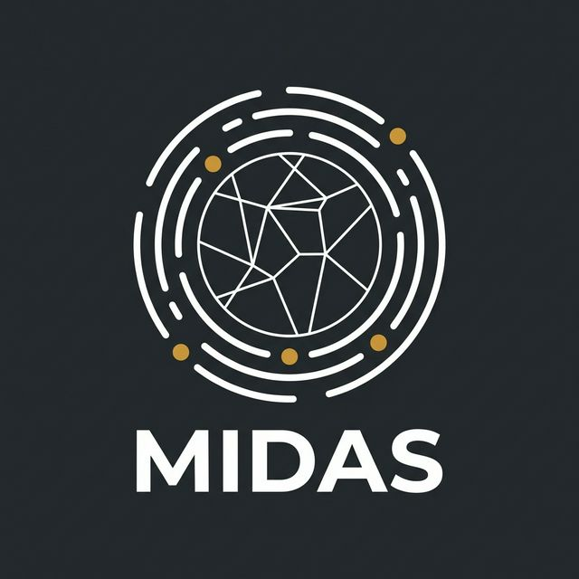

<p align="center">
  
</p>

# MIDAS — Microstructural Imaging using Diffraction Analysis Software

[](LICENSE)

**MIDAS** is an open-source suite for reconstructing three-dimensional microstructures from High-Energy Diffraction Microscopy (HEDM) data. Developed at the [Advanced Photon Source](https://www.aps.anl.gov/) at Argonne National Laboratory, it supports the complete data-reduction pipeline — from raw detector frames to grain maps, strain tensors, spatially resolved orientation fields, and tomographic reconstructions.

**Version:** 9.0
**Contact:** [Hemant Sharma](mailto:hsharma@anl.gov?subject=[MIDAS]%20From%20Github) (hsharma@anl.gov)

---

## Key Capabilities

| Technique | What It Produces | Detector Distance |
|-----------|-----------------|-------------------|
| **Far-Field HEDM (FF-HEDM)** | Grain centroids, average orientations, full elastic strain tensors | ≈ 1 m |
| **Near-Field HEDM (NF-HEDM)** | Spatially resolved 3D orientation maps, grain morphology, grain boundary networks | ≈ 5–10 mm |
| **Point-Focus HEDM (PF-HEDM)** | High-resolution grain orientations from focused beam | ≈ 1 m |
| **Radial Integration (Caking)** | 1D intensity vs. 2θ profiles for Rietveld refinement (GSAS-II) | — |
| **Grain Matching & Stitching** | Track grains across load states; combine multi-layer scans | — |
| **Tomography (CT)** | Absorption-contrast cross-sections via gridrec algorithm | — |

### Version 9 Highlights

- **Consolidated HDF5 output** — all FF-HEDM results (grains, spots, strains, peak provenance) in a single `.h5` file
- **Pseudo-Voigt peak fitting** — two-stage decomposed fitting (Lorentzian + Gaussian) with mu-weighted effective widths
- **Grain matching & stitching** — Python-native optimal (Hungarian) matching across load states with affine deformation support
- **Reprocess mode** — regenerate `MergeMap.csv` and consolidated HDF5 on old datasets (`-reprocess 1`)
- **Dynamic detector sizes** — auto-detected from data, no hardcoded dimensions
- **Zarr-ZIP data format** — compressed, portable, self-contained analysis archives
- **Forward simulation engine** — compressed output with OpenMP parallelism
- **Multi-resolution NF-HEDM** — iterative reconstruction at increasing grid resolution
- **Interactive GUI** — browser-based visualization of NF calibration, microstructure, and FF results

---

## Repository Layout

```
MIDAS/
├── FF_HEDM/          # Far-field HEDM (calibration, indexing, fitting, integration)
│   ├── src/          #   C source code (peak search, fitting, merging, indexing, grains)
│   ├── workflows/    #   Python workflow drivers (ff_MIDAS.py)
│   ├── bin/          #   Compiled binaries (auto-generated by build)
│   └── Example/      #   Example dataset for testing
├── NF_HEDM/          # Near-field HEDM reconstruction
│   ├── src/          #   C source code (forward model, grid reconstruction)
│   ├── workflows/    #   Python workflow drivers (nf_MIDAS.py)
│   ├── bin/          #   Compiled binaries (auto-generated by build)
│   ├── v7/           #   Workflow templates
│   ├── seedOrientations/  # Orientation seed files (downloaded by build)
│   └── Example/      #   Example dataset for testing
├── DT/               # Diffraction tomography (peak-fit integrator)
├── TOMO/             # Tomographic reconstruction (gridrec CT engine)
├── utils/            # Python utilities
│   ├── AutoCalibrateZarr.py   # FF-HEDM auto-calibration
│   ├── match_grains.py        # Grain matching and layer stitching
│   ├── calcMiso.py            # Crystallographic misorientation calculations
│   ├── gsas_ii_refine.py      # GSAS-II integration
│   └── ...
├── gui/              # Interactive visualization GUI
├── manuals/          # Comprehensive documentation (see below)
├── cmake/            # CMake build configuration and dependency management
├── build.sh          # Build script (Linux / macOS)
├── build_wsl_windows.sh  # Build script (Windows via WSL)
├── environment.yml   # Conda environment specification
├── CMakeLists.txt    # Top-level CMake configuration
└── LICENSE           # UChicago Argonne open-source license
```

---

## Documentation

Full manuals are in the **[manuals/](manuals/)** directory. Start with the [manuals README](manuals/README.md) for an overview of all HEDM techniques, coordinate systems, and a getting-started checklist.

| Manual | Topic |
|--------|-------|
| [FF_calibration](manuals/FF_calibration.md) | FF-HEDM geometry calibration |
| [FF_Analysis](manuals/FF_Analysis.md) | FF-HEDM grain indexing and fitting |
| [FF_Match_Stack_Reconstructions](manuals/FF_Match_Stack_Reconstructions.md) | Grain matching across load states and layer stitching |
| [FF_RadialIntegration](manuals/FF_RadialIntegration.md) | Radial integration / caking |
| [FF_Interactive_Plotting](manuals/FF_Interactive_Plotting.md) | Interactive FF-HEDM visualization |
| [FF_visualization](manuals/FF_visualization.md) | FF-HEDM result visualization |
| [FF_dual_datasets](manuals/FF_dual_datasets.md) | Dual-dataset FF-HEDM analysis |
| [PF_Analysis](manuals/PF_Analysis.md) | Point-Focus HEDM analysis |
| [NF_calibration](manuals/NF_calibration.md) | NF-HEDM detector calibration |
| [NF_Analysis](manuals/NF_Analysis.md) | NF-HEDM reconstruction workflow |
| [NF_MultiResolution_Analysis](manuals/NF_MultiResolution_Analysis.md) | Multi-resolution NF-HEDM |
| [NF_gui](manuals/NF_gui.md) | NF-HEDM interactive GUI |
| [ForwardSimulationManual](manuals/ForwardSimulationManual.md) | Forward simulation for validation |
| [GSAS-II_Integration](manuals/GSAS-II_Integration.md) | Importing MIDAS output into GSAS-II |
| [Tomography_Reconstruction](manuals/Tomography_Reconstruction.md) | Absorption-contrast CT reconstruction |
| [FF_Benchmark](manuals/FF_Benchmark.md) | FF-HEDM benchmark testing |
| [NF_Benchmark](manuals/NF_Benchmark.md) | NF-HEDM benchmark testing |

---

## Installation

### Prerequisites

| Platform | Requirements |
|----------|-------------|
| **macOS** | Homebrew, LLVM, libomp, GCC, CMake, jemalloc |
| **Linux** | GCC ≥ 9, CMake ≥ 3.16 |
| **Windows** | WSL with Ubuntu |

MIDAS automatically downloads and builds these C/C++ dependencies during compilation: [NLOPT](https://nlopt.readthedocs.io/en/latest/), [LIBTIFF](http://www.libtiff.org/), [FFTW](http://www.fftw.org/), [HDF5](https://www.hdfgroup.org/solutions/hdf5/), [BLOSC](https://github.com/Blosc/c-blosc), [BLOSC-2](https://github.com/Blosc/c-blosc2), [ZLIB](https://zlib.net/), [LIBZIP](https://libzip.org/).

### Clone

```bash
git clone https://github.com/marinerhemant/MIDAS.git
cd MIDAS
```

### macOS

1. Install Homebrew (if not already installed):
    ```bash
    /bin/bash -c "$(curl -fsSL https://raw.githubusercontent.com/Homebrew/install/HEAD/install.sh)"
    ```
    Without sudo access, install to your home directory:
    ```bash
    mkdir homebrew && curl -L https://github.com/Homebrew/brew/tarball/main | tar xz --strip-components 1 -C homebrew
    eval "$(homebrew/bin/brew shellenv)"
    brew update --force --quiet
    chmod -R go-w "$(brew --prefix)/share/zsh"
    ```
    Add Homebrew to your PATH:
    ```bash
    echo 'eval $(/opt/homebrew/bin/brew shellenv)' >> ~/.zshrc
    source ~/.zshrc
    ```

2. Install dependencies:
    ```bash
    brew install llvm libomp gcc cmake jemalloc
    ```

3. Configure environment variables:
    ```bash
    echo 'export PATH="/opt/homebrew/opt/llvm/bin:$PATH"' >> ~/.zshrc
    echo 'export LDFLAGS="-L/opt/homebrew/opt/llvm/lib $LDFLAGS"' >> ~/.zshrc
    echo 'export CPPFLAGS="-I/opt/homebrew/opt/llvm/include $CPPFLAGS"' >> ~/.zshrc
    echo 'export LDFLAGS="-L/opt/homebrew/opt/libomp/lib $LDFLAGS"' >> ~/.zshrc
    echo 'export CPPFLAGS="-I/opt/homebrew/opt/libomp/include $CPPFLAGS"' >> ~/.zshrc
    echo 'CC=/opt/homebrew/opt/gcc/bin/gcc-15' >> ~/.zshrc
    echo 'export CC' >> ~/.zshrc
    echo 'CXX=/opt/homebrew/opt/gcc/bin/g++-15' >> ~/.zshrc
    echo 'export CXX' >> ~/.zshrc
    source ~/.zshrc
    ```

4. Build:
    ```bash
    ./build.sh
    ```

### Linux

```bash
./build.sh
```

### Windows (WSL)

```bash
sudo ./build_wsl_windows.sh
```

### Build Options

```bash
# Disable CUDA support
./build.sh --cuda OFF

# Specify a custom nvcc compiler path
cd build
cmake .. -DCMAKE_CUDA_COMPILER=/path/to/cuda/bin/nvcc
cmake --build . -j

# Specify target CUDA architectures (default is "86;90")
cd build
cmake .. -DCMAKE_CUDA_ARCHITECTURES="75;80"
cmake --build . -j

# Build and run benchmarks
./build.sh --test all

# Build a single target
cd build
cmake --build . --target IntegratorFitPeaksGPUStream
```

### Updating After `git pull`

Each time you pull the latest changes, rebuild the C binaries:

```bash
cd MIDAS/build
cmake --build .
```

### Python Environment

```bash
conda env create -f environment.yml
conda activate midas_env
```

Or install the required packages manually:

```bash
pip install numpy scipy h5py parsl
```

---

## Quick Start

1. **Calibrate** the detector geometry → [FF_calibration](manuals/FF_calibration.md)
2. **Run FF-HEDM** grain indexing and fitting → [FF_Analysis](manuals/FF_Analysis.md)
3. **Visualize** results interactively → [FF_Interactive_Plotting](manuals/FF_Interactive_Plotting.md)
4. **Match/stitch** grains across load states or layers → [FF_Match_Stack_Reconstructions](manuals/FF_Match_Stack_Reconstructions.md)
5. **Reconstruct NF-HEDM** orientation maps → [NF_Analysis](manuals/NF_Analysis.md)
6. **Validate** with forward simulation → [ForwardSimulationManual](manuals/ForwardSimulationManual.md)

See the [manuals README](manuals/README.md) for the full step-by-step checklist.

### Example: Run FF-HEDM on the included test dataset

```bash
conda activate midas_env
cd FF_HEDM/Example
python ../workflows/ff_MIDAS.py -paramFN ps_ff.txt
```

### Example: Reprocess old results (generate MergeMap.csv + consolidated HDF5)

```bash
python FF_HEDM/workflows/ff_MIDAS.py -reprocess 1 -resultFolder /path/to/results/
```

### Example: Match grains across load states

```bash
python utils/match_grains.py match \
  --state1 unloaded/Grains.csv \
  --state2 loaded/Grains.csv \
  --space-group 225 --mode combined --weights 2.0 50.0
```

---

## Benchmark Testing

MIDAS includes automated benchmark tests that validate the complete pipeline using synthetic data:

### Quick Start

```bash
# Build and run all benchmarks
./build.sh --test all

# Or run benchmarks individually:
./build.sh --test ff    # FF-HEDM only
./build.sh --test nf    # NF-HEDM only
```

### Running Benchmarks Separately

```bash
conda activate midas_env

# FF-HEDM: Forward simulation → indexing → grain recovery
python utils/test_ff_hedm.py -nCPUs 4

# NF-HEDM: Forward simulation → reconstruction → orientation comparison
python utils/test_nf_hedm.py -nCPUs 8
```

The **FF-HEDM benchmark** simulates 3 Au grains, runs the full indexing pipeline, and verifies all 3 grains are recovered. Output is in `FF_HEDM/Example/`.

The **NF-HEDM benchmark** simulates a microstructure, reconstructs it, and compares orientations against a reference using misorientation analysis. Output is isolated in `NF_HEDM/Example/sim/` for easy cleanup.

See [FF_Benchmark](manuals/FF_Benchmark.md) and [NF_Benchmark](manuals/NF_Benchmark.md) for full details.

---

## Citing MIDAS

If you use MIDAS in your research, please cite:

> In review, citations coming soon.

**FF-HEDM methodology:**

> H. Sharma, R. M. Huizenga & S. E. Offerman, "A fast methodology to determine the characteristics of thousands of grains using three-dimensional X-ray diffraction. I. Overlapping diffraction peaks and parameters of the experimental setup," *J. Appl. Cryst.* **45**, 693–704 (2012). DOI: [10.1107/S0021889812025563](https://doi.org/10.1107/S0021889812025563)

> H. Sharma, R. M. Huizenga & S. E. Offerman, "A fast methodology to determine the characteristics of thousands of grains using three-dimensional X-ray diffraction. II. Volume, centre-of-mass position, crystallographic orientation and strain state of grains," *J. Appl. Cryst.* **45**, 705–718 (2012). DOI: [10.1107/S0021889812025599](https://doi.org/10.1107/S0021889812025599)


---

## Acknowledgments

- [SGInfo](http://cci.lbl.gov/sginfo/) library for HKL calculations
- [ODFPF](https://anisotropy.mae.cornell.edu/onr/Matlab/matlab-functions.html) package (Cornell) for misorientation functions

---

## License

MIDAS is released under the [UChicago Argonne open-source license](LICENSE).

Copyright © 2012, UChicago Argonne, LLC. All rights reserved.

> This product includes software produced by UChicago Argonne, LLC under Contract No. DE-AC02-06CH11357 with the Department of Energy.
