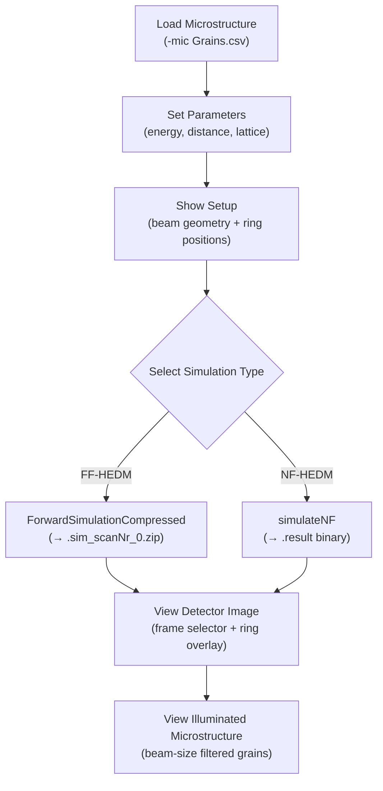

# MIDAS Digital Twin

Interactive browser-based visualization for simulating diffraction patterns from microstructure data.

## Overview

The MIDAS Digital Twin creates a virtual diffraction experiment from a measured or simulated microstructure. Given a microstructure file (grain orientations and positions), it generates synthetic detector images for both Far-Field (FF-HEDM) and Near-Field (NF-HEDM) geometries using MIDAS forward simulation codes.

### Key Features

- **Interactive parameter control**: Detector distance, beam center, energy, lattice parameters, omega range
- **Both FF and NF simulation**: Toggle between forward simulation modes
- **Live detector view**: Simulated 2D detector image with optional diffraction ring overlays
- **Microstructure visualization**: 3D grain scatter or 2D map colored by Euler component
- **Beam size filtering**: Slider to select grains within the beam footprint
- **Sequence support**: Load and compare multiple deformation states from `Grains.csv.*`

## Script

| Script | Description |
|--------|-------------|
| `dig_tw.py` | Unified digital twin (Dash + Plotly) — supports FF-HEDM and NF-HEDM |

> [!NOTE]
> The previous `MIDAS_dig_tw.py` and `ff_dig_tw.py` have been consolidated into `dig_tw.py` and archived to `gui/archive/`.

## Usage

```bash
# Launch the digital twin (opens in browser at http://localhost:8050)
cd <data_directory>
python ~/opt/MIDAS/gui/dig_tw.py -mic Grains.csv
```

### Supported Microstructure Formats

| Format | Header Pattern | Coordinates | Orientations |
|--------|---------------|-------------|--------------|
| `Grains.csv` (FF-HEDM) | `%NumGrains` | Columns 10–12 (X, Y, Z) | Columns 1–9 (orientation matrix) |
| NF-HEDM `.mic` | `%TriEdgeSize` | Columns 3–5 | Columns 7–9 (Euler angles) |
| PF-HEDM CSV | `# SpotID` | Columns 11–13 | Last 7–4 columns |

## Workflow



## Parameters

| Parameter | Default | Description |
|-----------|---------|-------------|
| Detector distance | 1,000,000 μm | Sample-to-detector distance |
| Beam center | (1024, 1024) px | Beam center on detector |
| Energy | 71.676 keV | X-ray energy |
| Space group | 194 | Crystallographic space group number |
| Lattice constants | Ti (HCP) | a, b, c (Å), α, β, γ (°) |
| Beam size | 2000 µm | Horizontal beam footprint for grain filtering (FF only) |
| Pixel size | 200 µm | Detector pixel size |
| NrPixels | 2048 | Detector dimension (NrPixels × NrPixels) |
| Omega range | −10° to 10° | Rotation range for simulation |
| Omega step | 0.25° | Angular step per frame |

## Requirements

```
dash
dash-bootstrap-components
plotly
pandas
numpy
zarr
diskcache
```

## MIDAS Binaries Used

- `GetHKLList` — generates HKL list from lattice parameters (called in `--stdout` CLI mode)
- `ForwardSimulationCompressed` — FF-HEDM forward simulation
- `simulateNF` — NF-HEDM forward simulation

## See Also

- [FF_Interactive_Plotting](FF_Interactive_Plotting.md) — Post-analysis grain/spot browser
- [GUIs_and_Visualization](GUIs_and_Visualization.md) — Master GUI guide
