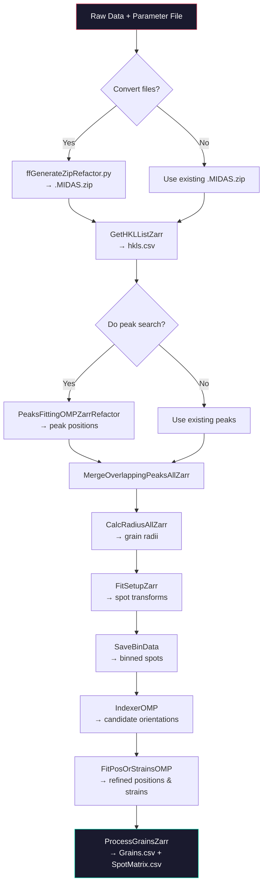

# ff_MIDAS.py User Manual

**Version:** 9.0  
**Contact:** hsharma@anl.gov

> [!NOTE]
> For **scanning/Point-Focus** FF-HEDM, see [PF_Analysis.md](PF_Analysis.md).  
> For **dual-dataset** FF-HEDM, see [FF_dual_datasets.md](FF_dual_datasets.md).

---

## 1. Introduction

`ff_MIDAS.py` is the primary driver script for single-dataset **Far-Field High-Energy Diffraction Microscopy (FF-HEDM)** analysis using MIDAS. It orchestrates a complete pipeline from raw diffraction images through peak searching, indexing, refinement, and grain processing, producing a `Grains.csv` file containing the orientation, position, strain, and lattice parameters for each grain in the sample.

The script uses [Parsl](https://parsl-project.org/) for parallelism and supports both local multi-core execution and distributed computing on cluster machines.

---

## 2. Prerequisites

-   A working MIDAS installation.
-   Raw diffraction data in one of the supported formats:
    -   **GE format** (`.ge2`, `.ge3`, etc.) with a matching parameter file.
    -   **HDF5 format** (`.h5`) — either standalone or paired with a parameter file.
    -   **Pre-built Zarr-ZIP** (`.MIDAS.zip`) — if data conversion was already performed.
-   A calibrant-derived parameter file (see [FF_calibration.md](FF_calibration.md)).
-   Python environment with: `parsl`, `numpy`, `argparse`, `logging`.

---

## 3. Command-Line Arguments

```
python ff_MIDAS.py [arguments]
```

| Argument | Type | Default | Description |
|---|---|---|---|
| `-paramFN` | `str` | `''` | Parameter file name. **Must provide either `-paramFN` and/or `-dataFN`.** |
| `-dataFN` | `str` | `''` | Data file name (HDF5 or pre-built ZIP). |
| `-resultFolder` | `str` | `''` (cwd) | Output folder for results. Defaults to current directory. |
| `-nCPUs` | `int` | `10` | Number of CPU cores for local execution. |
| `-machineName` | `str` | `local` | Execution target: `local`, `orthrosnew`, `orthrosall`, `umich`, `marquette`, `purdue`. |
| `-nNodes` | `int` | `-1` (auto) | Number of compute nodes. Auto-detected if omitted. |
| `-startLayerNr` | `int` | `1` | First layer number to process. |
| `-endLayerNr` | `int` | `1` | Last layer number to process. |
| `-fileName` | `str` | `''` | Process a specific file. Overrides `-startLayerNr`/`-endLayerNr`. |
| `-convertFiles` | `int` | `1` | `1` = convert raw data to Zarr-ZIP; `0` = Zarr-ZIP already exists. |
| `-doPeakSearch` | `int` | `1` | `1` = run peak search; `0` = skip (peaks already found). |
| `-peakSearchOnly` | `int` | `0` | `1` = stop after peak search (no indexing/refinement). |
| `-numFrameChunks` | `int` | `-1` | Chunk data for low-RAM systems. `-1` disables chunking. |
| `-preProcThresh` | `int` | `-1` | Pre-processing threshold above dark. `-1` disables; `0` = dark subtraction only. |
| `-provideInputAll` | `int` | `0` | `1` = supply `InputAllExtraInfoFittingAll.csv` directly. Result folder must contain this file. |
| `-rawDir` | `str` | `''` | Override `RawFolder` in the parameter file. |
| `-grainsFile` | `str` | `''` | Seed grains file for grain finding (sets `MinNrSpots` to 1). |
| `-reprocess` | `int` | `0` | `1` = re-run peak merging (`MergeMap.csv`) and consolidated HDF5 generation on existing results. Only needs `-resultFolder`. |

### Minimal Examples

```bash
# From a parameter file (GE data):
python ff_MIDAS.py -paramFN ps_ff.txt -resultFolder ~/results/

# From an HDF5 file with parameter file:
python ff_MIDAS.py -paramFN ps_ff.txt -dataFN data.h5 -nCPUs 20

# Multi-layer processing:
python ff_MIDAS.py -paramFN ps_ff.txt -startLayerNr 1 -endLayerNr 5

# Peak search only (for inspection):
python ff_MIDAS.py -paramFN ps_ff.txt -peakSearchOnly 1

# Reprocess existing results (regenerate MergeMap.csv + consolidated HDF5):
python ff_MIDAS.py -reprocess 1 -resultFolder ~/results/
```

---

## 4. Parameter File Reference

The parameter file is a space-delimited text file. Lines starting with `#` are comments. Each parameter is specified as `KeyName Value`.

### Core Parameters

| Key | Type | Description |
|---|---|---|
| `FileStem` | `str` | Base name of raw data files (e.g., `sample1_ff`) |
| `Ext` | `str` | File extension (e.g., `.ge3`, `.tif`) |
| `StartFileNrFirstLayer` | `int` | File number of the first frame in the first layer |
| `NrFilesPerSweep` | `int` | Number of files per HEDM scan (default: 1) |
| `RawFolder` | `str` | Path to directory containing raw data files |
| `Dark` | `str` | Path to the dark-field image file |
| `Lsd` | `float` | Sample-to-detector distance (μm) |
| `Wavelength` | `float` | X-ray wavelength (Å) |
| `px` | `float` | Pixel size (μm) |
| `BC` | `float float` | Beam center (Y, Z) on detector (pixels) |
| `ty` | `float` | Detector vertical tilt (degrees) |
| `tz` | `float` | Detector horizontal tilt (degrees) |
| `p0` | `float` | Detector torsion (degrees) |
| `LatticeParameter` | `float ×6` | a, b, c (Å), α, β, γ (degrees) |
| `SpaceGroup` | `int` | Space group number (e.g., 225 for FCC) |
| `StartNr` | `int` | First frame number in scan (keep 1) |
| `EndNr` | `int` | Last frame number in scan (usually the number of frames) |
| `OmegaFirstFile` | `float` | Omega angle of the first frame (degrees) |
| `OmegaStep` | `float` | Omega step size per frame (degrees) |
| `RingThresh` | `int float` | Ring number and intensity threshold pairs (one per line) |
| `ImTransOpt` | `int` | Image transformation option (0–3). One per line; multiple allowed. Order matters (same as alignment).<br>0: No transform<br>1: Horizontal flip<br>2: Vertical flip<br>3: Transpose |

### Indexing & Refinement Parameters

| Key | Type | Description |
|---|---|---|
| `OverAllRingToIndex` | `int` | Ring number used for the primary indexing search |
| `MinNrSpots` | `int` | Minimum finding redundancy: The grain must be found this many times (starting from different spots) to be accepted. |
| `MinOmeSpotIDsToIndex` | `float` | Minimum omega for spot IDs considered to generate indexing list |
| `MaxOmeSpotIDsToIndex` | `float` | Maximum omega for spot IDs considered to generate indexing list |
| `Twins` | `int` | **[DANGEROUS]** Not fully implemented. Use `1` only if FCC twins are present and you know what you are doing; otherwise `0`. |
| `BeamThickness` | `float` | X-ray beam height (μm) |
| `GlobalPosition` | `float` | Y-stage position (μm) |
| `NumPhases` | `int` | Total number of phases (legacy, usually 1) |
| `PhaseNr` | `int` | Phase ID added to the final result (typically 1). **Note:** For multi-phase materials, run MIDAS separately for each phase and change this number. |

### Optional Parameters

| Key | Type | Description |
|---|---|---|
| `PanelShiftsFile` | `str` | Path to a file containing per-panel geometric shifts |
| `RingsToExcludeFraction` | Ring exclusion fraction (advanced) |
| `GrainsFile` | `str` | Path to a seed grains file for guided indexing |
| `ResultFolder` | `str` | Override result folder instead of default execution folder |
| `UsePixelOverlap` | `int` | `1` = merge peaks using shared pixel coordinates instead of center-distance. Requires `_PX.bin` files from peak search. Default: `0` (distance-based merge). |
| `doPeakFit` | `int` | `0` = skip Pseudo-Voigt fitting and treat each connected component as a single peak. Default: `1`. |
| `MaskFN` | `str` | Path to a uint8 TIFF mask file. Convention: `0` = valid, `1` = masked (bad pixel). Embedded into the Zarr archive and applied during peak search. |
| `BadPxIntensity` | `float` | Intensity value representing bad pixels (e.g., `-2`). Pixels matching this value are masked. |
| `GapIntensity` | `float` | Intensity value representing detector gaps (e.g., `-1`). Pixels matching this value are masked. |

> [!TIP]
> To create a mask TIFF from a dark frame:
> ```bash
> python utils/generate_mask.py dark.tif -1 -2 -o mask.tif
> ```
> Then add `MaskFN mask.tif` to your parameter file.

---

## 5. Workflow Architecture



### Stage Descriptions

| Stage | Binary | Description |
|---|---|---|
| **Data Conversion** | `ffGenerateZipRefactor.py` | Converts raw GE/HDF5 frames into a Zarr-compressed ZIP archive |
| **HKL Generation** | `GetHKLListZarr` | Computes expected (h,k,l) reflections from crystal structure |
| **Peak Search** | `PeaksFittingOMPZarrRefactor` | Identifies and fits diffraction peaks in 2D frames (parallelized). Also writes `_PX.bin` pixel coordinate files. |
| **Peak Merging** | `MergeOverlappingPeaksAllZarr` | Merges peaks split across adjacent frames (distance-based or pixel-overlap mode) |
| **Radius Calculation** | `CalcRadiusAllZarr` | Estimates grain radii from integrated intensities |
| **Data Transform** | `FitSetupZarr` | Converts detector coordinates to sample-frame coordinates |
| **Binning** | `SaveBinData` | Bins spots by angular position for efficient search |
| **Indexing** | `IndexerOMP` | Identifies grain orientations via combinatorial search (parallelized) |
| **Refinement** | `FitPosOrStrainsOMP` | Refines grain orientations, positions, and lattice strains (parallelized) |
| **Grain Processing** | `ProcessGrainsZarr` | Consolidates indexed grains, removes duplicates, computes strain tensors |

---

## 6. Technical Implementation Details

This section provides an in-depth look at the algorithms used in the core binaries, based on the C source code.

### 6.1. Peak Search (`PeaksFittingOMPZarrRefactor.c`)
The peak search identifies diffraction spots in the raw detector images.
*   **Preprocessing:** The code applies a dark field subtraction (implicit in the image correlation step).
*   **Connected Components Analysis (CCA):** 
    *   It uses an **iterative Depth-First Search (DFS)** algorithm to label connected regions of pixels that exceed a user-defined intensity threshold.
    *   Stack-based iteration is used instead of recursion to prevent stack overflow on large spots.
*   **Peak Finding:** Within each connected component, the algorithm searches for **regional maxima**. A pixel is identified as a peak if its intensity is strictly greater than all its 8 neighbors.
*   **Fitting:** 
    *   A **Pseudo-Voigt profile** (weighted sum of Gaussian and Lorentzian functions) is fitted to each identified peak.
    *   The objective function minimizes the sum of squared differences between the model and observed pixel intensities using non-linear optimization.
    *   Key fitted parameters: Center of Mass ($Y, Z$), Intensity, and profile widths ($\sigma$).
    *   When `doPeakFit 0` is set, fitting is skipped and each connected component is treated as a single peak using its centroid.
*   **Pixel Coordinate Output (`_PX.bin`):**
    *   For each frame, a binary file is written containing the pixel coordinates belonging to each peak.
    *   Format: `int32 NrPixels`, `int32 nPeaks`, then per-peak: `int32 nPixels`, followed by `nPixels` pairs of `int16 y, int16 z`.
    *   These files are used by `MergeOverlappingPeaksAllZarr` when `UsePixelOverlap 1` is enabled.

### 6.1b. Peak Merging (`MergeOverlappingPeaksAllZarr.c`)
Two merge strategies are available:
*   **Distance-based (default):** Peaks in adjacent frames are merged if their centers are within `OverlapLength` pixels. This is the original method.
*   **Pixel-overlap (`UsePixelOverlap 1`):** Peaks are merged if they share any common pixel coordinates between adjacent frames. This uses a label-map approach:
    1. A 2D label map of the current frame's pixel assignments is built.
    2. For each new-frame peak, its pixels are scanned against the label map to find the best-matching current peak.
    3. A mutual best-match check ensures robust pairing.
    
    This mode is more accurate for closely-spaced or overlapping peaks, especially when used with `doPeakFit 0`.

### 6.2. Indexing (`IndexerOMP.c`)
The indexer finds grain orientations that are consistent with the observed diffraction spots.
*   **Search Strategy:** It employs a **forward modeling approach** combined with a discretized grid search.
    1.  **Candidate Generation:** It generates a grid of candidate orientations by rotating the crystal lattice around specific scattering vectors (HKLs) corresponding to observed diffraction rings.
    2.  **Theoretical Spot Generation:** For each candidate orientation, it calculates the expected positions ($Y, Z, \omega$) of diffraction spots using the Bragg equation and detector geometry.
    3.  **Matching:** The code compares theoretical spots against the observed spots. A match is declared if a spot falls within defined tolerances for:
        *   **Omega ($\omega$):** The rotation angle.
        *   **Eta ($\eta$):** The azimuthal angle on the detector.
        *   **Radial Distance:** The distance from the beam center (related to $2\theta$).
*   **Scoring:** A "Completeness" score is calculated based on the fraction of predicted spots that are actually observed. Orientations with high completeness scores are accepted as candidate grains.

### 6.3. Refinement (`FitPosOrStrainsOMP.c`)
This step refines the parameters of the indexed grains to minimize the error between observed and simulated spots.
*   **Algorithm:** **Non-linear Least Squares (NLLS)** optimization.
*   **Optimization Variables:**
    *   **Orientation:** 3 Euler angles (Bunge convention).
    *   **Position:** 3 coordinates ($X, Y, Z$) representing the grain's center of mass in the sample.
    *   **Strain:** 6 components of the lattice strain tensor (or directly the lattice parameters $a, b, c, \alpha, \beta, \gamma$).
*   **Objective Function:** The solver minimizes the weighted sum of squared differences between observed and simulated spot parameters:
    $$ \chi^2 = \sum (Y_{obs} - Y_{sim})^2 + (Z_{obs} - Z_{sim})^2 + (\omega_{obs} - \omega_{sim})^2 $$
*   **Corrections:** The model includes complex geometric corrections for:
    *   **Wedge:** Sample stage wedge angle.
    *   **Lsd/Tilt:** Detector distance and tilts.
    *   **Spatial Distortion:** Radial distortion of the detector (if parameters `p0, p1, p2` are used).

### 6.4. Grain Processing (`ProcessGrainsZarr.c`)
The final merging step cleans up the results and computes derived quantities.
*   **Deduplication:** Grains from the indexing step are compared for similarity. If two grains have very close orientations (misorientation angle $< 0.1^\circ$) and spatial positions ($< 5 \mu m$), they are merged.
    *   **Quaternion Math:** Distances between orientations are computed using quaternion algebra for numerical stability.
*   **Twin Detection:** The code checks for twin relationships (e.g., $60^\circ$ rotation around $<111>$ axes for FCC) if the `Twins` parameter is enabled.
*   **Strain Tensor Calculation:**
    *   **Fable-Beaudoin Method:** Uses the refined lattice parameters to compute the strain tensor relative to the unstrained lattice.
    *   **Kenesei Method:** An alternative strain calculation that uses individual spot vectors.

---

## 7. Output Files

### Directory Structure

Each layer generates a subdirectory:

```
<resultFolder>/
├── LayerNr_1/
│   ├── paramstest.txt           # Auto-generated parameter file
│   ├── hkls.csv                 # Expected HKL reflections
│   ├── SpotsToIndex.csv         # Spot IDs selected for indexing
│   ├── InputAllExtraInfoFittingAll.csv  # Full spot table
│   ├── Grains.csv               # ★ Final grain results
│   ├── SpotMatrix.csv           # Per-spot info grouped by grain
│   ├── <filestem>_consolidated.h5  # ★ Consolidated HDF5 (all results in one file)
│   ├── GrainIDsKey.csv          # Grain-to-spot-ID mapping
│   ├── IDsHash.csv              # Ring→spot-ID lookup table
│   ├── MergeMap.csv             # Peak merging provenance (SpotID→FrameNr,PeakID)
│   ├── Radius_StartNr_*.csv     # Per-spot radius and volume estimates
│   ├── <filestem>_NNNNNN.MIDAS.zip  # Zarr-compressed data
│   ├── Results/
│   │   ├── Key.bin              # Indexing results (binary)
│   │   ├── OrientPosFit.bin     # Refined orientations (binary)
│   │   └── ProcessKey.bin       # Grain→spot assignments (binary)
│   ├── Output/
│   │   └── FitBest.bin          # Best-fit spot data (binary)
│   ├── Temp/                    # Temporary working files
│   │   ├── *_PS.csv             # Per-frame peak search results
│   │   └── *_PX.bin             # Per-frame pixel coordinate data (for pixel-overlap merge)
│   └── output/                  # Log files
│       ├── hkls_out.csv / hkls_err.csv
│       ├── peaksearch_out*.csv / peaksearch_err*.csv
│       ├── merge_overlaps_out.csv / merge_overlaps_err.csv
│       ├── calc_radius_out.csv / calc_radius_err.csv
│       ├── fit_setup_out.csv / fit_setup_err.csv
│       ├── binning_out.csv / binning_err.csv
│       ├── indexing_out*.csv / indexing_err*.csv
│       ├── refining_out*.csv / refining_err*.csv
│       └── process_grains_out.csv / process_grains_err.csv
├── LayerNr_2/
│   └── ...
```

### Grains.csv Column Format

The `Grains.csv` file has a multi-line header (lines starting with `%`) followed by tab-separated data:

**Header metadata:**
```
%NumGrains <N>
%BeamCenter <value>
%BeamThickness <value>
%GlobalPosition <value>
%NumPhases <N>
%PhaseInfo
%   SpaceGroup:<N>
%   Lattice Parameter: a b c alpha beta gamma
```

**Data columns (47 total):**

| Column | Name | Description |
|---|---|---|
| 1 | `GrainID` | Unique grain identifier |
| 2–10 | `O11`–`O33` | Orientation matrix (3×3, row-major) |
| 11–13 | `X`, `Y`, `Z` | Grain center-of-mass position (μm) |
| 14–19 | `a`, `b`, `c`, `alpha`, `beta`, `gamma` | Fitted lattice parameters |
| 20 | `DiffPos` | Position difference metric |
| 21 | `DiffOme` | Omega difference metric |
| 22 | `DiffAngle` | Misorientation angle metric |
| 23 | `GrainRadius` | Equivalent grain radius (μm) |
| 24 | `Confidence` | Indexing confidence metric |
| 25–33 | `eFab11`–`eFab33` | Strain tensor (Fable-Beaudoin method, ×10⁶) |
| 34–42 | `eKen11`–`eKen33` | Strain tensor (Kenesei method, ×10⁶) |
| 43 | `RMSErrorStrain` | RMS error of strain fit (×10⁶) |
| 44 | `PhaseNr` | Phase number |
| 45–47 | `Eul0`, `Eul1`, `Eul2` | Euler angles (Bunge convention, degrees) |

### SpotMatrix.csv Column Format

Tab-separated, one row per diffraction spot per grain:

| Column | Name | Description |
|---|---|---|
| 1 | `GrainID` | Parent grain ID |
| 2 | `SpotID` | Unique spot identifier |
| 3 | `Omega` | Omega angle (degrees) |
| 4 | `DetectorHor` | Horizontal detector position (pixels) |
| 5 | `DetectorVert` | Vertical detector position (pixels) |
| 6 | `OmeRaw` | Raw omega angle (degrees) |
| 7 | `Eta` | Azimuthal angle (degrees) |
| 8 | `RingNr` | Diffraction ring number |
| 9 | `YLab` | Y position in lab frame (μm) |
| 10 | `ZLab` | Z position in lab frame (μm) |
| 11 | `Theta` | Bragg angle θ (degrees) |
| 12 | `StrainError` | Per-spot strain error |

### Consolidated HDF5 File

The pipeline automatically generates a `<filestem>_consolidated.h5` file that combines all analysis results (grains, spots, peaks, parameters) into a single, self-contained HDF5 file. This is the recommended way to access FF-HEDM results programmatically.

#### File Structure

```
<filestem>_consolidated.h5
├── /parameters/                     # All analysis parameters from paramstest.txt
│   ├── Lsd                          # (float) Sample-to-detector distance
│   ├── Wavelength                   # (float) X-ray wavelength
│   ├── SpaceGroup                   # (float) Space group number
│   ├── LatticeParameter             # (float[6]) a, b, c, α, β, γ
│   └── ...                          # All other key-value pairs
│
├── /all_spots/                      # Full spot table (InputAllExtraInfoFittingAll.csv)
│   └── data                         # (float[N×15]) All detected spots, 15 columns
│       attrs: column_names          # [YLab, ZLab, Omega, GrainRadius, SpotID,
│                                    #  RingNumber, Eta, Ttheta, OmegaIni, YOrig,
│                                    #  ZOrig, YOrigDetCor, ZOrigDetCor,
│                                    #  OmegaOrigDetCor, IntegratedIntensity]
│
├── /radius_data/                    # Per-spot radius/volume estimates
│   ├── SpotID                       # (float[N]) Spot identifiers
│   ├── IntegratedIntensity          # (float[N])
│   ├── Omega, YCen, ZCen, IMax      # (float[N]) Spot position/intensity
│   ├── MinOme, MaxOme               # (float[N]) Omega span of the spot
│   ├── Radius, Theta, Eta           # (float[N]) Geometric properties
│   ├── DeltaOmega, NImgs            # (float[N]) Omega width, number of frames
│   ├── RingNr                       # (float[N]) Ring number
│   ├── GrainVolume, GrainRadius     # (float[N]) Estimated grain size
│   ├── PowderIntensity              # (float[N]) Reference powder intensity
│   ├── SigmaR, SigmaEta             # (float[N]) Effective spot widths
│   └── NrPx, NrPxTot               # (float[N]) Pixel counts
│
├── /merge_map/                      # Peak merging provenance
│   ├── MergedSpotID                 # (int[N]) Final merged spot ID
│   ├── FrameNr                      # (int[N]) Frame number of constituent peak
│   └── PeakID                       # (int[N]) Peak ID within that frame
│
├── /grains/                         # Per-grain results
│   ├── summary                      # (float[G×47]) Full Grains.csv data as 2D array
│   │   attrs: column_names          # Column names (see Grains.csv section above)
│   │
│   └── grain_NNNN/                  # One subgroup per grain (e.g., grain_0001)
│       ├── grain_id                 # (int) Grain ID
│       ├── orientation              # (float[3×3]) Orientation matrix
│       ├── position                 # (float[3]) X, Y, Z position (μm)
│       ├── euler_angles             # (float[3]) Euler angles (Bunge, degrees)
│       ├── lattice_params_fit       # (float[6]) Fitted a, b, c, α, β, γ
│       ├── strain_fable             # (float[3×3]) Strain tensor (Fable method)
│       ├── strain_kenesei           # (float[3×3]) Strain tensor (Kenesei method)
│       ├── rms_strain_error         # (float) RMS strain error
│       ├── confidence               # (float) Indexing confidence
│       ├── phase_nr                 # (int) Phase number
│       ├── radius                   # (float) Grain radius (μm)
│       │
│       └── spots/                   # Spots assigned to this grain
│           ├── n_spots              # (int) Number of spots
│           ├── spotid, omega, dety  # (float[S]) SpotMatrix columns (vectorized)
│           ├── detz, omeraw, eta    # (float[S]) ...
│           ├── ringnr, ylab, zlab   # (float[S]) ...
│           ├── theta, strainerror   # (float[S]) ...
│           │
│           └── spot_MMMMMM/         # Per-spot subgroup (e.g., spot_000042)
│               ├── spot_id          # (int) Spot ID
│               ├── omega, dety, ... # (float) Individual spot properties
│               ├── minome, maxome   # (float) Radius-derived properties
│               ├── grainvolume      # (float) Grain volume estimate
│               ├── powderintensity  # (float) Reference intensity
│               │
│               └── constituent_peaks/  # Raw peaks that form this merged spot
│                   ├── n_constituent_peaks  # (int) Number of raw peaks
│                   ├── frame_nr     # (int[C]) Frame numbers
│                   ├── peak_id      # (int[C]) Peak IDs within each frame
│                   ├── spotid       # (float[C]) Peak-fitted spot ID
│                   ├── integratedintensity  # (float[C])
│                   ├── omega, ycen, zcen    # (float[C]) Peak position
│                   ├── imax, radius, eta    # (float[C]) Peak shape
│                   ├── sigmar, sigmaeta     # (float[C]) Effective widths
│                   ├── sigmagr, sigmalr     # (float[C]) Gaussian/Lorentzian R widths
│                   ├── sigmageta, sigmaleta # (float[C]) Gaussian/Lorentzian η widths
│                   ├── mu                   # (float[C]) Pseudo-Voigt mixing parameter
│                   └── bg, nrpixels, ...    # (float[C]) Other _PS.csv columns
│
└── /raw_data_ref/                   # Reference to source data
    └── zarr_path                    # (str) Absolute path to the Zarr-ZIP file
```

#### Python Example: Reading the Consolidated HDF5

```python
import h5py
import numpy as np

with h5py.File('output_consolidated.h5', 'r') as h5:
    # Access parameters
    lsd = h5['parameters/Lsd'][()]
    
    # Read all grains at once (N×47 array)
    grains_summary = h5['grains/summary'][:]
    col_names = list(h5['grains/summary'].attrs['column_names'])
    
    # Iterate over individual grains
    for name in h5['grains']:
        if not name.startswith('grain_'):
            continue
        g = h5['grains'][name]
        grain_id = g['grain_id'][()]
        orientation = g['orientation'][:]  # 3×3 matrix
        position = g['position'][:]       # [X, Y, Z]
        n_spots = g['spots/n_spots'][()]
        
        # Access spots for this grain
        if n_spots > 0:
            omegas = g['spots/omega'][:]
            
            # Access constituent peaks for a specific spot
            for sname in g['spots']:
                if not sname.startswith('spot_'):
                    continue
                spot = g['spots'][sname]
                if 'constituent_peaks' in spot:
                    cp = spot['constituent_peaks']
                    n_peaks = cp['n_constituent_peaks'][()]
                    frame_nrs = cp['frame_nr'][:]
                    intensities = cp['integratedintensity'][:]
```

## 8. Computational Resources

### Machine Configurations

| Machine | CPUs/Node | Nodes | Notes |
|---|---|---|---|
| `local` | User-specified (`-nCPUs`) | 1 | Default. Uses Parsl ThreadPoolExecutor. |
| `orthrosnew` | 32 | 11 | ANL Orthros cluster (new partition) |
| `orthrosall` | 64 | 5 | ANL Orthros cluster (full) |
| `umich` | 36 | User-specified | University of Michigan cluster |
| `marquette` | 36 | User-specified | Marquette University cluster |
| `purdue` | 128 | User-specified | Purdue University cluster |

### Resource Guidelines

-   **Memory:** Data conversion and peak search are the most memory-intensive stages. Use `-numFrameChunks` to reduce memory usage if needed.
-   **CPU:** Peak search and indexing are parallelized across nodes. More CPUs reduce wall time for these stages.
-   **Disk:** Each layer can produce several GB of intermediate files.

---

## 9. Troubleshooting

| Issue | Likely Cause | Resolution |
|---|---|---|
| `No ID was found in SpotsToIndex.csv` | No peaks passed thresholds | Lower `RingThresh` values; check data quality |
| `Key file was not found` | Indexing found zero grains | Check `MinNrSpots`, ring thresholds, and detector geometry |
| `Failed to generate ZIP file` | Raw data not found or wrong format | Verify `RawFolder`, `FileStem`, `Ext`, and `StartFileNrFirstLayer` |
| `HKL generation failed` | Wrong crystal structure parameters | Verify `LatticeParameter`, `SpaceGroup`, and `Wavelength` |
| Peak search produces no output | Incorrect `BC`, `Lsd`, or tilts | Re-run calibration ([FF_calibration.md](FF_calibration.md)) |
| Out of memory during peak search | Dataset too large for RAM | Use `-numFrameChunks 2` (or higher) |
| `Grains.csv is empty` | `MinNrSpots` too high, or wrong `SpaceGroup` | Lower `MinNrSpots` or verify crystal symmetry |

---

## 10. See Also

- [PF_Analysis.md](PF_Analysis.md) — Scanning/Point-Focus FF-HEDM analysis
- [FF_calibration.md](FF_calibration.md) — Geometry calibration from calibrant rings
- [FF_dual_datasets.md](FF_dual_datasets.md) — Dual-dataset combined analysis
- [FF_Interactive_Plotting.md](FF_Interactive_Plotting.md) — Visualizing FF-HEDM results
- [ForwardSimulationManual.md](ForwardSimulationManual.md) — Forward simulation for validation
- [README.md](README.md) — High-level MIDAS overview and manual index

---

If you encounter any issues or have questions, please open an issue on this repository.