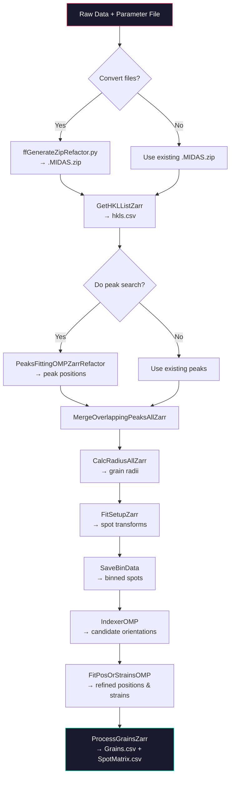

# ff_MIDAS.py User Manual

**Version:** 11.0
**Contact:** hsharma@anl.gov

> [!NOTE]
> For **scanning/Point-Focus** FF-HEDM, see [PF_Analysis.md](PF_Analysis.md).
> For **dual-dataset** FF-HEDM, see [FF_Dual_Datasets.md](FF_Dual_Datasets.md).

---

## 1. Introduction

`ff_MIDAS.py` is the primary driver script for single-dataset **Far-Field High-Energy Diffraction Microscopy (FF-HEDM)** analysis using MIDAS. It orchestrates a complete pipeline from raw diffraction images through peak searching, indexing, refinement, and grain processing, producing a `Grains.csv` file containing the orientation, position, strain, and lattice parameters for each grain in the sample.

The script uses [Parsl](https://parsl-project.org/) for parallelism and supports both local multi-core execution and distributed computing on cluster machines.

---

## 2. Prerequisites

-   A working MIDAS installation.
-   Raw diffraction data in one of the supported formats:
    -   **GE format** (`.ge2`, `.ge3`, etc.) with a matching parameter file.
    -   **HDF5 format** (`.h5`) — either standalone or paired with a parameter file.
    -   **Pre-built Zarr-ZIP** (`.MIDAS.zip`) — if data conversion was already performed.
-   A calibrant-derived parameter file (see [FF_Calibration.md](FF_Calibration.md)).
-   Python environment with: `parsl`, `numpy`, `argparse`, `logging`.

---

## 3. Command-Line Arguments

```
python ff_MIDAS.py [arguments]
```

| Argument | Type | Default | Description |
|---|---|---|---|
| `-paramFN` | `str` | `''` | Parameter file name. **Must provide either `-paramFN` and/or `-dataFN`.** |
| `-dataFN` | `str` | `''` | Data file name (HDF5 or pre-built ZIP). |
| `-resultFolder` | `str` | `''` (cwd) | Output folder for results. Defaults to current directory. |
| `-nCPUs` | `int` | `10` | Number of CPU cores for local execution. |
| `-machineName` | `str` | `local` | Execution target: `local`, `orthrosnew`, `orthrosall`, `umich`, `marquette`, `purdue`. |
| `-nNodes` | `int` | `-1` (auto) | Number of compute nodes. Auto-detected if omitted. |
| `-startLayerNr` | `int` | `1` | First layer number to process. |
| `-endLayerNr` | `int` | `1` | Last layer number to process. |
| `-fileName` | `str` | `''` | Process a specific file. Overrides `-startLayerNr`/`-endLayerNr`. |
| `-convertFiles` | `int` | `1` | `1` = convert raw data to Zarr-ZIP; `0` = Zarr-ZIP already exists. |
| `-doPeakSearch` | `int` | `1` | `1` = run peak search; `0` = skip (peaks already found). |
| `-peakSearchOnly` | `int` | `0` | `1` = stop after peak search (no indexing/refinement). |
| `-numFrameChunks` | `int` | `-1` | Chunk data for low-RAM systems. `-1` disables chunking. |
| `-preProcThresh` | `int` | `-1` | Pre-processing threshold above dark. `-1` disables; `0` = dark subtraction only. |
| `-provideInputAll` | `int` | `0` | `1` = supply `InputAllExtraInfoFittingAll.csv` directly. Result folder must contain this file. |
| `-rawDir` | `str` | `''` | Override `RawFolder` in the parameter file. |
| `-grainsFile` | `str` | `''` | Seed grains file for grain finding (sets `MinNrSpots` to 1). |
| `-nfResultDir` | `str` | `''` | NF result directory containing per-layer seed grains. Each layer looks for its own NF-derived `Grains.csv` to use as seed orientations. |
| `-batchMode` | `int` | `0` | `1` = auto-detect files with varying stems across layers. Files in `RawFolder` are matched by the pattern `{stem}_{zero-padded-number}{ext}`; dark files (stem starting with `dark_`) are automatically skipped. |
| `-useGPU` | `int` | `0` | `1` = use GPU-accelerated binaries (`IndexerGPU` for indexing, `FitPosOrStrainsGPU` for refinement) instead of CPU versions. |
| `-generateH5` | `int` | `0` | `1` = generate a consolidated HDF5 file (`<filestem>_consolidated.h5`) containing all analysis results (grains, spots, peaks, parameters) after processing completes. |
| `-reprocess` | `int` | `0` | `1` = re-run peak merging (`MergeMap.csv`) and consolidated HDF5 generation on existing results. Only needs `-resultFolder`. |
| `-resume` | `str` | `''` | Path to a pipeline H5 file to resume from. Auto-detects the last completed stage and re-runs from there. |
| `-restartFrom` | `str` | `''` | Explicit stage to restart from. All stages from this point forward are re-run. Valid stages: `hkl`, `peak_search`, `merge_overlaps`, `calc_radius`, `data_transform`, `binning`, `indexing`, `refinement`, `consolidation`. |

The following flags appear **only when the optional `sr-midas` pip package is installed** (see [Section 3a](#3a-super-resolution-peak-search-optional-sr-midas)):

| Argument | Type | Default | Description |
|---|---|---|---|
| `-runSR` | `int` | `0` | `1` = replace MIDAS peak search with the sr-midas super-resolution pipeline. Requires `-doPeakSearch 0`. |
| `-srfac` | `int` | `8` | Super-resolution upscale factor. Choices: `2`, `4`, `8`. |
| `-SRconfig_path` | `str` | `auto` | Path to a custom sr-midas config JSON. `auto` uses the config bundled with sr-midas. |
| `-saveSRpatches` | `int` | `0` | `1` = save the predicted super-resolved patches to disk (`SR_out/SR_patches/`). |
| `-saveFrameGoodCoords` | `int` | `0` | `1` = save per-frame `goodCoords` maps (pixels that belong to rings). |

### Minimal Examples

```bash
# From a parameter file (GE data):
python ff_MIDAS.py -paramFN ps_ff.txt -resultFolder ~/results/

# From an HDF5 file with parameter file:
python ff_MIDAS.py -paramFN ps_ff.txt -dataFN data.h5 -nCPUs 20

# Multi-layer processing:
python ff_MIDAS.py -paramFN ps_ff.txt -startLayerNr 1 -endLayerNr 5

# Peak search only (for inspection):
python ff_MIDAS.py -paramFN ps_ff.txt -peakSearchOnly 1

# Reprocess existing results (regenerate MergeMap.csv + consolidated HDF5):
python ff_MIDAS.py -reprocess 1 -resultFolder ~/results/

# Resume from the last completed stage (auto-detect):
python ff_MIDAS.py -paramFN ps_ff.txt -resume ~/results/LayerNr_1/output_consolidated.h5

# Restart from indexing (re-runs indexing -> refinement -> consolidation):
python ff_MIDAS.py -paramFN ps_ff.txt -restartFrom indexing

# Batch mode with varying file stems across layers:
python ff_MIDAS.py -paramFN ps_ff.txt -batchMode 1 -startLayerNr 1 -endLayerNr 10

# GPU-accelerated indexing and refinement:
python ff_MIDAS.py -paramFN ps_ff.txt -useGPU 1

# Generate consolidated HDF5 output:
python ff_MIDAS.py -paramFN ps_ff.txt -generateH5 1

# NF-seeded indexing (per-layer seed grains from NF results):
python ff_MIDAS.py -paramFN ps_ff.txt -nfResultDir ~/nf_results/
```

---

## 3a. Super-Resolution Peak Search (optional, `sr-midas`)

`ff_MIDAS.py` can delegate peak search to **[sr-midas](https://pypi.org/project/sr-midas/)**, an optional PyPI package that upscales each detector patch with a cascaded CNN (x1 → x2 → x4 → x8) before fitting peaks. Downstream stages (merging, radius calculation, indexing, refinement) are unchanged — sr-midas emits the same `Temp/*_PS.csv` format MIDAS already consumes.

**Install** (one-time, in a Python **3.12.4** environment, with PyTorch that matches your GPU):

```bash
pip install sr-midas
```

When the package is importable, the five `-runSR*` flags above are automatically registered and a banner prints at startup:

```
SR-MIDAS: available (version 0.1.1).
```

If sr-midas isn't installed the flags don't appear in `--help` and `ff_MIDAS.py` behaves exactly as before.

**GPU strongly recommended.** sr-midas auto-detects CUDA; on a CPU-only host the driver logs a prominent warning and inference runs 10–100× slower.

**Usage**:

```bash
# Replace MIDAS peak fitting with sr-midas (srfac=8 default):
python ff_MIDAS.py -paramFN ps_ff.txt -doPeakSearch 0 -runSR 1

# Lower upscale factor (faster, less resolved):
python ff_MIDAS.py -paramFN ps_ff.txt -doPeakSearch 0 -runSR 1 -srfac 4

# Custom sr-midas config + save diagnostic outputs:
python ff_MIDAS.py -paramFN ps_ff.txt -doPeakSearch 0 -runSR 1 \
    -SRconfig_path /path/to/cnnsr_sr_config.json \
    -saveSRpatches 1 -saveFrameGoodCoords 1
```

**Guardrails**:

- `-runSR 1` with `-doPeakSearch 1` exits with an error — sr-midas *replaces* MIDAS peak search, it does not run alongside it.
- `-runSR 1` without sr-midas installed exits with a `pip install sr-midas` hint.
- The integration hook is in [`process_layer()`](../FF_HEDM/workflows/ff_MIDAS.py) inside the `peak_search` stage. `-resume` / `-restartFrom peak_search` work identically to the standard path.

---

## 4. Parameter File Reference

The parameter file is a space-delimited text file. Lines starting with `#` are comments. Each parameter is specified as `KeyName Value`.

### Core Parameters

| Key | Type | Description |
|---|---|---|
| `FileStem` | `str` | Base name of raw data files (e.g., `sample1_ff`) |
| `Ext` | `str` | File extension (e.g., `.ge3`, `.tif`) |
| `StartFileNrFirstLayer` | `int` | File number of the first frame in the first layer |
| `NrFilesPerSweep` | `int` | Number of files per HEDM scan (default: 1) |
| `RawFolder` | `str` | Path to directory containing raw data files |
| `Dark` | `str` | Path to the dark-field image file |
| `Lsd` | `float` | Sample-to-detector distance (μm) |
| `Wavelength` | `float` | X-ray wavelength (Å) |
| `px` | `float` | Pixel size (μm) |
| `BC` | `float float` | Beam center (Y, Z) on detector (pixels) |
| `ty` | `float` | Detector vertical tilt (degrees) |
| `tz` | `float` | Detector horizontal tilt (degrees) |
| `p0` | `float` | Detector torsion (degrees) |
| `LatticeParameter` | `float ×6` | a, b, c (Å), α, β, γ (degrees) |
| `SpaceGroup` | `int` | Space group number (e.g., 225 for FCC) |
| `StartNr` | `int` | First frame number in scan (keep 1) |
| `EndNr` | `int` | Last frame number in scan (usually the number of frames) |
| `OmegaFirstFile` | `float` | Omega angle of the first frame (degrees) |
| `OmegaStep` | `float` | Omega step size per frame (degrees) |
| `RingThresh` | `int float` | Ring number and intensity threshold pairs (one per line) |
| `ImTransOpt` | `int` | Image transformation option (0–3). One per line; multiple allowed. Order matters (same as alignment).<br>0: No transform<br>1: Horizontal flip<br>2: Vertical flip<br>3: Transpose |

### Indexing & Refinement Parameters

| Key | Type | Description |
|---|---|---|
| `OverAllRingToIndex` | `int` | Ring number used for the primary indexing search |
| `MinNrSpots` | `int` | Minimum finding redundancy: The grain must be found this many times (starting from different spots) to be accepted. |
| `MinOmeSpotIDsToIndex` | `float` | Minimum omega for spot IDs considered to generate indexing list |
| `MaxOmeSpotIDsToIndex` | `float` | Maximum omega for spot IDs considered to generate indexing list |
| `Twins` | `int` | **[DANGEROUS]** Not fully implemented. Use `1` only if FCC twins are present and you know what you are doing; otherwise `0`. |
| `BeamThickness` | `float` | X-ray beam height (μm) |
| `GlobalPosition` | `float` | Y-stage position (μm) |
| `NumPhases` | `int` | Total number of phases (legacy, usually 1) |
| `PhaseNr` | `int` | Phase ID added to the final result (typically 1). **Note:** For multi-phase materials, run MIDAS separately for each phase and change this number. |

### Optional Parameters

| Key | Type | Description |
|---|---|---|
| `PanelShiftsFile` | `str` | Path to a file containing per-panel geometric shifts |
| `RingsToExcludeFraction` | Ring exclusion fraction (advanced) |
| `GrainsFile` | `str` | Path to a seed grains file for guided indexing |
| `ResultFolder` | `str` | Override result folder instead of default execution folder |
| `UsePixelOverlap` | `int` | `1` = merge peaks using shared pixel coordinates instead of center-distance. Requires `_PX.bin` files from peak search. Default: `0` (distance-based merge). |
| `doPeakFit` | `int` | `0` = skip Pseudo-Voigt fitting and treat each connected component as a single peak. Default: `1`. |
| `MaskFN` | `str` | Path to a uint8 TIFF mask file. Convention: `0` = valid, `1` = masked (bad pixel). Embedded into the Zarr archive and applied during peak search. |
| `BadPxIntensity` | `float` | Intensity value representing bad pixels (e.g., `-2`). Pixels matching this value are masked. |
| `GapIntensity` | `float` | Intensity value representing detector gaps (e.g., `-1`). Pixels matching this value are masked. |
| `WeightMask` | `float` | Weight multiplier applied during refinement to peaks that touch the detector mask. Default: `1.0` (no penalty). |
| `WeightFitRMSE` | `float` | Exponential decay factor (`exp(-RMSE * WeightFitRMSE)`) applied during refinement based on the pseudo-Voigt fit's Root Mean Square Error. Default: `0.0` (disabled). |

> [!TIP]
> To create a mask TIFF from a dark frame:
> ```bash
> python utils/generate_mask.py dark.tif -1 -2 -o mask.tif
> ```
> Then add `MaskFN mask.tif` to your parameter file.

---

## 5. Workflow Architecture


```mermaid
flowchart TD
    A[Raw Data + Parameter File] --> B{Convert files?}
    B -->|Yes| C[ffGenerateZipRefactor.py<br/>→ .MIDAS.zip]
    B -->|No| D[Use existing .MIDAS.zip]
    C --> E[GetHKLListZarr<br/>→ hkls.csv]
    D --> E
    E --> F{Do peak search?}
    F -->|Yes| G[PeaksFittingOMPZarrRefactor<br/>→ peak positions]
    F -->|No| H[Use existing peaks]
    G --> I[MergeOverlappingPeaksAllZarr]
    H --> I
    I --> J[CalcRadiusAllZarr<br/>→ grain radii]
    J --> K[FitSetupZarr<br/>→ spot transforms]
    K --> L[SaveBinData<br/>→ binned spots]
    L --> M[IndexerOMP<br/>→ candidate orientations]
    M --> N[FitPosOrStrainsOMP<br/>→ refined positions & strains]
    N --> O[ProcessGrainsZarr<br/>→ Grains.csv + SpotMatrix.csv]

    style A fill:#1a1a2e,stroke:#e94560,color:#fff
    style O fill:#1a1a2e,stroke:#00d4aa,color:#fff
```

### Stage Descriptions

| Stage | Binary | Description |
|---|---|---|
| **Data Conversion** | `ffGenerateZipRefactor.py` | Converts raw GE/HDF5 frames into a Zarr-compressed ZIP archive |
| **HKL Generation** | `GetHKLListZarr` | Computes expected (h,k,l) reflections from crystal structure |
| **Peak Search** | `PeaksFittingOMPZarrRefactor` | Identifies and fits diffraction peaks in 2D frames (parallelized). Also writes `_PX.bin` pixel coordinate files. |
| **Peak Merging** | `MergeOverlappingPeaksAllZarr` | Merges peaks split across adjacent frames (distance-based or pixel-overlap mode) |
| **Radius Calculation** | `CalcRadiusAllZarr` | Estimates grain radii from integrated intensities |
| **Data Transform** | `FitSetupZarr` | Converts detector coordinates to sample-frame coordinates |
| **Binning** | `SaveBinData` | Bins spots by angular position for efficient search |
| **Indexing** | `IndexerOMP` | Identifies grain orientations via combinatorial search (parallelized) |
| **Refinement** | `FitPosOrStrainsOMP` | Refines grain orientations, positions, and lattice strains (parallelized) |
| **Grain Processing** | `ProcessGrainsZarr` | Consolidates indexed grains, removes duplicates, computes strain tensors |

---

## 6. Technical Implementation Details

This section provides an in-depth look at the algorithms used in the core binaries, based on the C source code.

### 6.1. Peak Search (`PeaksFittingOMPZarrRefactor.c`)
The peak search identifies diffraction spots in the raw detector images.
*   **Preprocessing:** The code applies a dark field subtraction (implicit in the image correlation step).
*   **Connected Components Analysis (CCA):**
    *   It uses an **iterative Depth-First Search (DFS)** algorithm to label connected regions of pixels that exceed a user-defined intensity threshold.
    *   Stack-based iteration is used instead of recursion to prevent stack overflow on large spots.
*   **Peak Finding:** Within each connected component, the algorithm searches for **regional maxima**. A pixel is identified as a peak if its intensity is strictly greater than all its 8 neighbors.
*   **Fitting:**
    *   A **height-normalized Pseudo-Voigt profile** is fitted to each identified peak. The Gaussian and Lorentzian components share a single FWHM (Gamma), with a mixing parameter Mu interpolating between the two profiles.
    *   When `doPeakFit 0` is set, fitting is skipped and each connected component is treated as a single peak using its centroid.

    **1D Profile (used in `IntegratorZarrOMP` and `IntegratorFitPeaksGPUStream`):**

    > [!NOTE]
    > The 1D integrator fitting pipeline has been refactored to use a **GSAS-II compliant area-normalized Pseudo-Voigt** profile with Thompson-Cox-Hastings (TCH) mixing. The output parameters are: `[Area, Center, sig, gam, FWHM, eta, ChiSq]`. See the [Radial Integration Manual](FF_Radial_Integration.md#25-peak-fitting-both-cpu-and-gpu-engines) for full details.

    **2D Profile (used in `PeaksFittingOMPZarrRefactor`):**

    The 2D profile is a separable product of 1D profiles in R and Eta, each with its own shared FWHM:

    $$L_{2D}(R,\eta) = L_R(R) \cdot L_\eta(\eta)$$

    $$G_{2D}(R,\eta) = \exp\!\left(-4\ln 2\left[\frac{(R - R_{cen})^2}{\Gamma_R^2} + \frac{(\eta - \eta_{cen})^2}{\Gamma_\eta^2}\right]\right)$$

    $$I(R,\eta) = BG + I_{max}\bigl[\mu\,L_{2D}(R,\eta) + (1 - \mu)\,G_{2D}(R,\eta)\bigr]$$

    **Fitted Parameters:**

    | Parameter | Description |
    |---|---|
    | $I_{max}$ | Peak height above background |
    | $R_{cen},\;\eta_{cen}$ | Peak center position |
    | $\mu$ | Mixing parameter (0 = pure Gaussian, 1 = pure Lorentzian) |
    | $\Gamma_R,\;\Gamma_\eta$ | Full-Width at Half-Maximum (shared by G and L) |
    | $BG$ | Background intensity (shared across all peaks in a region) |

    **Analytical Area** (1D, used for integrated intensity computation):

    $$A = I_{max} \cdot \frac{\Gamma}{2}\left[\mu\pi + (1-\mu)\sqrt{\frac{\pi}{\ln 2}}\right]$$

    **Backward-Compatible Sigma Convention:**

    For downstream codes that expect separate Gaussian/Lorentzian sigma values, the shared Gamma is converted:

    | Output Column | Formula | Relationship |
    |---|---|---|
    | `SigmaGR` | $\Gamma_R / (2\sqrt{2\ln 2}) \approx \Gamma_R / 2.355$ | Gaussian: $G = e^{-x^2/2\sigma_G^2}$ has FWHM $= 2\sqrt{2\ln 2}\,\sigma_G$ |
    | `SigmaLR` | $\Gamma_R / 2$ | Lorentzian: $L = 1/(1 + x^2/\sigma_L^2)$ has FWHM $= 2\sigma_L$ |
    | `SigmaR` (effective) | $\mu\,\sigma_L + (1-\mu)\,\sigma_G$ | Blended width |

*   **Pixel Coordinate Output (`_PX.bin`):**
    *   For each frame, a binary file is written containing the pixel coordinates belonging to each peak.
    *   Format: `int32 NrPixels`, `int32 nPeaks`, then per-peak: `int32 nPixels`, followed by `nPixels` pairs of `int16 y, int16 z`.
    *   These files are used by `MergeOverlappingPeaksAllZarr` when `UsePixelOverlap 1` is enabled.

### 6.1b. Peak Merging (`MergeOverlappingPeaksAllZarr.c`)
Two merge strategies are available:
*   **Distance-based (default):** Peaks in adjacent frames are merged if their centers are within `OverlapLength` pixels. This is the original method.
*   **Pixel-overlap (`UsePixelOverlap 1`):** Peaks are merged if they share any common pixel coordinates between adjacent frames. This uses a label-map approach:
    1. A 2D label map of the current frame's pixel assignments is built.
    2. For each new-frame peak, its pixels are scanned against the label map to find the best-matching current peak.
    3. A mutual best-match check ensures robust pairing.

    This mode is more accurate for closely-spaced or overlapping peaks, especially when used with `doPeakFit 0`.

### 6.2. Indexing (`IndexerOMP.c`)
The indexer finds grain orientations that are consistent with the observed diffraction spots.
*   **Search Strategy:** It employs a **forward modeling approach** combined with a discretized grid search.
    1.  **Candidate Generation:** It generates a grid of candidate orientations by rotating the crystal lattice around specific scattering vectors (HKLs) corresponding to observed diffraction rings.
    2.  **Theoretical Spot Generation:** For each candidate orientation, it calculates the expected positions ($Y, Z, \omega$) of diffraction spots using the Bragg equation and detector geometry.
    3.  **Matching:** The code compares theoretical spots against the observed spots. A match is declared if a spot falls within defined tolerances for:
        *   **Omega ($\omega$):** The rotation angle.
        *   **Eta ($\eta$):** The azimuthal angle on the detector.
        *   **Radial Distance:** The distance from the beam center (related to $2\theta$).
*   **Scoring:** A "Completeness" score is calculated based on the fraction of predicted spots that are actually observed. Orientations with high completeness scores are accepted as candidate grains.

### 6.3. Refinement (`FitPosOrStrainsOMP.c`)
This step refines the parameters of the indexed grains to minimize the error between observed and simulated spots.
*   **Algorithm:** **Non-linear Least Squares (NLLS)** optimization.
*   **Optimization Variables:**
    *   **Orientation:** 3 Euler angles (Bunge convention).
    *   **Position:** 3 coordinates ($X, Y, Z$) representing the grain's center of mass in the sample.
    *   **Strain:** 6 components of the lattice strain tensor (or directly the lattice parameters $a, b, c, \alpha, \beta, \gamma$).
*   **Objective Function:** The solver minimizes the weighted sum of squared differences between observed and simulated spot parameters:

$$
\chi^2 = \sum \left[(Y_{obs} - Y_{sim})^2 + (Z_{obs} - Z_{sim})^2 + (\omega_{obs} - \omega_{sim})^2\right]
$$

*   **Corrections:** The model includes complex geometric corrections for:
    *   **Wedge:** Sample stage wedge angle.
    *   **Lsd/Tilt:** Detector distance and tilts.
    *   **Spatial Distortion:** Radial distortion of the detector (if parameters `p0, p1, p2` are used).
*   **Dynamic Spot Reassignment:** After each optimization stage (Position, Orientation, Strain), the code performs a **two-pass refinement**:
    1.  **Pass 1:** The standard fit is performed using the initially-assigned spots from the indexing step.
    2.  **Reassignment:** Using the refined grain parameters, theoretical diffraction spot positions are recomputed. The 3D-binned spot pool (`Spots.bin`, `Data.bin`, `nData.bin` — the same data used by the indexer) is searched to find the best-matching observed spots for the current grain state.
    3.  **Pass 2:** The fit is re-run with the newly assigned spots, which may provide better constraints and improved accuracy.

    This feature is controlled by the `EtaBinSize` and `OmeBinSize` parameters (which define the bin dimensions for the spot search) and is automatically enabled when the bin data files are present.

> [!NOTE]
> Dynamic spot reassignment is only available in the **single-dataset** refinement code (`FitPosOrStrainsOMP`). It is **not** used in the dual-dataset refinement (`FitPosOrStrainsDoubleDataset`), because the two datasets have paired spot correspondences that cannot be independently reassigned.

### 6.4. Grain Processing (`ProcessGrainsZarr.c`)
The final merging step cleans up the results and computes derived quantities.
*   **Deduplication:** Grains from the indexing step are compared for similarity. If two grains have very close orientations (misorientation angle $< 0.1^\circ$) and spatial positions ($< 5 \mu m$), they are merged.
    *   **Quaternion Math:** Distances between orientations are computed using quaternion algebra for numerical stability.
*   **Twin Detection:** The code checks for twin relationships (e.g., $60^\circ$ rotation around $<111>$ axes for FCC) if the `Twins` parameter is enabled.
*   **Strain Tensor Calculation:**
    *   **Fable-Beaudoin Method:** Uses the refined lattice parameters to compute the strain tensor relative to the unstrained lattice.
    *   **Kenesei Method:** An alternative strain calculation that uses individual spot vectors.

---

## 7. Output Files

### Directory Structure

Each layer generates a subdirectory:

```
<resultFolder>/
├── LayerNr_1/
│   ├── paramstest.txt           # Auto-generated parameter file
│   ├── hkls.csv                 # Expected HKL reflections
│   ├── SpotsToIndex.csv         # Spot IDs selected for indexing
│   ├── InputAllExtraInfoFittingAll.csv  # Full spot table
│   ├── Grains.csv               # ★ Final grain results
│   ├── SpotMatrix.csv           # Per-spot info grouped by grain
│   ├── <filestem>_consolidated.h5  # ★ Consolidated HDF5 (all results in one file)
│   ├── GrainIDsKey.csv          # Grain-to-spot-ID mapping
│   ├── IDsHash.csv              # Ring→spot-ID lookup table
│   ├── MergeMap.csv             # Peak merging provenance (SpotID→FrameNr,PeakID)
│   ├── Radius_StartNr_*.csv     # Per-spot radius and volume estimates
│   ├── <filestem>_NNNNNN.MIDAS.zip  # Zarr-compressed data
│   ├── Results/
│   │   ├── Key.bin              # Indexing results (binary)
│   │   ├── OrientPosFit.bin     # Refined orientations (binary)
│   │   └── ProcessKey.bin       # Grain→spot assignments (binary)
│   ├── Output/
│   │   └── FitBest.bin          # Best-fit spot data (binary)
│   ├── Temp/                    # Temporary working files
│   │   ├── *_PS.csv             # Per-frame peak search results
│   │   └── *_PX.bin             # Per-frame pixel coordinate data (for pixel-overlap merge)
│   └── output/                  # Log files
│       ├── hkls_out.csv / hkls_err.csv
│       ├── peaksearch_out*.csv / peaksearch_err*.csv
│       ├── merge_overlaps_out.csv / merge_overlaps_err.csv
│       ├── calc_radius_out.csv / calc_radius_err.csv
│       ├── fit_setup_out.csv / fit_setup_err.csv
│       ├── binning_out.csv / binning_err.csv
│       ├── indexing_out*.csv / indexing_err*.csv
│       ├── refining_out*.csv / refining_err*.csv
│       └── process_grains_out.csv / process_grains_err.csv
├── LayerNr_2/
│   └── ...
```

### Grains.csv Column Format

The `Grains.csv` file has a multi-line header (lines starting with `%`) followed by tab-separated data:

**Header metadata:**
```
%NumGrains <N>
%BeamCenter <value>
%BeamThickness <value>
%GlobalPosition <value>
%NumPhases <N>
%PhaseInfo
%   SpaceGroup:<N>
%   Lattice Parameter: a b c alpha beta gamma
```

**Data columns (47 total):**

| Column | Name | Description |
|---|---|---|
| 1 | `GrainID` | Unique grain identifier |
| 2–10 | `O11`–`O33` | Orientation matrix (3×3, row-major) |
| 11–13 | `X`, `Y`, `Z` | Grain center-of-mass position (μm) |
| 14–19 | `a`, `b`, `c`, `alpha`, `beta`, `gamma` | Fitted lattice parameters |
| 20 | `DiffPos` | Position difference metric |
| 21 | `DiffOme` | Omega difference metric |
| 22 | `DiffAngle` | Misorientation angle metric |
| 23 | `GrainRadius` | Equivalent grain radius (μm) |
| 24 | `Confidence` | Indexing confidence metric |
| 25–33 | `eFab11`–`eFab33` | Strain tensor (Fable-Beaudoin method, ×10⁶) |
| 34–42 | `eKen11`–`eKen33` | Strain tensor (Kenesei method, ×10⁶) |
| 43 | `RMSErrorStrain` | RMS error of strain fit (×10⁶) |
| 44 | `PhaseNr` | Phase number |
| 45–47 | `Eul0`, `Eul1`, `Eul2` | Euler angles (Bunge convention, degrees) |

> **Decomposing `DiffPos`/`DiffOme` (Python midas-process-grains ≥ 0.6.0):**
> when grain processing runs through the Python `midas-process-grains`
> package, it also writes `processgrains_diagnostics.h5` next to
> `Grains.csv`. Its `/residuals` group holds the signed per-spot residual
> decomposition behind these two scalars: a per-spot table
> `(grain_idx, spot_id, ring_nr, eta_deg, dy_um, dz_um, drad_um, dtan_um,
> dome_deg, internal_angle_deg, r_exp_um)` plus per-grain medians/MADs,
> per-ring `dR/R` ppm, 30° eta profiles, and global scalars (schema =
> `SPOT_RESIDUAL_COLS` in `compute/residual_decomposition.py`; see the
> package README). A consistent per-ring |median dR/R| > 200 ppm indicates
> a wrong reference `LatticeConstant` (a₀) absorbed as fake hydrostatic
> strain — the run log warns when this trips. Legacy mode (no FitBest pass)
> writes empty `/residuals` by design.

### SpotMatrix.csv Column Format

Tab-separated, one row per diffraction spot per grain:

| Column | Name | Description |
|---|---|---|
| 1 | `GrainID` | Parent grain ID |
| 2 | `SpotID` | Unique spot identifier |
| 3 | `Omega` | Omega angle (degrees) |
| 4 | `DetectorHor` | Horizontal detector position (pixels) |
| 5 | `DetectorVert` | Vertical detector position (pixels) |
| 6 | `OmeRaw` | Raw omega angle (degrees) |
| 7 | `Eta` | Azimuthal angle (degrees) |
| 8 | `RingNr` | Diffraction ring number |
| 9 | `YLab` | Y position in lab frame (μm) |
| 10 | `ZLab` | Z position in lab frame (μm) |
| 11 | `Theta` | Bragg angle θ (degrees) |
| 12 | `StrainError` | Per-spot strain error |

### Spot ID spaces (do NOT join on SpotID across files)

Three distinct SpotID spaces exist; nothing renumbers consistently between
them, and a naive SpotID join silently pairs random spots (it invalidated
two analyses on the emerson campaign before being caught):

1. **peaksearch/merge space** — `Result_StartNr_*_EndNr_*.csv` col 0.
2. **calc_radius space** — `Radius_StartNr_*.csv` col 0: renumbered 1..N,
   and a spot whose radius matches TWO rings appears once per ring.
3. **fit_setup space** — `InputAll*/Spots.bin/SpotMatrix/FitBest`: re-sorted
   per ring by ω and renumbered again.

Bridges (midas-transforms ≥ 0.8.0): `InputAllExtraInfoFittingAll.csv`
col 18 `OrigSpotID` carries the merge-space ID end-to-end (col 19
`ReturnCode` carries the peakfit per-peak return code; −1 = unknown/legacy
input), and `Radius_*.csv` cols 24/25 carry the same pair. `IDRings.csv`
(ring, origID, newID) maps radius→fit_setup spaces.

### Raw-frame conventions (verified on emerson Varex)

For raw-pixel consumers (midas-grain-odf / midas-pf-odf extractors):
zarr frame layout is `frame[row = ZCen_px, col = (nPxY−1) − YCen_px]`;
the ideal-µm→px map is `y_px = y_BC − y_µm/px`, `z_px = z_BC + z_µm/px`;
and raw vs DetCor positions differ by **tens of pixels** when distortion
is large (p3 ≈ 35.5 on emerson vs −0.64 on park22) — never anchor
forward-model matching on raw pixels without applying the calibrated
distortion (`apply_distortion=True` in the pf-odf/grain-odf model
builders).

### Consolidated HDF5 File

The pipeline generates a `<filestem>_consolidated.h5` file when `-generateH5 1` is passed. This file combines all analysis results (grains, spots, peaks, parameters) into a single, self-contained HDF5 file. This is the recommended way to access FF-HEDM results programmatically.

#### File Structure

```
<filestem>_consolidated.h5
├── /parameters/                     # All analysis parameters from paramstest.txt
│   ├── Lsd                          # (float) Sample-to-detector distance
│   ├── Wavelength                   # (float) X-ray wavelength
│   ├── SpaceGroup                   # (float) Space group number
│   ├── LatticeParameter             # (float[6]) a, b, c, α, β, γ
│   └── ...                          # All other key-value pairs
│
├── /all_spots/                      # Full spot table (InputAllExtraInfoFittingAll.csv)
│   └── data                         # (float[N×18..21]) All detected spots
│       attrs: column_names          # CSV order (midas-transforms >= 0.8.0):
│                                    # [YLab, ZLab, Omega, GrainRadius, SpotID,
│                                    #  RingNumber, Eta, Ttheta, OmegaIni,
│                                    #  YOrigDetCor, ZOrigDetCor, YRawPx, ZRawPx,
│                                    #  OmegaDetCor, IntegratedIntensity,
│                                    #  RawSumIntensity, maskTouched, FitRMSE
│                                    #  (+OrigSpotID, ReturnCode; +DetID)]
│                                    # NB: cols 11/12 are RAW DETECTOR PIXELS
│                                    # (== peaksearch YCen/ZCen), cols 9/10 the
│                                    # det-corrected lab um. ExtraInfo.bin (16
│                                    # doubles) uses a DIFFERENT order — see
│                                    # midas_fit_grain.io_binary.EXTRA_INFO_COLS.
│
├── /radius_data/                    # Per-spot radius/volume estimates
│   ├── SpotID                       # (float[N]) Spot identifiers
│   ├── IntegratedIntensity          # (float[N])
│   ├── Omega, YCen, ZCen, IMax      # (float[N]) Spot position/intensity
│   ├── MinOme, MaxOme               # (float[N]) Omega span of the spot
│   ├── Radius, Theta, Eta           # (float[N]) Geometric properties
│   ├── DeltaOmega, NImgs            # (float[N]) Omega width, number of frames
│   ├── RingNr                       # (float[N]) Ring number
│   ├── GrainVolume, GrainRadius     # (float[N]) Estimated grain size
│   ├── PowderIntensity              # (float[N]) Reference powder intensity
│   ├── SigmaR, SigmaEta             # (float[N]) Effective spot widths
│   └── NrPx, NrPxTot               # (float[N]) Pixel counts
│
├── /merge_map/                      # Peak merging provenance
│   ├── MergedSpotID                 # (int[N]) Final merged spot ID
│   ├── FrameNr                      # (int[N]) Frame number of constituent peak
│   └── PeakID                       # (int[N]) Peak ID within that frame
│
├── /grains/                         # Per-grain results
│   ├── summary                      # (float[G×47]) Full Grains.csv data as 2D array
│   │   attrs: column_names          # Column names (see Grains.csv section above)
│   │
│   └── grain_NNNN/                  # One subgroup per grain (e.g., grain_0001)
│       ├── grain_id                 # (int) Grain ID
│       ├── orientation              # (float[3×3]) Orientation matrix
│       ├── position                 # (float[3]) X, Y, Z position (μm)
│       ├── euler_angles             # (float[3]) Euler angles (Bunge, degrees)
│       ├── lattice_params_fit       # (float[6]) Fitted a, b, c, α, β, γ
│       ├── strain_fable             # (float[3×3]) Strain tensor (Fable method)
│       ├── strain_kenesei           # (float[3×3]) Strain tensor (Kenesei method)
│       ├── rms_strain_error         # (float) RMS strain error
│       ├── confidence               # (float) Indexing confidence
│       ├── phase_nr                 # (int) Phase number
│       ├── radius                   # (float) Grain radius (μm)
│       │
│       └── spots/                   # Spots assigned to this grain
│           ├── n_spots              # (int) Number of spots
│           ├── spotid, omega, dety  # (float[S]) SpotMatrix columns (vectorized)
│           ├── detz, omeraw, eta    # (float[S]) ...
│           ├── ringnr, ylab, zlab   # (float[S]) ...
│           ├── theta, strainerror   # (float[S]) ...
│           │
│           └── spot_MMMMMM/         # Per-spot subgroup (e.g., spot_000042)
│               ├── spot_id          # (int) Spot ID
│               ├── omega, dety, ... # (float) Individual spot properties
│               ├── minome, maxome   # (float) Radius-derived properties
│               ├── grainvolume      # (float) Grain volume estimate
│               ├── powderintensity  # (float) Reference intensity
│               │
│               └── constituent_peaks/  # Raw peaks that form this merged spot
│                   ├── n_constituent_peaks  # (int) Number of raw peaks
│                   ├── frame_nr     # (int[C]) Frame numbers
│                   ├── peak_id      # (int[C]) Peak IDs within each frame
│                   ├── spotid       # (float[C]) Peak-fitted spot ID
│                   ├── integratedintensity  # (float[C])
│                   ├── omega, ycen, zcen    # (float[C]) Peak position
│                   ├── imax, radius, eta    # (float[C]) Peak height, position
│                   ├── sigmar, sigmaeta     # (float[C]) Effective widths (Mu*sigmaL + (1-Mu)*sigmaG)
│                   ├── sigmagr, sigmalr     # (float[C]) Gauss/Lorentz-equiv sigma R (both from shared FWHM)
│                   ├── sigmageta, sigmaleta # (float[C]) Gauss/Lorentz-equiv sigma η (both from shared FWHM)
│                   ├── mu                   # (float[C]) Pseudo-Voigt mixing parameter (0=Gauss, 1=Lorentz)
│                   └── bg, nrpixels, ...    # (float[C]) Other _PS.csv columns
│
└── /raw_data_ref/                   # Reference to source data
    └── zarr_path                    # (str) Absolute path to the Zarr-ZIP file
```

#### Python Example: Reading the Consolidated HDF5

```python
import h5py
import numpy as np

with h5py.File('output_consolidated.h5', 'r') as h5:
    # Access parameters
    lsd = h5['parameters/Lsd'][()]

    # Read all grains at once (N×47 array)
    grains_summary = h5['grains/summary'][:]
    col_names = list(h5['grains/summary'].attrs['column_names'])

    # Iterate over individual grains
    for name in h5['grains']:
        if not name.startswith('grain_'):
            continue
        g = h5['grains'][name]
        grain_id = g['grain_id'][()]
        orientation = g['orientation'][:]  # 3×3 matrix
        position = g['position'][:]       # [X, Y, Z]
        n_spots = g['spots/n_spots'][()]

        # Access spots for this grain
        if n_spots > 0:
            omegas = g['spots/omega'][:]

            # Access constituent peaks for a specific spot
            for sname in g['spots']:
                if not sname.startswith('spot_'):
                    continue
                spot = g['spots'][sname]
                if 'constituent_peaks' in spot:
                    cp = spot['constituent_peaks']
                    n_peaks = cp['n_constituent_peaks'][()]
                    frame_nrs = cp['frame_nr'][:]
                    intensities = cp['integratedintensity'][:]
```

## 8. Computational Resources

### Machine Configurations

| Machine | CPUs/Node | Nodes | Notes |
|---|---|---|---|
| `local` | User-specified (`-nCPUs`) | 1 | Default. Uses Parsl ThreadPoolExecutor. |
| `orthrosnew` | 32 | 11 | ANL Orthros cluster (new partition) |
| `orthrosall` | 64 | 5 | ANL Orthros cluster (full) |
| `umich` | 36 | User-specified | University of Michigan cluster |
| `marquette` | 36 | User-specified | Marquette University cluster |
| `purdue` | 128 | User-specified | Purdue University cluster |

### Resource Guidelines

-   **Memory:** Data conversion and peak search are the most memory-intensive stages. Use `-numFrameChunks` to reduce memory usage if needed.
-   **CPU:** Peak search and indexing are parallelized across nodes. More CPUs reduce wall time for these stages.
-   **Disk:** Each layer can produce several GB of intermediate files.

---

## 9. Troubleshooting

| Issue | Likely Cause | Resolution |
|---|---|---|
| `No ID was found in SpotsToIndex.csv` | No peaks passed thresholds | Lower `RingThresh` values; check data quality |
| `Key file was not found` | Indexing found zero grains | Check `MinNrSpots`, ring thresholds, and detector geometry |
| `Failed to generate ZIP file` | Raw data not found or wrong format | Verify `RawFolder`, `FileStem`, `Ext`, and `StartFileNrFirstLayer` |
| `HKL generation failed` | Wrong crystal structure parameters | Verify `LatticeParameter`, `SpaceGroup`, and `Wavelength` |
| Peak search produces no output | Incorrect `BC`, `Lsd`, or tilts | Re-run calibration ([FF_Calibration.md](FF_Calibration.md)) |
| Out of memory during peak search | Dataset too large for RAM | Use `-numFrameChunks 2` (or higher) |
| `Grains.csv is empty` | `MinNrSpots` too high, or wrong `SpaceGroup` | Lower `MinNrSpots` or verify crystal symmetry |

---

## 10. GPU Acceleration

FF-HEDM supports GPU-accelerated indexing and strain fitting via the `-useGPU 1` flag:

```bash
python ff_MIDAS.py -paramFN params.txt -useGPU 1
```

This routes indexing through `IndexerGPU` (two-pass funnel screening with bitfield prefilter) and strain fitting through `FitPosOrStrainsGPU` (Nelder-Mead simplex on GPU).

Additional GPU environment variables:

| Variable | Description |
|---|---|
| `MIDAS_GPU_DOUBLE=1` | Enable double-precision GPU computation |
| `MIDAS_SCREEN_ONLY=1` | Run only Phase 1 screening, skip fitting |
| `MIDAS_VERBOSE=1` | Enable per-voxel diagnostic output |

Other new flags:

| Flag | Description |
|---|---|
| `-nfResultDir <path>` | NF-seeded indexing per layer |
| `-useGPU 1` | GPU-accelerated indexing and fitting |

For scanning/PF-HEDM, the consolidated binary I/O format replaces per-voxel file I/O with 3 binary files per scan (`IndexBest_all.bin`, `IndexKey_all.bin`, `IndexBest_IDs_all.bin`), reducing filesystem overhead from ~30K+ small files to 3 files. See [PF_Analysis.md](PF_Analysis.md).

See [GPU_Acceleration.md](GPU_Acceleration.md) for full GPU documentation.

---

## 11. See Also

- [PF_Analysis.md](PF_Analysis.md) — Scanning/Point-Focus FF-HEDM analysis
- [FF_Calibration.md](FF_Calibration.md) — Geometry calibration from calibrant rings
- [FF_Dual_Datasets.md](FF_Dual_Datasets.md) — Dual-dataset combined analysis
- [FF_Interactive_Plotting.md](FF_Interactive_Plotting.md) — Visualizing FF-HEDM results
- [Forward_Simulation.md](Forward_Simulation.md) — Forward simulation for validation
- [README.md](README.md) — High-level MIDAS overview and manual index

---

If you encounter any issues or have questions, please open an issue on this repository.
