# FF-HEDM Benchmark Test

**MIDAS v9+**

## Overview

The FF-HEDM benchmark (`utils/test_ff_hedm.py`) is an automated end-to-end test that validates the full FF-HEDM pipeline by:

1. Running a forward simulation to generate synthetic diffraction data from known grain orientations
2. Enriching the output Zarr with analysis metadata
3. Running the complete `ff_MIDAS.py` pipeline (peaksearch → indexing → refinement → grain list)
4. Verifying that the pipeline completes successfully and recovers the input grains

## Pipeline Data Flow

```mermaid
flowchart TD
    subgraph Inputs["📂 Input Files"]
        PARAMS["Parameters.txt"]
        GRAINS_IN["GrainsSim.csv\n(3 Au grains)"]
    end

    subgraph Step1["Step 1: Forward Simulation"]
        PARSE["Parse & rewrite paths"]
        FWD["ForwardSimulationCompressed"]
        PARAMS --> PARSE
        GRAINS_IN --> PARSE
        PARSE -->|"test_Parameters.txt"| FWD
    end

    subgraph Step1Out["Simulation Outputs"]
        ZIP_RAW["Au_FF_*_scanNr_0.zip\n(Zarr: 1440 frames × 2048² px)"]
        SPOT_MAT["SpotMatrixGen.csv\n(theoretical spot positions)"]
        GRAINS_GEN["GrainsGen.csv\n(re-indexed grain list)"]
        HKLS_SIM["hkls.csv\n(HKL reflections)"]
    end

    FWD --> ZIP_RAW
    FWD --> SPOT_MAT
    FWD --> GRAINS_GEN
    FWD --> HKLS_SIM

    subgraph Step2["Step 2: Zarr Enrichment"]
        ENRICH["write_analysis_parameters\n(inject metadata)"]
        RENAME["Rename to\n*.analysis.MIDAS.zip"]
    end

    ZIP_RAW --> ENRICH
    PARAMS --> ENRICH
    ENRICH --> RENAME

    subgraph Step3["Step 3: ff_MIDAS.py Pipeline"]
        direction TB
        HKLGEN["GetHKLListZarr"]
        PEAKS["PeaksFittingOMPZarrRefactor\n→ find spots in images"]
        MERGE["MergeOverlappingPeaksAllZarr\n→ consolidate peaks"]
        CALCR["CalcRadiusAllZarr\n→ compute ring radii"]
        FITS["FitSetupZarr\n→ lab coordinate transform"]
        BIND["SaveBinData\n→ binary format"]
        INDEX["IndexerOMP\n→ match spots to orientations"]
        REFINE["FitPosOrStrainsOMP\n→ refine positions & strains"]
        PROCG["ProcessGrainsZarr\n→ final grain list"]

        HKLGEN --> PEAKS
        PEAKS --> MERGE
        MERGE --> CALCR
        CALCR --> FITS
        FITS --> BIND
        BIND --> INDEX
        INDEX --> REFINE
        REFINE --> PROCG
    end

    RENAME -->|"*.analysis.MIDAS.zip"| HKLGEN

    subgraph Step3Out["Pipeline Outputs in LayerNr_1/"]
        INPUTALL["InputAll.csv\n(transformed spot data)"]
        SPOTM["SpotMatrix.csv\n(matched spots)"]
        RESULT["Result_*.csv\n(indexing results)"]
        GRAINS_OUT["Grains.csv\n(%NumGrains 3)"]
    end

    PEAKS -->|"Temp/\n(per-frame peaks)"| MERGE
    FITS --> INPUTALL
    INDEX --> RESULT
    PROCG --> GRAINS_OUT
    REFINE -->|"Output/\n(refined orientations)"| PROCG

    subgraph Step4["Step 4: Validation"]
        CHECK["✅ Exit code 0\nNumGrains == 3"]
    end

    GRAINS_OUT --> CHECK

    style Inputs fill:#e8f4f8,stroke:#2196F3
    style Step1 fill:#fff3e0,stroke:#FF9800
    style Step1Out fill:#fce4ec,stroke:#E91E63
    style Step2 fill:#f3e5f5,stroke:#9C27B0
    style Step3 fill:#e8f5e9,stroke:#4CAF50
    style Step3Out fill:#fce4ec,stroke:#E91E63
    style Step4 fill:#e8f5e9,stroke:#4CAF50
    style CHECK fill:#c8e6c9,stroke:#2E7D32
```



## Prerequisites

- MIDAS must be compiled (all FF_HEDM binaries built)
- The `midas_env` conda environment must be active:
  ```bash
  source /path/to/miniconda3/bin/activate midas_env
  ```

## Usage

```bash
python utils/test_ff_hedm.py [-nCPUs N] [-paramFN /path/to/Parameters.txt]
```

### Arguments

| Argument    | Default                              | Description                        |
|-------------|--------------------------------------|------------------------------------|
| `-nCPUs`    | `1`                                  | Number of CPUs for parallel steps  |
| `-paramFN`  | `FF_HEDM/Example/Parameters.txt`     | Path to the parameter file         |

### Example

```bash
source ~/miniconda3/bin/activate midas_env
python ~/opt/MIDAS/utils/test_ff_hedm.py -nCPUs 4
```

## Working Directory

The benchmark always runs in `FF_HEDM/Example/` relative to `MIDAS_HOME`. All intermediate and output files are generated there.

## What It Does

### Step 1: Forward Simulation
Runs `ForwardSimulationCompressed` with the example parameter file and `GrainsSim.csv` (3 Au grains) to produce a synthetic Zarr zip containing detector images.

### Step 2: Zarr Enrichment
Injects analysis metadata (ring thresholds, omega ranges, box sizes, etc.) into the Zarr zip so that `ff_MIDAS.py` can process it directly.

### Step 3: Pipeline Execution
Launches `ff_MIDAS.py` with `-convertFiles 0` (skipping raw data conversion since the Zarr is already prepared). The pipeline runs:
- **PeakSearch** → finds diffraction spots in the synthetic images
- **MergeOverlappingPeaks** → consolidates overlapping peaks
- **CalcRadius** → computes ring radii
- **FitSetup** → transforms data for indexing
- **IndexerOMP** → indexes spots to grain orientations
- **FitPosOrStrainsOMP** → refines grain positions and strains
- **ProcessGrains** → produces the final `Grains.csv`

### Step 4: Success Check
The script exits with code 0 if the pipeline completes without errors.

## Expected Output

A successful run produces output like:
```
First line of Grains.csv: %NumGrains 3
*** Automated FF_HEDM Benchmark Suite Executed Successfully ***
```

The benchmark should recover all 3 input grains from `GrainsSim.csv`.

## Generated Files

The following files are generated in `FF_HEDM/Example/` and are excluded via `.gitignore`:

| File/Directory               | Description                                      |
|------------------------------|--------------------------------------------------|
| `test_Parameters.txt`        | Modified parameter file with absolute paths       |
| `Au_FF_*.analysis.MIDAS.zip` | Zarr zip with synthetic diffraction data          |
| `GrainsGen.csv`              | Re-indexed grain list from simulation             |
| `SpotMatrixGen.csv`          | Theoretical spot positions from simulation        |
| `hkls.csv`                   | HKL list generated during simulation              |
| `LayerNr_1/`                 | Full pipeline output directory                    |
| `runinfo/`                   | Parsl runtime information                         |

## Troubleshooting

- **`ForwardSimulationCompressed not found`**: Run `cmake --build . --target ForwardSimulationCompressed` in the `build/` directory.
- **`zarr.ZipStore` error**: Ensure you are using the `midas_env` conda environment which has the correct zarr version.
- **Pipeline fails at indexing**: Check that the simulation produced valid detector images. The `SpotMatrixGen.csv` file can be inspected to verify spot positions.
