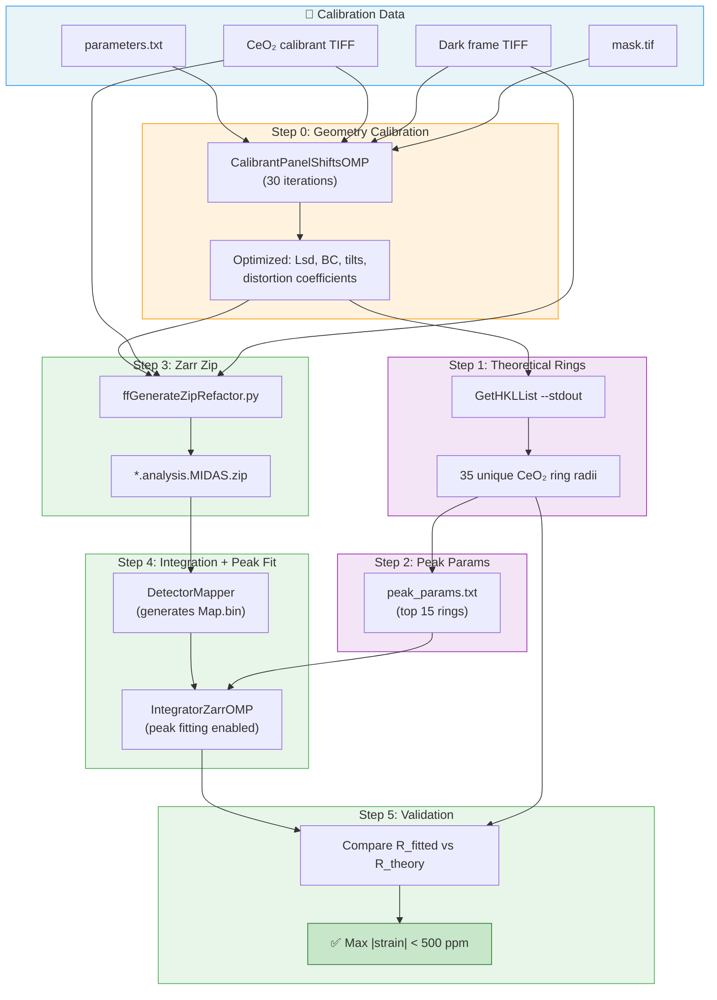

# FF-HEDM Integrator Peak Fitting Benchmark

**MIDAS v9+**

## Overview

The integrator peak fitting benchmark (`tests/test_integrator_peaks.py`) validates the complete **calibration → integration → peak fitting** pipeline by:

1. Running `CalibrantPanelShiftsOMP` to refine detector geometry from CeO₂ powder rings
2. Computing theoretical ring radii from the calibrated geometry (`GetHKLList`)
3. Generating a Zarr zip from the calibration TIFF (`ffGenerateZipRefactor.py`)
4. Running `DetectorMapper` + `IntegratorZarrOMP` with 1D peak fitting
5. Comparing fitted peak centers to theoretical positions (strain residual in ppm)

## Pipeline Data Flow



## Prerequisites

- MIDAS must be compiled (all FF_HEDM binaries built, including `IntegratorZarrOMP` and `DetectorMapper`)
- The `midas_env` conda environment must be active:
  ```bash
  source /path/to/miniconda3/bin/activate midas_env
  ```
- Calibration data must exist in `FF_HEDM/Example/Calibration/`:
  - `CeO2_Pil_100x100_att000_650mm_71p676keV_001956.tif`
  - `dark_CeO2_Pil_100x100_att000_650mm_71p676keV_001975.tif`
  - `mask.tif`
  - `parameters.txt`

## Usage

```bash
python tests/test_integrator_peaks.py [-nCPUs N] [--skip-calibration] [--max-rings N]
```

### Arguments

| Argument | Default | Description |
|----------|---------|-------------|
| `-nCPUs` | `1` | Number of CPUs for parallel steps |
| `--skip-calibration` | off | Skip `CalibrantPanelShiftsOMP` and use `parameters.txt` as-is |
| `--max-rings` | `15` | Maximum number of CeO₂ rings to fit |

### Examples

```bash
# Full pipeline (calibration + integration + peak fitting)
python tests/test_integrator_peaks.py -nCPUs 8

# Quick iteration (skip calibration, use existing geometry)
python tests/test_integrator_peaks.py -nCPUs 8 --skip-calibration

# Fit more rings for more thorough validation
python tests/test_integrator_peaks.py -nCPUs 8 --max-rings 25
```

### From build.sh

```bash
./build.sh --test peaks     # Run integrator peak benchmark after build
./build.sh --test all       # Run all benchmarks (ff, nf, calib, peaks)
```

## Output Metrics

The benchmark prints a per-ring comparison table:

```
Ring   R_theory   R_fitted         ΔR   ΔR/R (ppm)       Imax        SNR
----------------------------------------------------------------------
     1     211.86     211.79    -0.076       -356.7   112469.7       28.8
     2     244.73     244.75     0.018         74.5    30147.4       52.5
    ...
----------------------------------------------------------------------
  Mean strain:        51.8 ppm
  Max |strain|:      356.7 ppm
  ✅ PASS: Max strain residual (357 ppm) < threshold (500 ppm)
```

### Metric Definitions

| Column | Description | Expected Range |
|--------|-------------|---------------|
| **R_theory** | Theoretical ring radius from `GetHKLList` (pixels) | Reference |
| **R_fitted** | Pseudo-Voigt peak center from 1D lineout fit (pixels) | Should match R_theory |
| **ΔR** | `R_fitted − R_theory` (pixels) | < 0.1 px |
| **ΔR/R (ppm)** | Strain-equivalent residual: `(ΔR/R) × 10⁶` | < 500 ppm |
| **Imax** | Peak height above background (counts) | Decreases with ring radius |
| **SNR** | `Imax / sqrt(SSR/N)` — signal-to-noise ratio | > 10 is good; > 100 is excellent |

### Pass Criteria

- **Max |strain|** must be < **500 ppm** (50 microstrain)
- This threshold represents the combined systematic error from binning discretization, detector geometry imperfection, and fitting noise

### Comparison to Calibrant

| Method | Mean Strain | What It Measures |
|--------|------------|-----------------|
| **CalibrantPanelShiftsOMP** | ~19 ppm | Per-eta-bin peak fitting with simultaneous geometry refinement |
| **IntegratorZarrOMP** | ~52 ppm | Azimuthally-averaged 1D lineout with fixed (calibrated) geometry |

The ~2.7× difference is expected:
- The calibrant simultaneously **optimizes geometry** to minimize strain, while the integrator uses fixed geometry.
- The calibrant **excludes bad eta bins** (bins where the peak fit fails or the SNR is too low), so outlier slices with poor data do not contribute to the strain metric. The integrator averages over **all** azimuthal bins — including partially masked regions, panel gaps, and noisy bins — which increases the residuals.
- The integrator's azimuthal averaging and binning discretization (RBinSize=0.25 px) further limit peak center precision.

## Troubleshooting

- **`roi_min` shows huge negative values**: The mask file is not loading. Check that `MaskFile` is in the parameter file with a valid absolute path, and that `DetectorMapper` was rebuilt after the `MaskFN` zero-initialization fix.
- **`ResultFolder (null)`**: The Zarr zip is missing the `ResultFolder` entry. Ensure `ffGenerateZipRefactor.py` receives `-resultFolder`.
- **~35,000 ppm strain**: Mask is not applied — unmasked bad pixels produce corrupted lineout data.
- **CalibrantPanelShiftsOMP timeout**: The calibration runs 30 iterations and can take several minutes. Use `--skip-calibration` for fast iteration during development.

## See Also

- [FF_Radial_Integration.md](FF_Radial_Integration.md) — Full documentation of the radial integration suite
- [FF_Phase_Identification.md](FF_Phase_Identification.md) — Multi-phase identification from diffraction images
- [FF_Calibration.md](FF_Calibration.md) — Geometry calibration with `CalibrantPanelShiftsOMP`
- [FF_Benchmark.md](FF_Benchmark.md) — FF-HEDM full pipeline benchmark
