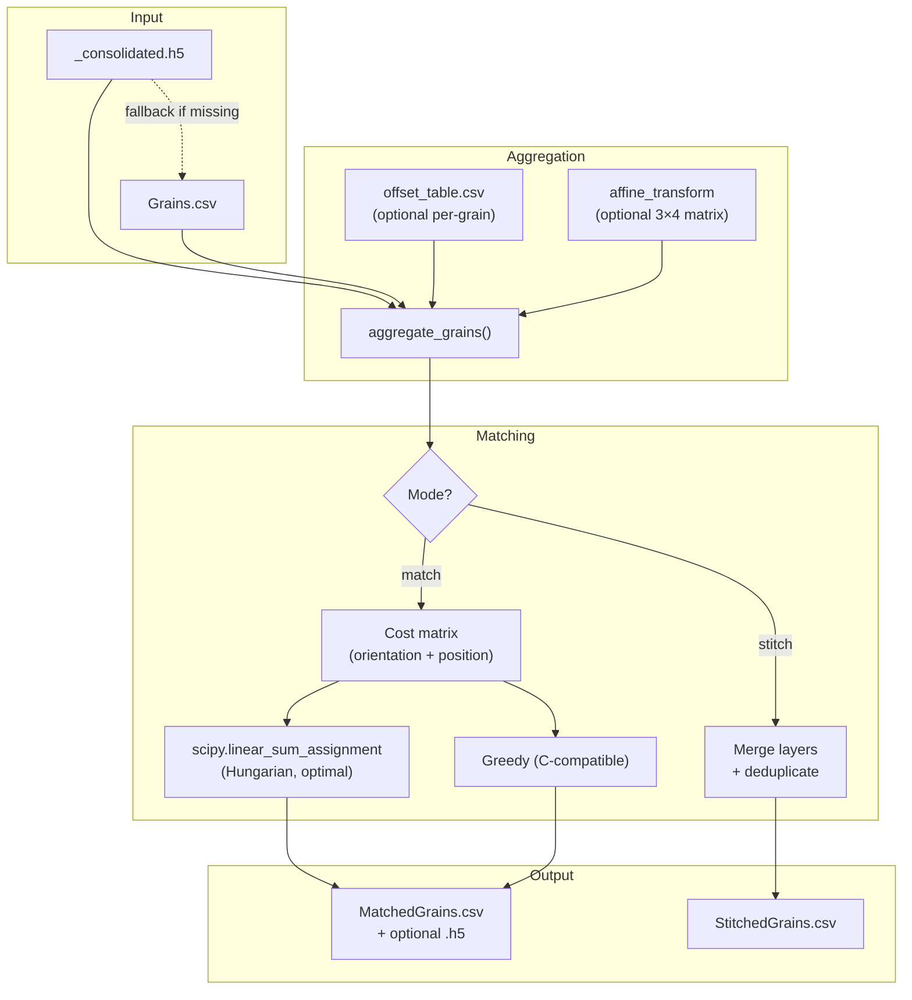

# Matching and Stacking Grain Reconstructions

**Version:** 9.0  
**Contact:** hsharma@anl.gov

---

## 1. Introduction

After performing Far-Field HEDM (FF-HEDM) analysis with `ff_MIDAS.py`, you have a `Grains.csv` file for each scan layer at each load state. This manual describes how to:

1. **Match** grains across load states — track the same grain as external load is applied.
2. **Stitch** layers from the same state — combine multiple scan heights into one grain map.

Both operations are performed by `match_grains.py`, located in the `utils/` directory of your MIDAS installation.

> [!NOTE]
> This script replaces the older C-based `MatchGrains` binary for most use cases. The C binary remains available for backwards compatibility.

---

## 2. Concepts

### 2.1. Why Matching is Needed

In an *in situ* experiment, a specimen is scanned at multiple load states. Between scans, grains move and rotate due to:

- **Rigid body translation** — the loading device shifts the sample.
- **Deformation** — the sample stretches/compresses, causing grains to displace relative to each other.
- **Grain rotation** — crystal lattices rotate in response to stress.

To compare grain properties (e.g., strain evolution) across load states, you must first identify *which grain in State 2 corresponds to which grain in State 1*.

### 2.2. Why Stitching is Needed

Often, the X-ray beam is thinner than the sample, so you scan at multiple vertical positions (layers). Each layer produces its own `Grains.csv` with independent grain IDs. To get a complete 3D grain map, you must:

1. Stack the layers vertically (offset Z by beam thickness).
2. Merge duplicate grains at layer boundaries.

### 2.3. How Matching Works



The matching pipeline works in three stages:

1. **Aggregation** — Load grain data from one or more layers. Grains are vertically stacked using beam thickness and optionally transformed (global offset, per-grain offset, or affine transform).

2. **Cost Matrix** — For every pair of grains (one from each state), compute a "distance" based on crystallographic misorientation, spatial distance, or a weighted combination.

3. **Assignment** — Find the best 1-to-1 mapping:
   - **Hungarian algorithm** (default): Globally optimal — minimizes total cost across all matches.
   - **Greedy**: For each grain in State 2, assigns the closest grain in State 1. Faster but may produce suboptimal pairings when grains are close together.

---

## 3. Installation and Prerequisites

The script is part of your MIDAS installation. It requires:

- **Python 3.8+**
- **numpy** — matrix operations and I/O
- **scipy** — `linear_sum_assignment` for Hungarian matching
- **h5py** (optional) — for reading consolidated HDF5 files

```bash
pip install numpy scipy h5py
```

---

## 4. Quick Start

### 4.1. Match Grains Between Two Load States

```bash
cd /path/to/results

# Single-layer match (most common case):
python $MIDAS_HOME/utils/match_grains.py match \
  --state1 unloaded/LayerNr_1/Grains.csv \
  --state2 loaded/LayerNr_1/Grains.csv \
  --space-group 225 \
  --mode combined \
  --weights 2.0 50.0 \
  --output matched_load1.csv
```

### 4.2. Stitch Layers from the Same State

```bash
python $MIDAS_HOME/utils/match_grains.py stitch \
  --layers LayerNr_1/Grains.csv LayerNr_2/Grains.csv LayerNr_3/Grains.csv \
  --beam-thickness 200 \
  --space-group 225 \
  --output stitched_unloaded.csv
```

### 4.3. Multi-Layer Match with Deformation Correction

```bash
# First, stitch each state:
python $MIDAS_HOME/utils/match_grains.py stitch \
  --layers unloaded/LayerNr_*/Grains.csv --beam-thickness 200 \
  --space-group 225 --output stitched_state0.csv

python $MIDAS_HOME/utils/match_grains.py stitch \
  --layers loaded/LayerNr_*/Grains.csv --beam-thickness 200 \
  --space-group 225 --output stitched_state1.csv

# Then match with affine deformation correction:
python $MIDAS_HOME/utils/match_grains.py match \
  --state1 stitched_state0.csv \
  --state2 stitched_state1.csv \
  --space-group 225 --mode combined --weights 2.0 50.0 \
  --affine-from-points tomo_ref.csv tomo_def.csv \
  --output matched_states.csv
```

---

## 5. Command Reference

### 5.1. `match` Subcommand

Matches grains between two sample states.

```
python match_grains.py match [options]
```

| Argument | Type | Default | Description |
|----------|------|---------|-------------|
| `--state1` | paths+ | *required* | Grains.csv files for State 1 (one per layer) |
| `--state2` | paths+ | *required* | Grains.csv files for State 2 (one per layer) |
| `--space-group` | int | *required* | Space group number (e.g., 225 for FCC, 194 for HCP) |
| `--beam-thickness` | float | 0 | Vertical step between layers (µm). Only needed for multi-layer. |
| `--mode` | str | `combined` | `orientation`: match by misorientation only. `position`: match by centroid distance only. `combined`: weighted sum of both. |
| `--weights` | float float | 1.0 1.0 | **Combined mode only.** Scaling factors: `(angle_scale_deg, dist_scale_um)`. Cost = misorientation/angle_scale + distance/dist_scale. |
| `--offset` | float×3 | 0 0 0 | Global translation `(dx, dy, dz)` applied to State 2 positions (µm). |
| `--offset-table` | path | None | CSV with per-grain offsets: `layer,grainID,dx,dy,dz`. |
| `--affine` | float×12 | None | 3×4 affine matrix `[R|t]` applied to State 2 (row-major). |
| `--affine-from-points` | path path | None | Two CSV files of matched point pairs (reference, deformed). Least-squares affine fit. |
| `--remove-duplicates` | flag | True | Use Hungarian (1-to-1) matching. |
| `--no-remove-duplicates` | flag | False | Use greedy matching (allows many-to-one). |
| `--size-filter` | float | 0 | Only match grains within this % of each other's size. |
| `--ref-misorientation` | float | 0 | Expected misorientation (degrees). Useful for twin finding or known rotations. |
| `--output` | path | `MatchedGrains.csv` | Output file. |
| `-v` | flag | False | Verbose logging. |

### 5.2. `stitch` Subcommand

Combines grain lists from multiple layers into a single list and removes duplicates at
layer boundaries.

```
python match_grains.py stitch [options]
```

| Argument | Type | Default | Description |
|----------|------|---------|-------------|
| `--layers` | paths+ | *required* | Grains.csv files (or layer directories) to stitch |
| `--beam-thickness` | float | *required* | Vertical distance between layers (µm) |
| `--space-group` | int | *required* | Space group number |
| `--misorientation-tol` | float | 0.5 | Maximum misorientation for merging (degrees) |
| `--position-tol` | float | 50.0 | Maximum centroid distance for merging (µm) |
| `--output` | path | `StitchedGrains.csv` | Output file |

---

## 6. Matching Modes Explained

### 6.1. Orientation Only (`--mode orientation`)

Uses only crystallographic misorientation. Best when:
- Grain positions are unreliable (poor beam center calibration).
- Very few grains in the illuminated volume (low ambiguity).

### 6.2. Position Only (`--mode position`)

Uses only Euclidean distance between grain centroids. Best when:
- Grains have similar orientations (e.g., textured materials).
- Positions are well-calibrated across states.

### 6.3. Combined (`--mode combined`)

Uses a weighted sum of misorientation and position distance. **This is the recommended mode** for most experiments. The cost for each pair (i, j) is:

$$\text{cost}_{i,j} = \frac{\Delta\omega_{i,j}}{w_\omega} + \frac{\|\mathbf{x}_i - \mathbf{x}_j\|}{w_x}$$

where $w_\omega$ is `--weights` argument 1 (in degrees) and $w_x$ is argument 2 (in µm).

> [!TIP]
> **Choosing weights:** Set each weight to the typical uncertainty in that quantity. For well-calibrated experiments, `2.0 50.0` (2° and 50 µm) works well. If your position calibration is very accurate, increase the position weight (e.g., `2.0 20.0`).

---

## 7. Deformation Correction

### 7.1. Why It Matters

When a sample is deformed (e.g., tensile test in the RAMS load frame), grains move rigidly *plus* deform nonuniformly. Without correction, grains at the top of the sample may have shifted by 100+ µm relative to grains at the bottom, making position-based matching unreliable.

### 7.2. Options

#### Global Offset (`--offset`)
Simplest approach — applies a constant translation to all grains in State 2:
```bash
--offset 0 0 -30.5   # shift 30.5 µm in Z
```

#### Per-Grain Offset Table (`--offset-table`)
For nonuniform deformation, provide a CSV with individual corrections:
```csv
layer,grainID,dx,dy,dz
0,1,0.0,0.0,-10.2
0,2,0.0,0.0,-10.5
1,1,0.0,0.0,-15.3
```
These offsets can be determined from tomography scans or digital image correlation (DIC).

#### Affine Transform (`--affine` or `--affine-from-points`)
For rigid body + stretch deformation, an affine transform $\mathbf{x}' = \mathbf{A}\mathbf{x} + \mathbf{t}$ captures rotation, scaling, and translation in one operation.

You can provide the 12 values of the 3×4 matrix directly:
```bash
--affine 1.0 0.0 0.0  0.0 1.0 0.0  0.0 0.0 1.02  0 0 -30.5
#        [--- R (3×3) ---]                          [- t -]
```

Or let the script fit it automatically from matched point pairs (e.g., from tomography features):
```bash
--affine-from-points reference_points.csv deformed_points.csv
```
where each CSV has columns `x,y,z` (with header).

---

## 8. Using as a Python Library

All functions are importable for scripting and Jupyter notebooks:

```python
import sys
sys.path.insert(0, '/path/to/MIDAS/utils')
from match_grains import (
    load_grains,
    aggregate_grains,
    match_grains,
    stitch_layers,
    fit_affine_from_points,
)

# Load single Grains.csv
data = load_grains('LayerNr_1/Grains.csv')
print(f"Loaded {data.shape[0]} grains, {data.shape[1]} columns")

# Aggregate multi-layer
state1 = aggregate_grains(
    ['LayerNr_1/Grains.csv', 'LayerNr_2/Grains.csv'],
    beam_thickness=200.0,
)

# Match
result = match_grains(state1, state2, sg_nr=225,
                      mode='combined', weights=(2.0, 50.0))

for i1, i2, cost, angle, dist in result['matches']:
    print(f"  Grain {int(state1[i1, 0])} ↔ {int(state2[i2, 0])}: "
          f"Δω={angle:.2f}°, d={dist:.1f}µm")

# Stitch layers
stitched = stitch_layers(
    ['LayerNr_1/Grains.csv', 'LayerNr_2/Grains.csv'],
    beam_thickness=200, sg_nr=225,
)
```

### Key Functions

| Function | Description |
|----------|-------------|
| `load_grains(path)` | Load from `_consolidated.h5`, falls back to `Grains.csv` |
| `aggregate_grains(files, ...)` | Stack layers, apply offsets/transforms, assign unique IDs |
| `compute_cost_matrix(s1, s2, ...)` | Build N₁×N₂ matching cost matrix |
| `match_grains(s1, s2, ...)` | Full matching pipeline → `{matches, unmatched_state1, unmatched_state2}` |
| `stitch_layers(files, ...)` | Stack layers and merge duplicates at boundaries |
| `fit_affine_from_points(ref, def)` | Least-squares 3×4 affine fit from point correspondences |

---

## 9. Output Format

### MatchedGrains.csv

Tab-separated file with a header row. Each row represents one grain pair or an unmatched grain.

| Column | Name | Description |
|--------|------|-------------|
| 1 | `UniqueIDState1` | Unique ID in aggregated State 1 (0 if unmatched) |
| 2 | `LayerState1` | Layer number in State 1 |
| 3 | `OrigIDState1` | Original Grains.csv grain ID |
| 4 | `UniqueIDState2` | Unique ID in aggregated State 2 (0 if unmatched) |
| 5 | `LayerState2` | Layer number in State 2 |
| 6 | `OrigIDState2` | Original Grains.csv grain ID |
| 7–10 | `Quat0..3State1` | Orientation quaternion (State 1) |
| 11–14 | `Quat0..3State2` | Orientation quaternion (State 2) |
| 15–17 | `X/Y/ZState1` | Grain centroid position (µm) |
| 18–20 | `X/Y/ZState2` | Grain centroid position (µm) |
| 21 | `GrainSize1` | Grain radius in State 1 (µm) |
| 22 | `GrainSize2` | Grain radius in State 2 (µm) |
| 23 | `CostValue` | Matching cost (mode-dependent) |
| 24 | `MisorientAngle` | Misorientation angle (degrees) |
| 25–27 | `dX/dY/dZ` | Position difference vector (µm) |
| 28 | `EuclideanDist` | Euclidean distance between centroids (µm) |

**Unmatched grains** have zeros in the columns of the missing state.

### StitchedGrains.csv

Tab-separated with columns: `UniqueID`, `LayerNr`, `OrigGrainID`, orientation matrix (9 values), `X`, `Y`, `Z`, `GrainSize`, quaternion (4 values).

---

## 10. Practical Workflow for In Situ Experiments

Here is a recommended step-by-step workflow for matching grains across load states in a mechanical testing experiment.

### Step 1: Run FF-HEDM Analysis

Process all layers at all load states using `ff_MIDAS.py`:
```bash
for state in state0 state1 state2; do
  for layer in 1 2 3; do
    python ff_MIDAS.py -paramFN ${state}/ps_ff.txt \
      -startLayerNr $layer -endLayerNr $layer \
      -resultFolder ${state}/LayerNr_${layer}/
  done
done
```

### Step 2: Stitch Layers (Per State)

```bash
for state in state0 state1 state2; do
  python $MIDAS_HOME/utils/match_grains.py stitch \
    --layers ${state}/LayerNr_1/ ${state}/LayerNr_2/ ${state}/LayerNr_3/ \
    --beam-thickness 200 --space-group 225 \
    --output ${state}/stitched.csv
done
```

### Step 3: Determine Deformation Offsets (Optional)

If you have tomography data, determine how the sample translated and deformed:
1. Identify fiducial features (e.g., sample edges, inclusions) in both states.
2. Create two CSV files with matched `x,y,z` coordinates.
3. Use `--affine-from-points` in the match step.

### Step 4: Match Across States

```bash
python $MIDAS_HOME/utils/match_grains.py match \
  --state1 state0/stitched.csv \
  --state2 state1/stitched.csv \
  --space-group 225 --mode combined --weights 2.0 50.0 \
  --affine-from-points ref_features.csv def_features.csv \
  --output matched_0_to_1.csv
```

### Step 5: Analyze Results

```python
import numpy as np

data = np.genfromtxt('matched_0_to_1.csv', skip_header=1, delimiter='\t')
matched = data[(data[:, 0] > 0) & (data[:, 3] > 0)]  # Both states present

print(f"Matched: {len(matched)} grains")
print(f"Mean misorientation: {np.mean(matched[:, 23]):.3f}°")
print(f"Mean displacement: {np.mean(matched[:, 27]):.1f} µm")
```

---

## 11. Troubleshooting

| Issue | Likely Cause | Resolution |
|-------|-------------|------------|
| Few matches found | States not aligned | Use `--offset` or `--affine-from-points` to correct sample displacement |
| All misorientations are ~0° | Matching same file to itself | Verify `--state1` and `--state2` are different |
| `scipy` import error | Missing dependency | Run `pip install scipy` |
| `h5py` import warning | No consolidated HDF5 | This is normal — falls back to Grains.csv |
| Very slow matching | Too many grains | Use `--size-filter 20` to pre-filter, or reduce layers |
| Wrong matches in textured sample | Orientation ambiguity | Use `--mode combined` instead of `--mode orientation` |
| `FileNotFoundError` | Wrong path | Verify Grains.csv exists in the specified directory |

---

## 12. Legacy C Binary

The C binary `MatchGrains` is still available for backwards compatibility:

```bash
MatchGrains OutFile state1.txt state2.txt SGNr \
  offsetX offsetY offsetZ matchMode \
  beamThickness1 beamThickness2 \
  removeDuplicates sizeFilter [weights] [refMiso]
```

The Python wrapper provides the same functionality plus:
- Multi-layer aggregation with unique grain IDs
- HDF5 input support
- Affine deformation transforms
- Optimal (Hungarian) matching
- Library API for scripting

---

## 13. See Also

- [FF_Analysis.md](FF_Analysis.md) — Full FF-HEDM analysis workflow (`ff_MIDAS.py`)
- [PF_Analysis.md](PF_Analysis.md) — Scanning/Point-Focus FF-HEDM
- [FF_calibration.md](FF_calibration.md) — Detector geometry calibration
- [ForwardSimulationManual.md](ForwardSimulationManual.md) — Forward simulation for validation
- [README.md](README.md) — High-level MIDAS overview and manual index
