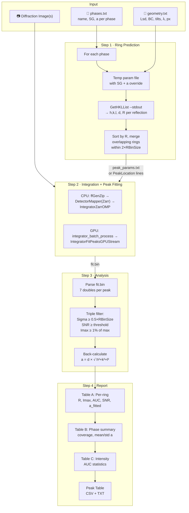

# FF Phase Identification

Multi-phase identification from powder diffraction images using MIDAS integration and peak fitting.

## Overview

`phase_id.py` identifies crystallographic phases present in 2D diffraction images by:
1. Predicting diffraction ring positions for each candidate phase
2. Integrating the 2D image to a 1D radial profile
3. Fitting pseudo-Voigt peaks at predicted ring positions
4. Back-calculating lattice parameters from fitted peak centers
5. Reporting per-ring results and per-phase detection summary

The tool supports both CPU (`IntegratorZarrOMP`) and GPU (`IntegratorFitPeaksGPUStream`) backends.

## Workflow



## Quick Start

```bash
# Basic usage — identify phases in a single image
python utils/phase_id.py \
    -paramFN geometry.txt \
    -dataFN scan_001.tif \
    -phases phases.txt \
    -darkFN dark.tif \
    -nCPUs 4

# Multiple explicit files
python utils/phase_id.py \
    -paramFN geometry.txt \
    -dataFN scan_001.tif scan_002.tif scan_003.tif \
    -phases phases.txt

# Number range (replaces last number in filename)
python utils/phase_id.py \
    -paramFN geometry.txt \
    -dataFN scan_000001.tif \
    -startNr 1 -endNr 100 \
    -phases phases.txt

# Process all files in a folder
python utils/phase_id.py \
    -paramFN geometry.txt \
    -dataFolder /data/pressure_series/ \
    -phases phases.txt

# Parallel processing — 4 files at a time
python utils/phase_id.py \
    -paramFN geometry.txt \
    -dataFolder /data/pressure_series/ \
    -phases phases.txt \
    --multi-cpu 4 \
    --output results.txt

# GPU backend
python utils/phase_id.py \
    -paramFN geometry.txt \
    -dataFN scan_001.tif \
    -phases phases.txt \
    -backend gpu
```

## Input Files

### Parameter File (`-paramFN`)

Standard MIDAS parameter file with detector geometry. Required keys:
- `Lsd` — sample-to-detector distance (µm)
- `BC` — beam center (y z) in pixels
- `px` — pixel size (µm)
- `Wavelength` — X-ray wavelength (Å)
- `RMin`, `RMax`, `RBinSize` — radial integration limits and bin size
- `ty`, `tz`, `p0`–`p4` — detector tilts and distortion coefficients
- `SpaceGroup`, `LatticeConstant` — placeholder values (overridden per phase)
- `MaskFile` — bad pixel mask (optional but recommended)

### Phases File (`-phases`)

Simple text file defining candidate crystal structures. One phase per line:
```text
# name  spacegroup  lattice_a(Å)
CeO2    225         5.4116
LaB6    221         4.1569
Au      225         4.0782
Fe_bcc  229         2.8665
```

Columns:
| Column | Description |
|--------|-------------|
| `name` | Phase label (no spaces) |
| `spacegroup` | Space group number (International Tables) |
| `lattice_a` | Cubic lattice parameter in Ångströms |

> [!NOTE]
> Only **cubic** crystal systems are currently supported. All six lattice parameters are set to `a a a 90 90 90`.

## Command-Line Arguments

| Argument | Default | Description |
|----------|---------|-------------|
| `-paramFN` | required | Geometry parameter file |
| `-dataFN` | — | Data file(s). Multiple accepted. Used as template with `-startNr`/`-endNr`. |
| `-dataFolder` | — | Process all TIFF/HDF5 files in this folder |
| `-startNr` | — | Starting file number (requires `-dataFN` template) |
| `-endNr` | — | Ending file number (requires `-startNr`) |
| `-phases` | required | Phase definitions file |
| `-darkFN` | — | Dark frame for subtraction |
| `-nCPUs` | 4 | Number of CPU threads per integration job |
| `-backend` | `cpu` | `cpu` (IntegratorZarrOMP) or `gpu` (IntegratorFitPeaksGPUStream) |
| `--snr-threshold` | 5.0 | Minimum SNR for a peak to be "detected" |
| `--rel-intensity-threshold` | 0.01 | Minimum Imax as fraction of strongest peak (1% default) |
| `--max-rings` | 20 | Maximum rings to fit per phase |
| `--roi-padding` | 30 | Peak fit ROI half-width in radial bins |
| `--merge-threshold` | 2×RBinSize | Ring deduplication threshold (pixels) |
| `--keep-work-dir` | — | Preserve temporary working directory |
| `--work-dir` | — | Use specific working directory |
| `--multi-cpu` | 0 | Process N files in parallel (0 = sequential). Runs `DetectorMapper` once, copies map files, then launches N workers. |
| `--output` | `<work-dir>/phase_id_results.txt` | Save combined results to this file |
| `--format` | `table` | Output format: `table` (default) or `json` |

## Detection Filters

A peak is considered "detected" only if **all three** conditions are met:

1. **Sigma filter**: `Sigma ≥ 0.5 × RBinSize` — rejects fitting artifacts where the optimizer converges to a delta-function width (Sigma ≈ 0.053), which indicates the fitter found noise rather than a real peak
2. **SNR filter**: `SNR ≥ snr-threshold` (default 5.0) — ensures the peak is statistically significant above background noise
3. **Relative intensity filter**: `Imax ≥ rel-intensity-threshold × max(Imax)` (default 1%) — eliminates weak noise peaks that happen to pass the SNR filter but are orders of magnitude weaker than real diffraction peaks

> [!NOTE]
> The detection gate uses raw `Imax` (peak height), not AUC. This is deliberate: AUC (`π × Imax × Sigma`) amplifies false positives from fitting artifacts where the fitter converges to its maximum allowed sigma (≈ 4.25), inflating AUC for tiny Imax values. AUC is computed and displayed for informational purposes.

When a peak fails detection, the rejection reason is displayed:
- `σ=0.053<0.125` — failed Sigma filter (fitting artifact)
- `SNR=2.1<5.0` — failed SNR filter
- `Imax=0.02%<1%` — failed relative intensity filter
- `NOT DET` — no peak found at all (Imax ≈ 0)

## Overlapping Rings

When rings from different phases have similar radii (ΔR < merge threshold), they are **merged** into a single fit position. After fitting:
- The fitted Rcen is used to back-calculate `a` for **each** contributing phase
- Both assignments are reported with their respective `Δa/a` values
- Overlapping peaks are flagged with ⚠️ in the output

| Proximity | Behavior |
|-----------|----------|
| ΔR > 2 × ROIPadding | Independent fits |
| ΔR < ROIPadding, > 2×FWHM | Joint fit, both resolved |
| ΔR < 2×FWHM, > merge threshold | Joint fit, flagged as "blended" |
| ΔR < merge threshold | Merged into single peak |

## Output

### Table A: Per-Ring Results

For each fitted ring:
- `Phase` + `(hkl)` — phase assignment and Miller indices
- `R_theory` / `R_fitted` — predicted vs. fitted radius (pixels)
- `Imax` — peak amplitude above background (counts)
- `AUC` — Area Under Curve (`π × Imax × Sigma`), measures total diffracted power
- `BG` — fitted background level
- `Sigma` — peak width (Gaussian-equivalent sigma, in bins)
- `SNR` — signal-to-noise ratio
- `a_fitted` — back-calculated cubic lattice parameter (Å)
- `Δa/a(ppm)` — fractional deviation from nominal lattice parameter
- `Notes` — overlap warnings, rejection reasons

### Table B: Phase Summary

Per-phase aggregate statistics:
- `Detected` — count of detected/total rings
- `Coverage` — detection percentage
- `Mean/Std/Min/Max a(Å)` — lattice parameter statistics
- `Δa/a_nom(ppm)` — mean fractional deviation from nominal
- `Status` — classification (see [Phase Classification](#phase-classification) below)

### Table C: Intensity Statistics

Per-phase AUC breakdown (only includes detected peaks):
- `Sum/Mean/Max/Min AUC` — AUC distribution across detected rings
- `Frac of Total` — fraction of total detected AUC belonging to each phase

> [!NOTE]
> AUC (`π × Imax × Sigma`) captures both peak height and width, providing a better measure of total diffracted power than Imax alone. It is used for intensity comparisons between phases but NOT for detection gating.

### Peak Table (`peak_table.csv` / `peak_table.txt`)

A combined peak table is written alongside the results file, containing **all** fitted peaks (both detected and undetected) across all processed files. Two formats are generated automatically:

| File | Format |
|------|--------|
| `peak_table.csv` | Comma-separated, with header row |
| `peak_table.txt` | Space-aligned columns, `#`-comment header |

**Columns:**

| Column | Description |
|--------|-------------|
| `Filename` | Source data filename |
| `R_px` | Fitted peak center (pixels) |
| `R_um` | Fitted peak center (µm) = R_px × pixel_size |
| `2theta_deg` | Scattering angle = atan(R_um / Lsd), in degrees |
| `FWHM_px` | Full-width half-maximum in pixels (2.355 × σ) |
| `FWHM_2theta_deg` | FWHM converted to 2θ degrees |
| `Intensity` | Integrated area under the peak |
| `Imax` | Peak maximum intensity (counts) |
| `SNR` | Signal-to-noise ratio |
| `Phase` | Assigned phase label |
| `HKL` | Miller indices |
| `Flag` | `DETECTED` or `NOT_DET` (based on detection filters) |

> [!TIP]
> The peak table is ideal for quick post-experiment analysis: load `peak_table.csv` with pandas/Excel, filter by `Flag == 'DETECTED'`, and plot 2θ positions vs. filename to track lattice evolution.

## Phase Classification

Phases are classified using a multi-criteria decision that goes beyond simple coverage percentage:

1. **Exclusive-peak check**: If a phase has exclusive (non-overlapping) rings but **none** of them are detected, the phase is capped at ⚠️ MARGINAL. This prevents a phase from being declared PRESENT solely through peaks shared with another phase.
2. **First-ring heuristic**: If neither of a phase's two lowest-angle rings are detected, the phase is capped at ⚠️ MARGINAL. Low-angle reflections are always the strongest; if both are missed, the phase is likely not present.
3. **PRESENT criteria** (any one sufficient):
   - Exclusive ring detection ratio ≥ 30%
   - Coverage ≥ 50% AND intensity fraction ≥ 20%
   - Coverage ≥ 40% AND intensity fraction ≥ 40%
4. **MARGINAL**: Some rings detected but criteria above not met
5. **ABSENT**: Zero detected rings

## Lattice Parameter Back-Calculation

For cubic crystals, the lattice parameter is computed from the fitted peak center:

```
R_µm = R_fitted × pixel_size
2θ = atan(R_µm / Lsd)
d = λ / (2 · sin(θ))
a = d × √(h² + k² + l²)
```

The mean `a` across all detected rings provides the refined lattice parameter. The standard deviation indicates the consistency of the refinement. Values within ~100 ppm of nominal indicate good geometry calibration.

## CPU vs GPU Backend

| Feature | CPU (`-backend cpu`) | GPU (`-backend gpu`) |
|---------|---------------------|---------------------|
| Binary | `IntegratorZarrOMP` | `IntegratorFitPeaksGPUStream` |
| Orchestration | Direct: `ffGenerateZipRefactor → DetectorMapperZarr → IntegratorZarrOMP` | Via `integrator_batch_process.py` |
| Peak params | `peak_params.txt` file | `PeakLocation` lines in param file |
| Best for | Few images, no GPU | Streaming, large datasets |
| Output | `fit.bin` (same format) | `fit.bin` (same format) |

## Parallel Processing (`--multi-cpu`)

When processing multiple files, `--multi-cpu N` launches up to N files in parallel:

1. **Phase prediction and ring deduplication** run once (shared)
2. **DetectorMapper** (non-Zarr) runs once in the base work directory, producing `Map.bin` + `nMap.bin`
3. **Map files are copied** to each per-file work directory
4. **N workers** run concurrently. Each calls `IntegratorZarrOMP` in **direct file mode** (`-paramFN`/`-dataFN`), reading the TIFF/HDF5 image directly—**no Zarr creation needed**. This eliminates the ~0.5s per-file Zarr bottleneck, achieving ~13× faster per-file integration.
5. **Results are printed in file order** — output is captured per-worker to prevent interleaving
6. **Combined results** are saved to the `--output` file

**Screen output** is compact — a single Phase Summary table header followed by per-file rows with per-stage timing (integrate, analysis). The Phase Summary includes a `Uniq` column showing the number of non-overlapping (exclusive) peaks detected for each phase. Full per-ring detail is written to the `--output` file only.

```bash
# Process 8 files, 4 in parallel
python utils/phase_id.py \
    -paramFN geometry.txt \
    -dataFolder /data/scans/ \
    -phases phases.txt \
    --multi-cpu 4 \
    --output /data/results.txt \
    --keep-work-dir
```

> [!TIP]
> The `--multi-cpu` flag controls job-level parallelism. Each `IntegratorZarrOMP` call uses 1 CPU thread. A timing summary at the end shows wall time and per-stage breakdown (rings, mapper, files) for identifying bottlenecks.

## Benchmark Test

```bash
# Run the phase identification benchmark
python utils/test_phase_id.py -nCPUs 4

# Via build.sh
./build.sh --test phaseid
```

The benchmark:
1. Runs CeO₂ + Au phases against the CeO₂ calibration data
2. Asserts CeO₂ is detected (≥30% coverage)
3. Asserts Au is absent (0 detections)
4. Validates CeO₂ lattice parameter within 500 ppm of 5.4116 Å

## Application: High-Pressure Compression Experiments

In dynamic compression or diamond anvil cell (DAC) experiments, the lattice parameter evolves under pressure. `phase_id.py` handles this naturally:

### How It Works

The tool predicts ring positions using the **nominal** (ambient) lattice parameter, then fits peaks wherever they actually appear within the ROI window. Even if the lattice parameter changes significantly under pressure, the **back-calculation** from the fitted Rcen automatically yields the compressed lattice parameter:

```
nominal a = 5.4116 Å → predicted R = 211.85 px
compressed a = 5.30 Å → actual R shifts to ~216 px
→ fitted Rcen = 216.03 px
→ back-calculated a = 5.2998 Å (correct!)
```

The key requirement is that the shifted peak must remain **within the ROI window** (`--roi-padding`). With the default `--roi-padding 30` (= 30 bins × 0.25 px/bin = 7.5 px), peaks can shift by up to ~7 px and still be captured.

### Recommended Settings for Large Compressions

| Compression | Expected ΔR | Recommended `--roi-padding` |
|-------------|------------|----------------------------|
| < 1% volume | < 3 px | 30 (default) |
| 1–5% volume | 3–15 px | 60–80 |
| 5–20% volume | 15–60 px | 100–200 |
| > 20% volume | > 60 px | 250+ or update nominal `a` |

> [!TIP]
> For very large compressions (>10% volume change), consider updating the nominal `a` in `phases.txt` to a mid-range value. For example, if you expect `a` to go from 5.41 to 5.00 Å, use `a = 5.20` as the nominal. This centers the ROI windows on the expected peak positions and reduces required padding.

### Multi-Image Time Series

For tracking lattice parameter evolution across a series of images (e.g., pressure steps, time-resolved), run `phase_id.py` on each image independently and collect the per-image fitted lattice parameters:

```bash
# Process a series of images in parallel
python utils/phase_id.py \
    -paramFN geometry.txt \
    -dataFolder /data/pressure_series/ \
    -phases phases.txt \
    -nCPUs 2 \
    --multi-cpu 8 \
    --roi-padding 100 \
    --work-dir output/ \
    --output lattice_results.txt
```

The per-phase `Mean a(Å)` from each run gives `a(t)` or `a(P)`, which can be used to compute:
- **Equation of state**: `V(P) = a³(P)` for cubic
- **Strain evolution**: `ε = (a - a₀) / a₀`
- **Phase transitions**: sudden appearance/disappearance of phases

> [!NOTE]
> For streaming real-time experiments at the beamline, use `-backend gpu` with `integrator_batch_process.py` for much faster throughput.

## See Also

- [FF_Radial_Integration.md](FF_Radial_Integration.md) — Integration and peak fitting details
- [FF_Integrator_Benchmark.md](FF_Integrator_Benchmark.md) — Peak fitting benchmark
- [FF_Calibration.md](FF_Calibration.md) — Geometry calibration prerequisite
