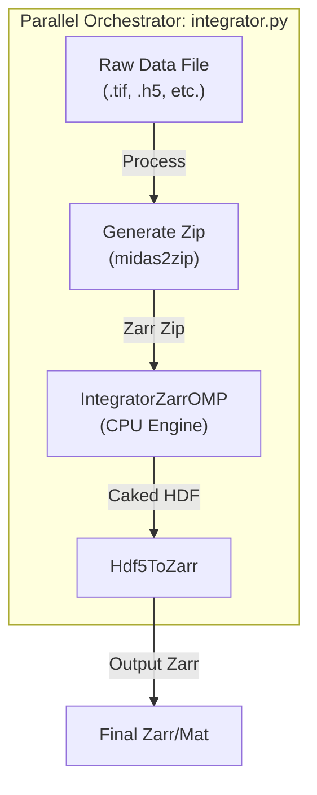

# MIDAS Radial Integration Suite: User Manual

**Version:** 7.0  
**Contact:** hsharma@anl.gov

---

## 1. Introduction

The MIDAS Radial Integration Suite provides high-performance tools for reducing 2D diffraction images into 1D intensity profiles (Azimuthal Integration). The suite helps you go from raw detector images to integrated `Intensity vs. Radius` lineouts and fitted peak parameters.

There are **two primary workflows** depending on your experimental needs:

| Feature | **Workflow A: GPU Streaming** | **Workflow B: CPU Batch Processing** |
| :--- | :--- | :--- |
| **Script** | `utils/integrator_batch_process.py` | `utils/integrator.py` |
| **Best For** | **Real-time** experiments, High-throughput, Large Datasets | **Post-experiment** analysis, Single files, Systems without GPUs |
| **Engine** | `IntegratorFitPeaksGPUStream` (CUDA) | `IntegratorZarrOMP` (OpenMP) |
| **Key Feature** | Live streaming from detector (PVA) or folder | Parallel processing of individual file chunks |
| **Outputs** | HDF5 with fit results & lineouts | Zarr/HDF5 with lineouts, MATLAB (.mat) option |

---

## 2. Workflow A: High-Throughput GPU Streaming
**Script:** `utils/integrator_batch_process.py`

This is the recommended workflow for most large-scale experiments. It orchestrates a high-speed pipeline where data streams (from files or a live detector) to a GPU-accelerated backend.

### 2.1. Pipeline Architecture

```mermaid
graph LR
    subgraph "Data Source"
        Files[Folder of Images]
        Stream[Epics PVA Stream]
    end
    
    subgraph "Orchestrator: integrator_batch_process.py"
        Server[integrator_server.py]
        GPU["IntegratorFitPeaksGPUStream<br>(CUDA Backend)"]
        Mapper["DetectorMapper<br>(Geometry Calc)"]
    end
    
    Files --> Server
    Stream --> Server
    Mapper -->|Map.bin| GPU
    Server -->|Frames (Socket)| GPU
    GPU -->|Binary Stream| Post[integrator_stream_process_h5.py]
    Post --> Final[Final Output .h5]
```

### 2.2. Requirements
*   **Hardware:** NVIDIA GPU (Compute Capability 3.5+).
*   **Environment:** MIDAS `FF_HEDM` compiled with CUDA support.
*   **Network:** Ports `60439` (Server) must be available locally.

### 2.3. Usage Examples

**Example 1: Processing a Folder of TIFFs**
```bash
python ~/opt/MIDAS/utils/integrator_batch_process.py \
    --param-file setup_30keV.txt \
    --folder /data/experiment/scan_01 \
    --dark /data/experiment/darks/dark_avg.bin \
    --output-h5 scan_01_integrated.h5
```

**Example 2: Real-time Streaming (Live Analysis)**
```bash
python ~/opt/MIDAS/utils/integrator_batch_process.py \
    --param-file setup_30keV.txt \
    --pva \
    --pva-ip 10.54.105.139 \
    --output-h5 live_analysis.h5
```

### 2.4. Key Arguments
| Argument | Description |
| :--- | :--- |
| `--param-file` | **Required.** Path to the text file containing geometry and integration parameters. |
| `--folder` | Source folder for image files (e.g., `.tif`, `.ge`). Mutually exclusive with `--pva`. |
| `--pva` | Enable listening to an EPICS PVA stream instead of reading files. |
| `--dark` | Path to a dark field file (binary) for background subtraction. |
| `--output-h5` | Filename for the final consolidated HDF5 output. |
| `--save-interval` | How often (in frames) to save the intermediate mapping file. Default: 500. |

---

## 3. Workflow B: CPU Batch Processing
**Script:** `utils/integrator.py`

This workflow is designed for flexibility. It processes files independently, making it ideal for converting specific scans, running on clusters without GPUs, or simple "convert-and-integrate" tasks. It handles the full lifecycle of a file: `Raw -> Zarr -> Integrated HDF5`.

### 3.1. Pipeline Architecture



### 3.2. Requirements
*   **Hardware:** Multi-core CPU.
*   **Dependencies:** `zarr`, `numpy`, `scipy`.
*   **Environment:** MIDAS `FF_HEDM` compiled (OpenMP support recommended).

### 3.3. Usage Examples

**Example 1: Process a single file**
```bash
python ~/opt/MIDAS/utils/integrator.py \
    --paramFN setup.txt \
    --dataFN /data/images/scan_001.tif \
    --resultFolder /analysis/output
```

**Example 2: parallel processing of a series**
Run on 4 files starting from `scan_001.tif`, using 8 global CPUs, with each integrator instance using 4 local threads.
```bash
python ~/opt/MIDAS/utils/integrator.py \
    --paramFN setup.txt \
    --dataFN /data/images/scan_001.tif \
    --startFileNr 1 \
    --endFileNr 4 \
    --nCPUs 8 \
    --nCPUsLocal 4
```

### 3.4. Key Arguments
| Argument | Description | Default |
| :--- | :--- | :--- |
| `-paramFN` | **Required.** Path to the parameter file. | - |
| `-dataFN` | **Required.** Path to the *first* data file pattern. | - |
| `-resultFolder` | Output directory for results. | Current Dir |
| `-nCPUs` | Number of simultaneous files to process. | 1 |
| `-nCPUsLocal` | Number of threads to use *per file* (OMP threads). | 4 |
| `-writeMat` | Save outputs as MATLAB `.mat` files? (1=Yes, 0=No). | 0 |
| `-mapDetector` | Run `DetectorMapper` to generate `Map.bin`? (1=Yes, 0=No). | 1 |
| `-convertFiles` | Convert input files to Zarr before integrating? | 1 |

---

## 4. Technical Reference: The Engines

Both workflows rely on the same core logic for mapping detector pixels to polar coordinates (`DetectorMapper`) and performing the integration.

### 4.1. DetectorMapper (The Geometry Engine)
This tool runs automatically at the start of either workflow. It consumes the experimental geometry (distance, tilts, pixel size) and produces two look-up tables:
*   `Map.bin`: The mapping of every pixel to its (Radius, Azimuth) bin.
*   `nMap.bin`: An index file for the map.

**Key Parameters (in parameter file):**
*   `Lsd`: Sample-to-detector distance (microns).
*   `BC`: Beam Center (y, z) in pixels.
*   `tx, ty, tz`: Detector tilts (degrees).
*   `RMin, RMax, RBinSize`: Radial integration range (pixels).
*   `EtaMin, EtaMax, EtaBinSize`: Azimuthal integration range (degrees).

### 4.2. Output Formats

**HDF5 / Zarr Structure**
Both workflows produce hierarchical data files containing:
*   `lineout`: The 1D integrated intensity vs. radius.
*   `tth`: The 2-theta angles corresponding to the radius bins.
*   `azimuth`: The azimuthal angles.
*   `intensity`: The 2D integrated image (if enabled).

**Visualizing Results**
Use the **FF-HEDM Interactive Viewer** (`interactiveFFplotting.py`) to inspect the resulting HDF5/Zarr files, or simpler tools like `silx view` or standard Python `h5py`/`zarr` scripts.
