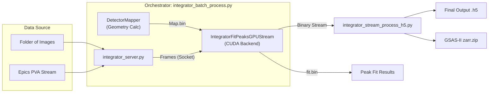
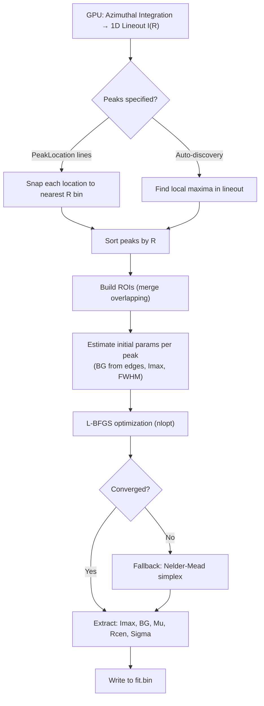
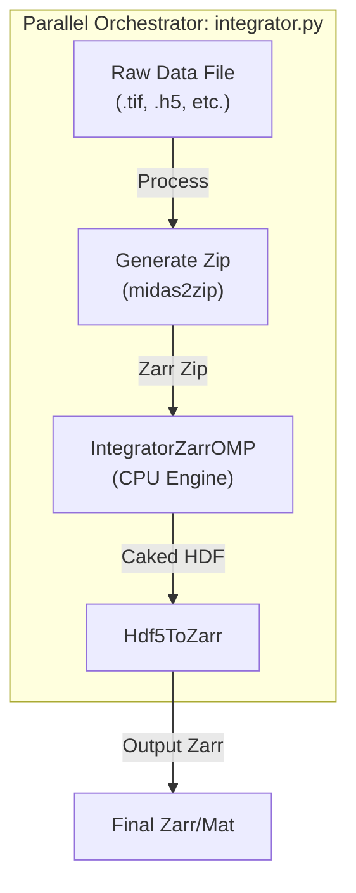

# MIDAS Radial Integration Suite: User Manual

**Version:** 9.0  
**Contact:** hsharma@anl.gov

---

## 1. Introduction

The MIDAS Radial Integration Suite provides high-performance tools for reducing 2D diffraction images into 1D intensity profiles (Azimuthal Integration). The suite helps you go from raw detector images to integrated `Intensity vs. Radius` lineouts and fitted peak parameters.

There are **two primary workflows** depending on your experimental needs:

| Feature | **Workflow A: GPU Streaming** | **Workflow B: CPU Batch Processing** |
| :--- | :--- | :--- |
| **Script** | `utils/integrator_batch_process.py` | `utils/integrator.py` |
| **Best For** | **Real-time** experiments, High-throughput, Large Datasets | **Post-experiment** analysis, Single files, Systems without GPUs |
| **Engine** | `IntegratorFitPeaksGPUStream` (CUDA) | `IntegratorZarrOMP` (OpenMP) |
| **Key Feature** | Live streaming from detector (PVA) or folder, optional 1D peak fitting | Parallel processing of individual file chunks |
| **Outputs** | HDF5 with fit results & lineouts, zarr.zip for GSAS-II | Zarr/HDF5 with lineouts, zarr.zip for GSAS-II, MATLAB (.mat) option |

---

## 2. Workflow A: High-Throughput GPU Streaming
**Script:** `utils/integrator_batch_process.py`

This is the recommended workflow for most large-scale experiments. It orchestrates a high-speed pipeline where data streams (from files or a live detector) to a GPU-accelerated backend.

### 2.1. Pipeline Architecture



The GPU pipeline now produces **both** HDF5 and `.zarr.zip` output by default. The zarr.zip file is directly importable into GSAS-II using the MIDAS zarr reader (see [GSAS-II_Integration.md](GSAS-II_Integration.md)).

### 2.2. Requirements
*   **Hardware:** NVIDIA GPU (Compute Capability 3.5+).
*   **Environment:** MIDAS `FF_HEDM` compiled with CUDA support.
*   **Network:** Ports `60439` (Server) must be available locally.

### 2.3. Usage Examples

**Example 1: Processing a Folder of TIFFs**
```bash
python ~/opt/MIDAS/utils/integrator_batch_process.py \
    --param-file setup_30keV.txt \
    --folder /data/experiment/scan_01 \
    --dark /data/experiment/darks/dark_avg.bin \
    --output-h5 scan_01_integrated.h5
```

**Example 2: Real-time Streaming (Live Analysis)**
```bash
python ~/opt/MIDAS/utils/integrator_batch_process.py \
    --param-file setup_30keV.txt \
    --pva \
    --pva-ip 10.54.105.139 \
    --output-h5 live_analysis.h5
```

### 2.4. Key Arguments
| Argument | Description |
| :--- | :--- |
| `--param-file` | **Required.** Path to the text file containing geometry and integration parameters. |
| `--folder` | Source folder for image files (e.g., `.tif`, `.ge`). Mutually exclusive with `--pva`. |
| `--pva` | Enable listening to an EPICS PVA stream instead of reading files. |
| `--dark` | Path to a dark field file (binary) for background subtraction. |
| `--output-h5` | Filename for the final consolidated HDF5 output. |
| `--zarr-output` | Custom filename for the GSAS-II zarr.zip output (default: auto from `--output-h5`). |
| `--no-zarr` | Skip zarr.zip creation (HDF5 only). |
| `--save-interval` | How often (in frames) to save the intermediate mapping file. Default: 500. |

### 2.5. Peak Fitting (GPU Backend)

The GPU streaming engine can optionally perform **1D Pseudo-Voigt peak fitting** on the azimuthally-integrated 1D lineout for every frame. This is enabled by adding peak fitting parameters to the parameter file.

> [!NOTE]
> Peak fitting runs on the **CPU** (parallelized with OpenMP) after the GPU integration completes each frame. The fitted parameters are streamed to `fit.bin` in real time.

#### Peak Shape Model

Each peak in the 1D lineout is fitted with a **height-normalized Pseudo-Voigt** profile. The Gaussian and Lorentzian components share a single FWHM (Gamma):

$$L(R) = \frac{1}{1 + 4\,(R - R_{cen})^2 / \Gamma^2} \qquad G(R) = \exp\!\left(-\frac{4\ln 2\,(R - R_{cen})^2}{\Gamma^2}\right)$$

$$I(R) = BG + I_{max}\bigl[\mu\,L(R) + (1-\mu)\,G(R)\bigr]$$

Both $L$ and $G$ peak at 1.0 at $R = R_{cen}$. The fitted parameters are:

| Parameter | Description |
|---|---|
| $I_{max}$ | Peak height above background |
| $\mu$ | Pseudo-Voigt mixing (0 = pure Gaussian, 1 = pure Lorentzian) |
| $R_{cen}$ | Peak center (radial position in pixel units) |
| $\Gamma$ | Full-Width at Half-Maximum (shared by Gaussian and Lorentzian components) |
| $BG$ | Background level (shared across all peaks in each ROI) |

When multiple peaks overlap, they are fitted simultaneously within a shared ROI with a common background.

#### Specifying Peaks

There are two ways to tell the engine which peaks to fit:

**Mode 1: User-Specified Peak Locations** (recommended for known ring positions)

Add one `PeakLocation` line per expected ring radius (in pixel units) to the parameter file:

```text
DoPeakFit 1
PeakLocation 245.3
PeakLocation 347.1
PeakLocation 425.8
```

Each `PeakLocation` is snapped to the nearest radial bin. If no bin is within `2 × RBinSize` of the specified location, that peak is silently skipped. Setting `PeakLocation` automatically enables `DoPeakFit 1` and `MultiplePeaks 1`, and disables smoothing.

**Mode 2: Automatic Peak Discovery**

Set `DoPeakFit 1` and `MultiplePeaks 1` without any `PeakLocation` lines. The engine will automatically find peaks in the 1D lineout by searching for local maxima. Optional Savitzky-Golay smoothing (`DoSmoothing 1`) can reduce noise before peak detection.

```text
DoPeakFit 1
MultiplePeaks 1
DoSmoothing 1
```

#### Fitting Parameters

| Parameter | Type | Default | Description |
|---|---|---|---|
| `DoPeakFit` | int | `0` | `1` = enable 1D peak fitting on the integrated lineout |
| `MultiplePeaks` | int | `0` | `1` = enable multi-peak fitting (must be `1` for >1 peak) |
| `PeakLocation` | float | — | Expected peak radius (pixels). Repeatable, one per line. Implicitly enables `DoPeakFit`, `MultiplePeaks`, and disables smoothing |
| `DoSmoothing` | int | `0` | `1` = apply Savitzky-Golay smoothing before automatic peak finding (window sizes 5, 7, or 9) |
| `FitROIPadding` | int | `20` | Half-width of the fitting Region of Interest around each peak (in radial bins) |
| `FitROIAuto` | int | `0` | `1` = automatically determine ROI width from estimated FWHM (overrides `FitROIPadding`). ROI = max(15, 1.5 × FWHM) |

#### Fitting Pipeline (Per Frame)



1. **1D Lineout:** The GPU reduces the 2D caked image to a 1D `I(R)` profile by averaging all eta bins for each radial bin.
2. **Peak Identification:** Peaks are found either from user-specified `PeakLocation` entries (snapped to the nearest R bin) or by automatic local maxima detection.
3. **ROI Construction:** A region of interest is built around each peak (`±FitROIPadding` bins or auto-sized). Overlapping ROIs are merged, and their peaks are fitted jointly with a shared background.
4. **Initial Guess:** Background is estimated from the ROI edges (average of up to 5 edge points). Peak height (`Imax`) is estimated from the peak maximum minus background. FWHM is estimated by scanning for the half-maximum crossings.
5. **Optimization:** The L-BFGS algorithm (with analytical gradients) minimizes the sum of squared residuals. If L-BFGS fails, the Nelder-Mead simplex method is used as a fallback.
6. **Output:** Fitted parameters are converted to backward-compatible units (Gamma → Gaussian-equivalent sigma: $\sigma = \Gamma / 2.355$) and written to `fit.bin`.

#### Output Format (`fit.bin`)

The fit results are written as a binary stream of `double` values, **7 values per peak per frame**:

| Column | Name | Description |
|---|---|---|
| 0 | `Imax` | Fitted peak height above background |
| 1 | `BG` | Fitted background level |
| 2 | `Mu` | Pseudo-Voigt mixing parameter (0–1) |
| 3 | `Rcen` | Fitted peak center (pixel units) |
| 4 | `Sigma` | Gaussian-equivalent sigma ($= \Gamma / 2.355$) |
| 5 | `GoF` | Goodness-of-fit (sum of squared residuals) |
| 6 | `Area` | Reserved (currently 0) |

A companion file `fit_curves.bin` is also written, containing the fitted model curves for visualization.

> [!TIP]
> To read the fit results in Python:
> ```python
> import numpy as np
> n_peaks = 3  # number of PeakLocation entries
> data = np.fromfile('fit.bin', dtype=np.float64).reshape(-1, n_peaks, 7)
> # data[frame_idx, peak_idx, column_idx]
> imax = data[:, :, 0]   # Peak heights for all frames, all peaks
> rcen = data[:, :, 3]   # Peak centers
> sigma = data[:, :, 4]  # Gaussian-equiv sigma
> ```

#### Example: Fitting Three Calibrant Rings

```text
# In parameter file:
DoPeakFit 1
PeakLocation 245.3
PeakLocation 347.1
PeakLocation 425.8
FitROIPadding 25
```

```bash
python ~/opt/MIDAS/utils/integrator_batch_process.py \
    --param-file setup_30keV.txt \
    --folder /data/experiment/scan_01 \
    --dark /data/experiment/darks/dark_avg.bin \
    --output-h5 scan_01_integrated.h5
# After completion, fit.bin and fit_curves.bin will be in the working directory
```

---

## 3. Workflow B: CPU Batch Processing
**Script:** `utils/integrator.py`

This workflow is designed for flexibility. It processes files independently, making it ideal for converting specific scans, running on clusters without GPUs, or simple "convert-and-integrate" tasks. It handles the full lifecycle of a file: `Raw -> Zarr -> Integrated HDF5`.

### 3.1. Pipeline Architecture



### 3.2. Requirements
*   **Hardware:** Multi-core CPU.
*   **Dependencies:** `zarr`, `numpy`, `scipy`.
*   **Environment:** MIDAS `FF_HEDM` compiled (OpenMP support recommended).

### 3.3. Usage Examples

**Example 1: Process a single file**
```bash
python ~/opt/MIDAS/utils/integrator.py \
    --paramFN setup.txt \
    --dataFN /data/images/scan_001.tif \
    --resultFolder /analysis/output
```

**Example 2: parallel processing of a series**
Run on 4 files starting from `scan_001.tif`, using 8 global CPUs, with each integrator instance using 4 local threads.
```bash
python ~/opt/MIDAS/utils/integrator.py \
    --paramFN setup.txt \
    --dataFN /data/images/scan_001.tif \
    --startFileNr 1 \
    --endFileNr 4 \
    --nCPUs 8 \
    --nCPUsLocal 4
```

### 3.4. Key Arguments
| Argument | Description | Default |
| :--- | :--- | :--- |
| `-paramFN` | **Required.** Path to the parameter file. | - |
| `-dataFN` | **Required.** Path to the *first* data file pattern. | - |
| `-resultFolder` | Output directory for results. | Current Dir |
| `-nCPUs` | Number of simultaneous files to process. | 1 |
| `-nCPUsLocal` | Number of threads to use *per file* (OMP threads). | 4 |
| `-writeMat` | Save outputs as MATLAB `.mat` files? (1=Yes, 0=No). | 0 |
| `-mapDetector` | Run `DetectorMapper` to generate `Map.bin`? (1=Yes, 0=No). | 1 |
| `-convertFiles` | Convert input files to Zarr before integrating? | 1 |

### 3.5. Parameter Overrides
You can override any value in the parameter file directly from the command line by appending the key-value pair to the end of the command. This is useful for quick adjustments without modifying the file.

**Syntax:** `Key Value` or `--Key Value`

**Example:** Override radial range and bins
```bash
python utils/integrator.py --paramFN setup.txt --dataFN scan_001.tif MinRad 10 MaxRad 1000 RadBinSize 0.5
```
You can also use standard flag syntax if you prefer:
```bash
python utils/integrator.py --paramFN setup.txt --dataFN scan_001.tif --MinRad 10 --MaxRad 1000
```
*Note: Any arguments not recognized as standard flags (like `-paramFN`, `-dataFN`) are treated as parameter overrides.*

---

## 4. Technical Implementation Details

The radial integration is performed by one of two engines, optimized for different hardware architectures.

### 4.1. CPU Engine (`IntegratorZarrOMP.c`)
*   **Parallelization:** OpenMP is used to parallelize the integration loop. The outer loop iterates over Radial bins, and the inner loop over Azimuthal (Eta) bins.
*   **Memory mapping:** `Map.bin` and `nMap.bin` are memory-mapped (`mmap`) to avoid loading the entire 16GB+ mapping tables into RAM. These tables provide a linear list of pixel indices for each bin.
*   **Data Handling:**
    *   Reads **Zarr** chunks using `blosc1_decompress`.
    *   Applies image transformations (flips/transposes) in memory.
    *   Subtracts the dark field image.
    *   Accumulates intensity: `Intensity += PixelValue * Fraction`.
*   **Efficiency:** By processing Zarr chunks sequentially but parallelizing the bin summation, it balances memory usage with CPU utilization.

### 4.2. GPU Engine (`IntegratorFitPeaksGPUStream.cu`)
*   **Streaming Architecture:** Implements a multi-threaded C++ server that listens on a TCP socket.
    *   **Input Thread:** Receives data chunks and pushes them to a `ProcessQueue`.
    *   **Worker Threads:** Pull frames and issue CUDA commands.
    *   **Writer Thread:** Asynchronously writes results to disk to prevent I/O blocking.
*   **CUDA Optimization:**
    *   **Streams:** Uses 4 concurrent CUDA streams to overlap Data Transfer (H2D), Kernel Execution, and Result Retrieval (D2H).
    *   **Pinned Memory:** Uses `cudaMallocHost` for zero-copy access or accelerated DMA transfers.
    *   **Kernels:**
        *   `initialize_PerFrameArr`: Pre-calculates static bin data (R, Eta, Area) and applies pixel masks.
        *   `integrate_kernel`: Performs the weighted summation of pixels for each bin. It uses atomic adds for the "Summed Image" feature.
        *   `calculate_1D_profile_kernel`: efficiently reduces the 2D (R, Eta) array to a 1D (R) profile using **Warp Shuffle** intrinsics (`__shfl_down_sync`) for high-speed reduction within GPU thread blocks.
*   **CPU-Side Peak Fitting:** When `DoPeakFit` is enabled, after each frame's GPU integration completes, the 1D lineout is passed to an OpenMP-parallelized CPU fitting pipeline that uses `nlopt` (L-BFGS with analytical gradients, Nelder-Mead fallback) to fit height-normalized Pseudo-Voigt peaks. See [Section 2.5](#25-peak-fitting-gpu-backend) for full details.

### 4.3. DetectorMapper (The Geometry Engine)
This tool runs automatically at the start of either workflow. It consumes the experimental geometry (distance, tilts, pixel size) and produces two look-up tables:
*   `Map.bin`: The mapping of every pixel to its (Radius, Azimuth) bin.
*   `nMap.bin`: An index file for the map.

## 5. Parameter File Reference
 
The parameter file is a text file containing key-value pairs used by both the `integrator` and `DetectorMapper`.
 
### A.1. Experimental Geometry
| Parameter | Type | Description | Units / Notes |
| :--- | :--- | :--- | :--- |
| `Lsd` | `float` | Sample-to-detector distance | microns (μm) |
| `Wavelength` | `float` | X-ray wavelength | Angstroms (Å) |
| `BC` | `float float` | Beam center (Y, Z) | pixels |
| `ty`, `tz`, `tx` | `float` | Detector tilts (vertical, horizontal, torsion) | degrees |
| `px` | `float` | Pixel size | microns (μm) |
 
### A.2. Integration Configuration
| Parameter | Type | Description | Units / Notes |
| :--- | :--- | :--- | :--- |
| `RMin` | `float` | Minimum radius for integration | pixels |
| `RMax` | `float` | Maximum radius for integration | pixels |
| `RBinSize` | `float` | Radial bin size | pixels |
| `EtaMin` | `float` | Minimum azimuth angle | degrees |
| `EtaMax` | `float` | Maximum azimuth angle | degrees |
| `EtaBinSize` | `float` | Azimuthal bin size | degrees |
 
### A.3. Corrections & Advanced
| Parameter | Type | Description |
| :--- | :--- | :--- |
| `MaskFile` | `str` | Path to a uint8 TIFF mask file. Convention: `0` = valid pixel, `1` = masked. Can be generated using `utils/generate_mask.py`. |
| `GapFile` | `str` | Path to a file defining panel gaps (mask) |
| `BadPxFile` | `str` | Path to a file defining bad pixels (mask) |
| `DistortionFile` | `str` | Path to binary file (double precision) containing Y then Z distortion maps |
| `ImTransOpt` | `int` | Image transformation (0=None, 1=FlipH, 2=FlipV, 3=Transpose) |
| `Polariz` | `float` | Polarization factor (default 0.99) |
| `GapIntensity` | `float` | In-fill value for gap pixels (default 0) |
| `p0`, `p1`, `p2`, `p3` | `float` | Geometric distortion coefficients |
| `NPanelsY`, `NPanelsZ` | `int` | Number of detector panels in Y and Z directions |
| `PanelSizeY`, `PanelSizeZ` | `int` | Size of each panel in pixels |
| `PanelGapsY`, `PanelGapsZ` | `int` | Gap size between panels in pixels |

### A.4. Peak Fitting (GPU Engine Only)

These parameters control the optional 1D peak fitting in `IntegratorFitPeaksGPUStream`. See [Section 2.5](#25-peak-fitting-gpu-backend) for full documentation.

| Parameter | Type | Default | Description |
| :--- | :--- | :--- | :--- |
| `DoPeakFit` | `int` | `0` | `1` = enable 1D Pseudo-Voigt peak fitting |
| `MultiplePeaks` | `int` | `0` | `1` = allow fitting multiple peaks |
| `PeakLocation` | `float` | — | Expected peak radius (pixels). Repeatable. Implicitly enables fitting |
| `DoSmoothing` | `int` | `0` | `1` = Savitzky-Golay smoothing before auto peak detection |
| `FitROIPadding` | `int` | `20` | Half-width of fitting ROI (radial bins) |
| `FitROIAuto` | `int` | `0` | `1` = auto-size ROI from FWHM |

## 6. Output Formats

### 6.1. HDF5 / Zarr Structure
Both workflows produce hierarchical data files containing:
*   `lineout`: The 1D integrated intensity vs. radius.
*   `tth`: The 2-theta angles corresponding to the radius bins.
*   `azimuth`: The azimuthal angles.
*   `intensity`: The 2D integrated image (if enabled).

### 6.2. GSAS-II Compatible zarr.zip
Both workflows also produce a `.zarr.zip` file compatible with GSAS-II's MIDAS zarr importer. This file contains:
*   `REtaMap` — (4 × R × η) geometry array: radius, 2θ, η, bin area
*   `OmegaSumFrame` — Summed 2D caked frames with omega attributes
*   `InstrumentParameters` — Wavelength, profile parameters, distance

Instrument parameters are read from the parameter file if present (keys `Wavelength`, `Lsd`, `U`, `V`, `W`, `SHpL`, `Polariz`, `X`, `Y`, `Z`), otherwise sensible defaults are used.

> [!TIP]
> For importing into GSAS-II, see [GSAS-II_Integration.md](GSAS-II_Integration.md). MIDAS requires `zarr` v2 (e.g. `zarr==2.18.3`).

### 6.3. Visualizing Results
Use the **FF-HEDM Interactive Viewer** (`interactiveFFplotting.py`) to inspect the resulting HDF5/Zarr files, or simpler tools like `silx view` or standard Python `h5py`/`zarr` scripts.

---

## 7. See Also

- [FF_Analysis.md](FF_Analysis.md) — Standard FF-HEDM analysis
- [FF_Calibration.md](FF_Calibration.md) — Geometry calibration from calibrant rings
- [FF_Interactive_Plotting.md](FF_Interactive_Plotting.md) — Visualizing FF-HEDM results
- [GSAS-II_Integration.md](GSAS-II_Integration.md) — Importing caked output into GSAS-II for Rietveld refinement
- [README.md](README.md) — High-level MIDAS overview and manual index

---

If you encounter any issues or have questions, please open an issue on this repository.
