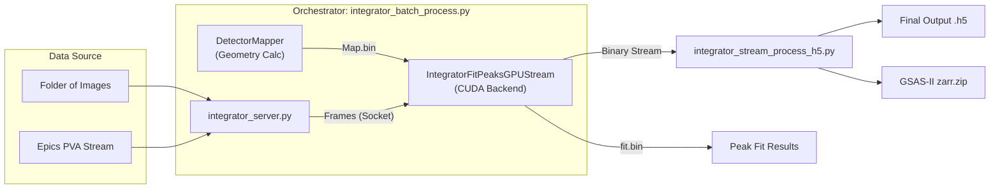
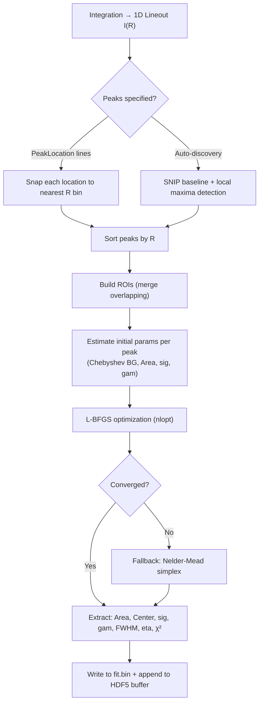
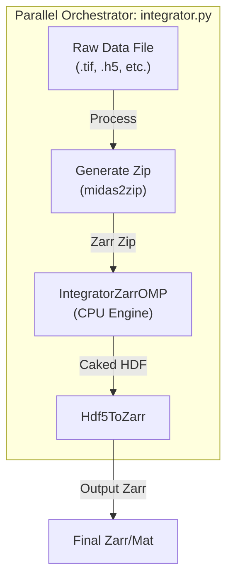
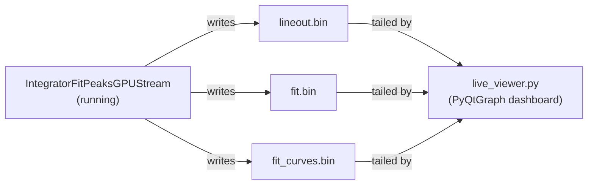

# MIDAS Radial Integration Suite: User Manual

**Version:** 11.0  
**Contact:** hsharma@anl.gov

---

## 1. Introduction

The MIDAS Radial Integration Suite provides high-performance tools for reducing 2D diffraction images into 1D intensity profiles (Azimuthal Integration). The suite helps you go from raw detector images to integrated `Intensity vs. Radius` lineouts and fitted peak parameters.

There are **two primary workflows** depending on your experimental needs:

| Feature | **Workflow A: GPU Streaming** | **Workflow B: CPU Batch Processing** |
| :--- | :--- | :--- |
| **Script** | `FF_HEDM/workflows/integrator_batch_process.py` | `FF_HEDM/workflows/integrator.py` |
| **Best For** | **Real-time** experiments, High-throughput, Large Datasets | **Post-experiment** analysis, Single files, Systems without GPUs |
| **Engine** | `IntegratorFitPeaksGPUStream` (CUDA) | `IntegratorZarrOMP` (OpenMP) |
| **Key Feature** | Live streaming from detector (PVA) or folder, optional 1D peak fitting | Parallel processing of individual file chunks |
| **Outputs** | HDF5 with fit results & lineouts, zarr.zip for GSAS-II | Zarr/HDF5 with lineouts, zarr.zip for GSAS-II, MATLAB (.mat) option |

---

## 2. Workflow A: High-Throughput GPU Streaming
**Script:** `FF_HEDM/workflows/integrator_batch_process.py`

This is the recommended workflow for most large-scale experiments. It orchestrates a high-speed pipeline where data streams (from files or a live detector) to a GPU-accelerated backend.

### 2.1. Pipeline Architecture


```mermaid
graph LR
    subgraph "Data Source"
        Files[Folder of Images]
        Stream[Epics PVA Stream]
    end
    
    subgraph "Orchestrator: integrator_batch_process.py"
        Server[integrator_server.py]
        GPU["IntegratorFitPeaksGPUStream<br>(CUDA Backend)"]
        Mapper["DetectorMapper<br>(Geometry Calc)"]
    end
    
    Files --> Server
    Stream --> Server
    Mapper -->|"Map.bin"| GPU
    Server -->|"Frames (Socket)"| GPU
    GPU -->|"Binary Stream"| Post["integrator_stream_process_h5.py"]
    GPU -->|"fit.bin"| Fit["Peak Fit Results"]
    Post --> Final["Final Output .h5"]
    Post --> Zarr["GSAS-II zarr.zip"]
```

The GPU pipeline now produces **both** HDF5 and `.zarr.zip` output by default. The zarr.zip file is directly importable into GSAS-II using the MIDAS zarr reader (see [GSAS-II_Integration.md](GSAS-II_Integration.md)).

### 2.2. Requirements
*   **Hardware:** NVIDIA GPU (Compute Capability 3.5+).
*   **Environment:** MIDAS `FF_HEDM` compiled with CUDA support.
*   **Network:** Ports `60439` (Server) must be available locally.

### 2.3. Usage Examples

**Example 1: Processing a Folder of TIFFs**
```bash
python ~/opt/MIDAS/FF_HEDM/workflows/integrator_batch_process.py \
    --param-file setup_30keV.txt \
    --folder /data/experiment/scan_01 \
    --dark /data/experiment/darks/dark_avg.bin \
    --output-h5 scan_01_integrated.h5
```

**Example 2: Real-time Streaming (Live Analysis)**
```bash
python ~/opt/MIDAS/FF_HEDM/workflows/integrator_batch_process.py \
    --param-file setup_30keV.txt \
    --pva \
    --pva-ip 10.54.105.139 \
    --output-h5 live_analysis.h5
```

### 2.4. Key Arguments
| Argument | Description |
| :--- | :--- |
| `--param-file` | **Required.** Path to the text file containing geometry and integration parameters. |
| `--folder` | Source folder for image files (e.g., `.tif`, `.ge`). Mutually exclusive with `--file` and `--pva`. |
| `--file` | Single image file to process (auto-detects extension and parent folder). Mutually exclusive with `--folder` and `--pva`. |
| `--pva` | Enable listening to an EPICS PVA stream instead of reading files. |
| `--dark` | Path to a dark field file (binary) for background subtraction. |
| `--output-h5` | Filename for the final consolidated HDF5 output. |
| `--output-dir` | Custom output directory name (default: `analysis_YYYYMMDD_HHMMSS`). |
| `--zarr-output` | Custom filename for the GSAS-II zarr.zip output (default: auto from `--output-h5`). |
| `--no-zarr` | Skip zarr.zip creation (HDF5 only). |
| `--save-interval` | How often (in frames) to save the intermediate mapping file. Default: 500. |

### 2.5. Peak Fitting (Both CPU and GPU Engines)

Both `IntegratorZarrOMP` (CPU) and `IntegratorFitPeaksGPUStream` (GPU) can optionally perform **1D Pseudo-Voigt peak fitting** on the azimuthally-integrated 1D lineout for every frame. This is enabled by adding peak fitting parameters to the parameter file.

> [!NOTE]
> Peak fitting runs on the **CPU** (parallelized with OpenMP) after each frame's integration completes. The fitted parameters are streamed to `fit.bin` in real time and also written to `_caked_peaks.h5` (HDF5) at program exit.

#### Peak Shape Model

Each peak in the 1D lineout is fitted with a **GSAS-II compliant area-normalized Pseudo-Voigt** profile. The Gaussian (G) and Lorentzian (L) components have independent width parameters (`sig` and `gam`):

$$G(R) = \frac{\sqrt{4\ln 2}}{\text{FWHM}_G \sqrt{\pi}} \exp\!\left(-\frac{4\ln 2\,(R - R_{cen})^2}{\text{FWHM}_G^2}\right)$$

$$L(R) = \frac{2}{\pi\,\text{FWHM}_L} \cdot \frac{1}{1 + 4\,(R - R_{cen})^2 / \text{FWHM}_L^2}$$

$$I(R) = BG(R) + A\bigl[\eta\,L(R) + (1-\eta)\,G(R)\bigr]$$

The total FWHM and mixing parameter $\eta$ are derived from `sig` and `gam` using the **Thompson-Cox-Hastings (TCH)** approximation:

- $\text{FWHM}_G = \sqrt{8\ln 2 \cdot \text{sig}}$ (where sig = Gaussian variance in pixel²)
- $\text{FWHM}_L = \text{gam}$ (Lorentzian FWHM in pixels)
- $\text{FWHM}_{total}$ and $\eta$ are computed from a 5th-order polynomial TCH mixing rule.

The background is a **2-parameter Chebyshev** polynomial (constant + linear term) fitted jointly with the peaks.

| Parameter | Unit | Description |
|---|---|---|
| $A$ (Area) | counts × pixels | Integrated area under the peak |
| $R_{cen}$ (Center) | pixels | Peak center (radial position) |
| $\sigma$ (sig) | pixels² | Gaussian variance parameter |
| $\gamma$ (gam) | pixels | Lorentzian FWHM parameter |
| FWHM | pixels | Total FWHM from TCH mixing |
| $\eta$ (eta) | — | TCH mixing (0 = pure Gaussian, 1 = pure Lorentzian) |
| $\chi^2$ | — | Reduced chi-squared of the fit |

When multiple peaks overlap, they are fitted simultaneously within a shared ROI with a common Chebyshev background.

#### Specifying Peaks

There are two ways to tell the engine which peaks to fit:

**Mode 1: User-Specified Peak Locations** (recommended for known ring positions)

Add one `PeakLocation` line per expected ring radius (in pixel units) to the parameter file:

```text
DoPeakFit 1
PeakLocation 245.3
PeakLocation 347.1
PeakLocation 425.8
```

Each `PeakLocation` is snapped to the nearest radial bin. If no bin is within `2 × RBinSize` of the specified location, that peak is silently skipped. Setting `PeakLocation` automatically enables `DoPeakFit 1` and `MultiplePeaks 1`, and disables smoothing.

**Mode 2: Automatic Peak Discovery**

Set `DoPeakFit 1` and `MultiplePeaks 1` without any `PeakLocation` lines. The engine will automatically find peaks in the 1D lineout by searching for local maxima. Optional Savitzky-Golay smoothing (`DoSmoothing 1`) can reduce noise before peak detection.

```text
DoPeakFit 1
MultiplePeaks 1
DoSmoothing 1
```

#### Fitting Parameters

| Parameter | Type | Default | Description |
|---|---|---|---|
| `DoPeakFit` | int | `0` | `1` = enable 1D peak fitting on the integrated lineout |
| `MultiplePeaks` | int | `0` | `1` = enable multi-peak fitting (must be `1` for >1 peak) |
| `PeakLocation` | float | — | Expected peak radius (pixels). Repeatable, one per line. Implicitly enables `DoPeakFit`, `MultiplePeaks`, and disables smoothing |
| `DoSmoothing` | int | `0` | `1` = apply Savitzky-Golay smoothing before automatic peak finding (window sizes 5, 7, or 9) |
| `FitROIPadding` | int | `20` | Half-width of the fitting Region of Interest around each peak (in radial bins) |
| `FitROIAuto` | int | `0` | `1` = automatically determine ROI width from estimated FWHM (overrides `FitROIPadding`). ROI = max(15, 1.5 × FWHM) |

#### Fitting Pipeline (Per Frame)


```mermaid
graph TD
    A["Integration → 1D Lineout I(R)"] --> B{Peaks specified?}
    B -->|"PeakLocation lines"| C["Snap each location to nearest R bin"]
    B -->|"Auto-discovery"| D["SNIP baseline + local maxima detection"]
    C --> E["Sort peaks by R"]
    D --> E
    E --> F["Build ROIs (merge overlapping)"]
    F --> G["Estimate initial params per peak<br/>(Chebyshev BG, Area, sig, gam)"]
    G --> H["L-BFGS optimization (nlopt)"]
    H --> I{Converged?}
    I -->|Yes| K
    I -->|No| J["Fallback: Nelder-Mead simplex"]
    J --> K["Extract: Area, Center, sig, gam, FWHM, eta, χ²"]
    K --> L["Write to fit.bin + append to HDF5 buffer"]
```

1. **1D Lineout:** The engine reduces the 2D caked image to a 1D `I(R)` profile by averaging all eta bins for each radial bin.
2. **Peak Identification:** Peaks are found either from user-specified `PeakLocation` entries (snapped to the nearest R bin) or by SNIP baseline subtraction followed by local maxima detection.
3. **ROI Construction:** A region of interest is built around each peak (`±FitROIPadding` bins or auto-sized). Overlapping ROIs are merged, and their peaks are fitted jointly with a shared Chebyshev background.
4. **Initial Guess:** Background is estimated via 2-parameter Chebyshev from the ROI edges. Peak area is estimated from the integral above background. Sig and gam are estimated from the observed FWHM.
5. **Optimization:** The L-BFGS algorithm minimizes the sum of squared residuals. If L-BFGS fails, the Nelder-Mead simplex method is used as a fallback. Gradients are computed numerically for TCH safety.
6. **Output:** Fitted GSAS-II parameters are written to `fit.bin` (binary stream) and accumulated into a `_caked_peaks.h5` HDF5 file at program exit.

#### Output Format (`fit.bin`)

The fit results are written as a binary stream of `double` values, **7 values per peak per frame**:

| Column | Name | Unit | Description |
|---|---|---|---|
| 0 | `Area` | counts × px | Integrated peak area (GSAS-II convention) |
| 1 | `Center` | pixels | Fitted peak center position |
| 2 | `sig` | pixels² | Gaussian variance parameter |
| 3 | `gam` | pixels | Lorentzian FWHM parameter |
| 4 | `FWHM` | pixels | Total FWHM from TCH mixing |
| 5 | `eta` | — | TCH mixing parameter (0–1) |
| 6 | `ChiSq` | — | Reduced chi-squared of the fit |

The CPU engine (`IntegratorZarrOMP`) also writes a per-eta-bin CSV file (`_fit_per_eta.csv`) and a `_caked_peaks.h5` HDF5 file compatible with `plot_caked_peaks.py`.

> [!TIP]
> To read the fit results in Python:
> ```python
> import numpy as np
> n_peaks = 3  # number of PeakLocation entries
> data = np.fromfile('fit.bin', dtype=np.float64).reshape(-1, n_peaks, 7)
> # data[frame_idx, peak_idx, column_idx]
> area   = data[:, :, 0]   # Integrated area for all frames, all peaks
> center = data[:, :, 1]   # Peak centers (pixels)
> sig    = data[:, :, 2]   # Gaussian variance
> gam    = data[:, :, 3]   # Lorentzian FWHM
> fwhm   = data[:, :, 4]   # Total FWHM (TCH mixed)
> eta    = data[:, :, 5]   # TCH mixing parameter
> chisq  = data[:, :, 6]   # Reduced chi-squared
> ```

#### Example: Fitting Three Calibrant Rings

```text
# In parameter file:
DoPeakFit 1
PeakLocation 245.3
PeakLocation 347.1
PeakLocation 425.8
FitROIPadding 25
```

```bash
python ~/opt/MIDAS/FF_HEDM/workflows/integrator_batch_process.py \
    --param-file setup_30keV.txt \
    --folder /data/experiment/scan_01 \
    --dark /data/experiment/darks/dark_avg.bin \
    --output-h5 scan_01_integrated.h5
# After completion, fit.bin and fit_curves.bin will be in the working directory
```

---

## 3. Workflow B: CPU Batch Processing
**Script:** `FF_HEDM/workflows/integrator.py`

This workflow is designed for flexibility. It processes files independently, making it ideal for converting specific scans, running on clusters without GPUs, or simple "convert-and-integrate" tasks. It handles the full lifecycle of a file: `Raw -> Zarr -> Integrated HDF5`.

### 3.1. Pipeline Architecture


```mermaid
graph TD
    subgraph "Parallel Orchestrator: integrator.py"
        Input["Raw Data File<br>(.tif, .h5, etc.)"]
        ZipGen["Generate Zip<br>(midas2zip)"]
        IntOMP["IntegratorZarrOMP<br>(CPU Engine)"]
        Conv[Hdf5ToZarr]
    end
    
    Input -->|Process| ZipGen
    ZipGen -->|"Zarr Zip"| IntOMP
    IntOMP -->|"Caked HDF"| Conv
    Conv -->|"Output Zarr"| Result["Final Zarr/Mat"]
```

### 3.2. Requirements
*   **Hardware:** Multi-core CPU.
*   **Dependencies:** `zarr`, `numpy`, `scipy`.
*   **Environment:** MIDAS `FF_HEDM` compiled (OpenMP support recommended).

### 3.3. Usage Examples

**Example 1: Process a single file**
```bash
python ~/opt/MIDAS/FF_HEDM/workflows/integrator.py \
    --paramFN setup.txt \
    --dataFN /data/images/scan_001.tif \
    --resultFolder /analysis/output
```

**Example 2: parallel processing of a series**
Run on 4 files starting from `scan_001.tif`, using 8 global CPUs, with each integrator instance using 4 local threads.
```bash
python ~/opt/MIDAS/FF_HEDM/workflows/integrator.py \
    --paramFN setup.txt \
    --dataFN /data/images/scan_001.tif \
    --startFileNr 1 \
    --endFileNr 4 \
    --nCPUs 8 \
    --nCPUsLocal 4
```

### 3.4. Key Arguments
| Argument | Description | Default |
| :--- | :--- | :--- |
| `-paramFN` | **Required.** Path to the parameter file. | - |
| `-dataFN` | **Required.** Path to the *first* data file pattern. | - |
| `-resultFolder` | Output directory for results. | Current Dir |
| `-nCPUs` | Number of simultaneous files to process. | 1 |
| `-nCPUsLocal` | Number of threads to use *per file* (OMP threads). | 4 |
| `-writeMat` | Save outputs as MATLAB `.mat` files? (1=Yes, 0=No). | 0 |
| `-mapDetector` | Run `DetectorMapper` to generate `Map.bin`? (1=Yes, 0=No). | 1 |
| `-convertFiles` | Convert input files to Zarr before integrating? | 1 |

### 3.5. Parameter Overrides
You can override any value in the parameter file directly from the command line by appending the key-value pair to the end of the command. This is useful for quick adjustments without modifying the file.

**Syntax:** `Key Value` or `--Key Value`

**Example:** Override radial range and bins
```bash
python FF_HEDM/workflows/integrator.py --paramFN setup.txt --dataFN scan_001.tif MinRad 10 MaxRad 1000 RadBinSize 0.5
```
You can also use standard flag syntax if you prefer:
```bash
python FF_HEDM/workflows/integrator.py --paramFN setup.txt --dataFN scan_001.tif --MinRad 10 --MaxRad 1000
```
*Note: Any arguments not recognized as standard flags (like `-paramFN`, `-dataFN`) are treated as parameter overrides.*

---

## 4. Technical Implementation Details

The radial integration is performed by one of two engines, optimized for different hardware architectures.

### 4.1. CPU Engine (`IntegratorZarrOMP.c`)
*   **Parallelization:** OpenMP is used to parallelize the integration loop. The outer loop iterates over Radial bins, and the inner loop over Azimuthal (Eta) bins.
*   **Memory mapping:** `Map.bin` and `nMap.bin` are memory-mapped (`mmap`) to avoid loading the entire 16GB+ mapping tables into RAM. These tables provide a linear list of pixel indices for each bin.
*   **Data Handling:**
    *   Reads **Zarr** chunks using `blosc1_decompress`.
    *   Image transformations (flips/transposes) are pre-baked into `Map.bin` by `DetectorMapper` — the integrator reads raw pixel data directly.
    *   Subtracts the dark field image.
    *   Accumulates intensity: `Intensity += PixelValue * Fraction`.
*   **Efficiency:** By processing Zarr chunks sequentially but parallelizing the bin summation, it balances memory usage with CPU utilization.

### 4.2. GPU Engine (`IntegratorFitPeaksGPUStream.cu`)
*   **Streaming Architecture:** Implements a multi-threaded C++ server that listens on a TCP socket.
    *   **Input Thread:** Receives data chunks and pushes them to a `ProcessQueue`.
    *   **Worker Threads:** Pull frames and issue CUDA commands.
    *   **Writer Thread:** Asynchronously writes results to disk to prevent I/O blocking.
*   **CUDA Optimization:**
    *   **Streams:** Uses 4 concurrent CUDA streams to overlap Data Transfer (H2D), Kernel Execution, and Result Retrieval (D2H).
    *   **Pinned Memory:** Uses `cudaMallocHost` for zero-copy access or accelerated DMA transfers.
    *   **Kernels:**
        *   `initialize_PerFrameArr`: Pre-calculates static bin data (R, Eta, Area) and applies pixel masks.
        *   `integrate_kernel`: Performs the weighted summation of pixels for each bin. It uses atomic adds for the "Summed Image" feature.
        *   `calculate_1D_profile_kernel`: efficiently reduces the 2D (R, Eta) array to a 1D (R) profile using **Warp Shuffle** intrinsics (`__shfl_down_sync`) for high-speed reduction within GPU thread blocks.
*   **CPU-Side Peak Fitting:** When `DoPeakFit` is enabled, after each frame's GPU integration completes, the 1D lineout is passed to an OpenMP-parallelized CPU fitting pipeline that uses `nlopt` (L-BFGS with numerical gradients, Nelder-Mead fallback) to fit GSAS-II area-normalized Pseudo-Voigt peaks with TCH mixing. Results are written to `fit.bin` (binary stream) and `caked_peaks.h5` (HDF5, written after all frames). See [Section 2.5](#25-peak-fitting-both-cpu-and-gpu-engines) for full details.
*   **Runtime Peak Updates:** The integrator polls for `peak_update.txt` at the top of each frame loop. If found, it updates the peak locations and enables fitting on-the-fly. See [Section 4.2.1](#421-interactive-peak-selection-from-live-viewer) below.

#### 4.2.1. Interactive Peak Selection from Live Viewer

The `live_viewer.py` dashboard can **interactively send peak locations** to the running GPU integrator. This enables exploratory analysis: watch the lineout, identify interesting peaks, and immediately begin fitting them — all without restarting the integrator.

**Protocol (File-Based IPC):**

The live_viewer writes a `peak_update.txt` file atomically (temp + rename) to the GPU integrator's working directory. The integrator polls for this file at the top of each frame loop.

```text
mode replace
245.3
347.1
425.8
```

- First line: `mode replace` (discard existing peaks, fit only these) or `mode append` (add to current peaks)
- Remaining lines: one R value per line (radius in pixel units)

After reading and deleting the signal file, the integrator writes `active_peaks.txt` (one R per line) so the live_viewer can display red overlay markers at the currently-fitted radii.

**live_viewer usage:**

```bash
python ~/opt/MIDAS/gui/viewers/live_viewer.py \
    --lineout lineout.bin --nRBins 500 \
    --fit fit.bin --nPeaks 5 \
    --params setup_30keV.txt
```

1. Click **🎯 Pick** to enter peak selection mode
2. Click on peaks in the lineout or heatmap — yellow markers appear
3. Select **Replace** or **Append** mode
4. Click **📤 Send Peaks** — `peak_update.txt` is written
5. GPU picks it up on the next frame — fitting begins
6. Red overlay lines appear at active fit radii on both plots

**Triple Axes (2θ, Q):**

When `--params` is provided (or `--lsd`, `--px`, `--wavelength` are given explicitly), the live_viewer shows three stacked x-axes on both plots:

| Axis | Formula | Units |
|------|---------|-------|
| R | — | pixels |
| 2θ | `atan(R × px / Lsd)` | degrees |
| Q | `4π sin(θ) / λ` | Å⁻¹ |

If wavelength is not available, only R and 2θ axes are shown.

### 4.3. DetectorMapper (The Geometry Engine)
This tool runs automatically at the start of either workflow. It consumes the experimental geometry (distance, tilts, pixel size) and produces three look-up tables:
*   `Map.bin`: The mapping of every pixel to its (Radius, Azimuth) bin.
*   `nMap.bin`: An index file for the map.
*   `maskMap.bin`: A per-bin contamination flag (1 = bin overlaps with a masked pixel). Used by `IntegratorZarrOMP` to exclude contaminated bins from lineouts.

`DetectorMapper` is a unified binary that supports both text-file and Zarr inputs:

```bash
# Text file input (standard)
DetectorMapper parameters.txt -nCPUs 8

# Zarr input
DetectorMapper parameters.txt -nCPUs 8 -zarrFN data.zip -resultFolder output/
```

The `-nCPUs N` flag parallelizes the mapping computation with OpenMP. When run via `integrator.py` or `phase_id.py`, the `-nCPUs` argument is passed through automatically.

The mapping uses the shared `DetectorGeometry` library (`dg_pixel_to_REta`, `dg_polygon_area`, etc.) for pixel-to-(R, η) coordinate transforms with full distortion correction (tilts, p0–p4, per-panel Lsd/dP2).

`DetectorMapper` supports an optional **Q-spacing mode** where radial bins are equally spaced in Q (Å⁻¹) instead of R (pixels). When `QBinSize`, `QMin`, `QMax`, and `Wavelength` are all specified, non-uniform R bin edges are computed from equal Q spacing. See [Parameter Reference §A.2a](#a2a-q-spacing-mode-optional).

When `ImTransOpt` is set, `DetectorMapper` applies the inverse image transformation to pixel coordinates at map-generation time. This means the pixel indices stored in `Map.bin` reference **raw (untransformed) image coordinates**, so the integrators (`IntegratorZarrOMP`, `IntegratorFitPeaksGPUStream`) can consume raw pixel data directly without per-frame transformation overhead. Changing `ImTransOpt` triggers a `Map.bin` rebuild (via the parameter hash).

> [!NOTE]
> The separate `DetectorMapperZarr` binary has been retired (archived to `src/archive/`). The unified `DetectorMapper` handles both text and Zarr inputs.

## 5. Parameter File Reference
 
The parameter file is a text file containing key-value pairs used by both the `integrator` and `DetectorMapper`.
 
### A.1. Experimental Geometry
| Parameter | Type | Description | Units / Notes |
| :--- | :--- | :--- | :--- |
| `Lsd` | `float` | Sample-to-detector distance | microns (μm) |
| `Wavelength` | `float` | X-ray wavelength | Angstroms (Å) |
| `BC` | `float float` | Beam center (Y, Z) | pixels |
| `ty`, `tz`, `tx` | `float` | Detector tilts (vertical, horizontal, torsion) | degrees |
| `px` | `float` | Pixel size | microns (μm) |
 
### A.2. Integration Configuration
| Parameter | Type | Description | Units / Notes |
| :--- | :--- | :--- | :--- |
| `RMin` | `float` | Minimum radius for integration | pixels |
| `RMax` | `float` | Maximum radius for integration | pixels |
| `RBinSize` | `float` | Radial bin size | pixels |
| `EtaMin` | `float` | Minimum azimuth angle | degrees |
| `EtaMax` | `float` | Maximum azimuth angle | degrees |
| `EtaBinSize` | `float` | Azimuthal bin size | degrees |

### A.2b. Omega Metadata (Optional, RI Frame Stamps)

The RI engine does not index spots, but it does stamp each output lineout
with the corresponding ω angle so downstream tools (`live_viewer`,
`plot_caked_peaks`) can plot intensity vs ω. These keys are optional — omit
them if your scan has no rotation.

| Parameter | Type | Description | Units / Notes |
| :--- | :--- | :--- | :--- |
| `OmegaStart` | `float` | ω of the first frame | degrees. Alias: `OmegaFirstFile` |
| `OmegaStep` | `float` | Δω between successive frames (sign = direction) | degrees |
| `OmegaSumFrames` | `int` | Frames to chunk into one output lineout (default 1) | count. Maps to `chunkFiles` in `IntegratorZarrOMP` |

When `OmegaSumFrames > 1`, consecutive frames are summed before integration
and the output lineout carries the average ω of the chunk.

### A.2a. Q-Spacing Mode (Optional)

By default, radial bins are equally spaced in **R** (pixels). To use equally spaced **Q** (Å⁻¹) bins instead, add the following parameters:

| Parameter | Type | Description | Units / Notes |
| :--- | :--- | :--- | :--- |
| `QBinSize` | `float` | Q-spacing bin size | Å⁻¹ |
| `QMin` | `float` | Minimum Q value | Å⁻¹ |
| `QMax` | `float` | Maximum Q value | Å⁻¹ |
| `Wavelength` | `float` | X-ray wavelength (also required for standard mode Q output) | Å |

When all four parameters are present and positive, Q-mode activates automatically. The number of bins becomes `ceil((QMax − QMin) / QBinSize)`, and each bin's R edges are computed from:

$$R(Q) = \frac{L_{sd}}{px} \cdot \tan\!\left(2\arcsin\!\left(\frac{Q\,\lambda}{4\pi}\right)\right)$$

This produces **non-uniform R bins** whose Q spacing is uniform. Eta bins remain uniformly spaced.

> [!NOTE]
> When Q-mode is active, the `RMin`, `RMax`, and `RBinSize` parameters are ignored for bin construction. The `MapHeader` version is bumped to 2 and the Q-mode flag + wavelength are included in the parameter hash, so changing Q parameters triggers a `Map.bin` rebuild.

**Example:**
```text
QBinSize 0.01
QMin 1.0
QMax 5.0
Wavelength 0.1839
```
 
### A.3. Corrections & Advanced
| Parameter | Type | Description |
| :--- | :--- | :--- |
| `MaskFile` | `str` | Path to a uint8 TIFF mask file. Convention: `0` = valid pixel, `1` = masked. Can be generated using `utils/generate_mask.py`. |
| `GapFile` | `str` | Path to a file defining panel gaps (mask) |
| `BadPxFile` | `str` | Path to a file defining bad pixels (mask) |
| `DistortionFile` | `str` | Path to binary file (double precision) containing Y then Z distortion maps |
| `ImTransOpt` | `int` | Image transformation (0=None, 1=FlipH, 2=FlipV, 3=Transpose). Applied by `DetectorMapper` at map-generation time — integrators read raw pixel data directly |
| `SolidAngleCorrection` | `int` | `1` enables cos³(2θ) solid-angle correction in `DetectorMapper` (default `0`) |
| `PolarizationCorrection` | `int` | `1` enables pixel-weight polarization correction in `DetectorMapper` (default `0`) |
| `PolarizationFraction` | `float` | σ/π polarization fraction used by `PolarizationCorrection` (default `0.99`). **Distinct from `Polariz`** — this one drives DetectorMapper's pixel weights; `Polariz` is written to the GSAS-II `InstrumentParameters` |
| `Polariz` | `float` | GSAS-II polarization profile parameter (default 0.99) |
| `GradientCorrection` | `int` | `1` enables radial gradient flattening in `IntegratorZarrOMP` (default `0`) |
| `Normalize` | `int` | `1` enables per-frame intensity normalization (default `1`) |
| `SumImages` | `int` | Number of frames to sum per output lineout (0 = per-frame output) |
| `SaveIndividualFrames` | `int` | `1` saves per-frame lineouts alongside summed output (default `1`) |
| `GapIntensity` | `float` | In-fill value for gap pixels (default 0) |
| `YPixelSize` | `float` | Y-direction pixel size override for non-square detectors (defaults to `px`) |
| `p0` … `p14` | `float` | Detector distortion polynomial coefficients (see [FF_Parameters_Reference §3a](FF_Parameters_Reference.md#3a-distortion-model)). Not applicable to NF-HEDM |
| `NPanelsY`, `NPanelsZ` | `int` | Number of detector panels in Y and Z directions |
| `PanelSizeY`, `PanelSizeZ` | `int` | Size of each panel in pixels |
| `PanelGapsY`, `PanelGapsZ` | `int` | Gap size between panels in pixels |

### A.4. Peak Fitting (Both CPU and GPU Engines)

These parameters control the optional 1D peak fitting in both `IntegratorZarrOMP` and `IntegratorFitPeaksGPUStream`. See [Section 2.5](#25-peak-fitting-both-cpu-and-gpu-engines) for full documentation.

| Parameter | Type | Default | Description |
| :--- | :--- | :--- | :--- |
| `DoPeakFit` | `int` | `0` | `1` = enable 1D GSAS-II area-normalized Pseudo-Voigt peak fitting |
| `MultiplePeaks` | `int` | `0` | `1` = allow fitting multiple peaks |
| `PeakLocation` | `float` | — | Expected peak radius (pixels). Repeatable. Implicitly enables fitting |
| `AutoDetectPeaks` | `int` | `0` | Number of peaks to auto-detect (0 = disabled). Uses SNIP baseline + local maxima |
| `SNIPIterations` | `int` | `50` | Number of SNIP iterations for baseline estimation in auto-detect mode |
| `DoSmoothing` | `int` | `0` | `1` = Savitzky-Golay smoothing before auto peak detection |
| `FitROIPadding` | `int` | `20` | Half-width of fitting ROI (radial bins) |
| `FitROIAuto` | `int` | `0` | `1` = auto-size ROI from FWHM |
| `Wavelength` | `float` | — | X-ray wavelength (Å). Required for d-spacing in HDF5 output |

## 6. Output Formats

### 6.1. HDF5 / Zarr Structure
Both workflows produce hierarchical data files containing:
*   `lineout`: The 1D integrated intensity vs. radius.
*   `tth`: The 2-theta angles corresponding to the radius bins.
*   `azimuth`: The azimuthal angles.
*   `intensity`: The 2D integrated image (if enabled).

`IntegratorZarrOMP` also produces:
*   **`_lineout.xy`** — A two-column text file (2θ in degrees, intensity) for each frame. The 2θ values are computed by `IntegratorZarrOMP` using the fitted Lsd, ensuring consistency across all tools. Bins contaminated by masked pixels (from `maskMap.bin`) have NaN intensities and are omitted.
*   **`_lineout.bin`** — Binary lineout (R-indexed) for backward compatibility.

### 6.2. GSAS-II Compatible zarr.zip
Both workflows also produce a `.zarr.zip` file compatible with GSAS-II's MIDAS zarr importer. This file contains:
*   `REtaMap` — (5 × R × η) geometry array: radius, 2θ, η, bin area, Q (Å⁻¹)
*   `OmegaSumFrame` — Summed 2D caked frames with omega attributes
*   `InstrumentParameters` — Wavelength, profile parameters, distance

The Q row (row 4) is always computed when `Wavelength` is available: $Q = \frac{4\pi}{\lambda} \sin\theta$, where $\theta = \frac{1}{2}\arctan\!\left(\frac{R \cdot px}{L_{sd}}\right)$. Legacy files with 4-row `REtaMap` are auto-detected and handled transparently.

Instrument parameters are read from the parameter file if present (keys `Wavelength`, `Lsd`, `U`, `V`, `W`, `SHpL`, `Polariz`, `X`, `Y`, `Z`), otherwise sensible defaults are used.

> [!TIP]
> For importing into GSAS-II, see [GSAS-II_Integration.md](GSAS-II_Integration.md). MIDAS requires `zarr` v2 (e.g. `zarr==2.18.3`).

### 6.3. Live Integration Dashboard (`live_viewer.py`)

For real-time monitoring during GPU streaming experiments, MIDAS provides a PyQtGraph-based dashboard that tails binary output files as they are written by `IntegratorFitPeaksGPUStream`.

#### Architecture


```mermaid
graph LR
    GPU["IntegratorFitPeaksGPUStream<br/>(running)"] -->|writes| LO["lineout.bin"]
    GPU -->|writes| FIT["fit.bin"]
    GPU -->|writes| FC["fit_curves.bin"]
    LO -->|tailed by| LV["live_viewer.py<br/>(PyQtGraph dashboard)"]
    FIT -->|tailed by| LV
    FC -->|tailed by| LV
```

The viewer uses a `BinaryTailer` class that periodically checks file sizes and reads new complete records. This allows it to start before the GPU process and remain synchronized as data streams in.

#### Launching

```bash
# Basic — lineout only
python ~/opt/MIDAS/gui/viewers/live_viewer.py \
    --lineout lineout.bin --n-rbins 500

# With peak fitting
python ~/opt/MIDAS/gui/viewers/live_viewer.py \
    --lineout lineout.bin --n-rbins 500 \
    --fit fit.bin --n-peaks 3 \
    --max-history 2000

# Auto-launched by integrator_batch_process.py
python ~/opt/MIDAS/FF_HEDM/workflows/integrator_batch_process.py \
    --param-file setup.txt --folder /data/scan_01 \
    --output-h5 scan_01.h5
# → automatically starts live_viewer in a subprocess
```

#### Three-Panel Display

| Panel | Content | Use |
|---|---|---|
| **1D Lineout** (left) | Latest integrated I(R) profile | Monitor peak positions, check data quality |
| **Heatmap** (center) | R × frame waterfall (time-evolving) | Spot drift, beam instabilities, texture changes |
| **Peak Evolution** (right) | Fitted params vs. frame | Track Imax, Rcen, Sigma, Mu, BG, SNR per peak over time |

#### Controls

| Control | Description |
|---|---|
| Colormap | Select from viridis, inferno, plasma, etc. |
| Theme | Dark or light mode |
| Log heatmap | Log₁₀ scale for heatmap |
| Log lineout | Log₁₀ scale for 1D lineout |
| Font size | Adjustable 8–24pt |
| Decimate | Show every Nth frame in heatmap (performance) |
| Max history | Limit number of retained frames |
| Pause | Freeze display (data still collected) |
| Reset | Clear all accumulated data |
| Param select | Choose which fit params to plot (Area, Center, sig, gam, FWHM, eta, ChiSq) |
| Peak select | Choose which peaks to display |

#### Command-Line Arguments

| Argument | Description | Default |
|---|---|---|
| `--lineout` | Path to `lineout.bin` | **(required)** |
| `--n-rbins` | Number of radial bins per record | `500` |
| `--fit` | Path to `fit.bin` | *(optional)* |
| `--n-peaks` | Number of peaks in fit.bin | `0` |
| `--max-history` | Max frames to retain | `0` (unlimited) |
| `--theme` | `light` or `dark` | `light` |

### 6.4. Post-Hoc Peak Analysis (`plot_integrator_peaks.py`)

For offline analysis of caked output, `plot_integrator_peaks.py` reads `.caked.hdf.zarr.zip` files and fits Pseudo-Voigt peaks along the 2θ axis for each η slice.

```bash
python ~/opt/MIDAS/gui/viewers/plot_integrator_peaks.py \
    --zarr scan_01.caked.hdf.zarr.zip \
    --peaks 245.3 347.1 425.8 \
    --frame -1
```

**Output:** 2D scatter plot of fitted 2θ vs η with ring assignment, per-ring statistics (mean, std), and overlaid ideal ring positions.

### 6.5. Batch Lineout Extraction (`extract_lineouts.py`)

For batch extraction of 1D lineouts from a series of images:

```bash
python ~/opt/MIDAS/utils/extract_lineouts.py \
    --paramFN geometry.txt \
    --dataFN scan_001.tif \
    --startNr 1 --endNr 100 \
    --nCPUs 8
```

This runs `IntegratorZarrOMP` in direct mode for each frame and extracts the `_lineout.xy` text output. Results are two-column files (2θ, intensity) suitable for plotting or Rietveld refinement.

### 6.6. Lineout Comparison (`plot_lineout_comparison.py`)

Compares calibrant and integrator lineouts against ideal ring positions:

```bash
python ~/opt/MIDAS/gui/viewers/plot_lineout_comparison.py \
    --paramFN geometry.txt \
    calibrant_lineout.xy integrator_lineout.xy
```

**Output:** Overlay plot of both lineouts with vertical ideal-ring markers.

### 6.7. Caked Peak Fitting (`fit_caked_peaks.py`)

Standalone Python peak fitter that processes `_caked.hdf.zarr.zip` output from `IntegratorZarrOMP`:

```bash
python ~/opt/MIDAS/utils/fit_caked_peaks.py \
    /path/to/scan.caked.hdf.zarr.zip \
    -paramFN refined_params.txt
```

Produces `_caked_peaks.h5` containing per-η-bin fitted peaks using GSAS-II-convention area-normalized pseudo-Voigt profiles with 2-parameter Chebyshev background. Key features:

- Automatic peak detection using second-derivative (Savitzky-Golay) analysis
- SNIP background subtraction for clean peak isolation
- Adaptive rejection filters for FWHM outliers
- Chi-squared rejection normalized by peak area (intensity-independent)
- HDF5 output compatible with `plot_caked_peaks.py`

### 6.8. Caked Peak Viewer (`plot_caked_peaks.py`)

Interactive Qt viewer for the `_caked_peaks.h5` output:

```bash
python ~/opt/MIDAS/gui/viewers/plot_caked_peaks.py /path/to/results/

# With lattice parameter analysis:
python ~/opt/MIDAS/gui/viewers/plot_caked_peaks.py /path/to/results/ \
    -paramFN refined_params.txt
```

Four-panel display:
1. **Caked heatmap** — 2θ × η with colormap and crosshair
2. **1D profile** — intensity vs 2θ at selected η bin with fitted peaks overlaid
3. **Peak data table** — center, area, FWHM, sig, gam, η_mix, d, χ², and (with `--paramFN`) Ring, a(Å), Δa/a₀
4. **Lattice plots** (with `--paramFN`) — lattice parameter *a* and relative strain Δa/a₀ vs η, with per-ring coloring and checkbox selection

See [GUIs_and_Visualization.md](GUIs_and_Visualization.md) §1b for full feature list.

---

## 7. See Also

- [FF_Analysis.md](FF_Analysis.md) — Standard FF-HEDM analysis
- [FF_Calibration.md](FF_Calibration.md) — Geometry calibration from calibrant rings
- [FF_Interactive_Plotting.md](FF_Interactive_Plotting.md) — Visualizing FF-HEDM results
- [FF_Phase_Identification.md](FF_Phase_Identification.md) — Multi-phase identification from diffraction images
- [GSAS-II_Integration.md](GSAS-II_Integration.md) — Importing caked output into GSAS-II for Rietveld refinement
- [README.md](README.md) — High-level MIDAS overview and manual index

---

If you encounter any issues or have questions, please open an issue on this repository.
