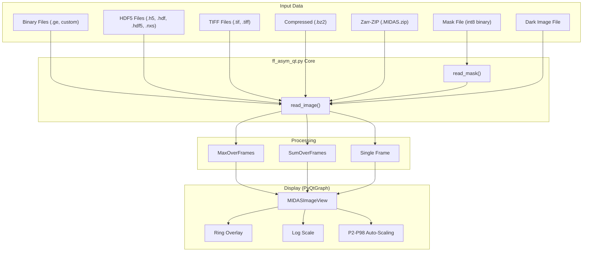

# MIDAS FF-HEDM Desktop Image Viewer (`ff_asym_qt.py`): User Manual

**Version:** 10.0  
**Contact:** hsharma@anl.gov

---

## 1. Introduction

The **MIDAS FF-HEDM Desktop Image Viewer** (`ff_asym_qt.py`) is a PyQt5/PyQtGraph-based GUI for inspecting raw detector images from FF-HEDM experiments. It provides **rapid, frame-by-frame inspection** of raw data at the beamline and during data reduction, supporting multiple file formats, real-time image processing, and diffraction ring overlays.

**Key Capabilities:**

- View raw detector images from **binary (GE, custom)**, **HDF5**, **TIFF**, **bz2-compressed**, and **Zarr-ZIP (`.MIDAS.zip`)** files
- **Dark-field correction** with flexible HDF5 dataset path selection
- **Bad pixel masking** with file browse dialog and on/off toggle
- **Frame-by-frame navigation** with keyboard shortcuts and mouse-wheel
- **Max and Sum projections** over arbitrary frame ranges (mutually exclusive)
- **Movie mode** with configurable FPS for automated frame playback
- **Logarithmic display** scaling
- **P2–P98 auto-scaling** with manual intensity override
- **Ring overlay** with auto-initialization from ZIP metadata
- **Nearest ring display** at cursor position in status bar
- **Image transformations**: horizontal flip, vertical flip, transpose
- **Drag-and-drop** file and folder loading
- **Session save/restore** for persistent viewer state
- **9 colormaps** and dark/light theme support
- **Export PNG** for screenshots



---

## 2. Requirements

### 2.1. Software

| Package | Purpose | Required |
| :--- | :--- | :--- |
| Python 3.x | Runtime | **Yes** |
| PyQt5 | GUI framework | **Yes** |
| pyqtgraph | Image rendering | **Yes** |
| numpy | Array operations | **Yes** |
| h5py | HDF5 file reading | For HDF5 files |
| tifffile | TIFF file reading | For TIFF files |
| zarr | Zarr-ZIP file reading | For `.MIDAS.zip` files |
| bz2, shutil | Compression handling | **Yes** (stdlib) |

### 2.2. Data Requirements

The viewer operates on **single detector files** containing one or more frames of 2D image data. Supported formats:

| Format | Extension(s) | Notes |
| :--- | :--- | :--- |
| Binary (GE) | `.ge1`–`.ge5`, custom | Fixed-size binary with header. Set `Header` and `Byt/Px`. |
| HDF5 | `.h5`, `.hdf`, `.hdf5`, `.nxs` | 2D `(Y, X)` or 3D `(frames, Y, X)` datasets. Dataset path configurable via H5 Data field. |
| TIFF | `.tif`, `.tiff` | Single or multi-frame TIFF. Requires `tifffile`. |
| Zarr-ZIP | `.MIDAS.zip` | MIDAS archive produced by `ffGenerateZip.py`. Contains `exchange/data`, `exchange/dark`, and analysis parameters. |
| Compressed | `.bz2` | Any of the above, bz2-compressed. Decompressed transparently to a temp file. |

**Bad Pixel Mask:** A flat binary file of `int8` values with dimensions `NrPixelsVert × NrPixelsHor`. Values: `0` = good pixel, `1` = bad pixel.

---

## 3. Getting Started

### 3.1. Launching

```bash
cd /path/to/your/data_directory
python ~/opt/MIDAS/gui/ff_asym_qt.py &
```

> [!TIP]
> Launch the GUI **from your data directory**. The GUI automatically scans the current working directory and pre-fills all file fields using the naming convention described below.

### 3.2. Automatic Filename Initialization

When launched from a data directory, `ff_asym_qt.py` runs a background auto-detection thread that:

1. **Takes the directory name as the file stem.** If the CWD is `/path/to/ff_Holder3_50um/`, it looks for files starting with `ff_Holder3_50um_`.
2. **Finds data files** matching `<dir_name>_NNNNNN.<ext>` (e.g., `ff_Holder3_50um_000001.ge3`).
3. **Extracts** the file stem, first file number, padding width, and file extension automatically.
4. **Finds dark files** by scanning for `dark_before_NNNNNN.<ext>` or `dark_after_NNNNNN.<ext>`. Prefers `dark_before` if both exist.
5. **Detects Zarr-ZIP** files (`*.MIDAS.zip`) and loads them automatically (see §3.3).
6. **Updates all GUI fields** — no manual entry needed.

### 3.3. Zarr-ZIP Loading

The viewer can open `.MIDAS.zip` archives produced by `ffGenerateZip.py`. These files contain the raw data, dark frames, and all analysis parameters in a single Zarr-ZIP archive.

**Auto-initialization:** When a ZIP is loaded (either by auto-detection or via the **Load ZIP** button), the viewer automatically:

1. Opens the archive and reads `exchange/data` dimensions (sets NrPixels and nFrames).
2. Reads `exchange/dark` and computes the mean dark frame (enables dark correction automatically).
3. Extracts detector and material parameters from `analysis/process/analysis_parameters/`.
4. Reads `ImTransOpt` and sets the HFlip/VFlip/Transpose checkboxes accordingly (`1`=HFlip, `2`=VFlip, `3`=Transpose).
5. Reads `Wavelength`, `SpaceGroup`, and `LatticeConstant` / `LatticeParameter` for auto-ring computation.

| Auto-loaded parameter | Zarr path |
|---|---|
| Detector distance (Lsd) | `analysis/process/analysis_parameters/Lsd` |
| Beam center Y | `analysis/process/analysis_parameters/YCen` |
| Beam center Z | `analysis/process/analysis_parameters/ZCen` |
| Pixel size | `analysis/process/analysis_parameters/PixelSize` |
| Space group | `analysis/process/analysis_parameters/SpaceGroup` |
| Lattice parameters | `analysis/process/analysis_parameters/LatticeConstant` or `LatticeParameter` |
| Wavelength | `analysis/process/analysis_parameters/Wavelength` |
| Image transforms | `analysis/process/analysis_parameters/ImTransOpt` |

### 3.4. Loading Your First Image (Manual)

If auto-detection populated the fields, the image loads automatically. Otherwise:

1. Click **FirstFile** → select a data file (binary, HDF5, TIFF, or bz2).
2. For HDF5 files, set the **H5 Data** path (default: `/exchange/data`). Click **Browse** to select from available datasets.
3. Set **NrPixH** and **NrPixV** to match your detector dimensions.
4. For binary files, set **Header** (e.g., `8192` for GE) and **Byt/Px** (`2` for uint16, `4` for int32).
5. The image will display automatically.

---

## 4. GUI Reference

### 4.1. File I/O Panel

| Control | Description |
| :--- | :--- |
| **FirstFile** | Opens a file dialog to select the primary data file. |
| **DarkFile** | Opens a file dialog to select the dark-field reference file. |
| **Dark** | Checkbox to enable/disable dark-field subtraction. |
| **Load ZIP** | Opens a file dialog to load a `.MIDAS.zip` Zarr archive, auto-populating all parameters. |
| **FileNr** | First file number in a numbered file series. |
| **nFr/File** | Number of frames per file (used for frame navigation). |
| **H5 Data** | HDF5 dataset path for the data images (e.g., `/exchange/data`). |
| **Browse** (Data) | Browse HDF5 file to select a dataset path interactively. |
| **H5 Dark** | HDF5 dataset path for the dark images (e.g., `/exchange/dark`). |
| **Browse** (Dark) | Browse HDF5 file to select a dark dataset path interactively. |
| **Mask** | Path to a bad pixel mask file (int8 binary). |
| **Browse** (Mask) | Opens a file dialog to select a mask file. |
| **Apply** | Checkbox to enable/disable bad pixel masking. |

### 4.2. Image Settings Panel

| Control | Description |
| :--- | :--- |
| **NrPixH** | Horizontal detector size in pixels (default: 2048). |
| **NrPixV** | Vertical detector size in pixels (default: 2048). |
| **Header** | File header size in bytes (default: 8192). |
| **Byt/Px** | Bytes per pixel: `2` = uint16, `4` = int32 (default: 2). |
| **HFlip** | Flip image horizontally (left–right). |
| **VFlip** | Flip image vertically (top–bottom). |
| **Transp** | Transpose the image (swap rows and columns). |
| **PixSz(μm)** | Pixel size in micrometers (default: 200). |

### 4.3. Display Control Panel

| Control | Description |
| :--- | :--- |
| **Frame** | Frame spinner (0-indexed). Keyboard: ← / → to step. |
| **MinI / MaxI** | Manual intensity range override. |
| **Apply** | Apply manual intensity range. |
| **Log** | Toggle logarithmic intensity scaling. |

### 4.4. Processing Panel

| Control | Description |
| :--- | :--- |
| **MaxOverFrames** | Compute pixel-wise maximum over a range of frames. |
| **SumOverFrames** | Compute pixel-wise sum over a range of frames. |
| **nFrames** | Number of frames to include in Max/Sum projection. |
| **RingsMat** | Open dialog to specify ring material parameters. |
| **PlotRings** | Toggle diffraction ring overlay on the image. |
| **DetNum** | Detector number for multi-detector setups. |
| **Lsd** | Sample-to-detector distance (μm). |
| **BC Y / BC Z** | Beam center coordinates (pixels). |

> [!IMPORTANT]
> **MaxOverFrames** and **SumOverFrames** are mutually exclusive. Checking one automatically unchecks the other.

### 4.5. Toolbar

| Control | Description |
| :--- | :--- |
| **Cmap** | Colormap selection (viridis, inferno, plasma, magma, turbo, gray, hot, cool, bone). |
| **Theme** | Light or dark theme. |
| **Font** | Adjustable font size (8–24pt). |
| **Log** | Toggle logarithmic display. |
| **Export PNG** | Save current view as a PNG file. |
| **Help** | Show keyboard shortcuts and mouse controls. |

---

## 5. Feature Details

### 5.1. Bad Pixel Masking

Bad pixel masks identify dead or hot detector pixels that should be excluded from analysis.

**Mask File Format:**
- Flat binary file of `int8` values
- Dimensions: `NrPixelsVert × NrPixelsHor` (row-major order)
- Values: `0` = good pixel, `1` = bad pixel

**Usage:**
1. Click **Browse** next to the Mask field and select your mask file.
2. Check the **Apply** checkbox.
3. The mask is automatically applied to all subsequent image loads.

### 5.2. Max/Sum Projections

| Mode | Description |
| :--- | :--- |
| **MaxOverFrames** | For each pixel, take the maximum intensity value across selected frames. Useful for seeing all diffraction spots in a single view. |
| **SumOverFrames** | For each pixel, sum intensity values across selected frames. Useful for enhancing weak features. |

Set **nFrames** to define the number of frames, then check the desired mode. The current frame is the starting frame.

### 5.3. Ring Overlay

The ring overlay feature plots expected diffraction ring positions on the image, helping verify detector geometry calibration.

**Manual workflow:**
1. Click **RingsMat** and enter your material parameters (space group, wavelength, lattice constants).
2. Select which rings to display from the generated list.
3. Check **PlotRings** to toggle the overlay on/off.

**Auto ring from ZIP:** When a Zarr-ZIP is loaded, clicking **RingsMat** bypasses the material parameter dialog and directly computes and displays rings using the metadata from the ZIP.

**Nearest ring display:** When rings are shown, the status bar displays the nearest ring's number and HKL indices at the current cursor position.

### 5.4. Movie Mode

The toolbar includes Play/Pause/Stop buttons for automated frame playback with configurable FPS.

### 5.5. Session Save/Restore

Save the current viewer state (file paths, frame, settings) to a `.session.json` file using **Ctrl+S**. Restore a saved session with **Ctrl+Shift+S**.

### 5.6. Drag-and-Drop

Drop a data file or folder onto the viewer to load it directly.

---

## 6. Keyboard Shortcuts

| Shortcut | Action |
| :--- | :--- |
| **← / →** | Previous / Next frame |
| **L** | Toggle log scale |
| **R** | Toggle ring overlay |
| **Q** | Quit |
| **Ctrl+S** | Save session |
| **Ctrl+Shift+S** | Load session |

---

## 7. Mouse Controls

| Control | Action |
| :--- | :--- |
| **Scroll wheel** | Zoom in/out |
| **Right-click drag** | Zoom rectangle |
| **Left-click drag** | Pan |
| **Ctrl+Scroll wheel** | Change frame |
| **Right-click → View All** | Reset zoom |

The histogram on the right side of the image can be used to adjust intensity levels by dragging the top/bottom bars.

---

## 8. Troubleshooting

| Problem | Solution |
| :--- | :--- |
| **Blank/white image** | Check `NrPixH`/`NrPixV` match your detector. For binary files, verify `Header` and `Byt/Px`. |
| **HDF5 dataset not found** | Use the **Browse** button next to H5 Data to browse the internal structure. |
| **Image appears rotated** | Toggle **HFlip**, **VFlip**, or **Transp** to match your detector orientation. |
| **Mask not applying** | Ensure **Apply** checkbox is checked and the mask file dimensions match `NrPixV × NrPixH`. |
| **Frame navigation not working** | Check that `nFr/File` is set correctly. |
| **Import error for tifffile** | Install with `pip install tifffile`. |
| **Import error for h5py** | Install with `pip install h5py`. |

---

## 9. Legacy Viewer

The legacy Tkinter-based viewer (`ff_asym.py`) has been archived to `gui/archive/ff_asym.py`. All functionality is available in the current Qt-based viewer. The legacy viewer is preserved for reference only.

---

## 10. See Also

- [GUIs_and_Visualization.md](GUIs_and_Visualization.md) — Master guide to all GUIs and visualization tools
- [FF_Interactive_Plotting.md](FF_Interactive_Plotting.md) — Dash-based interactive viewer for post-analysis visualization
- [FF_Analysis.md](FF_Analysis.md) — Standard FF-HEDM data reduction workflow
- [FF_Calibration.md](FF_Calibration.md) — Detector geometry calibration
- [README.md](README.md) — MIDAS manual index

---

If you encounter any issues or have questions, please open an issue on this repository.
