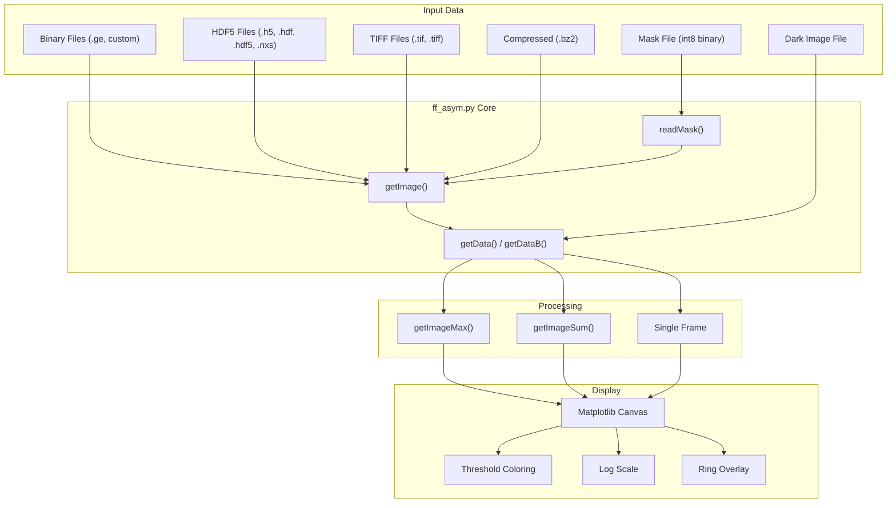
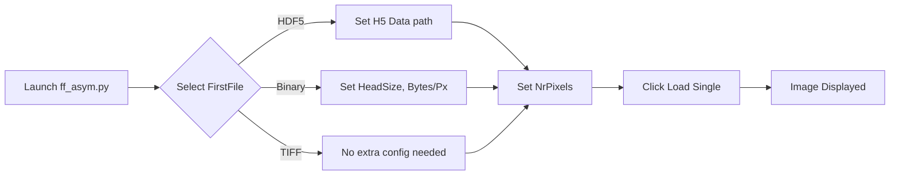
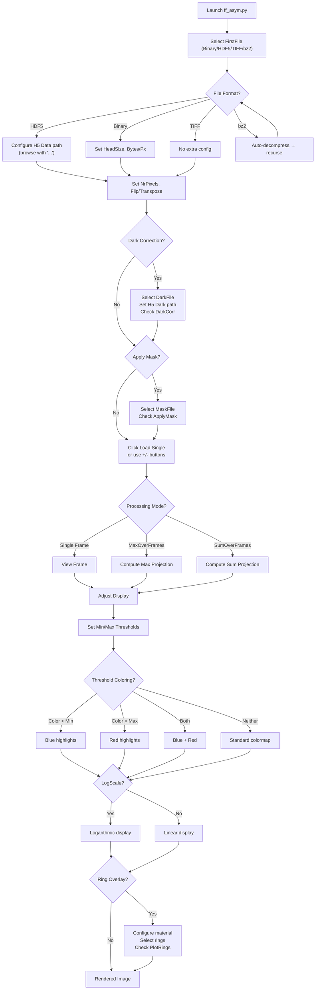

# MIDAS FF-HEDM Desktop Image Viewer (`ff_asym.py`): User Manual

**Version:** 9.0  
**Contact:** hsharma@anl.gov

---

## 1. Introduction

The **MIDAS FF-HEDM Desktop Image Viewer** (`ff_asym.py`) is a lightweight Tkinter-based GUI application for inspecting raw detector images from FF-HEDM experiments. Unlike the interactive Dash-based plotter (see [FF_Interactive_Plotting.md](FF_Interactive_Plotting.md)), this tool focuses on **rapid, frame-by-frame inspection** of raw data at the beamline and during data reduction, supporting multiple file formats and real-time image processing.

**Key Capabilities:**

- View raw detector images from **binary (GE, custom)**, **HDF5**, **TIFF**, and **bz2-compressed** files
- **Dark-field correction** with flexible HDF5 dataset path selection
- **Bad pixel masking** with an on/off toggle
- **Frame-by-frame navigation** through multi-frame files
- **Max and Sum projections** over arbitrary frame ranges
- **Threshold coloring** to highlight pixels below/above intensity thresholds
- **Logarithmic display** scaling
- **Ring overlay** for diffraction ring calibration verification
- **Image transformations**: horizontal flip, vertical flip, transpose



---

## 2. Requirements

### 2.1. Software

| Package | Purpose | Required |
| :--- | :--- | :--- |
| Python 3.x | Runtime | **Yes** |
| numpy | Array operations | **Yes** |
| matplotlib | Plotting | **Yes** |
| tkinter | GUI framework | **Yes** (bundled with Python) |
| h5py | HDF5 file reading | For HDF5 files |
| tifffile | TIFF file reading | For TIFF files |
| bz2, shutil | Compression handling | **Yes** (stdlib) |

### 2.2. Data Requirements

The viewer operates on **single detector files** containing one or more frames of 2D image data. Supported formats:

| Format | Extension(s) | Notes |
| :--- | :--- | :--- |
| Binary (GE) | `.ge1`–`.ge5`, custom | Fixed-size binary with header. Set `HeadSize` and `Bytes/Px`. |
| HDF5 | `.h5`, `.hdf`, `.hdf5`, `.nxs` | 2D `(Y, X)` or 3D `(frames, Y, X)` datasets. Dataset path configurable. |
| TIFF | `.tif`, `.tiff` | Single or multi-frame TIFF. Requires `tifffile`. |
| Compressed | `.bz2` | Any of the above, bz2-compressed. Decompressed transparently to a temp file. |

**Bad Pixel Mask:** A flat binary file of `int8` values with dimensions `NrPixelsVert × NrPixelsHor`. Values: `0` = good pixel, `1` = bad pixel.

---

## 3. Getting Started

### 3.1. Launching

```bash
python ff_asym.py
```

The GUI window will appear with four control panels at the bottom and the plot area above.

### 3.2. Loading Your First Image

1. Click **FirstFile** → select a data file (binary, HDF5, TIFF, or bz2).
2. For HDF5 files, set the **H5 Data** path (default: `/exchange/data`). Click **"..."** to browse the internal HDF5 structure.
3. Set **NrPixelsHor** and **NrPixelsVert** to match your detector dimensions.
4. For binary files, set **HeadSize** (e.g., `8192` for GE files) and **Bytes/Px** (`2` for uint16, `4` for int32).
5. Click **Load Single** to display the image.



---

## 4. GUI Reference

The interface is organized into four `LabelFrame` control panels, each grouping related functionality.

### 4.1. File I/O Panel

| Control | Description |
| :--- | :--- |
| **FirstFile** | Opens a file dialog to select the primary data file. |
| **DarkFile** | Opens a file dialog to select the dark-field reference file. |
| **DarkCorr** | Checkbox to enable/disable dark-field subtraction. |
| **FirstFileNr** | First file number in a numbered file series. |
| **nFrames/File** | Number of frames per file (used for frame navigation). |
| **H5 Data** | HDF5 dataset path for the data images (e.g., `/exchange/data`). |
| **"..."** (Data) | Browse HDF5 file to select a dataset path interactively. |
| **H5 Dark** | HDF5 dataset path for the dark images (e.g., `/exchange/dark`). |
| **"..."** (Dark) | Browse HDF5 file to select a dark dataset path interactively. |
| **MaskFile** | Opens a file dialog to select a bad pixel mask file. |
| **ApplyMask** | Checkbox to enable/disable bad pixel masking. |

#### 4.1.1. HDF5 Dark Correction: Special Cases

The viewer supports flexible dark correction for HDF5 files:

| Scenario | Configuration |
| :--- | :--- |
| **Same file, same dataset** | Select same H5 file for both FirstFile and DarkFile. Use same H5 path for both H5 Data and H5 Dark. |
| **Same file, different dataset** | Select same H5 file for both. Set **H5 Data** to `/exchange/data` and **H5 Dark** to `/exchange/dark` (for example). |
| **Different file, same dataset name** | Select different H5 files. Both H5 Data and H5 Dark can use the same path (e.g., `/exchange/data`). |
| **Different file, different dataset** | Select different H5 files. Set different paths for H5 Data and H5 Dark. |

### 4.2. Image Settings Panel

| Control | Description |
| :--- | :--- |
| **NrPixelsHor** | Horizontal detector size in pixels (default: 2048). |
| **NrPixelsVert** | Vertical detector size in pixels (default: 2048). |
| **HeadSize** | File header size in bytes (default: 8192, for GE files). |
| **Bytes/Px** | Bytes per pixel: `2` = uint16, `4` = int32 (default: 2). |
| **HFlip** | Flip image horizontally (left–right). |
| **VFlip** | Flip image vertically (top–bottom). |
| **Transp** | Transpose the image (swap rows and columns). |

### 4.3. Display Control Panel

| Control | Description |
| :--- | :--- |
| **FrameNr** | Current frame number to display (0-indexed). |
| **+** / **−** | Increment/decrement frame number and reload. |
| **MinThresh** | Minimum intensity threshold for display scaling. |
| **Color < Min** | When checked, pixels below MinThresh are colored **blue**. |
| **MaxThresh** | Maximum intensity threshold for display scaling. |
| **Color > Max** | When checked, pixels above MaxThresh are colored **red**. |
| **Update Plot** | Re-render the display with current threshold/color settings. |
| **LogScale** | Toggle logarithmic intensity scaling. |

### 4.4. Processing Panel

| Control | Description |
| :--- | :--- |
| **MaxOverFrames** | Compute pixel-wise maximum over a range of frames. |
| **SumOverFrames** | Compute pixel-wise sum over a range of frames. |
| **nFrames** | Number of frames to include in Max/Sum projection. |
| **StartFrame** | Starting frame number for Max/Sum projection. |
| **RingsMat** | Open dialog to specify ring material parameters (space group, wavelength, lattice constants). |
| **PlotRings** | Toggle diffraction ring overlay on the image. |
| **DetNum** | Detector number for multi-detector setups. |
| **Lsd** | Sample-to-detector distance (µm). |
| **BC** | Beam center coordinates (Y, Z) in pixels. |
| **Load Single** | Load and display a single frame from the current detector. |

---

## 5. Feature Details

### 5.1. Bad Pixel Masking

Bad pixel masks identify dead or hot detector pixels that should be excluded from analysis.

**Mask File Format:**
- Flat binary file of `int8` values
- Dimensions: `NrPixelsVert × NrPixelsHor` (row-major order)
- Values: `0` = good pixel, `1` = bad pixel

**Usage:**
1. Click **MaskFile** and select your mask file.
2. Check the **ApplyMask** checkbox.
3. Load or update the image — bad pixels will be set to `0`.

> [!NOTE]
> The mask is cached internally and only re-read when the mask file path, pixel dimensions, or image transformations (flip/transpose) change. This ensures efficient performance during frame-by-frame navigation and multi-frame projections.

### 5.2. Threshold Coloring

Threshold coloring provides visual highlighting of intensity outliers:

- **Color < Min (Blue):** All pixels with intensity below `MinThresh` are displayed in **blue**, making it easy to spot dead regions or background.
- **Color > Max (Red):** All pixels with intensity above `MaxThresh` are displayed in **red**, highlighting saturated or unusually bright pixels.

**Usage:**
1. Set `MinThresh` and `MaxThresh` values.
2. Check one or both of **Color < Min** and **Color > Max**.
3. Click **Update Plot** (or navigate to a new frame).

> [!TIP]
> Combine threshold coloring with **LogScale** to identify weak diffraction features against a noisy background. The blue/red coloring is applied via Matplotlib's `set_under()`/`set_over()` colormap methods.

### 5.3. Max/Sum Projections

These features allow you to compute pixel-wise aggregations over multiple frames, which is essential for identifying diffraction rings and checking data quality.

| Mode | Description |
| :--- | :--- |
| **MaxOverFrames** | For each pixel, take the maximum intensity value across all selected frames. Useful for seeing all diffraction spots in a single view. |
| **SumOverFrames** | For each pixel, sum the intensity values across all selected frames. Useful for enhancing weak features. |

Set **nFrames** and **StartFrame** to define the frame range, then check the desired mode and load the image.

### 5.4. HDF5 Dataset Path Browser

For HDF5 files, the internal dataset structure can be complex. The **"..."** buttons next to H5 Data and H5 Dark fields open an interactive tree browser that lists all groups and datasets within the selected HDF5 file, allowing you to pick the correct dataset path.

### 5.5. Ring Overlay

The ring overlay feature plots expected diffraction ring positions on top of the image, helping verify detector geometry calibration.

1. Click **RingsMat** and enter your material parameters (space group, wavelength, lattice constants, Lsd, pixel size, max ring radius).
2. Select which rings to display from the generated list.
3. Check **PlotRings** to toggle the overlay on/off.

---

## 6. Complete Workflow Flowchart



---

## 7. Troubleshooting

| Problem | Solution |
| :--- | :--- |
| **Blank/white image** | Check `NrPixelsHor`/`NrPixelsVert` match your detector. For binary files, verify `HeadSize` and `Bytes/Px`. |
| **HDF5 dataset not found** | Use the **"..."** button to browse the internal structure. Ensure the path matches (e.g., `/exchange/data`). |
| **Image appears rotated** | Toggle **HFlip**, **VFlip**, or **Transp** to match your detector orientation. |
| **Mask not applying** | Ensure **ApplyMask** checkbox is checked and the mask file dimensions match `NrPixelsVert × NrPixelsHor`. |
| **Frame navigation not working** | Check that `nFrames/File` is set correctly. For HDF5, the frame count is determined by the dataset's first dimension. |
| **Blue/Red coloring not visible** | Verify **Color < Min** / **Color > Max** are checked and click **Update Plot**. |
| **Import error for tifffile** | Install with `pip install tifffile`. TIFF support is optional. |
| **Import error for h5py** | Install with `pip install h5py`. Required only for HDF5 files. |

---

## 8. See Also

- [FF_Interactive_Plotting.md](FF_Interactive_Plotting.md) — Dash-based interactive viewer for post-analysis visualization
- [FF_Analysis.md](FF_Analysis.md) — Standard FF-HEDM data reduction workflow
- [FF_calibration.md](FF_calibration.md) — Detector geometry calibration
- [README.md](README.md) — MIDAS manual index

---

If you encounter any issues or have questions, please open an issue on this repository.
