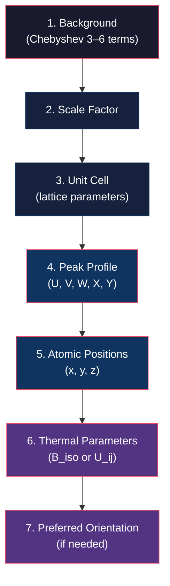

# GSAS-II Integration: Importing MIDAS Caked Data for Rietveld Refinement

**Version:** 9.0  
**Contact:** hsharma@anl.gov

---

## 1. Introduction

This manual walks you through the workflow of taking radially integrated (caked) powder-diffraction data produced by MIDAS and importing it into [GSAS-II](https://advancedphotonsource.github.io/GSAS-II-tutorials/index.html) for phase identification, profile fitting, and Rietveld refinement. It assumes that you have already calibrated your detector and run the MIDAS integrator — if not, see the prerequisites below.

> [!NOTE]
> GSAS-II is an open-source crystallographic analysis package developed at APS. It performs Rietveld refinement, peak fitting, texture analysis, and more. It is the recommended tool for quantitative analysis of the powder profiles that MIDAS produces.

---

## 2. Prerequisites

### 2.1. Software

| Component | Minimum Version | Installation |
|-----------|----------------|-------------|
| **MIDAS** | 9.0 | See [README.md](README.md) — typically installed to `~/opt/MIDAS/` but any path works.  Scripts auto-detect their install location. |
| **GSAS-II** | Latest | `conda install gsas2full -c briantoby` or [install guide](https://advancedphotonsource.github.io/GSAS-II-tutorials/install.html). See §2.3 below. |
| **Python** | 3.9+ | Required by both packages |
| **zarr** | Latest | `pip install zarr` or `conda install zarr` (required by the MIDAS zarr importer in GSAS-II) |

### 2.3. GSAS-II Installation & Setup

The MIDAS scripts need to import `GSASIIscriptable` at runtime.  There are two setups:

1. **Conda (recommended):** Install the `gsas2full` package, which places GSAS-II on the standard Python path:
   ```bash
   conda install gsas2full -c briantoby
   ```

2. **Manual / source install:** If GSAS-II is installed in a non-standard location (e.g. `/opt/gsas2/GSASII`), point the scripts to it with an environment variable:
   ```bash
   export GSASII_PATH=/path/to/GSAS-II/GSASII
   ```
   Add this to your `.bashrc` / `.zshrc` for persistence.

### 2.2. Data

Before starting, you should have:

1. A **calibrated parameter file** from `AutoCalibrateZarr.py` or manual calibration (see [FF_calibration.md](FF_calibration.md)).
2. A **caked output file** produced by `integrator.py` (see [FF_RadialIntegration.md](FF_RadialIntegration.md)).

---

## 3. MIDAS Output Format

The MIDAS `integrator.py` produces caked diffraction data in a **`.zarr.zip`** file. This file contains everything GSAS-II needs to import the data as a set of 1D powder patterns, and is read by the [MIDAS zarr importer](https://github.com/AdvancedPhotonSource/GSAS-II/blob/main/GSASII/imports/G2pwd_MIDAS.py) in GSAS-II.

The **streaming GPU pipeline** (`integrator_batch_process.py` → `integrator_stream_process_h5.py`) also generates a compatible `.zarr.zip` alongside the HDF5 output. Instrument parameters are read from the parameter file or use defaults matching the GSAS-II reader. Use `--no-zarr` to skip zarr creation, or `--zarr-output <name>` to set a custom filename.

### 3.1. Zarr Internal Structure

```
<filename>.zarr.zip
├── InstrumentParameters/
│   ├── Distance        # Sample-to-detector distance (µm)
│   ├── Lam             # Wavelength (Å)
│   ├── Polariz         # Polarization fraction
│   ├── SH_L            # Low-angle asymmetry parameter
│   ├── U, V, W         # Gaussian peak-profile parameters (Caglioti)
│   ├── X, Y            # Lorentzian peak-profile parameters
│   └── Z               # Additional profile parameter
├── OmegaSumFrame/
│   └── LastFrameNumber_<N>   # Caked intensity data (R × η array)
│       └── .attrs              # FirstOme, LastOme, Number Of Frames Summed
├── Omegas              # Effective ω angles for each summed frame
└── REtaMap             # (4 × R × η) array: 2θ, η, intensity/bin-area
```

### 3.2. Key Parameters That Affect the Output

These parameters are set in the MIDAS caking parameter file and directly control the structure of the output:

| Parameter | Description | Typical Value |
|-----------|-------------|---------------|
| `EtaBinSize` | Azimuthal bin width (°) | 5 |
| `EtaMin` / `EtaMax` | Azimuthal range (°) | −180 / 180 |
| `RBinSize` | Radial bin width (pixels) | 0.5 |
| `RMin` / `RMax` | Radial range (pixels) | 10 / 2880 |
| `OmegaSumFrames` | Number of ω frames summed per output pattern | 20 |

> [!IMPORTANT]
> The `OmegaSumFrames` parameter controls how many raw frames are averaged into a single caked pattern. Setting this to the total number of frames produces a single, high-statistics pattern — ideal for Rietveld refinement. Setting it to a smaller number produces multiple patterns at different ω positions, useful for texture analysis or checking for preferred orientation.

### 3.3. Running the Integrator (Quick Reference)

For full details, see [FF_RadialIntegration.md](FF_RadialIntegration.md). A typical invocation is:

```bash
python ~/opt/MIDAS/utils/integrator.py \
  -resultFolder ./output \
  -paramFN ps_caking.txt \
  -dataFN /path/to/data.vrx.h5 \
  -dataLoc /exchange/data \
  -darkFN /path/to/dark.vrx.h5 \
  -darkLoc /exchange/data \
  -startFileNr 48005 \
  -endFileNr 48024 \
  -convertFiles 1 \
  -mapDetector 1 \
  -nCPUs 10
```

---

## 4. Importing MIDAS Output into GSAS-II

### 4.1. Launch GSAS-II and Create a Project

1. Launch GSAS-II from your terminal or application launcher.
2. Go to **File → New Project** and save the project with a descriptive name (e.g., `CeO2_refinement.gpx`).

### 4.2. Import the Powder Data

1. Go to **Import → Powder Data → from MIDAS zarr file**.
2. Browse to your `.zarr.zip` file and select it.
3. GSAS-II will read all azimuthal lineouts from the zarr file. Each lineout with ≥ 20 unmasked points becomes a separate histogram.
4. Instrument parameters (wavelength, profile terms) are automatically read from the `InstrumentParameters/` group in the zarr file. You can override them with an external `.instprm` file placed alongside the `.zarr.zip` with the same base name.

> [!TIP]
> If GSAS-II does not show the MIDAS import option, ensure that zarr is installed in the Python environment used to run GSAS-II. You can verify with `python -c "import zarr; print(zarr.__version__)"`.

### 4.3. Verify the Import

After importing, the powder pattern should appear in the plot window. Check:

- The **x-axis** shows 2θ (or Q, d-spacing — toggle via the plot menu).
- The **peak positions** look reasonable for your calibrant or sample.
- The **intensity** scale is not clipped or empty.

If the pattern looks inverted, shifted, or empty, the most common causes are:
- Wrong `ImTransOpt` during MIDAS calibration.
- Incorrect `RMin`/`RMax` range (too narrow or in the wrong units).
- The dark frame was not subtracted properly.

---

## 5. Calibration Verification

Before proceeding to refinement, verify that the MIDAS calibration is consistent with what GSAS-II expects.

### 5.1. Check Peak Positions Against a Known Calibrant

If your caked data is from a known powder standard (CeO₂, LaB₆, Si):

1. Select the imported powder histogram in the data tree.
2. Go to **Import → Phase → from CIF file** and load the CIF file for your calibrant.
3. Link the phase to the histogram when prompted.
4. Click **Calculate → Compute** (without refining anything) to overlay the expected peak positions on the observed pattern.
5. The tick marks should align with observed peak centers. If there is a systematic shift, revisit your MIDAS calibration.

### 5.2. Background

1. Select the **Background** entry under the histogram in the data tree.
2. Choose a Chebyshev polynomial with 3–6 coefficients as a starting background model.
3. Check the **Refine** box next to the background function.

---

## 6. Rietveld Refinement Workflow

Rietveld refinement should proceed in stages, from the most robust parameters to the most sensitive. Below is a recommended sequence.



### Stage 1: Background + Scale

1. Check the **Refine** box for the background.
2. Under the phase's histogram data, check the **Refine** box for the **Scale** factor.
3. Click **Calculate → Refine**. Monitor **Rwp** — it should drop significantly.

### Stage 2: Lattice Parameters

1. Under **Phases → General**, check the **Refine Unit Cell** box.
2. Refine again. The lattice parameters should converge to values close to the known literature values.

### Stage 3: Peak Profile

1. Under **Instrument Parameters**, enable refinement of **U**, **V**, **W** (Gaussian broadening) one at a time.
2. After stabilizing, enable **X** and **Y** (Lorentzian broadening).
3. Refine after each addition. If the refinement diverges, remove the last added parameter and try with a different starting value.

> [!WARNING]
> Do not refine all profile parameters simultaneously on the first attempt. This can lead to strong correlations and divergence. Add parameters in groups (areas, then intensities, then widths) and verify that Rwp improves and the difference curve (observed − calculated) becomes flatter.

### Stage 4: Atomic Positions and Thermal Parameters

1. For the atoms in your phase, check the **Refine** boxes for position coordinates (**X**, **Y**, **Z**).
2. Refine.
3. Then enable **Uiso** (isotropic thermal parameter) for each atom.
4. Refine again.

### Stage 5: Final Inspection

1. Examine the **difference curve** at the bottom of the pattern plot. Systematic errors indicate model deficiencies (wrong phase, missing phase, texture, etc.).
2. Inspect the refined values for physical reasonableness:
   - Lattice parameters near literature values.
   - Thermal parameters positive and not unreasonably large.
   - Rwp typically < 15% for a good refinement of synchrotron data.

---

## 7. Exporting Results

### 7.1. Save the GSAS-II Project

Go to **File → Save Project** to save all refinement results, parameters, and plots in the `.gpx` file.

### 7.2. Export Refined Parameters

- **CIF**: Go to **Export → Phase → in CIF format** to export the refined crystal structure.
- **Plots**: Right-click on the plot window and select **Save Figure** to export publication-quality figures.
- **CSV tables**: Some GSAS-II menus allow export of parameter tables in CSV format.

---

## 8. Tips and Troubleshooting

### 8.1. Common Import Issues

| Symptom | Likely Cause | Fix |
|---------|-------------|-----|
| No HDF5 import option in GSAS-II | `h5py` not installed | Install with `pip install h5py` in the GSAS-II environment |
| Empty pattern after import | Wrong dataset selected in HDF5 tree | Re-import and select the correct dataset |
| Peaks at wrong 2θ positions | Incorrect wavelength | Verify `Wavelength` in MIDAS parameter file matches GSAS-II |
| Very broad peaks | Incorrect `Lsd` or `px` in calibration | Recalibrate with `AutoCalibrateZarr.py` |
| Asymmetric peaks at low 2θ | Axial divergence | Enable the `SH_L` asymmetry parameter in GSAS-II |

### 8.2. Choosing `OmegaSumFrames`

| Goal | Recommended `OmegaSumFrames` |
|------|------------------------------|
| Maximum statistics (Rietveld) | Total number of frames in the scan |
| Texture analysis | 1 (individual frames) or small number |
| Quick check | 10–20 |

### 8.3. Multi-Phase Refinement

If your sample contains multiple phases:

1. Import all phase CIF files one at a time via **Import → Phase**.
2. Link each phase to the histogram.
3. Refine scale factors for all phases simultaneously — the relative scale factors give the phase fractions.

### 8.4. Using MIDAS Instrument Parameters as Starting Guesses

The calibration parameters from MIDAS can serve as starting instrument-parameter guesses in GSAS-II. The key conversions are:

| MIDAS Parameter | GSAS-II Equivalent | Notes |
|----------------|-------------------|-------|
| `Lsd` (µm) | Distance (mm) | Divide by 1000 |
| `Wavelength` (Å) | Lam (Å) | Direct |
| `px` (µm) | — | Used internally by MIDAS; not needed by GSAS-II |
| `BC` (pixels) | — | Used internally by MIDAS; not needed by GSAS-II |

> [!NOTE]
> Once the data is caked (converted to 1D I vs. 2θ), the detector geometry is already encoded in the 2θ values. GSAS-II does not need `BC`, `px`, or tilt parameters — it only needs the wavelength and profile parameters.

---

## 9. Scripted Rietveld Refinement

For batch processing or pipeline integration, MIDAS provides a script that automates the staged Rietveld refinement workflow described above using the GSAS-II [scripting API](https://gsas-ii.readthedocs.io/en/latest/GSASIIscriptable.html).  Each histogram (lineout) is refined **independently** in its own `.gpx` project, and when `--nCPUs > 1` these refinements run **in parallel** via `multiprocessing`.

> [!NOTE]
> In the examples below, `$MIDAS_INSTALL_DIR` refers to wherever MIDAS is installed on your system (commonly `~/opt/MIDAS`).  The scripts auto-detect their install location, so you only need the correct absolute or relative path to the script.

### 9.1. Quick Start

```bash
python $MIDAS_INSTALL_DIR/utils/rietveld_refine.py \
    --data  output/sample.zarr.zip \
    --cif   CeO2.cif \
    --out   refinement/ \
    --bkg-terms 6 \
    --nCPUs 8
```

### 9.2. What the Script Does

The script performs the same staged refinement as the GUI workflow, **per histogram**:

| Stage | Parameters Refined |
|-------|-------------------|
| 1 | Background (Chebyshev) + Scale |
| 2 | Unit cell (lattice parameters) |
| 3a | Gaussian profile: U, V, W |
| 3b | Lorentzian profile: X, Y + asymmetry SH/L |
| 4 | Atomic positions + thermal parameters |

Each histogram produces its own `hist_NNNN.gpx` project that can be opened in the GSAS-II GUI.

### 9.3. CLI Arguments

| Argument | Description | Default |
|----------|-------------|--------|
| `--data` / `-d` | MIDAS `.zarr.zip` file (required) | — |
| `--cif` / `-c` | One or more CIF files (required) | — |
| `--out` / `-o` | Output **directory** for per-histogram `.gpx` files | `refinement/` |
| `--instprm` / `-i` | Optional `.instprm` override | (from zarr) |
| `--bkg-terms` | Number of background coefficients | 6 |
| `--limits LOW HIGH` | 2θ limits (degrees) | (full range) |
| `--nCPUs` | Number of parallel workers | 1 |
| `--no-atoms` | Skip atomic position refinement | — |
| `--no-export` | Skip CIF/CSV export | — |
| `-v` | Verbose (debug) logging | — |

### 9.4. Outputs (per histogram)

- **`hist_NNNN.gpx`** — GSAS-II project (openable in the GUI)
- **`hist_NNNN_<phase>.cif`** — Refined crystal structure
- **`hist_NNNN_data.csv`** — Pattern data (observed, calculated, difference)
- **`refinement_summary.json`** — Aggregated results: Rwp per histogram, mean Rwp, lattice parameters

### 9.5. Parallel Refinement

```bash
# Refine all histograms using 16 parallel workers
python $MIDAS_INSTALL_DIR/utils/rietveld_refine.py \
    --data  output/sample.zarr.zip \
    --cif   Al2O3.cif  Fe3O4.cif \
    --out   refinement/ \
    --nCPUs 16 \
    --limits 2.0 30.0
```

### 9.6. Python API

The script can be imported directly for integration into larger pipelines:

```python
from rietveld_refine import run_refinement

results = run_refinement(
    data_file='output/sample.zarr.zip',
    cif_files=['CeO2.cif'],
    output_dir='refinement/',
    bkg_terms=6,
    n_cpus=8,
)
print(f"Mean Rwp = {results['mean_Rwp']:.3f}%")
print(f"Succeeded: {results['succeeded']} / {results['total_histograms']}")
```

> [!TIP]
> Start by inspecting your data in the GSAS-II GUI to verify the import and choose appropriate 2θ limits.  Once satisfied, use the script to automate the refinement for batch processing.

---

## 10. Combined Integration + Refinement Pipeline

The `integrate_and_refine.py` wrapper runs the full pipeline from **raw data** to **refined crystal structures** in a single command.  It supports two integration backends:

| Backend | Engine | Data Source | Best For |
|---------|--------|-------------|----------|
| `batch` (default) | `integrator.py` (CPU/OpenMP) | Individual data files (`-dataFN`) | Post-experiment analysis, systems without GPUs |
| `stream` | `integrator_batch_process.py` (GPU/CUDA) | Folder of images or live PVA stream | Real-time experiments, high-throughput |

Both backends produce a `.zarr.zip` file that is passed to Stage 2 (Rietveld refinement).

### 10.1. CPU Batch Backend

Process individual data files using the OpenMP-based integrator:

```bash
python $MIDAS_INSTALL_DIR/utils/integrate_and_refine.py \
    --backend batch \
    -paramFN  ps.txt \
    -dataFN   data/sample_000001.h5 \
    --cif     CeO2.cif \
    --out     refinement/ \
    -nCPUs    8
```

### 10.2. GPU Streaming Backend (Folder)

Process a folder of images using the GPU streaming pipeline:

```bash
python $MIDAS_INSTALL_DIR/utils/integrate_and_refine.py \
    --backend stream \
    --param-file ps.txt \
    --folder /data/experiment/scan_01/ \
    --cif    CeO2.cif \
    --out    refinement/ \
    -nCPUs   8
```

### 10.3. GPU Streaming Backend (Live PVA)

Connect to a live EPICS PVAccess detector stream:

```bash
python $MIDAS_INSTALL_DIR/utils/integrate_and_refine.py \
    --backend stream \
    --param-file ps.txt \
    --pva --pva-ip 10.54.105.139 \
    --cif    CeO2.cif \
    --out    refinement/ \
    -nCPUs   8
```

### 10.4. Pipeline Control Flags

| Flag | Effect |
|------|--------|
| `--skip-integration --zarr-file FILE` | Skip Stage 1 and use an existing `.zarr.zip` |
| `--skip-refinement` | Run only Stage 1 (integration) |
| `--backend batch` | Use CPU batch integrator (default) |
| `--backend stream` | Use GPU streaming integrator |

### 10.5. Argument Groups

**Batch backend** (`--backend batch`):
`-paramFN`, `-dataFN`, `-resultFolder`, `-darkFN`, `-dataLoc`, `-darkLoc`, `-numFrameChunks`, `-preProcThresh`, `-startFileNr`, `-endFileNr`, `-nCPUsLocal`

**Stream backend** (`--backend stream`):
`--param-file`, `--folder`, `--pva`, `--pva-ip`, `--output-h5`, `--dark`, `--stream-data-loc`, `--compress`, `--zarr-output`

**Refinement** (both backends):
`--cif`, `--out`, `--instprm`, `--bkg-terms`, `--limits`, `--no-atoms`, `--no-export`

**Shared:** `-nCPUs` (parallel integration and refinement), `-v`

---

## 11. See Also

- [FF_RadialIntegration.md](FF_RadialIntegration.md) — MIDAS radial integration / caking workflow (both CPU and GPU pipelines)
- [FF_calibration.md](FF_calibration.md) — FF-HEDM geometry calibration (produces parameters used by integrator)
- [README.md](README.md) — High-level MIDAS overview and manual index
- [GSAS-II Tutorials](https://advancedphotonsource.github.io/GSAS-II-tutorials/tutorials.html) — Official GSAS-II tutorials and documentation
- [GSASIIscriptable API](https://gsas-ii.readthedocs.io/en/latest/GSASIIscriptable.html) — GSAS-II scripting reference

---

If you encounter any issues or have questions, please open an issue on this repository.
