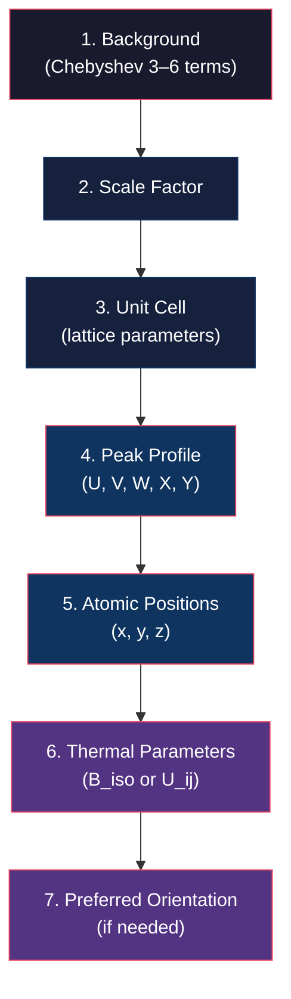

# GSAS-II Integration: Importing MIDAS Caked Data for Rietveld Refinement

**Version:** 9.0  
**Contact:** hsharma@anl.gov

---

## 1. Introduction

This manual walks you through the workflow of taking radially integrated (caked) powder-diffraction data produced by MIDAS and importing it into [GSAS-II](https://advancedphotonsource.github.io/GSAS-II-Tutorials/) for phase identification, profile fitting, and Rietveld refinement. It assumes that you have already calibrated your detector and run the MIDAS integrator — if not, see the prerequisites below.

> [!NOTE]
> GSAS-II is an open-source crystallographic analysis package developed at APS. It performs Rietveld refinement, peak fitting, texture analysis, and more. It is the recommended tool for quantitative analysis of the powder profiles that MIDAS produces.

---

## 2. Prerequisites

### 2.1. Software

| Component | Minimum Version | Installation |
|-----------|----------------|-------------|
| **MIDAS** | 9.0 | `~/opt/MIDAS/` |
| **GSAS-II** | Latest | `conda install gsas2full -c briantoby` or [install guide](https://advancedphotonsource.github.io/GSAS-II-Tutorials/install.html) |
| **Python** | 3.9+ | Required by both packages |

### 2.2. Data

Before starting, you should have:

1. A **calibrated parameter file** from `AutoCalibrateZarr.py` or manual calibration (see [FF_calibration.md](FF_calibration.md)).
2. A **caked output file** produced by `integrator.py` (see [FF_RadialIntegration.md](FF_RadialIntegration.md)).

---

## 3. MIDAS Output Format

The MIDAS `integrator.py` produces caked diffraction data in an HDF5 file with the extension **`.caked.hdf`**. This file contains everything GSAS-II needs to import the data as a set of 1D powder patterns.

### 3.1. HDF5 Internal Structure

```
<filename>.caked.hdf
├── InstrumentParameters/
│   ├── Distance        # Sample-to-detector distance (mm)
│   ├── Lam             # Wavelength (Å)
│   ├── Polariz         # Polarization fraction
│   ├── SH_L            # Low-angle asymmetry parameter
│   ├── U, V, W         # Gaussian peak-profile parameters (Caglioti)
│   ├── X, Y            # Lorentzian peak-profile parameters
│   └── Z               # Additional profile parameter
├── OmegaSumFrame/
│   └── LastFrameNumber_<N>   # Caked intensity data (R × η array)
├── Omegas              # Effective ω angles for each summed frame
└── REtaMap             # (4 × R × η) array: radius, η, intensity, error
```

### 3.2. Key Parameters That Affect the Output

These parameters are set in the MIDAS caking parameter file and directly control the structure of the output:

| Parameter | Description | Typical Value |
|-----------|-------------|---------------|
| `EtaBinSize` | Azimuthal bin width (°) | 5 |
| `EtaMin` / `EtaMax` | Azimuthal range (°) | −180 / 180 |
| `RBinSize` | Radial bin width (pixels) | 0.5 |
| `RMin` / `RMax` | Radial range (pixels) | 10 / 2880 |
| `OmegaSumFrames` | Number of ω frames summed per output pattern | 20 |

> [!IMPORTANT]
> The `OmegaSumFrames` parameter controls how many raw frames are averaged into a single caked pattern. Setting this to the total number of frames produces a single, high-statistics pattern — ideal for Rietveld refinement. Setting it to a smaller number produces multiple patterns at different ω positions, useful for texture analysis or checking for preferred orientation.

### 3.3. Running the Integrator (Quick Reference)

For full details, see [FF_RadialIntegration.md](FF_RadialIntegration.md). A typical invocation is:

```bash
python ~/opt/MIDAS/utils/integrator.py \
  -resultFolder ./output \
  -paramFN ps_caking.txt \
  -dataFN /path/to/data.vrx.h5 \
  -dataLoc /exchange/data \
  -darkFN /path/to/dark.vrx.h5 \
  -darkLoc /exchange/data \
  -startFileNr 48005 \
  -endFileNr 48024 \
  -convertFiles 1 \
  -mapDetector 1 \
  -nCPUs 10
```

---

## 4. Importing MIDAS Output into GSAS-II

### 4.1. Launch GSAS-II and Create a Project

1. Launch GSAS-II from your terminal or application launcher.
2. Go to **File → New Project** and save the project with a descriptive name (e.g., `CeO2_refinement.gpx`).

### 4.2. Import the Powder Data

1. Go to **Import → Powder Data → from Generic HDF5 XY (etc.) file**.
2. Browse to your `.caked.hdf` file and select it.
3. GSAS-II will scan the HDF5 tree and present the available datasets. Select the dataset corresponding to the caked intensity data (typically under `OmegaSumFrame` or `REtaMap`).
4. When prompted for instrument parameters:
   - If the HDF5 file includes `InstrumentParameters/`, GSAS-II may auto-populate wavelength and detector distance.
   - Otherwise, enter the **wavelength** (Å) and select the appropriate radiation type (synchrotron X-ray).

> [!TIP]
> If GSAS-II does not show an HDF5 import option, ensure that `h5py` is installed in the same Python environment as GSAS-II. You can verify with `python -c "import h5py; print(h5py.version.version)"`.

### 4.3. Verify the Import

After importing, the powder pattern should appear in the plot window. Check:

- The **x-axis** shows 2θ (or Q, d-spacing — toggle via the plot menu).
- The **peak positions** look reasonable for your calibrant or sample.
- The **intensity** scale is not clipped or empty.

If the pattern looks inverted, shifted, or empty, the most common causes are:
- Wrong `ImTransOpt` during MIDAS calibration.
- Incorrect `RMin`/`RMax` range (too narrow or in the wrong units).
- The dark frame was not subtracted properly.

---

## 5. Calibration Verification

Before proceeding to refinement, verify that the MIDAS calibration is consistent with what GSAS-II expects.

### 5.1. Check Peak Positions Against a Known Calibrant

If your caked data is from a known powder standard (CeO₂, LaB₆, Si):

1. Select the imported powder histogram in the data tree.
2. Go to **Import → Phase → from CIF file** and load the CIF file for your calibrant.
3. Link the phase to the histogram when prompted.
4. Click **Calculate → Compute** (without refining anything) to overlay the expected peak positions on the observed pattern.
5. The tick marks should align with observed peak centers. If there is a systematic shift, revisit your MIDAS calibration.

### 5.2. Background

1. Select the **Background** entry under the histogram in the data tree.
2. Choose a Chebyshev polynomial with 3–6 coefficients as a starting background model.
3. Check the **Refine** box next to the background function.

---

## 6. Rietveld Refinement Workflow

Rietveld refinement should proceed in stages, from the most robust parameters to the most sensitive. Below is a recommended sequence.



### Stage 1: Background + Scale

1. Check the **Refine** box for the background.
2. Under the phase's histogram data, check the **Refine** box for the **Scale** factor.
3. Click **Calculate → Refine**. Monitor **Rwp** — it should drop significantly.

### Stage 2: Lattice Parameters

1. Under **Phases → General**, check the **Refine Unit Cell** box.
2. Refine again. The lattice parameters should converge to values close to the known literature values.

### Stage 3: Peak Profile

1. Under **Instrument Parameters**, enable refinement of **U**, **V**, **W** (Gaussian broadening) one at a time.
2. After stabilizing, enable **X** and **Y** (Lorentzian broadening).
3. Refine after each addition. If the refinement diverges, remove the last added parameter and try with a different starting value.

> [!WARNING]
> Do not refine all profile parameters simultaneously on the first attempt. This can lead to strong correlations and divergence. Add parameters one at a time and verify that Rwp improves and the difference curve (observed − calculated) becomes flatter.

### Stage 4: Atomic Positions and Thermal Parameters

1. For the atoms in your phase, check the **Refine** boxes for position coordinates (**X**, **Y**, **Z**).
2. Refine.
3. Then enable **Uiso** (isotropic thermal parameter) for each atom.
4. Refine again.

### Stage 5: Final Inspection

1. Examine the **difference curve** at the bottom of the pattern plot. Systematic errors indicate model deficiencies (wrong phase, missing phase, texture, etc.).
2. Inspect the refined values for physical reasonableness:
   - Lattice parameters near literature values.
   - Thermal parameters positive and not unreasonably large.
   - Rwp typically < 15% for a good refinement of synchrotron data.

---

## 7. Exporting Results

### 7.1. Save the GSAS-II Project

Go to **File → Save Project** to save all refinement results, parameters, and plots in the `.gpx` file.

### 7.2. Export Refined Parameters

- **CIF**: Go to **Export → Phase → in CIF format** to export the refined crystal structure.
- **Plots**: Right-click on the plot window and select **Save Figure** to export publication-quality figures.
- **CSV tables**: Some GSAS-II menus allow export of parameter tables in CSV format.

---

## 8. Tips and Troubleshooting

### 8.1. Common Import Issues

| Symptom | Likely Cause | Fix |
|---------|-------------|-----|
| No HDF5 import option in GSAS-II | `h5py` not installed | Install with `pip install h5py` in the GSAS-II environment |
| Empty pattern after import | Wrong dataset selected in HDF5 tree | Re-import and select the correct dataset |
| Peaks at wrong 2θ positions | Incorrect wavelength | Verify `Wavelength` in MIDAS parameter file matches GSAS-II |
| Very broad peaks | Incorrect `Lsd` or `px` in calibration | Recalibrate with `AutoCalibrateZarr.py` |
| Asymmetric peaks at low 2θ | Axial divergence | Enable the `SH_L` asymmetry parameter in GSAS-II |

### 8.2. Choosing `OmegaSumFrames`

| Goal | Recommended `OmegaSumFrames` |
|------|------------------------------|
| Maximum statistics (Rietveld) | Total number of frames in the scan |
| Texture analysis | 1 (individual frames) or small number |
| Quick check | 10–20 |

### 8.3. Multi-Phase Refinement

If your sample contains multiple phases:

1. Import all phase CIF files one at a time via **Import → Phase**.
2. Link each phase to the histogram.
3. Refine scale factors for all phases simultaneously — the relative scale factors give the phase fractions.

### 8.4. Using MIDAS Instrument Parameters as Starting Guesses

The calibration parameters from MIDAS can serve as starting instrument-parameter guesses in GSAS-II. The key conversions are:

| MIDAS Parameter | GSAS-II Equivalent | Notes |
|----------------|-------------------|-------|
| `Lsd` (µm) | Distance (mm) | Divide by 1000 |
| `Wavelength` (Å) | Lam (Å) | Direct |
| `px` (µm) | — | Used internally by MIDAS; not needed by GSAS-II |
| `BC` (pixels) | — | Used internally by MIDAS; not needed by GSAS-II |

> [!NOTE]
> Once the data is caked (converted to 1D I vs. 2θ), the detector geometry is already encoded in the 2θ values. GSAS-II does not need `BC`, `px`, or tilt parameters — it only needs the wavelength and profile parameters.

---

## 9. See Also

- [FF_RadialIntegration.md](FF_RadialIntegration.md) — MIDAS radial integration / caking workflow
- [FF_calibration.md](FF_calibration.md) — FF-HEDM geometry calibration (produces parameters used by integrator)
- [README.md](README.md) — High-level MIDAS overview and manual index
- [GSAS-II Tutorials](https://advancedphotonsource.github.io/GSAS-II-Tutorials/) — Official GSAS-II tutorials and documentation

---

If you encounter any issues or have questions, please open an issue on this repository.
