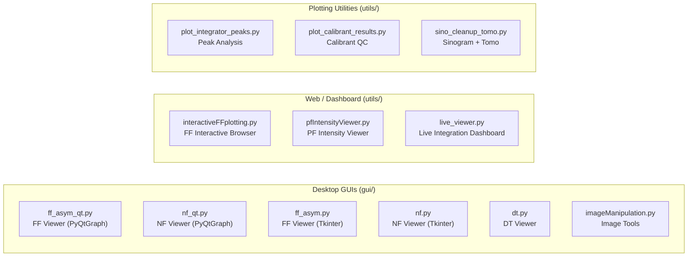

# GUIs and Visualization — MIDAS

**Version:** 9.1  
**Contact:** hsharma@anl.gov

---

## Overview

MIDAS provides desktop GUIs for interactive data exploration, calibration, and real-time monitoring. Two generations of GUIs are available:

| Generation | Framework | Benefits |
|---|---|---|
| **Legacy (Tkinter)** | Tkinter + Matplotlib | Mature, full feature set, familiar toolbar |
| **Modern (PyQtGraph)** | PyQt5 + PyQtGraph | Faster rendering, richer interaction, navigation toolbar |

> [!TIP]
> The PyQtGraph-based viewers (`ff_asym_qt.py`, `nf_qt.py`) are recommended for daily use. They offer faster image rendering, a built-in navigation toolbar, and a more responsive interface.



---

## 1. FF-HEDM Viewer — PyQtGraph (`gui/ff_asym_qt.py`)

**Launch:**
```bash
cd <data_directory>
python ~/opt/MIDAS/gui/ff_asym_qt.py &
```

### Features

- **Auto-detection** of data files from current directory
- **Image display** with PyQtGraph: fast pan, zoom, crosshair with pixel coordinates
- **Navigation toolbar** below image: Home, Back/Forward (view history), Pan, Zoom-to-rect
- **Intensity control**: P2–P98 percentile auto-scaling, editable MinI/MaxI fields, log scale
- **Ring overlays** from ring material database with live redraw on BC/Lsd change
- **Image transforms**: HFlip, VFlip, Transpose checkboxes
- **Dark subtraction**: load and apply dark field images
- **HDF5 support**: browse H5 datasets with customizable data path
- **Frame navigation**: spinner + Ctrl+mouse-wheel frame stepping
- **Max/Sum over frames**: aggregate multiple frames for improved signal
- **Colormap** and **theme** (dark/light) selection
- **Font size** control (8–24pt)
- **Export PNG** of current view
- **🎬 Movie mode**: Play/Pause/Stop + FPS slider (1–30) — animates through frames automatically
- **🖱️ Drag-and-drop**: drop a file or folder onto the viewer to open it
- **📊 Intensity vs Frame**: dock widget showing mean/max intensity across all frames, click to jump (View → Intensity vs Frame)
- **💾 Session save/restore**: File → Save/Load Session as `.session.json` (Ctrl+S / Ctrl+Shift+S)

### Key Differences from Legacy (`ff_asym.py`)

| Feature | Legacy (Tkinter) | Modern (PyQtGraph) |
|---|---|---|
| Rendering speed | Matplotlib (slower) | PyQtGraph (GPU-accelerated) |
| Navigation | Matplotlib toolbar | Custom Home/Back/Forward/Pan/Zoom |
| Mouse-wheel zoom | Enabled by default | Disabled (explicit Zoom button) |
| Intensity scaling | Manual min/max | P2–P98 auto-scaling + manual override |
| Ring update | Requires reload | Live on BC/Lsd text field change |
| Calibrate dialog | Available | Removed (use `AutoCalibrateZarr.py`) |

---

## 2. NF-HEDM Viewer — PyQtGraph (`gui/nf_qt.py`)

**Launch:**
```bash
cd <data_directory>
python ~/opt/MIDAS/gui/nf_qt.py &
```

### Features

All features from the FF viewer plus:

- **Microstructure overlay**: load `.mic` / `.map` files, color by Confidence, GrainID, Euler angles, KAM, GROD, Phase
- **Spot simulation**: load grain parameters and simulate diffraction spots
- **LineoutH / LineoutV**: horizontal and vertical intensity profiles
- **BoxH / BoxV ROI tools**: rectangular region-of-interest with real-time Sum, Mean, Min, Max statistics
- **Beam center determination**: guided workflow for multi-distance calibration
- **Origin at bottom-right** (matching physical NF detector convention)
- **🎬 Movie mode**, **🖱️ drag-drop**, **💾 session save** — same as FF viewer

For detailed NF-specific calibration workflows, see [NF_GUI.md](NF_GUI.md).

---

## 3. Legacy Tkinter GUIs (`gui/`)

### FF-HEDM Viewer (`gui/ff_asym.py`)

```bash
cd <data_directory> && python ~/opt/MIDAS/gui/ff_asym.py &
```

Full-featured FF viewer with Matplotlib rendering. See [FF_Visualization.md](FF_Visualization.md).

### NF-HEDM Viewer (`gui/nf.py`)

```bash
cd <data_directory> && python ~/opt/MIDAS/gui/nf.py &
```

Full-featured NF viewer with calibration workflow. See [NF_GUI.md](NF_GUI.md).

### Diffraction Tomography Viewer (`gui/dt.py`)

```bash
python ~/opt/MIDAS/gui/dt.py &
```

2D detector image viewer with ring overlays and 1D intensity profiles.

### Image Manipulation (`gui/imageManipulation.py`)

```bash
python ~/opt/MIDAS/gui/imageManipulation.py &
```

General-purpose detector image viewer: dark subtraction, flat-field, ROI selection, transformations, histograms.

---

## 4. Interactive Web Dashboards (`utils/`)

### FF-HEDM Interactive Plotting (`gui/viewers/interactiveFFplotting.py`)

**Browser-based** interactive exploration of FF-HEDM results using Plotly Dash.

```bash
python ~/opt/MIDAS/gui/viewers/interactiveFFplotting.py <Grains.csv>
```

See [FF_Interactive_Plotting.md](FF_Interactive_Plotting.md).

### PF-HEDM Intensity Viewer (`gui/viewers/pfIntensityViewer.py`)

Interactive sinogram, intensity patch, and tomographic reconstruction viewer for Point-Focus HEDM.

```bash
python ~/opt/MIDAS/gui/viewers/pfIntensityViewer.py
```

See [PF_Interactive_Plotting.md](PF_Interactive_Plotting.md).

### Live Integration Dashboard (`gui/viewers/live_viewer.py`)

Real-time visualization of GPU integrator output. Tails `lineout.bin` and `fit.bin` as they are written by `IntegratorFitPeaksGPUStream`.

```bash
python ~/opt/MIDAS/gui/viewers/live_viewer.py \
    --lineout lineout.bin --nRBins 500 \
    --fit fit.bin --nPeaks 3 \
    --params setup_30keV.txt
```

**Three-panel display:**
1. **1D Lineout** — latest integrated I(R) profile with log scale option
2. **Heatmap** — time-evolving intensity waterfall (R × frame)
3. **Peak evolution** — fitted Imax, Rcen, Sigma, η, BG, GoF, Area vs. frame for each peak

**Interactive Features:**
- **Triple x-axes** (R, 2θ, Q) on both lineout and heatmap — enabled via `--params` or `--lsd`/`--px`/`--wavelength`
- **🎯 Peak Pick** — click on peaks to select R values, then **📤 Send Peaks** to the running GPU integrator (Replace or Append mode)
- **Active fit overlays** — red dashed lines at currently-fitted radii on both plots

See [FF_Radial_Integration.md](FF_Radial_Integration.md) §4.2.1 for details on the interactive peak selection protocol.

---

## 5. Plotting Utilities (`utils/`)

### Peak Analysis (`gui/viewers/plot_integrator_peaks.py`)

Post-hoc Pseudo-Voigt peak fitting on caked zarr.zip output. Produces 2D scatter plots of fitted 2θ vs η with ring assignment.

```bash
python ~/opt/MIDAS/gui/viewers/plot_integrator_peaks.py \
    --zarr scan_01.caked.hdf.zarr.zip \
    --peaks 245.3 347.1 425.8
```

### Calibrant QC (`gui/viewers/plot_calibrant_results.py`)

Quick lattice-parameter-vs-η scatter plot from `CalibrantPanelShiftsOMP` `_corr.csv` output, with ideal lattice overlay.

### Sinogram Cleanup and Tomo Reconstruction (`utils/sino_cleanup_tomo.py`)

Processes PF-HEDM sinograms: column normalization, hole filling, despeckling, gap interpolation, 2D Gaussian smoothing, and MIDAS_TOMO reconstruction.

```bash
python ~/opt/MIDAS/utils/sino_cleanup_tomo.py \
    --topdir /analysis/pf_output \
    --sinoType raw --filterNr 2
```

See [Tomography_Reconstruction.md](Tomography_Reconstruction.md) for the reconstruction backend.

---

## 6. Shared Components (`gui/gui_common.py`)

The PyQtGraph-based viewers share a common library providing:

| Component | Description |
|---|---|
| `MIDASImageView` | Image viewer with crosshair, auto-levels, navigation toolbar, axis origin control |
| `apply_theme()` | Dark/light palette for Qt + PyQtGraph |
| `AsyncWorker` | Background thread wrapper with progress/error signals |
| `LogPanel` | Redirects `print()` to a collapsible log dock widget |
| `get_colormap()` | Name-based colormap lookup with matplotlib fallback |

### Navigation Toolbar

Built into `MIDASImageView`, displayed below the image:

| Button | Action |
|---|---|
| 🏠 Home | Reset to full image extent |
| ◀ Back | Previous view in history |
| ▶ Forward | Next view in history |
| 📋 Pan | Toggle: drag to move |
| 🔍 Zoom | Toggle: drag rectangle to zoom |
| ▶ Play | Animate frames at set FPS |
| ⏸ Pause | Pause animation |
| ⏹ Stop | Stop animation, reset mode |
| FPS | 1–30 frames per second spinner |

Mouse-wheel zoom is disabled by default. Ctrl+wheel scrolls frames.

---

## 7. Requirements

### PyQtGraph GUIs
```
PyQt5
pyqtgraph
numpy
```

### Legacy Tkinter GUIs
```
tkinter (built-in)
matplotlib
numpy
Pillow
```

### Web Dashboards
```
dash / plotly
flask
pandas
numpy
```

---

## See Also

- [NF_GUI.md](NF_GUI.md) — NF-HEDM calibration workflow (detailed)
- [FF_Visualization.md](FF_Visualization.md) — FF-HEDM visualization
- [FF_Interactive_Plotting.md](FF_Interactive_Plotting.md) — Browser-based FF exploration
- [FF_Radial_Integration.md](FF_Radial_Integration.md) — Integration + live viewer
- [PF_Interactive_Plotting.md](PF_Interactive_Plotting.md) — PF intensity viewer
- [README.md](README.md) — MIDAS manual index

---

If you encounter any issues or have questions, please open an issue on this repository.
