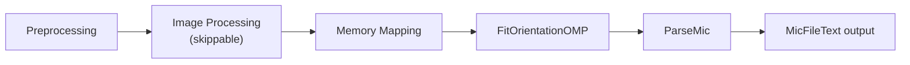
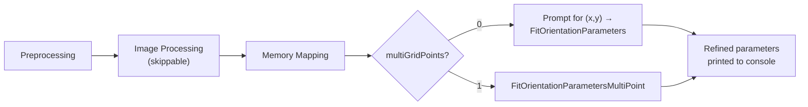

# nf_MIDAS.py User Manual

**Version:** 9.0  
**Contact:** hsharma@anl.gov

> [!NOTE]
> For **multi-resolution** NF-HEDM (iterative coarse-to-fine reconstruction), see the companion manual [NF_MultiResolution_Analysis.md](NF_MultiResolution_Analysis.md).

---

## 1. Introduction

`nf_MIDAS.py` is the primary driver for Near-Field High-Energy Diffraction Microscopy (NF-HEDM) analysis using the MIDAS software suite. It orchestrates a pipeline of high-performance C binaries to reconstruct a 3D microstructure voxel map from multi-distance detector images.

The script supports two modes:

1. **Microstructure Reconstruction** (`-refineParameters 0`) — the default. Solves for the crystal orientation at every point in a hexagonal grid.
2. **Parameter Refinement** (`-refineParameters 1`) — an advanced mode for refining experimental geometry (detector distance, tilts, beam center) using known grain locations.

### Key Capabilities

- End-to-end workflow: preprocessing → image processing → fitting → mic output
- Parallel execution via Parsl (cluster) or multiprocessing (local)
- Shared-memory I/O (`/dev/shm`) for high-throughput fitting
- Automatic retry with exponential backoff for Parsl tasks
- Far-field seeding from `Grains.csv`
- Interactive or file-based parameter refinement
- Robust cleanup of shared memory and Parsl resources on exit

---

## 2. Prerequisites

| Requirement | Details |
|---|---|
| **MIDAS Installation** | Script auto-detects install dir from its own location |
| **Python Packages** | `parsl`, `numpy`, `tqdm` |
| **Shared Memory** | `/dev/shm` must be writable and large enough for `SpotsInfo.bin`, `DiffractionSpots.bin`, `Key.bin`, `OrientMat.bin` |
| **Input Data** | Raw TIFF diffraction images in `DataDirectory` |
| **Parameter File** | Text file defining the experiment (see [Section 4](#4-parameter-file-reference)) |
| **Seed Orientations** | A `SeedOrientations` file listing candidate crystal orientations |
| **Far-Field Results** *(optional)* | `Grains.csv` from FF-HEDM if using `-ffSeedOrientations 1` |

---

## 3. Workflow Architecture

### Standard Reconstruction (`-refineParameters 0`)



**Preprocessing:**
1. `GetHKLListNF` — compute theoretical Bragg reflections → `hkls.csv`
2. `GenSeedOrientationsFF2NFHEDM` — *(if `-ffSeedOrientations 1`)* convert FF orientations to NF seeds
3. Auto-update `NrOrientations` in parameter file from seed file line count
4. `MakeHexGrid` — create hexagonal reconstruction grid → `grid.txt`
5. Grid filtering — *(optional)* apply `TomoImage` or `GridMask` to reduce computation
6. `MakeDiffrSpots` — simulate diffraction spots for all seed orientations → `DiffractionSpots.bin`, `Key.txt`, `OrientMat.bin`

**Image Processing** *(skipped if `-doImageProcessing 0`)*:
1. `MedianImageLibTiff` — per-distance median background image (parallelized via `multiprocessing.Pool` locally or Parsl on clusters)
2. `ImageProcessingLibTiffOMP` — background subtraction on raw TIFFs → `SpotsInfo.bin`

**Fitting & Postprocessing:**
1. `MMapImageInfo` — prepare memory-mapped binary data
2. Copy `.bin` files to `/dev/shm`
3. `FitOrientationOMP` — parallel orientation fitting across all grid points (with progress bar for single-node runs)
4. `ParseMic` — consolidate results → `{MicFileText}`

### Parameter Refinement (`-refineParameters 1`)



**Single-Point Refinement** (`-multiGridPoints 0`):
- Script prompts interactively for `(x,y)` coordinates
- Finds the closest grid point
- Runs `FitOrientationParameters` on that single point
- Displays refined geometry to console

**Multi-Point Refinement** (`-multiGridPoints 1`):
- Uses grid points defined via `GridPoints` in the parameter file
- Runs `FitOrientationParametersMultiPoint` using `-nCPUs` threads
- Displays refined geometry to console

---

## 4. Parameter File Reference

The parameter file is a whitespace-delimited text file. Lines starting with `#` are comments. Each line has the format `Key Value [Value ...]`.

### Core Parameters (Required)

| Key | Values | Description |
|---|---|---|
| `DataDirectory` | path | Working directory for all outputs |
| `ReducedFileName` | string | Base name pattern for input TIFF files |
| `StartNr` | int | First frame number |
| `EndNr` | int | Last frame number |
| `nDistances` | int | Number of detector distances (layers) |
| `Lsd` | float | Sample-to-detector distance (μm). Repeated `nDistances` times on separate lines |
| `BC` | float float | Beam center (y, z) in pixels. Repeated `nDistances` times |
| `px` | float | Pixel size (μm) |
| `Wavelength` | float | X-ray wavelength (Å) |
| `SpaceGroup` | int | Space group number (e.g., 225 for FCC) |
| `LatticeParameter` | 6 floats | a b c α β γ (Å and degrees) |
| `OmegaStart` | float | Starting rotation angle (degrees) |
| `OmegaStep` | float | Rotation step size (degrees) |
| `OmegaRange` | float float | Omega range [start, end]. Can appear multiple times |
| `BoxSize` | 4 floats | Bounding box per omega range. Must match number of `OmegaRange` lines |
| `ExcludePoleAngle` | float | Exclude reflections within this angle of the pole (degrees) |
| `GridSize` | float | Reconstruction voxel size (μm) |
| `MaxRingRad` | float | Maximum ring radius on detector (pixels) |
| `OrientTol` | float | Orientation tolerance for fitting (degrees) |
| `MinFracAccept` | float | Minimum fractional overlap to accept a solution |
| `MicFileBinary` | string | Binary mic output filename |
| `MicFileText` | string | Text mic output basename |
| `SeedOrientations` | path | File of candidate crystal orientations |
| `tx`, `ty`, `tz` | float | Detector tilt angles (degrees) |

### Optional Parameters

| Key | Values | Description |
|---|---|---|
| `RingsToUse` | int | Restrict to specific ring number. Can appear multiple times |
| `SaveNSolutions` | int | Number of top solutions to save per grid point (default: `1`) |
| `Wedge` | float | Wedge angle (degrees, default: `0`) |
| `Ice9Input` | *(no value)* | Flag to enable Ice9 mode |
| `NearestMisorientation` | int | Enable nearest-neighbor misorientation filtering |
| `TomoImage` | path | Tomography image for grid masking |
| `TomoPixelSize` | float | Pixel size of the tomography image |
| `GridMask` | 4 floats | `Xmin Xmax Ymin Ymax` — rectangular mask applied to the hex grid |
| `GrainsFile` | path | Path to `Grains.csv` for FF seeding |
| `GridFileName` | string | Custom grid filename (default: `grid.txt`) |
| `GridPoints` | 12 floats | Custom grid point specification (for multi-point refinement) |
| `BCTol` | 2 floats | Beam center tolerance for refinement |

---

## 5. Command-Line Arguments

```bash
python nf_MIDAS.py \
    -paramFN <param_file> \
    [-nCPUs <int>] [-machineName <str>] [-nNodes <int>] \
    [-ffSeedOrientations <0|1>] [-doImageProcessing <0|1>] \
    [-refineParameters <0|1>] [-multiGridPoints <0|1>]
```

| Argument | Type | Default | Description |
|---|---|---|---|
| `-paramFN` | string | **(required)** | Path to the parameter file |
| `-nCPUs` | int | `10` | CPU cores per node for OpenMP tasks |
| `-machineName` | string | `local` | Execution target: `local`, `orthrosnew`, `orthrosall`, `umich`, `marquette`, `purdue` |
| `-nNodes` | int | `1` | Number of compute nodes (Parsl workers) |
| `-ffSeedOrientations` | int | `0` | `1` = generate seeds from FF `Grains.csv`; `0` = use existing `SeedOrientations` file |
| `-doImageProcessing` | int | `1` | `1` = run median and image processing; `0` = skip (reuse existing processed images) |
| `-refineParameters` | int | `0` | `1` = run parameter refinement mode; `0` = run reconstruction mode |
| `-multiGridPoints` | int | `0` | *(only if `-refineParameters 1`)* `1` = use multiple grid points from param file; `0` = prompt for single (x,y) |

---

## 6. Execution Examples

### Example 1: Standard Reconstruction on a Cluster

```bash
python nf_MIDAS.py \
    -paramFN /path/to/nf_params.txt \
    -machineName purdue \
    -nNodes 4 \
    -nCPUs 128 \
    -ffSeedOrientations 1
```

### Example 2: Local Reconstruction, Skip Image Processing

```bash
python nf_MIDAS.py \
    -paramFN nf_params.txt \
    -machineName local \
    -nCPUs 8 \
    -doImageProcessing 0
```

### Example 3: Interactive Single-Point Parameter Refinement

```bash
python nf_MIDAS.py \
    -paramFN nf_params.txt \
    -machineName local \
    -nCPUs 8 \
    -refineParameters 1 \
    -multiGridPoints 0

# Script will prompt:
# "Enter the x,y coordinates to optimize (e.g., 1.2,3.4): "
# Type coordinates and press Enter
```

### Example 4: Multi-Point Parameter Refinement

```bash
python nf_MIDAS.py \
    -paramFN nf_params.txt \
    -machineName local \
    -nCPUs 8 \
    -refineParameters 1 \
    -multiGridPoints 1
```

---

## 7. Output Directory Structure

All output is generated within `DataDirectory` from the parameter file.

```
<DataDirectory>/
├── midas_log/                  # Logs for every binary
│   ├── midas_nf_workflow.log   # Master workflow log
│   ├── hkls_out/err.csv        # HKL generation
│   ├── seed_out/err.csv        # Seed orientation generation
│   ├── hex_out/err.csv         # Hex grid creation
│   ├── spots_out/err.csv       # Spot simulation
│   ├── tomo_out/err.csv        # Tomo grid filtering
│   ├── median{N}_out/err.csv   # Median image for distance N
│   ├── image{N}_out/err.csv    # Image processing for block N
│   ├── map_out/err.csv         # Memory mapping
│   ├── fit{N}_out/err.csv      # Orientation fitting for block N
│   ├── parse_out/err.csv       # Mic file parsing
│   ├── fit_singlepoint_out.csv # Single-point refinement output
│   └── fit_multipoint_out.csv  # Multi-point refinement output
├── {MicFileText}               # FINAL TEXT MIC OUTPUT (reconstruction mode)
├── {MicFileBinary}             # Binary mic output
├── grid.txt                    # Reconstruction grid (filtered if applicable)
├── grid_unfilt.txt             # Pre-tomo-filter backup of grid
├── grid_old.txt                # Pre-mask-filter backup of grid
├── hkls.csv                    # Theoretical HKL reflections
├── DiffractionSpots.bin        # Simulated spots (binary)
├── SpotsInfo.bin               # Processed experimental spots (binary)
├── Key.bin / Key.txt           # Orientation-to-spot index mapping
└── OrientMat.bin / OrientMat.txt  # Orientation matrices
```

### Mic File Format

The final text mic file has one line per reconstructed grid point. Lines starting with `%` are header/comments.

| Column | Index | Description |
|---|---|---|
| OrientationRowNr | 0 | Row number from the orientation matrix file |
| ID | 1 | Orientation ID |
| Time | 2 | (unused, typically 0) |
| X | 3 | X position (μm) |
| Y | 4 | Y position (μm) |
| Size | 5 | Grid cell size (μm) |
| UD | 6 | Up/Down triangle indicator (+1 or -1) |
| Euler1 | 7 | Euler angle φ₁ (radians) |
| Euler2 | 8 | Euler angle Φ (radians) |
| Euler3 | 9 | Euler angle φ₂ (radians) |
| Confidence | 10 | Fractional overlap (0–1), higher = better fit |

---

## 8. Binary Executables Reference

| Binary | Purpose | Key Arguments |
|---|---|---|
| `GetHKLListNF` | Generate HKL list | `<paramFN>` |
| `GenSeedOrientationsFF2NFHEDM` | Convert FF grains to NF seeds | `<GrainsFile> <SeedOrientations>` |
| `MakeHexGrid` | Create hexagonal reconstruction grid | `<paramFN>` |
| `filterGridfromTomo` | Filter grid using tomography image | `<TomoImage> <TomoPixelSize>` |
| `MakeDiffrSpots` | Simulate diffraction spots for all seeds | `<paramFN>` |
| `MedianImageLibTiff` | Compute median background image | `<paramFN> <distanceNr>` |
| `ImageProcessingLibTiffOMP` | Process raw images (background subtraction) | `<paramFN> <nodeNr> <nNodes> <nCPUs>` |
| `MMapImageInfo` | Prepare memory-mapped binary data | `<paramFN>` |
| `FitOrientationOMP` | Fit crystal orientations at each grid point | `<paramFN> <blockNr> <nBlocks> <nCPUs>` |
| `ParseMic` | Consolidate fitting results into mic file | `<paramFN>` |
| `FitOrientationParameters` | Single-point geometry refinement | `<paramFN> <gridPointNr>` |
| `FitOrientationParametersMultiPoint` | Multi-point geometry refinement | `<paramFN> <nCPUs>` |

---

## 9. Technical Implementation Details

### 9.1. High-Performance Data Structures (`MMapImageInfo`)
*   **Bitmasking:** To enable ultra-fast collision detection during fitting, the experimental diffraction images are pre-processed into a monolithic bitmask (`ObsSpotsInfo.bin`).
*   **Index Calculation:** A 4D coordinate (Layer, Rotation, Y, Z) is mapped to a linear index in the bitmask. If a pixel contains a diffraction peak, the corresponding bit is set to 1.
*   **Memory Mapping:** The binary files are memory-mapped (`mmap`) into the process address space. This allows the OS to efficiently manage memory paging and enables multiple processes (or threads) to access the massive dataset (often 10s of GBs) with near-RAM speeds, especially when placed in `/dev/shm` (RAM disk).

### 9.2. Orientation Fitting Algorithm (`FitOrientationOMP`)
*   **Grid Parallelization:** The reconstruction volume is discretized into a hexagonal grid. The fitting process for each grid point is independent, allowing trivial parallelization using **OpenMP**. Each CPU thread processes a subset of grid points.
*   **Two-Stage Optimization:**
    1.  **Discrete Search:** The algorithm first tests a pre-computed list of 'seed' orientations (from `SeedOrientations` or converted FF results). It calculates the fractional overlap for each seed and keeps the best candidates.
    2.  **Continuous Refinement:** The best candidate is refined using the **Nelder-Mead Simplex** algorithm (via `nlopt`). The objective function is maximizing the **Fractional Overlap** between simulated and experimental spots.
*   **Overlap Calculation:**
    *   **Projection:** Theoretical spots are projected onto the detector plane, accounting for sample position (`X, Y`), detector tilt, and wedge angle.
    *   **Rasterization:** The projected spot shape is rasterized into a set of pixels.
    *   **Collision Check:** Each rasterized pixel is checked against the `ObsSpotsInfo` bitmask. This is an $O(1)$ operation, making the loop extremely fast.

### 9.3. Parallel I/O
*   **Writer Locks:** While the computation is parallel, writing the results to the output file (`MicFileBinary`) uses `pwrite` (parallel write) with thread-safe file offsets to avoid race conditions and ensure data integrity without serialization bottlenecks.

---

### Shared Memory Errors

| Error | Cause | Fix |
|---|---|---|
| *Permission Denied on `/dev/shm`* | Insufficient permissions | Check node permissions |
| *No space left on device* | `.bin` files too large | Reduce orientation count or check `/dev/shm` size |
| *User Conflict detected* | Another user's `.bin` files present | Wait for their job or ask admin to clear |

### Fitting Issues

| Symptom | Likely Cause | Fix |
|---|---|---|
| All confidences near 0 | Wrong geometry parameters | Check `Lsd`, `BC`, `tx/ty/tz`, `px` |
| Fitting hangs | Missing nlopt stopping criteria | Ensure your `FitOrientationOMP` binary has `nlopt_set_maxeval` and `nlopt_set_ftol_rel` |
| Very few good points | Seeds too sparse or wrong | Check `SeedOrientations` file contents; try FF seeding |

### General Debugging

1. Check `midas_log/midas_nf_workflow.log` for the master log
2. Check individual `*_err.csv` files for binary-level error output
3. For fitting issues specifically, examine `fit{N}_out.csv` — each line corresponds to a completed grid point
4. Verify `grid.txt` has the expected number of points before fitting

### Common Errors

| Error | Fix |
|---|---|
| `FileNotFoundError` on param file | Check `-paramFN` path |
| `DataDirectory not found` | Ensure `DataDirectory` is set in parameter file |
| Parsl configuration errors | Check machine config files and partition names |
| Automatic retries exhausting | Likely a systemic issue — check `*_err.csv` logs |

---

## 11. See Also

- [NF_MultiResolution_Analysis.md](NF_MultiResolution_Analysis.md) — Multi-resolution iterative NF-HEDM reconstruction
- [NF_calibration.md](NF_calibration.md) — NF detector geometry calibration
- [NF_gui.md](NF_gui.md) — Interactive NF-HEDM analysis GUI
- [ForwardSimulationManual.md](ForwardSimulationManual.md) — Forward simulation (simulateNF)
- [README.md](README.md) — High-level MIDAS overview and manual index

---

If you encounter any issues or have questions, please open an issue on this repository.