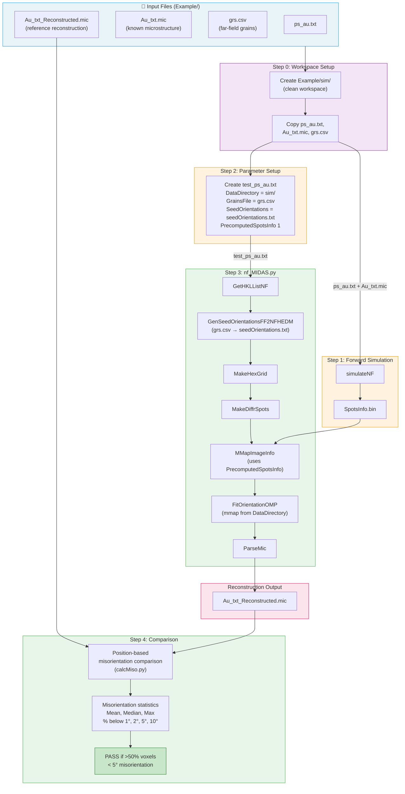

# NF-HEDM Benchmark Test

**MIDAS v9+**

## Overview

The NF-HEDM benchmark (`utils/test_nf_hedm.py`) is an automated end-to-end test that validates the NF-HEDM reconstruction pipeline by:

1. Running a forward simulation (`simulateNF`) to produce synthetic diffraction spot data from a known microstructure
2. Patching the parameter file and configuring seed orientations from a far-field grains file
3. Running `nf_MIDAS.py` reconstruction (skipping image processing, using precomputed spots)
4. Comparing the reconstructed orientations against a reference reconstruction using misorientation analysis

## Pipeline Data Flow



## Prerequisites

- MIDAS must be compiled (all NF_HEDM binaries built)
- The `midas_env` conda environment must be active:
  ```bash
  source /path/to/miniconda3/bin/activate midas_env
  ```
- The reference file `NF_HEDM/Example/Au_txt_Reconstructed.mic` must exist for comparison (the script still runs without it but skips the comparison step)

## Usage

```bash
python utils/test_nf_hedm.py [-nCPUs N] [-paramFN /path/to/ps_au.txt] [-micFN /path/to/Au_txt.mic]
```

### Arguments

| Argument    | Default                              | Description                        |
|-------------|--------------------------------------|------------------------------------|
| `-nCPUs`    | `4`                                  | Number of CPUs for parallel steps  |
| `-paramFN`  | `NF_HEDM/Example/ps_au.txt`         | Path to the parameter file         |
| `-micFN`    | `NF_HEDM/Example/Au_txt.mic`        | Path to the input mic file         |

### Example

```bash
source ~/miniconda3/bin/activate midas_env
python ~/opt/MIDAS/utils/test_nf_hedm.py -nCPUs 8
```

### Via Build Script

```bash
./build.sh --test nf
# or run both benchmarks:
./build.sh --test all
```

## Working Directory

All output is isolated in `NF_HEDM/Example/sim/`. The script automatically deletes and recreates this directory on each run, so cleanup is simply:

```bash
rm -rf NF_HEDM/Example/sim
```

## What It Does

### Step 0: Workspace Setup
Creates `NF_HEDM/Example/sim/` (deletes it if it already exists). Copies the 3 source files (`ps_au.txt`, `Au_txt.mic`, `grs.csv`) into the clean workspace.

### Step 1: Forward Simulation
Runs `simulateNF` with the example parameter file and `Au_txt.mic` to produce synthetic `SpotsInfo.bin` — the binary spot data that would normally come from image processing.

### Step 2: Parameter Setup
Creates `test_ps_au.txt` with:
- `DataDirectory` pointing to the `sim/` workspace
- `GrainsFile` pointing to `grs.csv` for seeded orientation generation
- `SeedOrientations` set to `seedOrientations.txt` (auto-generated by the workflow)
- `PrecomputedSpotsInfo 1` to use the simulated `SpotsInfo.bin` directly

### Step 3: nf_MIDAS.py Reconstruction
Launches `nf_MIDAS.py` with:
- `-ffSeedOrientations 1` — generate seed orientations from the far-field grains file
- `-doImageProcessing 0` — skip image processing (uses precomputed spots)
- `-refineParameters 0` — skip parameter refinement
- `-multiGridPoints 0` — no multi-point optimization

The workflow runs: HKL generation → seed orientation generation → hex grid creation → diffraction spot simulation → memory-mapped file creation → orientation fitting → mic file parsing.

### Step 4: Orientation Comparison
Reads both the reference mic (`Example/Au_txt_Reconstructed.mic`) and the test mic (`Example/sim/Au_txt_Reconstructed.mic`). For each voxel matched by `(X, Y)` position, computes the misorientation angle using `calcMiso.GetMisOrientationAngle` with SpaceGroup 225 (cubic).

Reports:
- **Misorientation statistics**: mean, median, std, min, max (in degrees)
- **Threshold fractions**: percentage of voxels below 1°, 2°, 5°, and 10°
- **Confidence statistics**: mean and median for both reference and test
- **Pass/Fail**: passes if >80% of voxels have <0.25° misorientation

## Expected Output

A successful run produces output similar to:
```
--- Misorientation Statistics (degrees) ---
  Mean:   0.0345
  Median: 0.0078
  Std:    0.1456
  Min:    0.0000
  Max:    5.3456

--- Fraction below threshold ---
  <  0.25°:  92.00%
  <  1.00°:  96.00%
  <  2.00°:  98.00%
  <  5.00°:  99.50%
  < 10.00°: 100.00%

  Benchmark result: PASSED (92.0% of voxels < 0.25° misorientation)
```

## Generated Files

All files are generated in `NF_HEDM/Example/sim/` and can be deleted by removing the directory:

| File/Directory               | Description                                      |
|------------------------------|--------------------------------------------------|
| `ps_au.txt`                  | Copy of the original parameter file               |
| `Au_txt.mic`                 | Copy of the input microstructure                  |
| `grs.csv`                    | Copy of the far-field grains file                 |
| `test_ps_au.txt`             | Modified parameter file with workspace paths      |
| `SpotsInfo.bin`              | Simulated spot data from `simulateNF`             |
| `seedOrientations.txt`       | Auto-generated seed orientations                  |
| `DiffractionSpots.bin`       | Simulated diffraction spots                       |
| `OrientMat.bin`              | Orientation matrix data                           |
| `Key.bin`                    | Key file for orientation lookup                   |
| `grid.txt`                   | Hex grid for reconstruction space                 |
| `Au_txt_Reconstructed.mic`   | Reconstructed microstructure (test output)         |
| `midas_log/`                 | Workflow log files                                |
| `runinfo/`                   | Parsl runtime information                         |

## Key macOS Compatibility Note

The NF-HEDM pipeline previously required `/dev/shm` (Linux shared memory) for memory-mapped file access. This has been removed — `FitOrientationOMP` and `compareNF` now `mmap` directly from `DataDirectory`, which is equally fast due to OS page caching and fully cross-platform.

## Troubleshooting

- **`simulateNF not found`**: Run `cmake --build . --target simulateNF` in the `build/` directory.
- **`GrainsFile not found`**: Ensure `grs.csv` exists in `NF_HEDM/Example/`.
- **`Reference mic not found`**: Run the benchmark once manually to generate the reference, or provide `Au_txt_Reconstructed.mic` in `NF_HEDM/Example/`.
- **Low confidence scores**: This can happen if the simulation parameters don't match well. Check the `midas_log/` directory for `fit*_err.csv` error logs.
- **`parsl` errors**: Ensure the `midas_env` conda environment is active.
