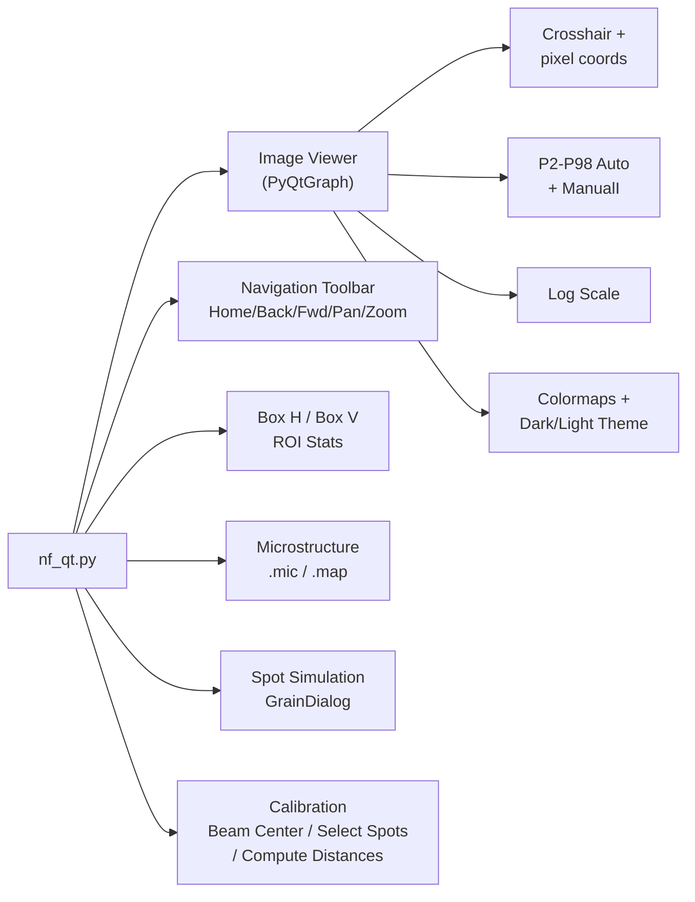

# Near-Field HEDM GUI

**Version:** 11.0  
**Contact:** hsharma@anl.gov

This manual covers the PyQtGraph-based NF viewer (`nf_qt.py`).

**DETAILED INSTRUCTIONS FOR CALIBRATION ARE AT:** [NF_Calibration.md](NF_Calibration.md)

---

## NF Viewer: `nf_qt.py` (PyQtGraph)

### Launching

```bash
cd <data_directory>
python ~/opt/MIDAS/gui/nf_qt.py &
```

### Features



| Feature | Description |
|---|---|
| **Navigation toolbar** | Home, Back/Forward, Pan, Zoom-to-rect below the image. Mouse-wheel zoom disabled |
| **Auto-detection** | Scans current directory for TIFF files, sets folder/stem/frame automatically |
| **Intensity control** | P2–P98 auto-scaling with editable Min I / Max I fields and Apply button (in toolbar) |
| **Log scale** | Checkbox for log₁₀ display |
| **Median subtraction** | Toggle per-frame background subtraction |
| **Max/Sum over frames** | Max/Frames and Sum/Frames checkboxes (mutually exclusive) |
| **Image transforms** | HFlip, VFlip, Transpose checkboxes |
| **Box H / Box V ROI** | Rectangular region with live Sum, Mean, Min, Max statistics. Auto-refreshes on frame/distance change |
| **Box profile edge lines** | Half-maximum edges shown in orange-red with center/width in image pixel coordinates |
| **Microstructure** | Load `.mic`/`.map`, color by Confidence, GrainID, Euler, KAM, GROD, Phase, GrainMap |
| **Select Point** | Click on mic map to auto-populate grain parameters for simulation |
| **Spot simulation** | GrainDialog: enter grain parameters, simulate expected spots |
| **Select Spots** | Interactive workflow to pick diffraction spots at multiple distances. **Right-click** to select spots while maintaining zoom |
| **Compute Distances** | Automatic ray triangulation on Finished — visual dialog with spot crop patches, triangulation ray diagram, per-pair Lsd/grainY output |
| **Calc Median** | Compute median background from all frames per distance. Auto-enables Subt. Median and reloads on completion. Output stored in temp directory |
| **Partial spot data** | Skip distances during Select Spots — only confirmed (≥2) spots are used for triangulation |
| **Beam Center** | Dialog to enter beam center values for each distance |
| **Colormap** | viridis, inferno, plasma, magma, turbo, gray, hot, cool, bone |
| **Theme** | Dark or light |
| **Font size** | Adjustable 8–24pt |
| **Export PNG** | Save current view |
| **Movie mode** | Play/Pause/Stop with configurable FPS |
| **Drag-and-drop** | Drop TIFF files or folders to load |
| **Session save/restore** | Ctrl+S / Ctrl+Shift+S |

### Keyboard Shortcuts

| Shortcut | Action |
|---|---|
| **← / →** | Previous / Next frame |
| **L** | Toggle log scale |
| **Q** | Quit |
| **Ctrl+S** | Save session |
| **Ctrl+Shift+S** | Load session |

### Prerequisites

```
PyQt5
pyqtgraph
numpy
tifffile
```

---

## User Guide

### 1. Loading Data

1.  **Launch the Application:** Run `python ~/opt/MIDAS/gui/nf_qt.py &` from your data directory.
2.  **Auto-Detection:** When launched from a data directory, the GUI automatically sets `Folder`, `File Stem`, and `Start Frame` by scanning for `.tif` files. The image loads automatically.
3.  **Load Initial File (alternative):** Click the **First File** button to open a file dialog and manually select your first `.tif` image.

#### BeamPos / DetZBeamPos Folder Mode

When the GUI is launched from a folder whose name contains **`BeamPos`** or **`DetZBeamPos`**, it activates a special navigation mode:

*   All `.tif` files in the folder are collected and sorted by their numeric suffix.
*   The `Frame` spinner becomes an **index** (0, 1, 2, …) into this sorted list.
*   The spinner steps through files sequentially, regardless of file stem.
*   Median background subtraction is not available in this mode.

### 2. Image Display and Navigation

The left panel shows the detector image.

*   **Toolbar:** Use the navigation buttons (Home, Back/Fwd, Pan, Zoom) above the image.
*   **Intensity Control:**
    *   **Auto-scaling:** Images are auto-scaled to the P2–P98 percentile range.
    *   **MinI / MaxI:** Override intensity range manually, then click **Apply**.
    *   **Log:** Check this box for log₁₀ display.
*   **Frame stepping:** Use the Frame spinner, ← / → keyboard keys, or Ctrl+mouse-wheel.

### 3. Part I: Determining the Beam Center

This procedure finds the `(x, y)` pixel coordinates of the beam center at each detector distance.

1.  **Generate Horizontal Profile:**
    *   Click the **Box H** button.
    *   A rectangular ROI appears on the image. Drag it over a horizontal diffraction line.
    *   The right panel shows an integrated intensity profile summed along the vertical axis.
2.  **Generate Vertical Profile:**
    *   Click the **Box V** button.
    *   Drag the ROI over a vertical feature.
    *   The right panel shows an integrated intensity profile summed along the horizontal axis.
3.  **Find the Center:**
    *   Hover your mouse over the profile plot. The coordinates are shown in the status bar.
    *   Identify the center of the slope/peak for both horizontal and vertical profiles.
    *   Average the left and right edges to get the beam center `(x, y)`.
4.  **Enter Beam Center Values:**
    *   Click the **Beam Center** button.
    *   Enter the `(x, y)` beam center for each distance.
    *   Enter the known distance difference between detectors (μm).
    *   Click **Confirm**.
5.  **Repeat** for other detector distances using the **Distance** spinner.

### 4. Part II: Determining Detector Position

1.  **Enable Background Correction (Recommended):**
    *   Check **Subt. Median**. To compute a new median, click **Calc Median**.
2.  **Select Spots:**
    *   Click the **Select Spots** button. A guide appears. Click **Ready!**
    *   Navigate to a clear diffraction spot using **Frame** spinner and **Dist** spinner.
    *   Use **left-click-drag** to zoom into the area of interest (rectangle zoom stays active).
    *   **Right-click** on the spot center. A **cyan crosshair** appears showing where you clicked.
    *   Click **Confirm Selection** in the status bar.
    *   A dialog asks for the next distance. Enter the number and click **Load**, or click **Finished** if done.
    *   Find the **same** spot on the next distance. Right-click to select and confirm.
    *   You may **skip distances** — at least 2 confirmed spots are needed.
    *   After clicking **Finished**, distances are **auto-computed** and a visual results dialog appears.
3.  **Results Dialog:**
    *   Shows **crop patches** of each confirmed spot (100×100 px window from the image at confirmation time).
    *   Shows a **ray triangulation diagram** with rays from the computed sample position through each spot.
    *   Displays per-distance spot positions (Y, Z, R), per-pair Lsd/grainY values, and mean Lsd.
    *   The mean Lsd is auto-filled in the main window.

### 5. Microstructure Analysis and Simulation

#### 5.1 Loading Reconstruction Results

1.  **Load Mic File:** Click **Load Mic** and select your reconstruction output file.

    | Format | Extension | Rendering | Notes |
    |--------|-----------|-----------|-------|
    | **Binary map** | `.map` | `imshow` (fast) | **Preferred format.** |
    | **Text mic** | `.mic` | `scatter` (slower) | Sparse point-based. |

2.  **Visualize Data:** Use the radio buttons (Conf, GrainID, Eu0/1/2, KAM, GROD, GrMap, Phase) to change coloring.

#### 5.2 Select Point: Auto-Populate Grain Parameters

1.  Click the **Select Point** button.
2.  Click on a grain of interest in the microstructure map.
3.  The grain's orientation and position are auto-populated in a Load Grain dialog. Click **Confirm**.
4.  Click **Make Spots** to simulate diffraction spots for that grain.

#### 5.3 Diffraction Spot Simulation

1.  **Manual Entry:** Click **Load Grain** and enter grain parameters manually.
2.  Click **Make Spots**. A red circle shows the predicted spot position. Frame navigation auto-jumps to the correct rotation angle. A blue star marks the beam center.

---

## 6. Technical Implementation Details

### 6.1. Software Architecture
*   **Framework:** PyQt5 for window management and controls; PyQtGraph for high-performance image rendering.
*   **Image rendering:** Uses `ImageItem` with `set_data()` for efficient frame-by-frame updates.
*   **Shared components:** Uses `gui_common.py` for `MIDASImageView`, `LogPanel`, `AsyncWorker`, colormap utilities, and theme management shared with the FF viewer.

### 6.2. Simulation Backend
The **Make Spots** simulation uses C binaries:
*   `GetHKLList` — Generates reciprocal lattice vectors.
*   `GenSeedOrientationsFF2NFHEDM` — Transforms orientation matrix.
*   `SimulateDiffractionSpots` — Computes expected spot positions.

### 6.3. Distance Calibration Algorithm
The `ComputeDistances` function uses **ray triangulation** based on the intercept theorem. For each pair of detector positions (i, j), the Lsd is computed as:

$$LSD_0 = \frac{R_i \cdot (j-i) \cdot \Delta d}{R_j - R_i} - (i \cdot \Delta d)$$

The final distance is the arithmetic mean across all pairs.

---

## 7. Legacy Viewer

The legacy Tkinter-based viewer (`nf.py`) has been archived to `gui/archive/nf.py`. All functionality is available in the current Qt-based viewer. The legacy viewer is preserved for reference only.

---

## 8. See Also

- [NF_Analysis.md](NF_Analysis.md) — Single-resolution NF-HEDM reconstruction
- [NF_MultiResolution_Analysis.md](NF_MultiResolution_Analysis.md) — Multi-resolution iterative NF-HEDM reconstruction
- [NF_Calibration.md](NF_Calibration.md) — Detailed step-by-step calibration procedure
- [GUIs_and_Visualization.md](GUIs_and_Visualization.md) — Master guide to all GUIs and visualization tools
- [README.md](README.md) — High-level MIDAS overview and manual index

---

If you encounter any issues or have questions, please open an issue on this repository.