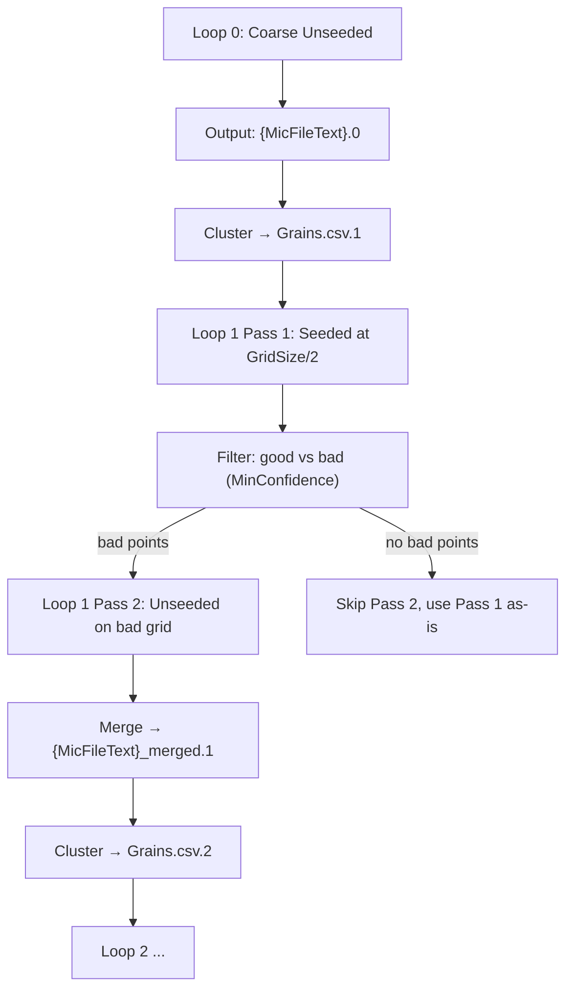

# NF-HEDM Multi-Resolution Analysis Manual

**Script:** `nf_MIDAS_Multiple_Resolutions.py`
**Version:** 7.0 — Contact: hsharma@anl.gov

---

## 1. Introduction

`nf_MIDAS_Multiple_Resolutions.py` is the primary driver for Near-Field High-Energy Diffraction Microscopy (NF-HEDM) microstructure reconstruction using the MIDAS software suite. It supports two modes:

1. **Single-Resolution Mode** — Standard NF-HEDM reconstruction at a fixed grid size.
2. **Multi-Resolution Mode** — Iterative coarse-to-fine reconstruction that progressively refines the microstructure map by halving (or scaling) the grid size across multiple loops, using the results of each loop to seed the next.

Multi-resolution mode is activated by the presence of the `GridRefactor` key in the parameter file.

### Key Capabilities

- End-to-end workflow: image processing → simulation → fitting → mic output
- Parallel execution via Parsl (cluster) or multiprocessing (local)
- Shared-memory I/O (`/dev/shm`) for high-throughput fitting
- Automatic retry with exponential backoff for Parsl tasks
- Far-field seeding from `Grains.csv`
- Multi-resolution iterative refinement with automatic seed generation
- Robust cleanup of shared memory and Parsl resources on exit

---

## 2. Prerequisites

| Requirement | Details |
|---|---|
| **MIDAS Installation** | Script auto-detects install dir from its own location |
| **Python Packages** | `parsl`, `numpy`, `tqdm` |
| **Shared Memory** | `/dev/shm` must be writable and large enough for `SpotsInfo.bin`, `DiffractionSpots.bin`, `Key.bin`, `OrientMat.bin` |
| **Input Data** | Raw TIFF diffraction images in `DataDirectory` |
| **Parameter File** | Text file defining the experiment (see [Section 4](#4-parameter-file-reference)) |
| **Seed Orientations** | A `SeedOrientations` file listing candidate crystal orientations |
| **Far-Field Results** *(optional)* | `Grains.csv` from FF-HEDM if using `-ffSeedOrientations 1` |

---

## 3. Command-Line Arguments

```bash
python nf_MIDAS_Multiple_Resolutions.py \
    -paramFN <param_file> \
    [-nCPUs <int>] [-machineName <str>] [-nNodes <int>] \
    [-ffSeedOrientations <0|1>] [-doImageProcessing <0|1>]
```

| Argument | Type | Default | Description |
|---|---|---|---|
| `-paramFN` | string | **(required)** | Path to the parameter file |
| `-nCPUs` | int | `10` | CPU cores per node for OpenMP tasks |
| `-machineName` | string | `local` | Execution target: `local`, `orthrosnew`, `orthrosall`, `umich`, `marquette`, `purdue` |
| `-nNodes` | int | `1` | Number of compute nodes (Parsl workers) |
| `-ffSeedOrientations` | int | `0` | `1` = generate seeds from FF `Grains.csv`; `0` = use existing `SeedOrientations` file |
| `-doImageProcessing` | int | `1` | `1` = run median and image processing; `0` = skip (reuse existing processed images) |

---

## 4. Parameter File Reference

The parameter file is a whitespace-delimited text file. Lines starting with `#` are comments. Each line has the format `Key Value [Value ...]`.

### Core Parameters (Required)

| Key | Values | Description |
|---|---|---|
| `DataDirectory` | path | Working directory for all outputs |
| `ReducedFileName` | string | Base name pattern for input TIFF files |
| `StartNr` | int | First frame number |
| `EndNr` | int | Last frame number |
| `nDistances` | int | Number of detector distances (layers) |
| `Lsd` | float | Sample-to-detector distance (μm). Repeated `nDistances` times on separate lines |
| `BC` | float float | Beam center (y, z) in pixels. Repeated `nDistances` times |
| `px` | float | Pixel size (μm) |
| `Wavelength` | float | X-ray wavelength (Å) |
| `SpaceGroup` | int | Space group number (e.g., 225 for FCC) |
| `LatticeParameter` | 6 floats | a b c α β γ (Å and degrees) |
| `OmegaStart` | float | Starting rotation angle (degrees) |
| `OmegaStep` | float | Rotation step size (degrees) |
| `OmegaRange` | float float | Omega range [start, end]. Can appear multiple times |
| `BoxSize` | 4 floats | Bounding box per omega range. Must match number of `OmegaRange` lines |
| `ExcludePoleAngle` | float | Exclude reflections within this angle of the pole (degrees) |
| `GridSize` | float | Reconstruction voxel size (μm). Overwritten during multi-resolution |
| `MaxRingRad` | float | Maximum ring radius on detector (pixels) |
| `OrientTol` | float | Orientation tolerance for fitting (degrees) |
| `MinFracAccept` | float | Minimum fractional overlap to accept a solution |
| `MicFileBinary` | string | Binary mic output filename |
| `MicFileText` | string | Text mic output basename (suffixed `.0`, `.1`, etc. in multi-res mode) |
| `SeedOrientations` | path | File of candidate orientations |
| `tx`, `ty`, `tz` | float | Detector tilt angles |

### Multi-Resolution Parameters

| Key | Values | Description |
|---|---|---|
| `GridRefactor` | 3 values | `StartingGridSize ScalingFactor NumLoops` (e.g., `5.0 2.0 3`). Presence of this key activates multi-resolution mode |
| `SeedOrientationsAll` | path | Full seed orientations file. **Must be distinct from `SeedOrientations`**. Backed up internally as `{path}_Backup` |
| `MinConfidence` | float | Confidence threshold for separating good/bad points between passes (default: `0.5`) |
| `MaxAngle` | float | Misorientation angle (degrees) used by `Mic2GrainsList` to cluster orientations into unique grains (default: `1.0`) |

### Optional Parameters

| Key | Values | Description |
|---|---|---|
| `RingsToUse` | int | Restrict to specific ring number. Can appear multiple times |
| `SaveNSolutions` | int | Number of top solutions to save per grid point (default: `1`) |
| `Wedge` | float | Wedge angle (degrees, default: `0`) |
| `Ice9Input` | *(no value)* | Flag to enable Ice9 mode |
| `NearestMisorientation` | int | Enable nearest-neighbor misorientation filtering |
| `TomoImage` | path | Tomography image for grid masking |
| `TomoPixelSize` | float | Pixel size of the tomography image |
| `GridMask` | 4 floats | `Xmin Xmax Ymin Ymax` — rectangular mask applied to the hex grid |
| `GrainsFile` | path | Path to `Grains.csv` for FF seeding |
| `GridFileName` | string | Custom grid filename (default: `grid.txt`) |
| `GridPoints` | 12 floats | Custom grid point specification |

---

## 5. Workflow Architecture

### 5.1 Single-Resolution Mode

When `GridRefactor` is **absent** from the parameter file, the script runs a single pass:


**Preprocessing:**
1. `GetHKLListNF` — compute theoretical Bragg reflections → `hkls.csv`
2. `GenSeedOrientationsFF2NFHEDM` — *(if `-ffSeedOrientations 1`)* convert FF orientations to seeds
3. `MakeHexGrid` — create hexagonal reconstruction grid → `grid.txt`
4. Grid filtering — *(optional)* apply `TomoImage` or `GridMask`
5. `MakeDiffrSpots` — simulate diffraction spots for all seed orientations → `DiffractionSpots.bin`, `Key.txt`, `OrientMat.bin`

**Image Processing** *(skipped if `-doImageProcessing 0`)*:
1. `MedianImageLibTiff` — per-distance median background image
2. `ImageProcessingLibTiffOMP` — background subtraction on raw TIFFs → `SpotsInfo.bin`

**Fitting & Postprocessing:**
1. `MMapImageInfo` — prepare memory-mapped data
2. Copy `.bin` files to `/dev/shm`
3. `FitOrientationOMP` — parallel orientation fitting across all grid points
4. `ParseMic` — consolidate results → `{MicFileText}`

### 5.2 Multi-Resolution Mode

When `GridRefactor` is **present**, the workflow runs iteratively:



#### Loop 0 — Initial Coarse Pass

1. Sets `GridSize` to `StartingGridSize` from `GridRefactor`
2. Runs full preprocessing + image processing + fitting (unseeded)
3. Produces `{MicFileText}.0`
4. Backs up `SeedOrientationsAll` → `{SeedOrientationsAll}_Backup`

#### Loop N (N ≥ 1) — Refinement

Each refinement loop has two passes:

**Pass 1 — Seeded Run:**
1. Computes `GridSize = StartingGridSize / (ScalingFactor ^ N)`
2. Runs `Mic2GrainsList` to cluster the previous loop's mic file into unique grains → `Grains.csv.N`
3. Generates seed orientations from the grain list → `{SeedOrientations}.N`
4. Creates a new full hex grid at the refined size
5. Runs fitting with the clustered seeds
6. Output: `{MicFileText}.N`

**Filtering:**
- Reads Pass 1 output and separates points into:
  - **Good:** `confidence ≥ MinConfidence` — kept directly
  - **Bad:** `confidence < MinConfidence` — fed back into the grid for Pass 2
- If no bad points exist, Pass 2 is skipped entirely

**Pass 2 — Unseeded Run (bad regions only):**
1. Writes a reduced `grid.txt` containing only the bad points  
2. Uses the full `SeedOrientationsAll_Backup` (not clustered seeds)
3. Skips `MakeHexGrid` (reuses the filtered grid)
4. Runs fitting unseeded on just the bad points
5. Output: `{MicFileText}_all_solutions.N`

**Merge:**
- Combines good lines from Pass 1 + all lines from Pass 2
- Sorts by Y then X
- Output: `{MicFileText}_merged.N`

> [!IMPORTANT]
> Image processing runs **only once** (during Loop 0 or the first pass if `-doImageProcessing 1`). All subsequent loops reuse the processed images.

---

## 6. Output File Map

Given parameter file settings:
- `MicFileText MyMic`
- `SeedOrientations seeds.txt`
- `SeedOrientationsAll seeds_all.txt`
- `GridRefactor 5.0 2.0 2`

### Mic Files

| File | Source | Description |
|---|---|---|
| `MyMic.0` | Loop 0 | Coarse reconstruction (unseeded, `GridSize=5.0`) |
| `MyMic.1` | Loop 1 Pass 1 | Refined reconstruction (seeded, `GridSize=2.5`) |
| `MyMic_all_solutions.1` | Loop 1 Pass 2 | Unseeded re-fit of Pass 1's low-confidence points |
| `MyMic_merged.1` | Loop 1 Merge | Good from Pass 1 + all of Pass 2 |
| `MyMic.2` | Loop 2 Pass 1 | Further refined (seeded, `GridSize=1.25`) |
| `MyMic_all_solutions.2` | Loop 2 Pass 2 | Unseeded re-fit of Pass 2's low-confidence points |
| `MyMic_merged.2` | Loop 2 Merge | **Final merged reconstruction** |

### Mic File Format

Each line in a mic text file (columns space-delimited):

| Column | Index | Description |
|---|---|---|
| OrientationRowNr | 0 | Row number from the orientation matrix file |
| ID | 1 | Orientation ID |
| Time | 2 | (unused, typically 0) |
| X | 3 | X position (μm) |
| Y | 4 | Y position (μm) |
| Size | 5 | Grid cell size (μm) |
| UD | 6 | Up/Down triangle indicator (+1 or -1) |
| Euler1 | 7 | Euler angle φ₁ (radians) |
| Euler2 | 8 | Euler angle Φ (radians) |
| Euler3 | 9 | Euler angle φ₂ (radians) |
| Confidence | 10 | Fractional overlap (0–1), higher = better fit |

Lines starting with `%` are header/comment lines.

### Supporting Files

| File | Description |
|---|---|
| `grid.txt` | Hex grid of reconstruction points (overwritten each pass). Header line = point count |
| `grid_unfilt.txt` / `grid_old.txt` | Pre-filtering backups of the original grid |
| `hkls.csv` | Theoretical HKL reflections and Bragg angles |
| `Grains.csv.N` | Clustered grain list from loop N-1 (used for seeding loop N) |
| `seeds.txt.N` | Seed orientations generated for loop N Pass 1 |
| `seeds_all.txt_Backup` | Backup of full seed orientations (used for Pass 2 unseeded runs) |
| `DiffractionSpots.bin` | Simulated diffraction spots (binary, regenerated each preprocessing call) |
| `SpotsInfo.bin` | Processed experimental spot data (binary) |
| `Key.bin` / `Key.txt` | Index mapping orientations to their spot counts |
| `OrientMat.bin` / `OrientMat.txt` | Orientation matrices for all seed orientations |

### Log Files

All logs are in `{DataDirectory}/midas_log/`:

| File Pattern | Stage |
|---|---|
| `hkls_out/err.csv` | HKL generation |
| `seed_out/err.csv` | Seed orientation generation |
| `hex_out/err.csv` | Hex grid creation |
| `spots_out/err.csv` | Spot simulation |
| `median{N}_out/err.csv` | Median image for distance N |
| `image{N}_out/err.csv` | Image processing for block N |
| `map_out/err.csv` | Memory mapping |
| `fit{N}_out/err.csv` | Orientation fitting for block N |
| `parse_out/err.csv` | Mic file parsing |
| `mic2grains_{N}_out/err.csv` | Grain clustering for loop N |
| `midas_nf_workflow_multires.log` | Master workflow log (appended) |

---

## 7. Execution Examples

### Example 1: Single-Resolution Local Run

```bash
python nf_MIDAS_Multiple_Resolutions.py \
    -paramFN params.txt \
    -machineName local \
    -nCPUs 8 \
    -ffSeedOrientations 1
```

### Example 2: Multi-Resolution on a Cluster

With `GridRefactor 5.0 2.0 3` in the parameter file:

```bash
python nf_MIDAS_Multiple_Resolutions.py \
    -paramFN params.txt \
    -machineName purdue \
    -nNodes 4 \
    -nCPUs 128 \
    -ffSeedOrientations 1
```

This will run:
- Loop 0 at `GridSize=5.0` (unseeded)
- Loop 1 at `GridSize=2.5` (seeded from Loop 0 clusters)
- Loop 2 at `GridSize=1.25` (seeded from Loop 1 merged clusters)
- Loop 3 at `GridSize=0.625` (seeded from Loop 2 merged clusters)

### Example 3: Resuming After Image Processing

If image processing completed but fitting failed:

```bash
python nf_MIDAS_Multiple_Resolutions.py \
    -paramFN params.txt \
    -machineName local \
    -nCPUs 8 \
    -doImageProcessing 0
```

---

## 8. The `Mic2GrainsList` Clustering Step

Between multi-resolution loops, `Mic2GrainsList` extracts unique grain orientations from the previous mic file. This is critical for generating focused seed orientations for the next loop.

**Algorithm:**
1. Reads all points from the mic file with `confidence ≥ MinFracAccept` (or `MinConfidence`)
2. Sorts by confidence (highest first)
3. Iterates through sorted list; for each unused grain:
   - Marks it as a unique grain
   - Computes misorientation to all remaining grains
   - Marks any grain within `MaxAngle` degrees as a duplicate (merged)
4. Writes unique grains in `Grains.csv` format (orientation matrix + lattice parameters)

**Key parameters read from the param file:**
- `SpaceGroup` — determines symmetry for misorientation calculation
- `MaxAngle` — clustering threshold (default: 1.0°)
- `MinFracAccept` or `MinConfidence` — minimum confidence to include a point
- `LatticeParameter` — written into the output grain file

---

## 9. Troubleshooting

### Shared Memory Errors

| Error | Cause | Fix |
|---|---|---|
| *Permission Denied on `/dev/shm`* | Insufficient permissions | Check node permissions |
| *No space left on device* | `.bin` files too large | Reduce orientation count or check `/dev/shm` size |
| *User Conflict detected* | Another user's `.bin` files present | Wait for their job or ask admin to clear |

### Fitting Issues

| Symptom | Likely Cause | Fix |
|---|---|---|
| All confidences near 0 | Wrong geometry parameters | Check `Lsd`, `BC`, `tx/ty/tz`, `px` |
| Fitting hangs | Missing nlopt stopping criteria | Ensure your `FitOrientationOMP` binary has `nlopt_set_maxeval` and `nlopt_set_ftol_rel` |
| Very few good points in Pass 1 | Seeds too sparse | Increase `MaxAngle` to get more unique seed grains, or check `SeedOrientations` file |

### Multi-Resolution Issues

| Symptom | Likely Cause | Fix |
|---|---|---|
| `SeedOrientationsAll not found` | Missing parameter | Add `SeedOrientationsAll` to parameter file (distinct from `SeedOrientations`) |
| Pass 2 never runs | All points above `MinConfidence` | This is normal — it means Pass 1 was sufficient |
| Merged file has duplicate points | Bad point lookup failure | Check for spatial precision issues in grid coordinates |
| `GridSize` wrong after interrupted run | `GridRefactor` overwrites it | The script resets `GridSize` to `StartingGridSize` at the start of Loop 0 |

### Debugging Workflow

1. Check `midas_log/midas_nf_workflow_multires.log` for the master log
2. Check individual `*_err.csv` files for binary-level error output
3. For fitting issues specifically, examine `fit{N}_out.csv` — each line corresponds to a completed grid point
4. Verify `grid.txt` has the expected number of points before each fitting step

---

## 10. Technical Implementation Details

### 10.1. Iterative Grid Refinement
*   **Coordinate Scaling:** The multi-resolution logic is purely grid-based. The script calculates a new hexagonal grid for each loop $N$, where the grid spacing $d_N = d_{start} / (ScaleFactor^N)$.
*   **Seed Propagation:** The critical link between loops is the `Mic2GrainsList` binary. It condenses the dense, noisy voxel map from Loop $N$ into a sparse set of high-confidence "grain" orientations. These orientations become the discrete search space for Loop $N+1$, allowing the fit to converge rapidly even on a finer grid.

### 10.2. Clustering Algorithm (`Mic2GrainsList`)
*   **Greedy Optimization:** The clustering algorithm effectively performs a greedy segmentation:
    1.  **Filter:** Discard all points with `confidence < MinConfidence`.
    2.  **Sort:** Rank all remaining points by confidence (descending).
    3.  **Cluster:** Pick the highest-confidence unused point as a new Grain Center.
    4.  **Consolidate:** Iterate through *all* other unused points. If a point's misorientation with the Grain Center is `< MaxAngle`, mark it as part of that grain (i.e., "used").
    5.  **Repeat:** Select the next highest-confidence unused point and repeat until all points are assigned.
*   **Symmetry Awareness:** The misorientation calculation (`GetMisOrientation`) fully accounts for crystal symmetry (e.g., cubic, hexagonal) as defined by the `SpaceGroup` parameter.

### 10.3. Hybrid Seeding Strategy
*   **Targeted + Global Search:** The "two-pass" structure of each loop combines the efficiency of targeted seeding with the safety of a global search:
    *   **Pass 1 (Seeded):** Explicitly tests *only* the orientations found in the previous loop. This is extremely fast (checking ~100s of orientations instead of millions) and handles 95%+ of the volume.
    *   **Pass 2 (Unseeded fallback):** Automatically detects regions where the seeded fit failed (`confidence < threshold`). For these specific "bad" voxels, it falls back to a global search using the full `SeedOrientationsAll` list (potentially millions of orientations). This ensures that new grains (perhaps too small to be seen in the coarse loop) are recovered rather than being lost.

---

## 11. Appendix: Binary Executables

| Binary | Purpose | Key Arguments |
|---|---|---|
| `GetHKLListNF` | Generate HKL list | `<paramFN>` |
| `GenSeedOrientationsFF2NFHEDM` | Convert FF grains to NF seeds | `<GrainsFile> <SeedOrientations>` |
| `MakeHexGrid` | Create hexagonal reconstruction grid | `<paramFN>` |
| `filterGridfromTomo` | Filter grid using tomography image | `<TomoImage> <TomoPixelSize>` |
| `MakeDiffrSpots` | Simulate diffraction spots for all seeds | `<paramFN>` |
| `MedianImageLibTiff` | Compute median background image | `<paramFN> <distanceNr>` |
| `ImageProcessingLibTiffOMP` | Process raw images (background subtraction) | `<paramFN> <nodeNr> <nNodes> <nCPUs>` |
| `MMapImageInfo` | Prepare memory-mapped binary data | `<paramFN>` |
| `FitOrientationOMP` | Fit crystal orientations at each grid point | `<paramFN> <blockNr> <nBlocks> <nCPUs>` |
| `ParseMic` | Consolidate fitting results into mic file | `<paramFN>` |
| `Mic2GrainsList` | Cluster mic orientations into unique grains | `<paramFN> <MicFile> <OutputFile>` |
