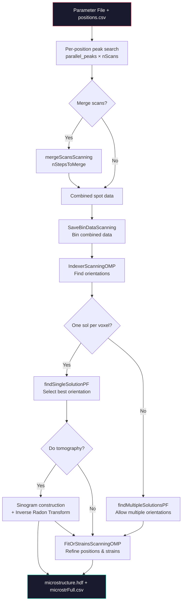

# pf_MIDAS.py User Manual

**Version:** 7.0  
**Contact:** hsharma@anl.gov

> [!NOTE]
> For **standard (box-beam)** FF-HEDM analysis, see [FF_Analysis.md](FF_Analysis.md).  
> PF-HEDM (Point-Focus / Pencil-beam / Scanning FF-HEDM) processes data from **multiple sample positions** to reconstruct a spatially-resolved microstructure map.

---

## 1. Introduction

`pf_MIDAS.py` is the driver script for **Point-Focus (Scanning) FF-HEDM** analysis within MIDAS. Unlike standard box-beam FF-HEDM, scanning FF-HEDM translates the sample across a focused beam, collecting diffraction data at each position. This allows voxel-level orientation mapping similar to EBSD but using high-energy X-rays for non-destructive 3D characterization.

The script:
1. Runs peak search on each scan position in parallel.
2. Combines spot data across all positions.
3. Performs scanning-mode indexing and refinement.
4. Optionally reconstructs tomographic sinograms (inverse Radon transform) for each grain.
5. Produces a `microstrFull.csv` and `microstructure.hdf` with the spatially-resolved microstructure.

---

## 2. Prerequisites

-   A working MIDAS installation.
-   Raw diffraction data (GE, HDF5, or pre-built Zarr-ZIP).
-   A calibrant-derived parameter file (see [FF_autocalibrate.md](FF_autocalibrate.md)).
-   A `positions.csv` file listing Y-positions (one per line, negative w.r.t. motor position).
-   Parameter file and `positions.csv` must be in the **same directory**.
-   Python environment with: `parsl`, `numpy`, `pandas`, `scikit-image`, `Pillow`, `h5py`, `zarr`, `numba`.

---

## 3. Command-Line Arguments

```
python pf_MIDAS.py -paramFile <param.txt> [options]
```

| Argument | Type | Default | Description |
|---|---|---|---|
| `-paramFile` | `str` | **Required** | Parameter file name (basename only, not full path). |
| `-resultDir` | `str` | `''` (cwd) | Output directory for results. |
| `-nCPUs` | `int` | `32` | Number of CPUs per node for peak search and indexing. |
| `-nCPUsLocal` | `int` | `4` | Number of local CPUs for non-parallelized tasks. |
| `-nNodes` | `int` | `1` | Number of compute nodes. |
| `-machineName` | `str` | `local` | Execution target: `local`, `orthrosnew`, `orthrosall`, `umich`, `marquette`. |
| `-doPeakSearch` | `int` | `1` | `1` = run peak search; `0` = skip (already done); `-1` = re-process peak output without re-running search. |
| `-convertFiles` | `int` | `1` | `1` = convert raw to Zarr-ZIP; `0` = use existing. |
| `-runIndexing` | `int` | `1` | `1` = run indexing; `0` = skip indexing. |
| `-oneSolPerVox` | `int` | `1` | `1` = single orientation per voxel; `0` = allow multiple orientations per voxel. |
| `-doTomo` | `int` | `1` | `1` = reconstruct tomographic sinograms; `0` = skip. Only for `-oneSolPerVox 1`. |
| `-normalizeIntensities` | `int` | `2` | `0` = equivalent grain size; `1` = normalize by powder intensity; `2` = integrated intensity. |
| `-numFrameChunks` | `int` | `-1` | Chunk data for low-RAM systems. `-1` disables. |
| `-preProcThresh` | `int` | `-1` | Pre-processing threshold above dark. `-1` disables. |
| `-startScanNr` | `int` | `1` | First scan number to process (for partial peak search). |
| `-minThresh` | `int` | `-1` | Filter peaks with maxIntensity below this value. `-1` disables. |
| `--micFN` | `str` | `''` | Path to a `.mic` file for guided indexing. |
| `--grainsFN` | `str` | `''` | Path to a grains file for seed-based indexing. |
| `-omegaFile` | `str` | `''` | Override omega values (one per scan, text file). |

### Example

```bash
# Full analysis with tomographic reconstruction:
python pf_MIDAS.py -paramFile ps_pf.txt -resultDir ~/results/ -nCPUs 16 -doTomo 1

# Skip peak search (already done):
python pf_MIDAS.py -paramFile ps_pf.txt -doPeakSearch 0 -nCPUs 32

# Multiple orientations per voxel (no tomography):
python pf_MIDAS.py -paramFile ps_pf.txt -oneSolPerVox 0 -doTomo 0
```

---

## 4. Parameter File Reference

The parameter file uses the same format as [FF_Analysis.md](FF_Analysis.md). The following **additional** keys are specific to PF-HEDM:

| Key | Type | Description |
|---|---|---|
| `nScans` | `int` | Number of scan positions (must match lines in `positions.csv`) |
| `BeamSize` | `float` | Beam size (μm). Multiplied by `nStepsToMerge` if merging is used. |
| `nStepsToMerge` | `int` | Number of adjacent scans to merge (0 = no merging) |
| `MaxAng` | `float` | Maximum misorientation angle for grain matching (degrees) |
| `TolOme` | `float` | Omega tolerance for spot matching (degrees) |
| `TolEta` | `float` | Eta tolerance for spot matching (degrees) |
| `OverAllRingToIndex` | `int` | Primary ring for indexing |
| `MicFile` | `str` | Path to `.mic` file for guided indexing (optional) |
| `GrainsFile` | `str` | Path to seed grains file (optional) |
| `MinMatchesToAcceptFrac` | `float` | Minimum completeness fraction to accept a solution (multi-solution mode) |

All core FF-HEDM parameters (`Lsd`, `Wavelength`, `BC`, tilts, `LatticeParameter`, `SpaceGroup`, etc.) apply identically — see [FF_Analysis.md § 4](FF_Analysis.md).

---

## 5. Input Files

### positions.csv

One Y-position per line (μm), **negative** with respect to the motor position. The number of lines must equal `nScans`.

```
-50.0
-40.0
-30.0
...
```

### Parameter File

Must be in the **same directory** as `positions.csv`. The parameter file name passed via `-paramFile` should be the **basename only** (not a full path).

---

## 6. Workflow Architecture



### Stage Descriptions

| Stage | Binary / Function | Description |
|---|---|---|
| **Peak Search** | `parallel_peaks()` (Parsl) | Runs per-position pipeline: ZIP generation, HKL list, peak search, merge, radius, fit setup |
| **Scan Merging** | `mergeScansScanning` | Merges adjacent scan positions to increase signal (optional) |
| **Binning** | `SaveBinDataScanning` | Bins spots from all scan positions for efficient search |
| **Indexing** | `IndexerScanningOMP` | Scanning-mode indexing with position awareness |
| **Single Solution** | `findSingleSolutionPF` | Selects best unique orientation per voxel |
| **Multi Solution** | `findMultipleSolutionsPF` | Allows overlapping grains in a single voxel |
| **Tomography** | `iradon` (scikit-image) | Reconstructs tomographic images per grain from sinograms |
| **Refinement** | `FitOrStrainsScanningOMP` | Refines orientations, positions, and strains |

---

## 7. Output Files

### Directory Structure

```
<resultDir>/
├── positions.csv                  # Input positions
├── paramstest.txt                 # Auto-generated parameter file
├── hkls.csv                       # HKL reflections
├── <startNr>/                     # Per-scan-position subdirectories
│   ├── paramstest.txt
│   ├── <filestem>_NNNNNN.MIDAS.zip
│   └── output/
├── InputAllExtraInfoFittingAll0.csv  # Combined spots (scan 0)
├── InputAllExtraInfoFittingAll1.csv  # Combined spots (scan 1)
├── ...
├── SpotsToIndex.csv               # Spots selected for indexing
├── UniqueOrientations.csv         # Unique grain orientations
├── Output/
│   ├── UniqueIndexSingleKey.bin   # Single-solution voxel map
│   └── IndexBest_voxNr_*.bin      # Best index per voxel
├── Results/
│   └── *.csv                      # Per-voxel refinement results
├── Sinos/                         # Tomographic sinograms (if -doTomo 1)
│   └── sino_grNr_*.tif
├── Thetas/                        # Per-grain theta arrays
│   └── thetas_grNr_*.txt
├── Recons/                        # Reconstructed images
│   ├── recon_grNr_*.tif           # Per-grain reconstruction
│   ├── Full_recon_max_project.tif
│   ├── Full_recon_max_project_grID.tif
│   ├── all_recons_together.tif
│   ├── microstrFull.csv           # ★ Final microstructure CSV
│   └── microstructure.hdf         # ★ Final HDF5 output
├── output/
│   ├── mapping_out.csv / mapping_err.csv
│   ├── indexing_out*.csv / indexing_err*.csv
│   └── refining_out*.csv / refining_err*.csv
└── processing.log
```

### microstrFull.csv Column Format (43 columns)

The output CSV contains one row per indexed voxel with the following columns:

| Columns | Name | Description |
|---|---|---|
| 1 | `SpotID` | Spot/Voxel identifier |
| 2–10 | `O11`–`O33` | Orientation matrix (3×3, row-major) |
| 11 | `SpotID` | (repeated) |
| 12–14 | `x`, `y`, `z` | Position (μm) |
| 15 | `SpotID` | (repeated) |
| 16–21 | `a`, `b`, `c`, `alpha`, `beta`, `gamma` | Fitted lattice parameters |
| 22 | `SpotID` | (repeated) |
| 23 | `PosErr` | Position error |
| 24 | `OmeErr` | Omega error |
| 25 | `InternalAngle` | Internal angle metric |
| 26 | `Radius` | Equivalent grain radius |
| 27 | `Completeness` | Fraction of expected spots matched |
| 28–36 | `E11`–`E33` | Strain tensor (6 unique components) |
| 37–39 | `Eul1`, `Eul2`, `Eul3` | Euler angles (Bunge convention, degrees) |
| 40–43 | `Quat1`–`Quat4` | Quaternion (fundamental region) |

### microstructure.hdf

HDF5 file with two datasets:
-   **`microstr`**: Full results array (same as `microstrFull.csv`)  
-   **`images`**: 3D array `(23, nScans, nScans)` with spatially-resolved data suitable for imaging — includes ID, quaternion, position, lattice parameters, strain, completeness.

---

## 8. Technical Implementation Details

### 8.1. Spatially-Aware Indexing (`IndexerScanningOMP`)
Unlike standard box-beam indexing, the scanning indexer accounts for the sample's translation across the beam.
*   **Dynamic Geometry:** For every candidate voxel at position $(x, y)$, the diffraction spot projection is recalculated. The expected detector $Y$ position ($Y_{det}$) is modified by the sample translation projected onto the detector plane:
    $$ Y_{det} = Y_{theor} + (x \cdot \sin \omega + y \cdot \cos \omega) / px\_size $$
*   **Voxel Grid:** The software discretizes the sample space into a grid defined by the `BeamSize`. It systematically tests orientations at each grid point, effectively performing a "diffraction-based raster scan."

### 8.2. Tomographic Reconstruction
When `-doTomo 1` is enabled:
1.  **Sinogram Generation:** For each identified grain, the script aggregates the "completeness" or intensity metric across all scan positions and rotation angles ($\omega$). This forms a sinogram where the vertical axis is the scan position and the horizontal axis is the projection angle.
2.  **Inverse Radon Transform:** The `iradon` function from `scikit-image` is used to invert these sinograms, reconstructing the 2D cross-sectional shape of the grain. This allows for sub-beam spatial resolution of the microstructure.

---

## 9. Troubleshooting

| Issue | Likely Cause | Resolution |
|---|---|---|
| `positions.csv` not found | Wrong directory or missing file | Ensure `-paramFile` and `positions.csv` are in the same folder |
| `Failed at generateZip for layer N` | Raw data not found | Check `RawFolder`, `FileStem`, `StartFileNrFirstLayer` |
| Empty `InputAllExtraInfoFittingAll*.csv` | No peaks found | Lower `RingThresh`, check detector geometry |
| No sino files found | `findSingleSolutionPF` found no orientations | Lower `MinNrSpots`, check `MaxAng` |
| Out of memory | Large number of scans × rings | Use `-numFrameChunks` and fewer `-nCPUs` |
| `Error reading sino data` | Mismatched `nScans` vs. `positions.csv` | Verify `nScans` matches number of positions |

---

## 10. See Also

- [FF_Analysis.md](FF_Analysis.md) — Standard (box-beam) FF-HEDM analysis
- [FF_autocalibrate.md](FF_autocalibrate.md) — Geometry calibration
- [FF_Interactive_Plotting.md](FF_Interactive_Plotting.md) — Visualizing FF-HEDM results
- [ForwardSimulationManual.md](ForwardSimulationManual.md) — Forward simulation for validation

---

If you encounter any issues or have questions, please open an issue on this repository.