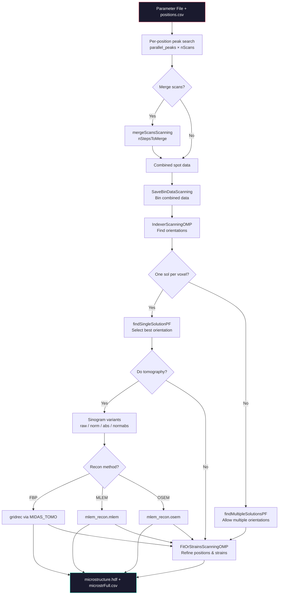

# PF-HEDM User Manual

**Version:** 12.0
**Contact:** hsharma@anl.gov

> [!NOTE]
> For **standard (box-beam)** FF-HEDM analysis, see [FF_Analysis.md](FF_Analysis.md).
> PF-HEDM (Point-Focus / Pencil-beam / Scanning FF-HEDM) processes data from **multiple sample positions** to reconstruct a spatially-resolved microstructure map.

> [!TIP]
> Two drivers exist as of `midas-pipeline 0.1.0a0`:
>
> 1. **`midas-pipeline run --scan-mode pf`** — the new unified Python orchestrator. FF and PF share one stage graph; `--scan-mode pf` enables the scanning-only stages (`merge_scans`, `seeding`, `find_grains`, `sinogen`, `reconstruct`, `fuse`, `potts`, `em_refine`) and routes everything else through the same kernels as the FF path. See [§12](#12-new-driver-midas-pipeline). **Recommended for new analyses.**
> 2. **`pf_MIDAS.py`** — the legacy driver documented below. Calls the C scanning binaries directly. Kept as the reference implementation; not deleted. Use this for parity comparisons or when you specifically need the legacy code paths.
>
> Both drivers consume the same parameter file and the same `positions.csv`. Outputs (`microstrFull.csv`, `microstructure.hdf`, per-grain TIFs, sinogram binaries) follow the same layouts.

---

## 1. Introduction

`pf_MIDAS.py` is the driver script for **Point-Focus (Scanning) FF-HEDM** analysis within MIDAS. Unlike standard box-beam FF-HEDM, scanning FF-HEDM translates the sample across a focused beam, collecting diffraction data at each position. This allows voxel-level orientation mapping similar to EBSD but using high-energy X-rays for non-destructive 3D characterization.

The script:
1. Runs peak search on each scan position in parallel.
2. Combines spot data across all positions.
3. Performs scanning-mode indexing and refinement.
4. Optionally reconstructs tomographic sinograms (inverse Radon transform) for each grain.
5. Produces a `microstrFull.csv` and `microstructure.hdf` with the spatially-resolved microstructure.

---

## 2. Prerequisites

-   A working MIDAS installation.
-   Raw diffraction data (GE, HDF5, or pre-built Zarr-ZIP).
-   A calibrant-derived parameter file (see [FF_Calibration.md](FF_Calibration.md)).
-   A `positions.csv` file listing Y-positions (one per line, negative w.r.t. motor position).
-   Parameter file and `positions.csv` must be in the **same directory**.
-   Python environment with: `parsl`, `numpy`, `pandas`, `scikit-image`, `Pillow`, `h5py`, `zarr`, `numba`.

---

## 3. Command-Line Arguments

```
python pf_MIDAS.py -paramFile <param.txt> [options]
```

| Argument | Type | Default | Description |
|---|---|---|---|
| `-paramFile` | `str` | **Required** | Parameter file name (basename only, not full path). |
| `-resultDir` | `str` | `''` (cwd) | Output directory for results. |
| `-nCPUs` | `int` | `32` | Number of CPUs per node for peak search and indexing. |
| `-nCPUsLocal` | `int` | `4` | Number of local CPUs for non-parallelized tasks. |
| `-nNodes` | `int` | `1` | Number of compute nodes. |
| `-machineName` | `str` | `local` | Execution target: `local`, `orthrosnew`, `orthrosall`, `umich`, `marquette`. |
| `-doPeakSearch` | `int` | `1` | `1` = run peak search; `0` = skip (already done); `-1` = re-process peak output without re-running search. |
| `-convertFiles` | `int` | `1` | `1` = convert raw to Zarr-ZIP; `0` = use existing. |
| `-runIndexing` | `int` | `1` | `1` = run indexing; `0` = skip indexing. |
| `-oneSolPerVox` | `int` | `1` | `1` = single orientation per voxel; `0` = allow multiple orientations per voxel. |
| `-doTomo` | `int` | `1` | `1` = reconstruct tomographic sinograms; `0` = skip. Only for `-oneSolPerVox 1`. |
| `-normalizeIntensities` | `int` | `2` | `0` = equivalent grain size; `1` = normalize by powder intensity; `2` = integrated intensity. |
| `-numFrameChunks` | `int` | `-1` | Chunk data for low-RAM systems. `-1` disables. |
| `-preProcThresh` | `int` | `-1` | Pre-processing threshold above dark. `-1` disables. |
| `-startScanNr` | `int` | `1` | First scan number to process (for partial peak search). |
| `-minThresh` | `int` | `-1` | Filter peaks with maxIntensity below this value. `-1` disables. |
| `-micFN` | `str` | `''` | Path to a `.mic` file for guided indexing. |
| `-grainsFN` | `str` | `''` | Path to a grains file for seed-based indexing. |
| `-omegaFile` | `str` | `''` | Override omega values (one per scan, text file). |
| `-sinoType` | `str` | `raw` | Sinogram variant to use for reconstruction. Valid: `raw`, `norm`, `abs`, `normabs`. See [Section 7](#sinogram-variants). |
| `-sinoSource` | `str` | `tolerance` | Sinogram spot source: `tolerance` = match all spots by angular tolerance (default); `indexing` = use only spots from per-voxel indexing results (cleaner). |
| `-reconMethod` | `str` | `fbp` | Reconstruction algorithm: `fbp` (Filtered Back-Projection via gridrec), `mlem` (Maximum Likelihood EM), `osem` (Ordered Subsets EM). See [Section 8.3](#83-reconstruction-methods-fbp-mlem-osem). |
| `-mlemIter` | `int` | `50` | Number of MLEM/OSEM iterations (only used when `-reconMethod` is `mlem` or `osem`). |
| `-osemSubsets` | `int` | `4` | Number of ordered subsets for OSEM (only used when `-reconMethod` is `osem`). |
| `-resume` | `str` | `''` | Path to a pipeline H5 to resume from. Auto-detects the last completed stage. |
| `-restartFrom` | `str` | `''` | Explicit stage to restart from. Valid stages: `hkl`, `peak_search`, `merge`, `params_rewrite`, `indexing`, `refinement`, `find_multiple_solutions`, `consolidation`. |

The following flags appear **only when the optional `sr-midas` pip package is installed** (see [Section 3a](#3a-super-resolution-peak-search-optional-sr-midas-experimental-for-pf)):

| Argument | Type | Default | Description |
|---|---|---|---|
| `-runSR` | `int` | `0` | `1` = replace per-scan MIDAS peak search with the sr-midas super-resolution pipeline. Requires `-doPeakSearch 0`. |
| `-srfac` | `int` | `8` | Super-resolution upscale factor. Choices: `2`, `4`, `8`. |
| `-SRconfig_path` | `str` | `auto` | Path to a custom sr-midas config JSON. `auto` uses the config bundled with sr-midas. |
| `-saveSRpatches` | `int` | `0` | `1` = save the predicted super-resolved patches to disk (`SR_out/SR_patches/` per scan). |
| `-saveFrameGoodCoords` | `int` | `0` | `1` = save per-frame `goodCoords` maps per scan. |

### Example

```bash
# Full analysis with tomographic reconstruction:
python pf_MIDAS.py -paramFile ps_pf.txt -resultDir ~/results/ -nCPUs 16 -doTomo 1

# Skip peak search (already done):
python pf_MIDAS.py -paramFile ps_pf.txt -doPeakSearch 0 -nCPUs 32

# Multiple orientations per voxel (no tomography):
python pf_MIDAS.py -paramFile ps_pf.txt -oneSolPerVox 0 -doTomo 0

# Resume from the last completed stage:
python pf_MIDAS.py -paramFile ps_pf.txt -resume /path/to/pipeline.h5

# Restart from indexing:
python pf_MIDAS.py -paramFile ps_pf.txt -restartFrom indexing

# Use MLEM reconstruction instead of FBP:
python pf_MIDAS.py -paramFile ps_pf.txt -doTomo 1 -reconMethod mlem -mlemIter 80

# Use OSEM (faster convergence) with normalized sinograms:
python pf_MIDAS.py -paramFile ps_pf.txt -doTomo 1 -reconMethod osem -osemSubsets 4 -sinoType norm
```

---

## 3a. Super-Resolution Peak Search (optional, `sr-midas`, experimental for PF)

`pf_MIDAS.py` can delegate the **peak-fitting** step inside each scan's `parallel_peaks` Parsl task to **[sr-midas](https://pypi.org/project/sr-midas/)**, an optional PyPI package that upscales detector patches with a cascaded CNN before fitting peaks. The surrounding per-scan stages (zip generation, `GetHKLListZarr`, `MergeOverlappingPeaksAllZarr`, omega handling, `CalcRadiusAllZarr`, `FitSetupZarr`, intensity normalization, consolidated-CSV write) still run unchanged, so downstream indexing / refinement / tomography are unaffected.

> [!WARNING]
> **PF-HEDM integration is EXPERIMENTAL.** The sr-midas README only documents FF-HEDM; the PF per-scan integration was inferred from the on-disk layout and has not been validated by the sr-midas authors. Verify outputs against a standard peak-search reference run before relying on them scientifically. A loud per-layer warning is printed to the log each time SR runs.

**Install** (one-time, in a Python **3.12.4** environment, with PyTorch that matches your GPU):

```bash
pip install sr-midas
```

When the package is importable, the five `-runSR*` flags above are automatically registered and a banner prints at startup:

```
SR-MIDAS: available (version 0.1.1).
```

If sr-midas isn't installed the flags don't appear in `--help` and `pf_MIDAS.py` behaves exactly as before.

**GPU strongly recommended.** sr-midas auto-detects CUDA; on a CPU-only host the driver logs a prominent warning and inference is 10–100× slower. Because PF runs one SR pass per scan (potentially dozens to hundreds), the CPU penalty compounds quickly.

**Usage**:

```bash
# Replace per-scan peak fitting with sr-midas (srfac=8 default):
python pf_MIDAS.py -paramFile ps_pf.txt -doPeakSearch 0 -runSR 1

# Lower upscale factor for faster per-scan inference:
python pf_MIDAS.py -paramFile ps_pf.txt -doPeakSearch 0 -runSR 1 -srfac 4

# Save diagnostic SR patches and goodCoords maps:
python pf_MIDAS.py -paramFile ps_pf.txt -doPeakSearch 0 -runSR 1 \
    -saveSRpatches 1 -saveFrameGoodCoords 1
```

**Guardrails**:

- `-runSR 1` with `-doPeakSearch 1` exits with an error — sr-midas *replaces* the per-scan peak-fit step.
- `-runSR 1` without sr-midas installed exits with a `pip install sr-midas` hint.
- Each scan's `.MIDAS.zip` must already exist (either from a prior run or from this invocation's zip generation). If the zarr is missing for a scan, that layer's SR task fails fast with a clear error.

---

## 4. Parameter File Reference

The parameter file uses the same format as [FF_Analysis.md](FF_Analysis.md). The following **additional** keys are specific to PF-HEDM:

| Key | Type | Description |
|---|---|---|
| `nScans` | `int` | Number of scan positions (must match lines in `positions.csv`) |
| `BeamSize` | `float` | Beam size (μm). Multiplied by `nStepsToMerge` if merging is used. |
| `nStepsToMerge` | `int` | Number of adjacent scans to merge (0 = no merging) |
| `MaxAng` | `float` | Maximum misorientation angle for grain matching (degrees) |
| `TolOme` | `float` | Omega tolerance for spot matching (degrees) |
| `TolEta` | `float` | Eta tolerance for spot matching (degrees) |
| `OverAllRingToIndex` | `int` | Primary ring for indexing |
| `MicFile` | `str` | Path to `.mic` file for guided indexing (optional) |
| `GrainsFile` | `str` | Path to seed grains file (optional) |
| `MinMatchesToAcceptFrac` | `float` | Minimum completeness fraction to accept a solution (multi-solution mode) |

All core FF-HEDM parameters (`Lsd`, `Wavelength`, `BC`, tilts, `LatticeParameter`, `SpaceGroup`, etc.) apply identically — see [FF_Analysis.md § 4](FF_Analysis.md).

---

## 5. Input Files

### positions.csv

One Y-position per line (μm), **negative** with respect to the motor position. The number of lines must equal `nScans`.

```
-50.0
-40.0
-30.0
...
```

### Parameter File

Must be in the **same directory** as `positions.csv`. The parameter file name passed via `-paramFile` should be the **basename only** (not a full path).

---

## 6. Workflow Architecture


```mermaid
flowchart TD
    A[Parameter File + positions.csv] --> B[Per-position peak search<br/>parallel_peaks × nScans]
    B --> C{Merge scans?}
    C -->|Yes| D[mergeScansScanning<br/>nStepsToMerge]
    C -->|No| E[Combined spot data]
    D --> E
    E --> F[SaveBinDataScanning<br/>Bin combined data]
    F --> G[IndexerScanningOMP<br/>Find orientations]
    G --> H{One sol per voxel?}
    H -->|Yes| I[findSingleSolutionPF<br/>Select best orientation]
    H -->|No| J[findMultipleSolutionsPF<br/>Allow multiple orientations]
    I --> K{Do tomography?}
    K -->|Yes| L[Sinogram variants<br/>raw / norm / abs / normabs]
    K -->|No| M[FitOrStrainsScanningOMP<br/>Refine positions & strains]
    L --> L2{Recon method?}
    L2 -->|FBP| L3[gridrec via MIDAS_TOMO]
    L2 -->|MLEM| L4[mlem_recon.mlem]
    L2 -->|OSEM| L5[mlem_recon.osem]
    L3 --> N[microstructure.hdf + microstrFull.csv]
    L4 --> N
    L5 --> N
    J --> M
    L3 --> M
    L4 --> M
    L5 --> M
    M --> N

    style A fill:#1a1a2e,stroke:#e94560,color:#fff
    style N fill:#1a1a2e,stroke:#00d4aa,color:#fff
```

### Stage Descriptions

| Stage | Binary / Function | Description |
|---|---|---|
| **Peak Search** | `parallel_peaks()` (Parsl) | Runs per-position pipeline: ZIP generation, HKL list, peak search, merge, radius, fit setup |
| **Scan Merging** | `mergeScansScanning` | Merges adjacent scan positions to increase signal (optional) |
| **Binning** | `SaveBinDataScanning` | Bins spots from all scan positions for efficient search |
| **Indexing** | `IndexerScanningOMP` | Scanning-mode indexing with position awareness |
| **Single Solution** | `findSingleSolutionPF` | Selects best unique orientation per voxel |
| **Multi Solution** | `findMultipleSolutionsPF` | Allows overlapping grains in a single voxel |
| **Tomography** | FBP / MLEM / OSEM | Reconstructs tomographic images per grain from sinograms (see [Section 8.3](#83-reconstruction-methods-fbp-mlem-osem)) |
| **Refinement** | `FitOrStrainsScanningOMP` | Refines orientations, positions, and strains |

### Pipeline Stage Order (for `-restartFrom`)

The internal stage order used by `-restartFrom` and `-resume` is:

1. `hkl`
2. `peak_search`
3. `merge`
4. `params_rewrite`
5. `indexing`
6. `refinement`
7. `find_multiple_solutions`
8. `consolidation`

Restarting from a given stage re-runs that stage and all subsequent stages.

---

## 7. Output Files

### Directory Structure

```
<resultDir>/
├── positions.csv                  # Input positions
├── paramstest.txt                 # Auto-generated parameter file
├── hkls.csv                       # HKL reflections
├── <startNr>/                     # Per-scan-position subdirectories
│   ├── paramstest.txt
│   ├── <filestem>_NNNNNN.MIDAS.zip
│   └── output/
├── InputAllExtraInfoFittingAll0.csv  # Combined spots (scan 0)
├── InputAllExtraInfoFittingAll1.csv  # Combined spots (scan 1)
├── ...
├── SpotsToIndex.csv               # Spots selected for indexing
├── UniqueOrientations.csv         # Unique grain orientations
├── Output/
│   ├── UniqueIndexSingleKey.bin   # Single-solution voxel map
│   └── IndexBest_voxNr_*.bin      # Best index per voxel
├── Results/
│   └── *.csv                      # Per-voxel refinement results
├── Sinos/                         # Tomographic sinograms (if -doTomo 1)
│   ├── sino_raw_grNr_NNNN.tif    # Raw intensity sinogram
│   ├── sino_norm_grNr_NNNN.tif   # Normalized (I/Imax) sinogram
│   ├── sino_abs_grNr_NNNN.tif    # Absorption (exp(-I)) sinogram
│   └── sino_normabs_grNr_NNNN.tif # Normalized absorption (exp(-I/Imax)) sinogram
├── Thetas/                        # Per-grain theta arrays
│   └── thetas_grNr_*.txt
├── Recons/                        # Reconstructed images
│   ├── recon_grNr_*.tif           # Per-grain reconstruction
│   ├── Full_recon_max_project.tif
│   ├── Full_recon_max_project_grID.tif
│   ├── all_recons_together.tif
│   ├── microstrFull.csv           # ★ Final microstructure CSV
│   └── microstructure.hdf         # ★ Final HDF5 output
├── output/
│   ├── mapping_out.csv / mapping_err.csv
│   ├── indexing_out*.csv / indexing_err*.csv
│   └── refining_out*.csv / refining_err*.csv
└── processing.log
```

### Sinogram Variants

When `-doTomo 1` is enabled, the workflow saves **four sinogram variants** per grain as TIF files in the `Sinos/` subdirectory. These are produced by `findSingleSolutionPFRefactored` and written out by `save_sinogram_variants()`:

| Variant | Filename Pattern | Description |
|---|---|---|
| `raw` | `sino_raw_grNr_NNNN.tif` | Raw intensity values from matched spots |
| `norm` | `sino_norm_grNr_NNNN.tif` | Normalized intensity (I / I_max per grain) |
| `abs` | `sino_abs_grNr_NNNN.tif` | Absorption-like transform: exp(-I) |
| `normabs` | `sino_normabs_grNr_NNNN.tif` | Normalized absorption: exp(-I / I_max) |

Each sinogram TIF has shape `(nScans, nSpots)` and stores double-precision values. The `-sinoType` argument controls which variant is fed into the reconstruction step.

### microstrFull.csv Column Format (43 columns)

The output CSV contains one row per indexed voxel with the following columns:

| Columns | Name | Description |
|---|---|---|
| 1 | `SpotID` | Spot/Voxel identifier |
| 2–10 | `O11`–`O33` | Orientation matrix (3×3, row-major) |
| 11 | `SpotID` | (repeated) |
| 12–14 | `x`, `y`, `z` | Position (μm) |
| 15 | `SpotID` | (repeated) |
| 16–21 | `a`, `b`, `c`, `alpha`, `beta`, `gamma` | Fitted lattice parameters |
| 22 | `SpotID` | (repeated) |
| 23 | `PosErr` | Position error |
| 24 | `OmeErr` | Omega error |
| 25 | `InternalAngle` | Internal angle metric |
| 26 | `Radius` | Equivalent grain radius |
| 27 | `Completeness` | Fraction of expected spots matched |
| 28–36 | `E11`–`E33` | Strain tensor (6 unique components) |
| 37–39 | `Eul1`, `Eul2`, `Eul3` | Euler angles (Bunge convention, degrees) |
| 40–43 | `Quat1`–`Quat4` | Quaternion (fundamental region) |

### microstructure.hdf

HDF5 file with two datasets:
-   **`microstr`**: Full results array (same as `microstrFull.csv`)
-   **`images`**: 3D array `(23, nScans, nScans)` with spatially-resolved data suitable for imaging — includes ID, quaternion, position, lattice parameters, strain, completeness.

---

## 8. Technical Implementation Details

### 8.1. Spatially-Aware Indexing (`IndexerScanningOMP`)
Unlike standard box-beam indexing, the scanning indexer accounts for the sample's translation across the beam.
*   **Dynamic Geometry:** For every candidate voxel at position $(x, y)$, the diffraction spot projection is recalculated. The expected detector $Y$ position ($Y_{det}$) is modified by the sample translation projected onto the detector plane:

$$Y_{det} = Y_{theor} + \frac{x \cdot \sin \omega + y \cdot \cos \omega}{px_{size}}$$


*   **Voxel Grid:** The software discretizes the sample space into a grid defined by the `BeamSize`. It systematically tests orientations at each grid point, effectively performing a "diffraction-based raster scan."

### 8.2. Sinogram Generation
When `-doTomo 1` is enabled, sinograms are constructed before reconstruction:
1.  **Per-grain aggregation:** For each identified grain, the script aggregates intensity metrics across all scan positions and rotation angles ($\omega$). This forms a sinogram where the vertical axis is the scan position and the horizontal axis is the projection angle.
2.  **Four variants:** The sinogram is saved in four processing combinations (raw, normalized, absorption, normalized-absorption) to allow flexibility in the downstream reconstruction. See [Sinogram Variants](#sinogram-variants) in Section 7.
3.  **Variant selection:** The `-sinoType` argument controls which variant is used for reconstruction. For samples with strong absorption contrast, `abs` or `normabs` may produce better grain shape reconstructions. For most diffraction-intensity cases, `raw` (default) or `norm` work well.

### 8.3. Reconstruction Methods (FBP, MLEM, OSEM)

The workflow supports three tomographic reconstruction algorithms, selected via `-reconMethod`:

#### FBP (Filtered Back-Projection) — default

The standard analytical reconstruction method. Uses the `gridrec` algorithm via `MIDAS_TOMO` (`midas_tomo_python.run_tomo_from_sinos`). FBP is fast and produces good results when the sinogram has dense, uniform angular coverage.

```bash
python pf_MIDAS.py -paramFile ps_pf.txt -doTomo 1 -reconMethod fbp
```

#### MLEM (Maximum Likelihood Expectation Maximization)

An iterative statistical reconstruction method (`utils/mlem_recon.mlem`) that is better suited for sparse or irregularly sampled sinograms. MLEM naturally handles:

-   **Missing projections:** Only sinogram rows with non-zero data are used; missing angles do not introduce artifacts.
-   **Non-uniform angular sampling:** No assumption of evenly spaced projection angles.
-   **Positivity constraint:** The multiplicative update inherently produces non-negative reconstructions.
-   **Poisson noise model:** More appropriate than FBP's implicit Gaussian assumption for photon-counting data.

Each iteration forward-projects the current estimate, computes the ratio of measured to projected data, back-projects the ratio, and applies a multiplicative correction. Convergence is controlled by `-mlemIter` (default: 50).

```bash
python pf_MIDAS.py -paramFile ps_pf.txt -doTomo 1 -reconMethod mlem -mlemIter 80
```

#### OSEM (Ordered Subsets Expectation Maximization)

An accelerated variant of MLEM (`utils/mlem_recon.osem`) that divides the projection angles into interleaved subsets and updates the estimate after each subset rather than after a full pass. This converges approximately `n_subsets` times faster than standard MLEM, making it practical for large datasets. Controlled by `-mlemIter` (iterations over all subsets) and `-osemSubsets` (number of subsets, default: 4).

```bash
python pf_MIDAS.py -paramFile ps_pf.txt -doTomo 1 -reconMethod osem -mlemIter 50 -osemSubsets 4
```

#### When to use each method

| Scenario | Recommended Method |
|---|---|
| Dense angular coverage, fast results needed | `fbp` |
| Sparse/irregular omega angles, missing projections | `mlem` or `osem` |
| Large number of grains, need speed | `osem` (faster convergence than `mlem`) |
| Best quality from limited data, time not critical | `mlem` with high iteration count |

---

## 9. Troubleshooting

| Issue | Likely Cause | Resolution |
|---|---|---|
| `positions.csv` not found | Wrong directory or missing file | Ensure `-paramFile` and `positions.csv` are in the same folder |
| `Failed at generateZip for layer N` | Raw data not found | Check `RawFolder`, `FileStem`, `StartFileNrFirstLayer` |
| Empty `InputAllExtraInfoFittingAll*.csv` | No peaks found | Lower `RingThresh`, check detector geometry |
| No sino files found | `findSingleSolutionPF` found no orientations | Lower `MinNrSpots`, check `MaxAng` |
| Out of memory | Large number of scans × rings | Use `-numFrameChunks` and fewer `-nCPUs` |
| `Error reading sino data` | Mismatched `nScans` vs. `positions.csv` | Verify `nScans` matches number of positions |
| `Invalid restart stage` | Wrong stage name in `-restartFrom` | Use one of: `hkl`, `peak_search`, `merge`, `params_rewrite`, `indexing`, `refinement`, `find_multiple_solutions`, `consolidation` |

---

## 10. GPU Acceleration & Consolidated I/O

### Consolidated Binary I/O

Per-voxel file I/O has been replaced with consolidated binary format:
- 3 binary files per scan: `IndexBest_all.bin`, `IndexKey_all.bin`, `IndexBest_IDs_all.bin`
- Reduces filesystem overhead from ~30K+ small files to 3 files
- Uses `IndexerConsolidatedIO.h` with `VoxelAccumulator` (writer) and `ConsolidatedReader` (mmap-based reader) for O(1) voxel access
- `pf_MIDAS.py` reads consolidated `IndexBest_all.bin` via numpy for `.mic` file generation

### GPU Acceleration

Enable GPU-accelerated scanning indexer and fitter:

```bash
python pf_MIDAS.py -paramFN params.txt -useGPU 1
```

`IndexerScanningGPU` supports three modes: spot-driven with beam proximity filter, MicFile-seeded, and GrainsFile-seeded. `FitOrStrainsScanningGPU` reads consolidated indexer output.

### Resume/Restart

`--resume` and `--restartFrom` flags are fully wired with `_should_run()` gates for proper stage-skipping.

See [GPU_Acceleration.md](GPU_Acceleration.md) for full GPU documentation.

---

## 12. New Driver: `midas-pipeline`

`midas-pipeline` (package `midas-pipeline`, ships in `midas-suite >= 0.2.0`) is a single orchestrator that handles both FF and PF analysis. FF is `--scan-mode ff`; PF is `--scan-mode pf`. The stage graph is shared up to the indexer and forks afterwards.

### 12.1 Install

```bash
# Full suite (recommended; pulls midas-pipeline + all leaves):
pip install "midas-suite>=0.2.0"

# Just the PF bundle:
pip install "midas-suite[pf]>=0.2.0"

# Or the orchestrator alone (leaves resolved transitively):
pip install "midas-pipeline>=0.1.0a0"
```

### 12.2 Quick start

```bash
# Full PF analysis, same paramFile + positions.csv as pf_MIDAS.py:
midas-pipeline run --scan-mode pf \
    --params ps_pf.txt \
    --result-dir ~/results/run01 \
    --n-cpus 16

# FF analysis through the same CLI (single source: FF = PF with nScans=1):
midas-pipeline run --scan-mode ff \
    --params ps_ff.txt \
    --result-dir ~/results/ff01 \
    --n-cpus 16

# Resume from the last completed stage (hash-verified):
midas-pipeline run --scan-mode pf --params ps_pf.txt --result-dir ~/results/run01 --resume auto

# Skip the recon tail (fast indexing-only):
midas-pipeline run --scan-mode pf --params ps_pf.txt --result-dir ~/results/run01 \
    --skip-stage reconstruct --skip-stage fuse --skip-stage potts --skip-stage em_refine
```

The legacy `pf_MIDAS.py` invocation continues to work; the new CLI is additive.

### 12.3 Stage order (PF mode)

```
zip_convert → hkl → peakfit → merge_overlaps → calc_radius → transforms
            → cross_det_merge → global_powder
            → merge_scans → seeding → binning → indexing → refinement
            → find_grains → sinogen → reconstruct → fuse → potts → em_refine
            → consolidation
```

`seeding` runs between `merge_scans` and `binning` so that:
- `mode=unseeded` is a no-op
- `mode=ff` consumes a pre-computed `Grains.csv` and emits `UniqueOrientations.csv` for the indexer
- `mode=merged-ff` runs align → merge_all → ff_index → handoff (alpha; `ff_index` is staged but not yet wired — use `mode=ff` instead while that lands)

`process_grains` is the FF-only consolidation stage and is skipped in PF mode (PF uses pure-Python `consolidation_pf` instead).

### 12.4 Mapping legacy flags → new CLI

| Legacy `pf_MIDAS.py` flag | New `midas-pipeline` flag |
|---|---|
| `-paramFile` | `--params` (full path; not basename) |
| `-resultDir` | `--result-dir` |
| `-nCPUs` / `-nNodes` / `-machineName` | `--n-cpus` / `--n-nodes` / `--machine` |
| `-doPeakSearch 0` | `--skip-stage peakfit` |
| `-runIndexing 0` | `--skip-stage indexing --skip-stage refinement` |
| `-doTomo 0` | `--skip-stage reconstruct` (and `fuse`, `potts`, `em_refine` as needed) |
| `-restartFrom <stage>` | `--resume from --resume-from-stage <stage>` |
| `-resume <h5>` | `--resume auto` (state ledger lives in `<layer>/midas_state.h5`) |
| `-sinoType` / `-sinoSource` / `-reconMethod` / `-mlemIter` / `-osemSubsets` | Equivalent fields under `[recon]` in the parameter file, or `--recon-*` CLI overrides |
| `-grainsFN` | `--seeding-mode ff --seeding-grains-file <path>` |
| `-micFN` | `--seeding-mode ff` (with the seed converted to `UniqueOrientations.csv`) |

### 12.4a PF operability guarantees + knobs (midas-pipeline > 0.5.1)

- **positions.csv is materialized at layer setup** (`<result>/LayerNr_N/
  positions.csv` + a root copy) from the scan geometry — file order =
  acquisition order (sign per `--scan-step`); a pre-seeded file is never
  overwritten. A missing file in PF mode is now a **hard error** (older
  versions soft-skipped every early stage and the run exited 0 having
  done nothing).
- **`--only` allowlists are dependency-checked** per scan mode: selecting
  stages whose upstream stages are neither selected nor already complete
  is a hard error (each omitted stage used to soft-skip → broken recon
  from a "successful" run). Prefer `--skip` on the unwanted tail.
- **Per-scan fan-out**: `--scan-workers N` runs peakfit + transforms over
  N scans concurrently (per-scan claim files under `midas_log/claims/`
  make concurrent runners cooperate instead of racing; CUDA devices are
  assigned round-robin and `--n-cpus-local` is split between workers).
  `--zip-workers N` parallelises the I/O-bound zip_convert. Defaults are
  1 (serial, legacy behaviour).
- **`--binning-device cpu`** overrides `--device` for binning only — its
  (spot × η × ω) pair expansion is the first thing to OOM on GPU at
  dense-PF scale (the expansion is also spot-chunked now, budget via
  `MIDAS_BIN_PAIR_CHUNK`, bit-identical output).
- **`--scan-work-dir <root>`** separates the writable per-scan work dirs
  from a read-only `RawFolder` (collaborator data); pre-built zips in the
  raw dirs are still honoured.
- **`MinIntegratedIntensity <counts>`** (parameter file): fit_setup drops
  spots below the threshold (default 0 = off) and records the key in
  `paramstest.txt` so reruns see it — replaces hand-filtering layer CSVs
  on noise-dominated dense data.
- **zip_convert fails hard when ALL scans fail** (a broken env, e.g. a
  missing dependency, fails every scan identically; the run used to march
  on and "succeed").

### 12.5 What's new vs the legacy driver

- **Single source.** FF and PF share one orchestrator, one config dataclass tree, one provenance ledger, and identical Python kernels (`midas-index`, `midas-fit-grain`, `midas-transforms`, `midas-stress`). C scanning binaries are no longer invoked.
- **Torch end-to-end.** Every compute kernel is `torch`-native (`CPU` / `CUDA` / `MPS`) and differentiable. No CUDA C; no `.cpu().numpy()` round-trips in the autograd path.
- **Two refinement modes.** `position_mode="fixed"` is the C-parity port (positions clamped to voxel centre). `position_mode="voxel_bounded"` is new — refines position jointly with orientation + strain within `voxel_centre ± beam_size/2`.
- **Friedel-symmetric scan filter by default.** Production runs use `(|s_proj − ypos| < tol) || (|−s_proj − ypos| < tol)`. The single-sided form (matching legacy C exactly) is available via `--no-friedel-symmetric-scan-filter` and is only used for the C-parity gates.
- **Pure-Python consolidation.** `consolidation_pf` replaces the `ProcessGrainsScanningHEDM` C path (which is not invoked but not deleted). `midas-process-grains` is FF-only.
- **Hash-verified resume.** `midas_state.h5` records the completion + output hashes per stage; `--resume auto` skips stages whose declared outputs still match.

### 12.6 Output layout

Identical to the legacy driver for the artefacts that matter downstream:

- `<result-dir>/Layer<N>/microstrFull.csv` and `microstructure.hdf`
- `<result-dir>/Layer<N>/Full_recon_max_project_grID.tif`
- `<result-dir>/Layer<N>/sinos_{raw,norm,abs,normabs}_*_*.bin`, `omegas_*_*.bin`, `nrHKLs_*.bin`
- `<result-dir>/Layer<N>/UniqueOrientations.csv`, `UniqueIndexSingleKey.bin`

New artefacts (do not collide with legacy outputs):

- `<result-dir>/Layer<N>/midas_state.h5` — provenance + resume ledger
- `<result-dir>/Layer<N>/midas_log/` — per-stage timing, inputs, outputs, metrics

### 12.7 Status

`midas-pipeline 0.1.0a0` covers the end-to-end PF stage graph from `find_grains` through `consolidation`, with the indexer + refiner running in scanning mode. The C-parity gate (`pytest -m slow packages/midas_index/tests/test_scanning_parity_vs_c.py`) is wired and runs green on the chiltepin cluster (989 MB nData mmap is too large for typical workstation RAM). The Wenxi CP-Ti real-data shakedown is the next planned validation.

---

## 13. See Also

- [FF_Analysis.md](FF_Analysis.md) — Standard (box-beam) FF-HEDM analysis
- [FF_Calibration.md](FF_Calibration.md) — Geometry calibration
- [PF_Interactive_Plotting.md](PF_Interactive_Plotting.md) — Interactive sinogram, intensity & tomo viewer for PF-HEDM
- [FF_Interactive_Plotting.md](FF_Interactive_Plotting.md) — Visualizing FF-HEDM results
- [Tomography_Reconstruction.md](Tomography_Reconstruction.md) — MIDAS tomography reconstruction
- [Forward_Simulation.md](Forward_Simulation.md) — Forward simulation for validation
- [NF_Analysis.md](NF_Analysis.md) — Near-field HEDM reconstruction
- [README.md](README.md) — High-level MIDAS overview and manual index

---

If you encounter any issues or have questions, please open an issue on this repository.
