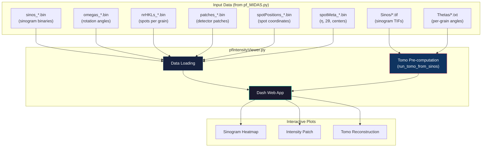
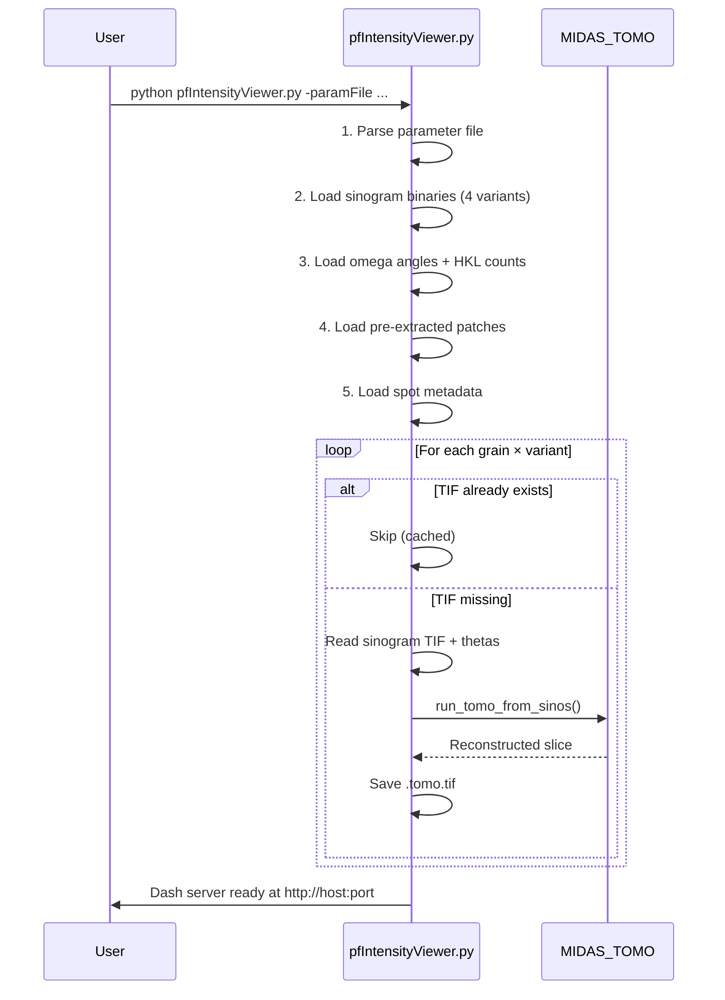
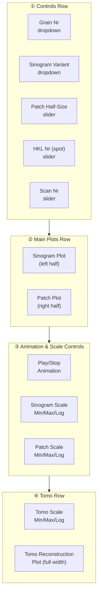
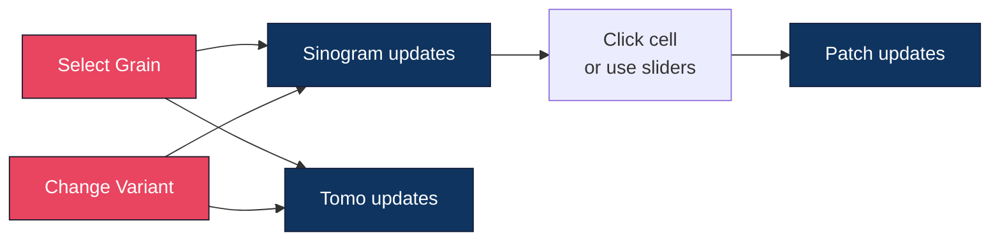
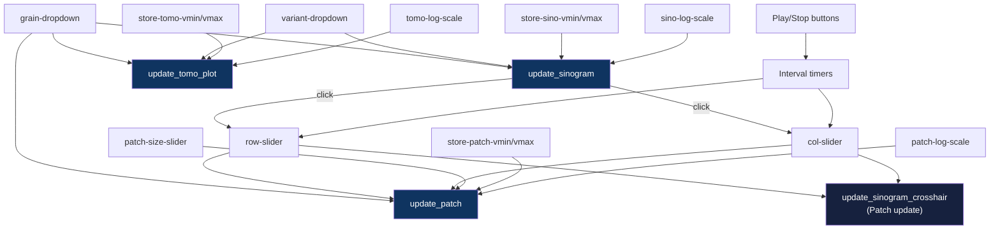

# PF-HEDM Interactive Sinogram, Intensity & Tomo Viewer

**Version:** 9.0  
**Contact:** hsharma@anl.gov

---

## 1. Introduction

The **PF-HEDM Interactive Viewer** (`pfIntensityViewer.py`) is a web-based application for exploring the output of PF-HEDM (scanning / pencil-beam FF-HEDM) analysis. It provides three linked, interactive plots that update in real time as you navigate grains, spots, and scan positions:

| Plot | Shows |
|------|-------|
| **Sinogram** | Intensity heatmap (scan position × rotation angle) for a selected grain and sinogram variant |
| **Intensity Patch** | 2D detector-space intensity (Y × Z pixels) for a single diffraction spot at a selected scan position |
| **Tomo Reconstruction** | Tomographic cross-section of the grain, reconstructed from the sinogram using MIDAS_TOMO |

The viewer also supports animated playback across scans or spots, independent intensity scaling for each plot, and automatic tomographic reconstruction at startup.



---

## 2. Prerequisites

### Software
- Python 3.8+ with:
  - `dash`, `dash-bootstrap-components`
  - `plotly`
  - `numpy`
  - `Pillow`
- A built MIDAS installation with `MIDAS_TOMO` binary (for tomo reconstruction)

### Data
The viewer reads output files generated by `pf_MIDAS.py` and `findSingleSolutionPFRefactored`. The following files must exist in the result directory:

| File Pattern | Source | Contents |
|---|---|---|
| `sinos_raw_N_M_S.bin` | `findSingleSolutionPFRefactored` | Raw sinogram data (float64) |
| `sinos_{norm,abs,normabs}_N_M_S.bin` | `findSingleSolutionPFRefactored` | Variant sinograms |
| `omegas_N_M.bin` | `findSingleSolutionPFRefactored` | Rotation angles per grain/spot (float64) |
| `nrHKLs_N.bin` | `findSingleSolutionPFRefactored` | Number of valid spots per grain (int32) |
| `patches_N_M_S.bin` | `findSingleSolutionPFRefactored` | Pre-extracted 21×21 detector patches (float32) |
| `spotPositions_N_M_S.bin` | `findSingleSolutionPFRefactored` | Spot center coordinates (float64) |
| `spotMeta_N_M_S.bin` | `findSingleSolutionPFRefactored` | Per-cell η, 2θ, yCen, zCen (float64) |
| `Sinos/sino_{variant}_grNr_NNNN.tif` | `pf_MIDAS.py` | Sinogram TIF per grain/variant |
| `Thetas/thetas_grNr_NNNN.txt` | `pf_MIDAS.py` | Rotation angles per grain |

Where `N` = nGrs, `M` = maxNHKLs, `S` = nScans (encoded in filenames).

---

## 3. Getting Started

### 3.1. Launching the Viewer

```bash
python pfIntensityViewer.py -paramFile <param.txt> [-resultDir <dir>] [-portNr 8051]
```

### 3.2. Command-Line Arguments

| Argument | Type | Default | Description |
|---|---|---|---|
| `-paramFile` | `str` | **Required** | Path to the PF parameter file (same file used for `pf_MIDAS.py`) |
| `-resultDir` | `str` | Current directory | Directory containing the output files listed above |
| `-portNr` | `int` | `8051` | Port for the Dash web server |
| `-HostName` | `str` | `0.0.0.0` | Hostname for the Dash web server |

### 3.3. Example

```bash
# From the result directory:
python ~/opt/MIDAS/utils/pfIntensityViewer.py -paramFile ps_pf.txt

# Specifying result directory and port:
python ~/opt/MIDAS/utils/pfIntensityViewer.py \
    -paramFile /data/exp1/ps_pf.txt \
    -resultDir /data/exp1/results/ \
    -portNr 9000
```

After launching, open `http://localhost:8051` (or your configured port) in a web browser.

---

## 4. Startup Sequence

When the viewer starts, it performs several loading steps before the web server begins. Understanding this sequence helps diagnose startup issues:



> [!NOTE]
> The first startup takes longer because tomo reconstructions must be computed for every grain × variant combination. Subsequent launches reuse the saved `Tomo/*.tomo.tif` files and start almost instantly.

---

## 5. User Interface Guide

### 5.1. Layout Overview

The interface is organized into four horizontal sections:



### 5.2. Controls (Section ①)

| Control | Description |
|---|---|
| **Grain Nr** | Dropdown to select which grain to view. Shows grain index and spot count (e.g., "Grain 5 (23 spots)"). |
| **Sinogram Variant** | Dropdown to select sinogram type: `raw`, `norm` (normalized), `abs` (exp(-I)), or `normabs` (exp(-I/Imax)). |
| **Patch Half-Size** | Slider (5–50 px) controlling the display window size of the intensity patch. |
| **HKL Nr** | Slider selecting which diffraction spot (HKL reflection) is highlighted. Range updates automatically per grain. |
| **Scan Nr** | Slider selecting which scan position to view in the patch plot. |

### 5.3. Sinogram Plot (Section ②, Left)

A 2D heatmap showing the sinogram for the selected grain and variant:
- **X-axis**: Scan number (sample position index)
- **Y-axis**: Spot number (HKL index, sorted by rotation angle)
- **Color**: Intensity value
- **Crosshair**: Orange lines indicating the currently selected HKL (row) and scan (col)

**Interaction**: Click anywhere on the heatmap to jump directly to that spot/scan combination. This updates both sliders and the patch plot simultaneously.

### 5.4. Intensity Patch Plot (Section ②, Right)

A 2D heatmap showing the detector-space intensity distribution for a single diffraction event:
- **X-axis**: Y detector pixels
- **Y-axis**: Z detector pixels
- **Color**: Intensity
- **Title**: Shows grain number, spot index, rotation angle (θ), and scan number

This is a 21×21 pixel window pre-extracted by `findSingleSolutionPFRefactored` around each spot's predicted detector position.

### 5.5. Animation Controls (Section ③, Left)

| Control | Description |
|---|---|
| **▶ Play Scans (fixed spot)** | Animates through scan positions while keeping the current spot fixed. Shows how a spot's intensity evolves across the sample. |
| **▶ Play Spots (fixed scan)** | Animates through spots while keeping the current scan fixed. Shows all diffraction events at one sample position. |
| **■ Stop** | Stops the current animation. |
| **Refresh (ms)** | Controls animation speed (100–5000 ms between frames). Default: 500 ms. |

### 5.6. Scale Controls (Section ③, Right)

Each plot has independent intensity scale controls:

| Control | Applies to | Description |
|---|---|---|
| **Sinogram Scale** | Sinogram heatmap | Min/Max inputs + Apply button. Leave empty for auto-scaling. |
| **Patch Scale** | Patch heatmap | Same as above. |
| **Log scale** | Both | Checkbox to apply `log(1+I)` transformation. |

### 5.7. Tomo Reconstruction Plot (Section ④)

A full-width 2D heatmap showing the tomographic reconstruction of the currently selected grain and variant:
- Updates automatically when you change the grain or variant dropdown
- The reconstruction is pre-computed at startup; the plot simply loads the saved TIF
- Has its own independent scale controls (Min/Max/Apply/Log)

---

## 6. Interaction Workflow



### Typical Analysis Session

1. **Select a grain** from the dropdown — the sinogram and tomo plots populate immediately.
2. **Choose a sinogram variant** (`raw`, `norm`, `abs`, `normabs`) to view different intensity representations.
3. **Click on the sinogram** to jump to a specific spot/scan — the patch plot shows the detector image at that location.
4. **Use Play Scans** to animate across scan positions — watch how a spot's intensity changes as the beam moves across the sample.
5. **Adjust scale controls** if the heatmap dynamic range is too wide — set Min/Max to clip outliers, or enable Log scale for high-dynamic-range data.
6. **Compare the tomo reconstruction** with the sinogram to verify that the reconstructed grain shape matches the measured sinogram.

---

## 7. Sinogram Variants

The viewer supports four sinogram variants generated by `findSingleSolutionPFRefactored` and `pf_MIDAS.py`:

| Variant | Formula | Best For |
|---|---|---|
| `raw` | Raw intensity $I$ | Seeing absolute peak intensities |
| `norm` | $I / I_{max}$ | Comparing relative intensities across spots |
| `abs` | $\exp(-I)$ | Absorption-contrast-like view |
| `normabs` | $\exp(-I / I_{max})$ | Normalized absorption contrast |

---

## 8. Output Files

The viewer generates the following files during startup:

```
<resultDir>/
└── Tomo/
    ├── sino_raw_grNr_0000.tomo.tif      # Reconstruction from raw sinogram
    ├── sino_norm_grNr_0000.tomo.tif     # Reconstruction from normalized sinogram
    ├── sino_abs_grNr_0000.tomo.tif      # ...
    ├── sino_normabs_grNr_0000.tomo.tif
    ├── sino_raw_grNr_0001.tomo.tif
    └── ...
```

Each `.tomo.tif` is a float32 2D image of shape `(xDimNew, xDimNew)` where `xDimNew = next_power_of_2(nScans)`.

---

## 9. Technical Details

### 9.1. Callback Architecture

The viewer uses Dash's callback system to link UI controls to plot updates:



### 9.2. Performance Optimization

- **Crosshair updates use `dash.Patch()`**: When moving the HKL or Scan sliders, only the crosshair overlay is updated (O(1)) — the sinogram heatmap is not re-rendered. This makes slider interaction feel instantaneous even with large sinograms.
- **Tomo TIF caching**: Reconstructions are computed once and saved as TIF files. The display callback simply reads the TIF — no recomputation per interaction.
- **Separate structural vs. cosmetic callbacks**: The sinogram plot has two callbacks — one for full re-render (grain/variant/scale changes) and one for crosshair-only updates (slider changes). This prevents expensive re-renders on every slider tick.

---

## 10. Troubleshooting

| Symptom | Likely Cause | Fix |
|---|---|---|
| Viewer crashes at startup with `FileNotFoundError` | Missing sinogram binary files | Run `pf_MIDAS.py` first to generate `sinos_*.bin` files |
| Empty sinogram plot | No data for the selected grain/variant | Check that `grainSpots[grainNr] > 0` — grain may have zero spots |
| Patch is all zeros | Spot not present at this scan position | Navigate to a scan position where this HKL has a diffraction event |
| Tomo plot shows "No tomo reconstruction" | Missing sinogram TIF or thetas file | Ensure `Sinos/*.tif` and `Thetas/*.txt` exist (generated by `pf_MIDAS.py`) |
| Slow startup | First-time tomo reconstruction for many grains | Expected — subsequent launches reuse cached `.tomo.tif` files |
| `Address already in use` | Port conflict | Use `-portNr <different_port>` |
| Remote access fails | Firewall or hostname binding | Use `-HostName 0.0.0.0` and check firewall |

---

## 11. See Also

- [PF_Analysis.md](PF_Analysis.md) — PF-HEDM workflow that generates the input data
- [Tomography_Reconstruction.md](Tomography_Reconstruction.md) — MIDAS_TOMO documentation and `run_tomo_from_sinos()` API
- [FF_Interactive_Plotting.md](FF_Interactive_Plotting.md) — Interactive viewer for standard (box-beam) FF-HEDM
- [FF_Analysis.md](FF_Analysis.md) — Standard FF-HEDM analysis
- [README.md](README.md) — High-level MIDAS overview

---

If you encounter any issues or have questions, please open an issue on this repository.
