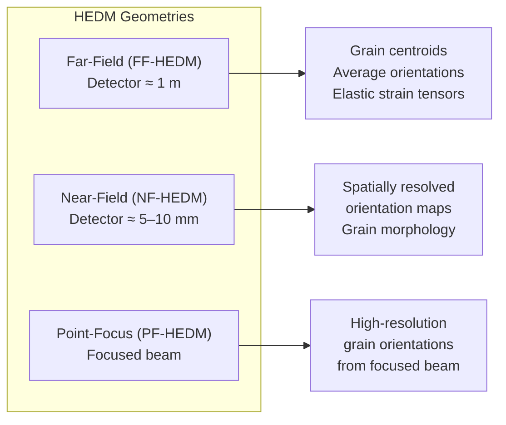
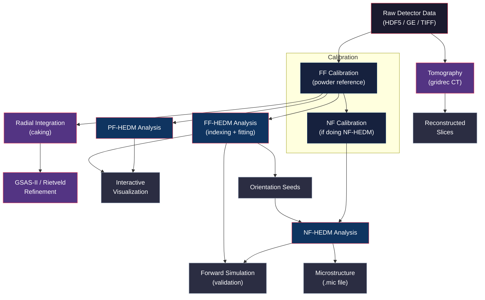

# MIDAS Manuals — High-Energy Diffraction Microscopy

**Version:** 9.0  
**Contact:** hsharma@anl.gov

---

## Manual Index

| Manual | Topic | When to Use |
|--------|-------|-------------|
| [FF_calibration.md](FF_calibration.md) | FF-HEDM geometry calibration | Setting up a new experiment; determining detector parameters |
| [FF_Analysis.md](FF_Analysis.md) | FF-HEDM grain indexing and fitting | Extracting grain orientations, positions, and strain tensors |
| [FF_RadialIntegration.md](FF_RadialIntegration.md) | Radial integration / caking | Converting 2D detector images to 1D intensity vs. 2θ profiles |
| [FF_Interactive_Plotting.md](FF_Interactive_Plotting.md) | Interactive FF-HEDM visualization | Exploring grains, spots, and raw data interactively in a browser |
| [FF_dual_datasets.md](FF_dual_datasets.md) | Dual-dataset FF-HEDM analysis | Combining two FF datasets (e.g., different load states) |
| [PF_Analysis.md](PF_Analysis.md) | Point-Focus HEDM analysis | Analyzing data from a focused beam geometry |
| [NF_calibration.md](NF_calibration.md) | NF-HEDM detector calibration | Calibrating NF detector distances and beam center |
| [NF_Analysis.md](NF_Analysis.md) | NF-HEDM reconstruction workflow | Reconstructing spatially resolved orientation maps |
| [NF_MultiResolution_Analysis.md](NF_MultiResolution_Analysis.md) | Multi-resolution NF-HEDM | Iterative NF reconstruction at increasing grid resolution |
| [NF_gui.md](NF_gui.md) | NF-HEDM interactive GUI | Calibrating detectors, visualizing NF data, and inspecting results |
| [ForwardSimulationManual.md](ForwardSimulationManual.md) | Forward simulation (`simulateNF`) | Validating reconstructions by simulating expected diffraction patterns |
| [GSAS-II_Integration.md](GSAS-II_Integration.md) | Importing MIDAS output into GSAS-II | Rietveld refinement of caked powder data |
| [Tomography_Reconstruction.md](Tomography_Reconstruction.md) | Absorption-contrast CT reconstruction | Reconstructing tomographic slices from projection data |

---

## Getting Started Checklist

For a first-time user performing a combined FF + NF experiment:

1. **Calibrate** the FF-HEDM detector using a powder calibrant (CeO₂ or LaB₆) → [FF_calibration.md](FF_calibration.md)
2. **Integrate / cake** the powder data (if WAXS analysis is needed) → [FF_RadialIntegration.md](FF_RadialIntegration.md)
3. **(Optional)** Import caked data into GSAS-II for Rietveld refinement → [GSAS-II_Integration.md](GSAS-II_Integration.md)
4. **Run FF-HEDM** analysis on the specimen → [FF_Analysis.md](FF_Analysis.md)
5. **Visualize** FF results interactively → [FF_Interactive_Plotting.md](FF_Interactive_Plotting.md)
6. **Calibrate** the NF-HEDM detectors → [NF_calibration.md](NF_calibration.md)
7. **Run NF-HEDM** reconstruction using FF orientation seeds → [NF_Analysis.md](NF_Analysis.md) or [NF_MultiResolution_Analysis.md](NF_MultiResolution_Analysis.md)
8. **Validate** results with forward simulation → [ForwardSimulationManual.md](ForwardSimulationManual.md)
9. **(Optional)** Reconstruct tomographic slices for absorption-contrast imaging → [Tomography_Reconstruction.md](Tomography_Reconstruction.md)

---

## Introduction

**MIDAS** (Microstructure Diffraction Analysis Software) is a suite of tools for reconstructing three-dimensional microstructures from High-Energy Diffraction Microscopy (HEDM) data. Developed at the Advanced Photon Source (APS) at Argonne National Laboratory, MIDAS supports the complete data-reduction pipeline — from raw detector frames to grain maps, strain tensors, spatially resolved orientation fields, and tomographic reconstructions.

HEDM exploits the high penetration depth of synchrotron X-rays to non-destructively characterize the internal grain structure of polycrystalline materials. Unlike surface-sensitive techniques such as EBSD, HEDM probes the full bulk of a specimen while it remains intact, making it ideal for *in situ* mechanical loading, thermal cycling, and other experiments where preserving the sample is essential.

---

## HEDM Techniques Supported by MIDAS

MIDAS supports three complementary diffraction geometries and an absorption-contrast tomography module. Each probes a different length scale and provides different information about the microstructure.

### Far-Field HEDM (FF-HEDM)

A large-area detector is placed approximately 1 meter downstream of the sample. As the sample rotates, each grain produces a set of discrete diffraction spots that trace out arcs on the detector. By associating spots across many rotation angles, MIDAS determines:

- The **center-of-mass position** of each grain.
- The **average crystallographic orientation** (as an orientation matrix).
- The **full elastic strain tensor** of each grain (6 independent components).

FF-HEDM is well-suited for specimens containing tens to thousands of grains. The diffraction spots are analyzed using a peak-search → indexing → fitting pipeline that groups spots by grain, determines the orientation matrix, and refines the full strain tensor. See [FF_Analysis.md](FF_Analysis.md) for the complete workflow.

### Near-Field HEDM (NF-HEDM)

The detector sits only a few millimeters from the sample. At this distance, individual diffraction spots from neighboring grains are spatially separated and can be mapped back to specific voxels in the sample. MIDAS reconstructs a 3D grid where every voxel is assigned a crystallographic orientation and a confidence metric.

**What NF-HEDM produces:**

- **3D grain-shape maps** with sub-micrometer spatial resolution — the morphology and topology of every grain in the illuminated volume.
- **Intragranular orientation gradients** — misorientation spreads within individual grains, revealing sub-grain boundaries, deformation substructure, and dislocation density variations.
- **Grain boundary networks** — the full 3D interface between all grains, including boundary normals, inclination angles, and misorientation across each boundary.

**How it works:**

NF-HEDM reconstruction is a voxel-by-voxel forward-modeling process. For each candidate voxel position and orientation, MIDAS simulates the expected diffraction pattern and compares it against the measured data. The orientation that produces the best agreement (highest confidence) is assigned to that voxel. The process typically proceeds as follows:

1. **Orientation seeding** — Candidate orientations come from a prior FF-HEDM analysis. Each FF grain provides a seed orientation that is tested at every voxel within the grain's expected spatial extent.
2. **Multi-layer detector setup** — NF-HEDM at APS 1-ID typically uses multiple GE detectors stacked at different distances from the sample (e.g., layers at 5 mm, 6 mm, 7 mm). Each layer provides an independent constraint, improving the spatial fidelity of the reconstruction.
3. **Grid-based reconstruction** — The sample volume is discretized into a regular grid (typically 1–5 µm spacing). Each voxel is tested against all candidate orientations, and the best match is stored in a `.mic` file.
4. **Multi-resolution refinement** — For large volumes, reconstruction can proceed iteratively: a coarse grid identifies the approximate grain structure, then finer grids refine boundaries and intragranular features. See [NF_MultiResolution_Analysis.md](NF_MultiResolution_Analysis.md).

**NF-HEDM detector calibration** is separate from FF calibration because the detector geometry must be known more precisely at the shorter working distances. The NF calibration procedure determines the sample-to-detector distance and beam center for each layer. See [NF_calibration.md](NF_calibration.md).

**Interactive analysis** is supported through a GUI that provides real-time visualization of raw NF diffraction images, reconstructed microstructure layers, and confidence maps. See [NF_gui.md](NF_gui.md).

> [!TIP]
> For best NF results, always run FF-HEDM first to generate high-quality orientation seeds. The quality of the NF reconstruction depends heavily on the completeness and accuracy of the seed orientations.

### Point-Focus HEDM (PF-HEDM)

A variant of FF-HEDM that uses a focused (pencil) beam instead of a box beam. Because the illuminated volume is much smaller, the number of overlapping spots is reduced, which improves indexing for fine-grained samples or high-symmetry materials. The sample is scanned spatially through the focused beam, providing layer-by-layer grain mapping. See [PF_Analysis.md](PF_Analysis.md).

### Tomography (Absorption-Contrast CT)

MIDAS includes a fast tomographic reconstruction engine based on the **gridrec** algorithm — a Fourier-domain filtered back-projection method using prolate spheroidal wave function (PSWF) interpolation. It reconstructs absorption-contrast cross-sections from rotation series of projection images.

**Key capabilities:**

- **Dark-field and white-field normalization** of raw projection images (dark + 2 white frames).
- **Multiple reconstruction filters** — Shepp-Logan, Hann (default), Hamming, and Ramp.
- **Rotation-axis shift search** — reconstructs at multiple candidate center positions to find the optimal alignment.
- **Ring artifact removal** — sinogram-space filtering to suppress ring artifacts from detector pixel defects.
- **OpenMP parallelism** — multi-threaded slice reconstruction with automatic memory management.

**Two entry points are provided:**

| Entry Point | Input | Use Case |
|-------------|-------|----------|
| `process_hdf.py` | HDF5 file with `/exchange/data` layout | Standard APS data exchange format |
| `midas_tomo_python.py` | NumPy arrays (dark, whites, projections) | Programmatic / custom data formats |

Both generate a parameter file and call the `MIDAS_TOMO` C binary, which uses FFTW for FFT acceleration. The output is a set of reconstructed slices as `float32` binary data, with dimensions rounded up to the next power of 2.

For full details — parameter reference, data formats, rotation-center alignment, and troubleshooting — see [Tomography_Reconstruction.md](Tomography_Reconstruction.md).

---

## End-to-End Workflow

A typical MIDAS analysis proceeds through the stages shown below. Not every stage is required for every experiment — for example, WAXS caking and tomography are independent of the grain-reconstruction pipeline.

---

## Coordinate Systems

Understanding the coordinate system is critical for correctly loading data into MIDAS and interpreting results.

### Laboratory Frame

MIDAS uses the **ESRF convention** for the laboratory coordinate system:

| Axis | Direction |
|------|-----------|
| **Z_L** | X-ray beam propagation direction (downstream) |
| **Y'_L** | Tomographic rotation axis |
| **X_L** | Plane normal of the (Z_L, Y'_L) plane |
| **Y_L** | Z_L × X_L |

The angle between **Y_L** and **Y'_L** is the **wedge angle** (Ω). For standard HEDM setups, the wedge angle is zero — the rotation axis is perpendicular to the beam.

> [!NOTE]
> The right-handed rotation about Y'_L is denoted **ω** (omega). A full ω-scan typically covers 360° (or ±180°) to capture all accessible diffraction conditions.

### Detector Frame

The detector plane is described by three tilt angles relative to the laboratory frame and a beam-center position (BC). The tilt about Z_L (called **tx**) requires Friedel pairs from a single crystal and cannot be determined from powder rings alone.

| Azimuth η | Detector Axis |
|-----------|---------------|
| 0° | +Y_D |
| +90° | −X_D |
| −90° | +X_D |
| ±180° | −Y_D |

### Image Transformation

When loading raw detector images, MIDAS may need to apply a transformation to make the image consistent with the laboratory coordinate system. Transformations are specified via the `ImTransOpt` parameter:

| `ImTransOpt` | Transformation |
|--------------|----------------|
| 0 | No change |
| 1 | Flip left/right |
| 2 | Flip top/bottom |
| 3 | Transpose |

> [!IMPORTANT]
> Getting `ImTransOpt` right is essential. If the image orientation does not match the coordinate system, calibration will fail silently and all downstream results will be incorrect. Verify using a physical feature on the detector (e.g., a beam-stop wire, a fiducial marker) whose position you can track.

### Sample Frame

The sample coordinate system is an intermediate frame **unknown** to the diffraction geometry. MIDAS treats crystals in the sample purely as scatterers that produce spots as the sample rotates through diffraction conditions. It is the user's responsibility to:

1. Track the sample orientation relative to the beam during mounting.
2. Use fiducial markers (e.g., Au dots, notches, tomography) to relate the lab frame to the sample frame for post-analysis interpretation.

---

## Detector Setup at APS 1-ID

### GE Amorphous-Si Detector

The single-panel GE amorphous-Si detector has a pixel pitch of **200 µm** and a coverage of **2048 × 2048** pixels. With this detector, `ImTransOpt` is typically **0** (no transformation needed).

### Varex 4343 Detector

The Varex 4343 detector has a pixel pitch of **150 µm** and covers **2880 × 2880** pixels. When mounted at APS 1-ID-C with the standard AreaDetector plugin configuration (Rot90 transform in Trans1), `ImTransOpt` should be set to **2** (vertical flip).

> [!TIP]
> Always verify the detector orientation by checking that the image, when loaded in a viewer (ImageJ, VSCode H5Web, Fit2D), matches the expected physical layout: **outboard** → +X_L and **up** → +Y_L. Place physical markers on the detector (a blue Allen key, tape on the pin diode cable) and confirm their projection appears in the correct quadrant.

---

## Sample Alignment and Tomographic Motion

### FF-HEDM Alignment

While placing the sample precisely on the rotation axis is not strictly required for FF-HEDM, centering the sample as closely as possible is good practice to minimize artifacts.

### WAXS Alignment

For Wide-Angle X-ray Scattering (WAXS) / caking, the sample must be placed precisely on the rotation axis (or at a well-known position relative to the detector and beam). The standard sample-alignment procedure is covered during beam time at APS 1-ID.

### Rotation Handedness

MIDAS assumes a **right-handed** rotation about the ω axis. Some rotation stages (e.g., Aerotech) perform a **left-handed** rotation. If your stage uses left-handed rotation, the omega angles must be negated before passing them to MIDAS.

| Stage | Rotation | Conversion Needed? |
|-------|----------|-------------------|
| Aerotech | Left-handed | Yes — negate ω |
| MTSphi | Right-handed | No |
| RAMS3 | Right-handed | No |

### Shadowing

If a custom loading frame or environmental cell causes shadowing at certain ω angles, those angular ranges must be excluded using the `OmegaRange` and `BoxSize` parameters in the MIDAS parameter file. Multiple disjoint omega ranges can be specified.

---

## Calibration Parameter Reference

The FF-HEDM instrument is characterized by the following parameters, typically determined during calibration:

| Parameter | Unit | Description |
|-----------|------|-------------|
| `Lsd` | µm | Sample-to-detector distance |
| `BC` | pixels | Beam center (horizontal, vertical) |
| `ty` | degrees | Detector tilt about Y |
| `tz` | degrees | Detector tilt about Z |
| `tx` | degrees | Detector tilt about beam axis (requires single-crystal calibration) |
| `p0`, `p1`, `p2` | — | Spatial distortion polynomial coefficients |
| `p3` | — | Spatial distortion parameter |
| `Wavelength` | Å | Incident X-ray wavelength |
| `px` | µm | Pixel size |

> [!NOTE]
> The `tx` parameter cannot be determined from powder rings alone. It requires Friedel pairs from a single crystal (typically Au). If you are only performing WAXS caking, `tx = 0` is usually sufficient.

### Cross-Software Parameter Conversion

If you obtain initial calibration guesses from other software, the following table provides first-order translations:

| Software | BC 1st term (px) | BC 2nd term (px) | Lsd (mm) |
|----------|-------------------|-------------------|----------|
| **MIDAS** | horizontal | vertical | in µm ÷ 1000 |
| **GSAS-II** | horizontal (µm → px) | vertical (µm → px) | direct |
| **HEXRD** | check coordinate convention | may differ | direct |
| **Fit2D** | horizontal | vertical | direct |

> [!CAUTION]
> Each software package has its own coordinate conventions. Always verify the physical meaning of the beam center and detector tilt parameters against the detector coordinate system before transferring values between packages.

---

If you encounter any issues or have questions, please open an issue on this repository.
