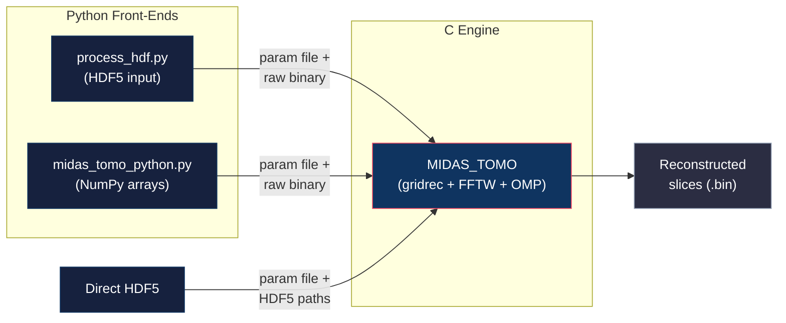

# Tomography Reconstruction with MIDAS

**Version:** 9.0  
**Contact:** hsharma@anl.gov

---

## 1. Introduction

MIDAS includes a high-performance tomographic reconstruction module based on the **gridrec** algorithm — a Fourier-based filtered back-projection method that uses a prolate spheroidal wave function (PSWF) interpolation kernel for regridding in the frequency domain. This approach produces reconstructions of comparable quality to standard FBP while being significantly faster, thanks to FFTW-accelerated FFTs and OpenMP parallelism.

The tomography module is designed for absorption-contrast X-ray computed tomography (CT) data collected at APS, but it works with any parallel-beam projection dataset. It handles:

- **Dark-field and white-field normalization** of raw projection images.
- **Multiple reconstruction filters** (Shepp-Logan, Hann, Hamming, Ramp).
- **Rotation-axis shift search** across a range of candidate center positions.
- **Ring artifact removal** via sinogram-space filtering.
- **Stripe artifact removal** for ring-artifact-free reconstructions (Vo et al. 2018).
- **OpenMP parallelism** across slices for fast multi-core reconstruction.

---

## 2. Architecture

The tomography pipeline has three components:



| Component | Location | Purpose |
|-----------|----------|---------|
| `MIDAS_TOMO` | `~/opt/MIDAS/TOMO/bin/MIDAS_TOMO` | C binary — performs the actual reconstruction |
| `process_hdf.py` | `~/opt/MIDAS/TOMO/process_hdf.py` | Reads HDF5 data, generates parameter file, calls `MIDAS_TOMO` |
| `midas_tomo_python.py` | `~/opt/MIDAS/TOMO/midas_tomo_python.py` | Python library — accepts NumPy arrays and returns reconstructions |

---

## 3. Quick Start

### 3.1. From HDF5 Files (Recommended)

If your tomography data is in an HDF5 file with the standard APS data exchange layout (`/exchange/data`, `/exchange/dark`, `/exchange/bright`), use `process_hdf.py`:

```bash
python ~/opt/MIDAS/TOMO/process_hdf.py \
  -dataFN /path/to/tomo_scan.h5 \
  -nCPUs 20
```

The script will:
1. Read dark, bright (white-field), and projection frames from the HDF5 file.
2. Apply any cropping specified in `/analysis/process/analysis_parameters/`.
3. Apply an optional in-plane rotation correction if `RotationAngle` is present.
4. Write a raw binary file and a parameter file (`mt_par.txt`).
5. Call `MIDAS_TOMO` to perform the reconstruction.

> [!NOTE]
> The HDF5 file must contain the following datasets:
> - `/exchange/data` — projection images (`uint16`, shape: `[nFrames, nZ, nX]`)
> - `/exchange/dark` — dark-field image(s)
> - `/exchange/bright` — white-field (flat-field) images (at least 2)
> - `/measurement/process/scan_parameters/start` — starting omega angle
> - `/measurement/process/scan_parameters/step` — omega step size
> - `/analysis/process/analysis_parameters/CropXL`, `CropXR`, `CropZL`, `CropZR` — cropping bounds
> - `/analysis/process/analysis_parameters/shift` — rotation axis shift (pixels)

### 3.2. Direct HDF5 Reconstruction (New)

You can also run `MIDAS_TOMO` directly on an HDF5 file without converting to binary first. This is efficient and avoids duplicating data.

**Parameter File for HDF5:**
```text
HDF5FileName /path/to/data.h5
ImageDatasetName /exchange/data
DarkDatasetName /exchange/dark
WhiteDatasetName /exchange/bright
reconFileName /path/to/output_recon
detXdim 2048
detYdim 1024
thetaRange -180 180 0.25
shiftValues 0 0 1
```

**Running:**
```bash
~/opt/MIDAS/TOMO/bin/MIDAS_TOMO my_hdf5_params.txt 20
```

### 3.3. From NumPy Arrays (Python API)

For programmatic use or when your data is not in HDF5 format:

```python
from midas_tomo_python import run_tomo
import numpy as np

# Load your data (example shapes)
data   = ...  # np.ndarray, shape (nThetas, nSlices, xDim), uint16
dark   = ...  # np.ndarray, shape (nSlices, xDim), float32
whites = ...  # np.ndarray, shape (2, nSlices, xDim), float32
thetas = np.arange(-180, 180.1, 0.25)  # rotation angles in degrees

recon = run_tomo(
    data, dark, whites,
    workingdir='/scratch/my_recon/',
    thetas=thetas,
    shifts=1.0,           # Single shift value (pixels)
    filterNr=2,           # Hann filter
    doLog=1,              # Take log for absorption contrast
    numCPUs=20
)
# recon shape: (nShifts, nSlices, xDimNew, xDimNew)
```

> [!IMPORTANT]
> The `data` array passed to `run_tomo` should have shape `(nThetas + 2, nSlices, xDim)` where the first two frames are tilt-corrected projections that get treated as extra frames. Internally, the function subtracts 2 from `nThetas`. See the docstring in `midas_tomo_python.py` for the exact binary layout.

> [!NOTE]
> Both `run_tomo()` and `run_tomo_from_sinos()` automatically handle **odd slice counts** by internally duplicating the last slice to satisfy the MIDAS_TOMO even-slice requirement. The returned array is truncated back to the original slice count.

### 3.4. From Pre-Computed Sinograms (Python API)

When you already have sinogram data (e.g., from PF-HEDM `findSingleSolutionPFRefactored` output), use `run_tomo_from_sinos()` which uses the `areSinos=1` mode — no dark/white normalization is needed:

```python
from midas_tomo_python import run_tomo_from_sinos
import numpy as np

# 2D sinogram: shape (nThetas, detXdim) — a single slice
sino = np.array(Image.open('Sinos/sino_raw_grNr_0000.tif')).T
thetas = np.loadtxt('Thetas/thetas_grNr_0000.txt')

recon = run_tomo_from_sinos(
    sino,                       # 2D or 3D (nSlices, nThetas, detXdim)
    workingdir='Tomo/',
    thetas=thetas,
    shifts=0.0,                 # Single shift
    filterNr=2,                 # Hann filter
    doLog=0,                    # Sinograms are already intensity, not raw
    numCPUs=1
)
# recon shape: (1, 1, xDimNew, xDimNew)
recon_slice = recon[0, 0, :, :]
```

The `pfIntensityViewer.py` viewer uses this function to automatically reconstruct all sinogram variants at startup and display them interactively.

---

## 4. Parameter File Reference

The `MIDAS_TOMO` binary reads a plain-text parameter file. Each line contains a keyword followed by its value(s).

| Parameter | Type | Description | Default |
|-----------|------|-------------|---------|
| `dataFileName` | string | Path to the raw binary input file (Mutual exclusive with HDF5FileName) | *required* |
| `HDF5FileName` | string | Path to the HDF5 input file (Mutual exclusive with dataFileName) | — |
| `ImageDatasetName` | string | HDF5 path to projection data (e.g. `/exchange/data`) | *required if HDF5* |
| `DarkDatasetName` | string | HDF5 path to dark fields (e.g. `/exchange/dark`) | *required if HDF5* |
| `WhiteDatasetName` | string | HDF5 path to white fields (e.g. `/exchange/bright`) | *required if HDF5* |
| `reconFileName` | string | Base name for reconstruction output | *required* |
| `areSinos` | 0 or 1 | Set to 1 if input is pre-computed sinograms, 0 if raw projections | 0 |
| `detXdim` | int | Horizontal dimension of detector (pixels) | *required* |
| `detYdim` | int | Vertical dimension of detector (number of slices) | *required* |
| `thetaFileName` | string | Path to text file with one angle (°) per line | — |
| `thetaRange` | 3 floats | `startAngle endAngle angleInterval` (alternative to `thetaFileName`) | — |
| `filter` | int | Reconstruction filter (see table below) | 2 (Hann) |
| `shiftValues` | 3 floats | `start_shift end_shift shift_interval` — rotation axis shift search (pixels) | *required* |
| `ringRemovalCoefficient` | float | Ring-artifact removal strength (0 = off, 1.0 = typical) | 0 |
| `doLog` | 0 or 1 | Take the logarithm for absorption-contrast reconstruction | 1 |
| `slicesToProcess` | string | `-1` for all slices, or path to a file listing slice indices | -1 |
| `ExtraPad` | 0 or 1 | Extra zero-padding for better frequency resolution | 0 |
| `AutoCentering` | 0 or 1 | Shift reconstruction so the rotation axis is at the image center | 1 |
| `saveReconSeparate` | 0 or 1 | Save each slice in a separate file (1) or all in one file (0) | 0 |
| `doStripeRemoval` | 0 or 1 | Enable stripe artifact removal (Vo et al. 2018) | 0 |
| `stripeSnr` | float | SNR threshold for stripe detection (higher = fewer stripes detected) | 3.0 |
| `stripeLaSize` | int (odd) | Median filter window for large stripe correction | 61 |
| `stripeSmSize` | int (odd) | Median filter window for small/medium stripe correction | 21 |

### 4.1. Reconstruction Filters

| Filter ID | Name | Characteristics |
|-----------|------|-----------------|
| 0 | None | No filtering (not recommended) |
| 1 | Shepp-Logan | Moderate smoothing, good edge preservation |
| 2 | **Hann** | Good balance of noise suppression and resolution (default) |
| 3 | Hamming | Similar to Hann but slightly less smoothing |
| 4 | Ramp | Maximum resolution but maximum noise amplification |

> [!TIP]
> Start with the **Hann** filter (2). If features appear blurred, try Shepp-Logan (1) or Ramp (4). If the reconstruction is too noisy, try Hamming (3).

### 4.2. Stripe Removal (Ring Artifact Suppression)

Stripe artifacts in sinograms manifest as **ring artifacts** in reconstructed slices. They are caused by miscalibrated, dead, or fluctuating detector pixels. The stripe removal module implements algorithms from:

> Nghia T. Vo, Robert C. Atwood, and Michael Drakopoulos, "Superior techniques for eliminating ring artifacts in X-ray micro-tomography," *Optics Express* 26(22), 28396–28412 (2018).

The implementation is based on the reference Python code in [tomopy](https://github.com/tomopy/tomopy) (`tomopy.prep.stripe`), ported to C for integration with the MIDAS reconstruction pipeline.

The module applies three correction phases to each normalized sinogram before reconstruction:
1. **Dead/fluctuating pixel correction** — Detects columns with anomalous fluctuation via SNR thresholding and replaces them by linear interpolation from neighboring good columns.
2. **Large stripe normalization** — Identifies and normalizes broad intensity variations across detector columns using sorted-domain statistics.
3. **Small-to-medium stripe correction** — Sorts each column by value, applies median filtering in the sorted domain, and restores original order. This removes narrow stripes without blurring real features.

**Example parameter file:**
```text
doStripeRemoval 1
stripeSnr 3.0
stripeLaSize 61
stripeSmSize 21
```

#### Recommended Starting Parameters

| Use Case | `stripeSnr` | `stripeLaSize` | `stripeSmSize` | Notes |
|----------|-------------|----------------|----------------|-------|
| **Default / first try** | 3.0 | 61 | 21 | Good balance for most APS datasets |
| Mild rings only | 3.0 | 51 | 11 | Lighter touch, less processing time |
| Severe ring artifacts | 1.5 | 71 | 31 | More aggressive — lower SNR detects fainter stripes, larger windows smooth more |
| Very noisy data | 5.0 | 61 | 21 | Higher SNR avoids false stripe detection from noise |
| High-resolution detector (4k+) | 3.0 | 101 | 41 | Scale windows up for wider detectors |

> [!TIP]
> **Tuning guide:**
> - `stripeSnr` controls **sensitivity**: lower values detect more stripes but risk treating real features as artifacts. Start at 3.0 and decrease only if rings persist.
> - `stripeLaSize` sets the **scale of "large"** stripes: it should be larger than the widest stripe you want to correct. Must be odd.
> - `stripeSmSize` sets the **smoothing width** for small stripes: larger values remove wider stripes but may slightly blur column-direction edges. Must be odd.
> - All filter sizes are automatically forced to odd if you provide an even number.

> [!NOTE]
> Stripe removal is applied to each normalized sinogram before the gridrec reconstruction step. It has no effect when `doStripeRemoval` is set to 0 (default). This feature is independent of the older `ringRemovalCoefficient` parameter and can be used alongside it, though using both simultaneously is generally unnecessary.

## 5. Input Data Format

### 5.1. Raw Binary Layout

When `areSinos = 0`, the input file must be a single binary file with the following layout:

| Segment | Data Type | Shape | Description |
|---------|-----------|-------|-------------|
| Dark frame | `float32` | `(detYdim, detXdim)` | Dark-current image |
| White frames | `float32` | `(2, detYdim, detXdim)` | Flat-field images (before and after) |
| Projections | `uint16` | `(nThetas, detYdim, detXdim)` | Raw projection images |

### 5.2. HDF5 Input

When using HDF5 input (`HDF5FileName` specified), the module reads datasets directly. 
- **Type Safety**: The module automatically checks if the datasets are numeric (Integer or Float).
- **Type Casting**: 
    - Darks and Whites are cast to `float32` (native HDF5 conversion).
    - Projections are cast to `uint16`.
- **Dimensions**:
    - Darks: Can be 2D `(Y, X)` or 3D `(N, Y, X)`. If 3D, all `N` frames are averaged to produce a single dark field.
    - Whites: Can be 2D `(Y, X)` or 3D `(N, Y, X)`.
        - If `N > 2`: The first `N/2` frames are averaged to produce the first white field (start), and the remaining frames are averaged to produce the second white field (end).
        - If `N == 2`: The first frame is White 1, the second is White 2.
    - Projections: `(nThetas, Y, X)`. 

### 5.3. Sinogram Input

When `areSinos = 1`, the input file contains pre-computed sinograms as `float32` data. Each sinogram has shape `(nThetas, detXdim)`.

---

## 6. Output Format

The reconstruction is saved as a single binary file (or individual files per slice if `saveReconSeparate = 1`). The filename convention is:

```
{reconFileName}_NrShifts_{NNN}_NrSlices_{NNNNN}_XDim_{NNNNNN}_YDim_{NNNNNN}_float32.bin
```

The data is `float32` with shape `(nShifts, nSlices, xDimNew, xDimNew)`, where `xDimNew` is the next power of 2 ≥ `detXdim` (or the next-next power of 2 if `ExtraPad = 1`).

### 6.1. Viewing the Reconstruction

```python
import numpy as np
import matplotlib.pyplot as plt

# Parse dimensions from filename
recon = np.fromfile('recon_output_NrShifts_001_NrSlices_01024_XDim_002048_YDim_002048_float32.bin',
                    dtype=np.float32).reshape((1, 1024, 2048, 2048))

plt.imshow(recon[0, 512, :, :], cmap='gray')
plt.colorbar()
plt.title('Reconstructed slice 512')
plt.show()
```

---

## 7. Rotation Axis Alignment

The most critical parameter for a good reconstruction is the **rotation axis position** (the `shiftValues` parameter). If the rotation axis is not centered on the detector, the reconstruction will exhibit characteristic arc-shaped artifacts.

### 7.1. Finding the Rotation Center

**Method 1 — Single value (if known):**
```
shiftValues 1.5 1.5 1
```

**Method 2 — Search a range:**
```
shiftValues -3.0 3.0 0.5
```
This produces 13 reconstructions, one for each shift. Inspect them to find the shift that gives the sharpest reconstruction.

> [!WARNING]
> The `shiftValues` range must produce an **even** number of shifts when more than one shift is specified. The number of slices must also be even. The C engine processes slices in pairs for efficiency.

### 7.2. Auto-Centering

When `AutoCentering = 1` (default), the reconstruction is shifted so the rotation axis appears at the center of the output image. Set to `0` if you want the rotation axis at its natural detector position.

---

## 8. Performance

### 8.1. Memory

The C engine reads `/proc/meminfo` at startup to determine available RAM and automatically limits the number of OpenMP threads to avoid out-of-memory conditions. Each thread requires memory proportional to the padded sinogram size for FFT buffers.

### 8.2. FFTW Wisdom Files

On the first run with a given detector size, the code generates FFTW wisdom files (`fftwf_wisdom_1d_*.txt` and `fftwf_wisdom_2d_*.txt`) in the working directory. These files cache optimized FFT plans and significantly speed up subsequent runs. **Do not delete them** unless you change detector dimensions.

### 8.3. Parallelism

The reconstruction is parallelized across slices using OpenMP. The number of threads is specified as the second argument to `MIDAS_TOMO`:

```bash
~/opt/MIDAS/TOMO/bin/MIDAS_TOMO params.txt 20
```

Typical performance: a 2048 × 2048 × 1800 dataset reconstructs in under 2 minutes on a 40-core workstation.

---

## 9. Troubleshooting

| Symptom | Likely Cause | Fix |
|---------|-------------|-----|
| Arc-shaped artifacts | Incorrect rotation center | Search a range of `shiftValues` |
| Ring artifacts | Detector pixel defects or gain non-uniformity | Increase `ringRemovalCoefficient` (try 1.0) |
| Very noisy reconstruction | Using Ramp filter with noisy data | Switch to Hann (2) or Hamming (3) filter |
| Reconstruction all black or NaN | Normalization failure (bad dark/white) | Verify dark and white frames are valid |
| `Number of shifts must be even` error | Odd number of shift steps | Adjust `shiftValues` range to produce an even number |
| `Number of slices must be even` error | Odd slice count (C binary only) | The Python API (`run_tomo`/`run_tomo_from_sinos`) handles this automatically. If calling `MIDAS_TOMO` directly, crop one row or specify an even slice range in `slicesToProcess` |
| Segmentation fault | Insufficient RAM for requested thread count | Reduce `nCPUs`; the code auto-limits but edge cases exist |
| Stripe removal too aggressive | `stripeSnr` too low or filter windows too large | Increase `stripeSnr` (try 5.0), reduce `stripeLaSize` and `stripeSmSize` |
| Rings persist after stripe removal | Stripes below detection threshold | Decrease `stripeSnr` (try 1.5), increase filter windows |

---

## 10. See Also

- [README.md](README.md) — High-level MIDAS overview and manual index
- [FF_RadialIntegration.md](FF_RadialIntegration.md) — Radial integration / caking (complementary analysis for diffraction data)
- [FF_calibration.md](FF_calibration.md) — FF-HEDM geometry calibration

---

If you encounter any issues or have questions, please open an issue on this repository.
